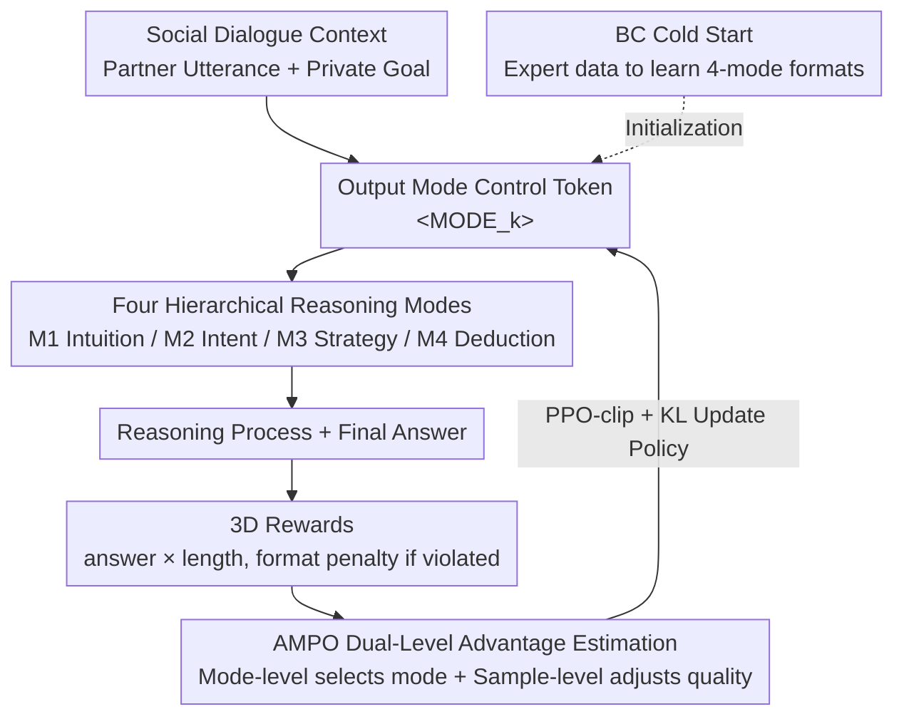

# Adaptive Social Learning via Mode Policy Optimization for Language Agents

**Conference**: ICLR 2026  
**arXiv**: [2505.02156](https://arxiv.org/abs/2505.02156)  
**Code**: [https://github.com/MozerWang/AMPO](https://github.com/MozerWang/AMPO)  
**Area**: LLM Reasoning  
**Keywords**: social intelligence, adaptive reasoning, mode selection, reinforcement-learning, token efficiency

## TL;DR
This paper proposes the Adaptive Social Learning (ASL) framework, featuring four hierarchical reasoning modes (ranging from intuitive response to deep deduction). Through the AMPO algorithm—which integrates mode-level and sample-level advantage estimation—LLM agents adaptively switch reasoning depth based on the complexity of social scenarios. On social intelligence tasks, it outperforms GPT-4o by 15.6% and GRPO by 7.0%, while reducing token usage by 32.8%.

## Background & Motivation
**Background**: LLM agents require dynamic adjustments to reasoning depth during social interactions (negotiation, cooperation, etc.). However, existing methods either lack reasoning (direct response) or use a uniform long CoT, leading to issues of over-reasoning or under-reasoning.

**Limitations of Prior Work**: Large reasoning models (such as o1 and R1) actually perform worse than GPT-4o on social tasks. They perform exhaustive reasoning regardless of the scenario, resulting in overthinking, excessively long reasoning chains, and weak goal awareness. Models trained with GRPO also tend to converge to a single reasoning mode (always using the deepest Mode 4).

**Key Challenge**: Social interaction is dynamic; different rounds and scenarios require different depths of reasoning. Simple scenarios (where both parties' goals are met) only need intuitive responses, while complex scenarios (unresolved conflicts) require deep strategic deduction. However, the advantage estimation in existing RL methods like GRPO is "mode-blind," failing to learn this adaptive capability.

**Goal**: How can LLM agents dynamically select the appropriate reasoning depth in social interactions based on context while maintaining both efficiency and effectiveness?

**Key Insight**: Drawing from Hierarchical Cognitive Control Theory (HCCT) in cognitive science, the authors design four levels of reasoning modes and introduce mode-level advantage estimation on top of GRPO to guide mode selection.

**Core Idea**: Utilizing hierarchical reasoning modes combined with mode-aware RL optimization (AMPO) allows social agents to learn adaptive reasoning—"fast when possible, slow when necessary."

## Method

### Overall Architecture
This paper aims to solve a specific problem: enabling social agents to learn when to be "fast" and when to be "slow"—providing intuitive responses for simple scenarios and deep deduction only for complex ones, rather than the exhaustive reasoning used by current large reasoning models. The process starts from a social dialogue context; the model first generates a mode control token (determining the reasoning depth for the turn), then produces the reasoning process and final answer according to that mode's format. After the answer is scored by a three-dimensional reward system, AMPO uses dual-level advantage estimation to feed signals back into the policy. Consequently, the model learns to "select modes based on scenarios" and refine reasoning quality. Training begins with Behavioral Cloning (BC) as a cold start to help the model learn the output formats of the four modes, followed by iterative loops of AMPO reinforcement learning.

### Key Designs

**1. Four Hierarchical Reasoning Modes: Reasoning Depth as Selectable Gears**

Reasoning depth requirements vary significantly across social interaction rounds. Instead of a uniform Long-CoT, reasoning is split into four levels from shallow to deep based on Hierarchical Cognitive Control Theory (HCCT), each identified by a control token `<MODE_k>`. M1 (Intuitive Response) is the shallowest, providing answers directly for simple scenarios like "goals achieved." M2 (Intent Analysis) adds intent analysis, style maintenance, and initial response. M3 (Strategic Adaptation) builds on M2 by adding history analysis, goal clarification, situational assessment, and strategy formulation. M4 (Forward Deduction) is the deepest, generating multiple candidate strategies and simulating deductions for each before integration and selection. These four levels map to the four HCCT levels from sensory-motor to long-contextual control, providing the model with a full spectrum from System 1 to System 2.

**2. Three-Dimensional Reward: Including "Conciseness" in Training Signals**

Relying solely on goal completion rewards often leads models to learn that "more words are safer," generating redundant reasoning without strategic gain. The reward consists of three parts: the answer reward $r^a$ uses an LLM evaluator to assess goal completion (normalized to $[0,1]$); the format reward enforces mode structure (a penalty of $-2$ if violated); and the answer length reward $r^l$ provides a length penalty, smoothly decaying to $[0,1]$ when the answer exceeds the target length. For correct formats, the total reward is $r = r^a \times r^l$; for incorrect formats, it is $r = -2$. The length reward encourages conciseness, which works with the mode-level advantage to realize adaptive reasoning depth.

**3. Adaptive Mode Policy Optimization: Making the Optimizer "Mode-Aware"**

GRPO's advantage estimation is "mode-blind"—it ranks samples by reward without knowing their mode, causing models to converge on M4 (highest reward but token-heavy). AMPO splits the advantage: Mode-level advantage $A^{\mathcal{M}}$ selects the mode, and Sample-level advantage $A^{\mathcal{S}}$ distinguishes quality within the chosen mode. The mode-level layer includes a "performance first, efficiency if performance ties" switch. When average rewards $\bar{r}^{\mathcal{M}_k}$ vary, it guides the model toward high-score modes via within-group normalization. When rewards are identical (e.g., all modes solve a simple task), it uses within-group normalized average token length $\bar{l}^{\mathcal{M}_k}$ with a negative tanh to reward shorter modes:

$$
A^{\mathcal{M}}_i =
\begin{cases}
\dfrac{\bar{r}^{m(i)} - \mathrm{mean}(\{\bar{r}^{\mathcal{M}_k}\})}{\mathrm{std}(\{\bar{r}^{\mathcal{M}_k}\})}, & \text{if rewards differ across modes} \\[8pt]
-\tanh\!\left(\dfrac{\bar{l}^{m(i)} - \mathrm{mean}(\{\bar{l}^{\mathcal{M}_k}\})}{\mathrm{std}(\{\bar{l}^{\mathcal{M}_k}\})}\right), & \text{if rewards are identical across modes}
\end{cases}
$$

The sample-level $A^{\mathcal{S}}$ only compares rollout quality within the same mode. The total advantage $A = A^{\mathcal{M}} + A^{\mathcal{S}}$ is then used in the PPO-clip objective. This ensures the model pursues high scores when performance varies and efficiency when rewards are equal, resulting in "fast when possible" behavior.

### Loss & Training
The training consists of two stages. The first stage is a BC cold start (loss $\mathcal{L}_{\text{BC}}$ is standard NLL for imitation learning), where an expert LLM generates format-compliant data for each mode to teach the model the required structures. The second stage is AMPO online policy optimization: for each prompt, $G$ rollouts are sampled (covering different modes), and the policy is updated using the dual-level advantage within the PPO-clip objective with KL regularization. A single-turn paradigm is used for efficiency.

## Key Experimental Results

### Main Results

| Method | SOTOPIA Goal↑ | Hard Goal↑ | Hard Overall↑ | Avg Tokens↓ |
|------|-------------|-----------|--------------|-------------|
| GPT-4o | 8.19 | 6.97 | 3.46 | - |
| DeepSeek-R1 | 7.97 | 5.86 | 2.73 | 711 |
| QwQ-32B | 7.70 | 5.35 | 2.41 | 973 |
| Qwen-7B + GRPO | 8.87 | 7.44 | 3.41 | 905 |
| **Qwen-7B + AMPO** | **8.95** | **7.85** | **3.54** | **647** |
| Llama-8B + GRPO | 8.86 | 7.59 | 3.44 | 865 |
| **Llama-8B + AMPO** | **9.08** | **8.06** | **3.68** | **581** |

### Ablation Study

| Configuration | Hard Goal | Hard Overall | Avg Tokens |
|------|-----------|-------------|------------|
| AMPO + 4 Modes (Full) | 7.85 | 3.54 | 647 |
| AMPO w/o length reward | 7.56 | 3.56 | 1617 |
| M1 Only | 7.08 | 3.40 | 101 |
| M4 Only | 7.62 | 3.31 | 972 |
| GRPO + No Modes | 7.32 | 3.16 | 866 |
| GRPO + 4 Modes | 7.44 | 3.41 | 905 |

### Key Findings
- **Large reasoning models fail in social tasks**: o1, R1, and QwQ are significantly inferior to GPT-4o on SOTOPIA-Hard, indicating that exhaustive reasoning is detrimental to social intelligence.
- **Mode distribution adapts across conversation turns**: M4 is concentrated in the first 4 rounds (53%), while M1 surges in later rounds (50% in rounds 14-20), aligning with the intuitive "deep then shallow" cognitive pattern.
- **Length reward impact**: Removing the length reward increases tokens by 2.5x (647→1617) but decreases the Goal score (7.85→7.56), proving that longer reasoning does not equate to better reasoning.
- **Hybrid modes outperform single modes**: AMPO with 4 modes yields a 3% higher Goal score and 33% fewer tokens compared to the best single mode (M4).

## Highlights & Insights
- **Adaptive reasoning depth is a key insight**: Not all scenarios require Long-CoT. In social interactions, adaptive depth is more effective than uniform deep reasoning; this finding could generalize to many non-deterministic tasks.
- **Elegant Mode-level Advantage design**: Switching between high-reward pursuit and efficiency pursuit based on reward variance is a natural and effective mechanism.
- **Cognitive science guided AI design**: The mapping from HCCT levels to four reasoning modes is clear and empirically validated, highlighting the value of cognitive theories in agent design.

## Limitations & Future Work
- The single-turn training paradigm might limit long-term strategic consistency, which remains a potential weakness despite the authors' analysis.
- The four modes are human-designed; the number and structure of modes might not be optimal. Automatic discovery of reasoning modes could be superior.
- Evaluation relies on GPT-4o scoring (despite manual verification), which may introduce evaluator bias.
- Currently only validated on social interaction tasks; generalizability to other adaptive reasoning scenarios (e.g., open-domain QA, creative writing) remains to be tested.

## Related Work & Insights
- **vs GRPO**: AMPO introduces mode-level advantage estimation to resolve the mode-blind issue, achieving a better performance-efficiency trade-off.
- **vs Large Reasoning Models (o1/R1)**: The failure of these models in social tasks suggests that indiscriminate Long-CoT is unsuitable for open-ended interactions requiring social intelligence.
- **vs EPO/DSI**: While external policy modules or policy injection provide improvements, they are limited. End-to-end adaptive social learning (ASL) proves more effective.

## Rating
- Novelty: ⭐⭐⭐⭐ Innovative hierarchical mode design and AMPO dual-level advantage.
- Experimental Thoroughness: ⭐⭐⭐⭐⭐ Comprehensive multi-model, multi-benchmark, ablation, and human evaluation.
- Writing Quality: ⭐⭐⭐⭐ Clear structure, though formulas are somewhat dense.
- Value: ⭐⭐⭐⭐ The concept of adaptive reasoning depth has broad applicability and represents significant work in social intelligence.

<!-- RELATED:START -->

## Related Papers

- [\[ICLR 2026\] Temperature as a Meta-Policy: Adaptive Temperature in LLM Reinforcement Learning](temperature_as_a_meta-policy_adaptive_temperature_in_llm_reinforcement_learning.md)
- [\[ICLR 2026\] DRPO: Efficient Reasoning via Decoupled Reward Policy Optimization](drpo_efficient_reasoning_via_decoupled_reward_policy_optimization.md)
- [\[ICLR 2026\] Inpainting-Guided Policy Optimization for Diffusion Large Language Models](inpainting-guided_policy_optimization_for_diffusion_large_language_models.md)
- [\[ICLR 2026\] Improving Reasoning for Diffusion Language Models via Group Diffusion Policy Optimization](improving_reasoning_for_diffusion_language_models_via_group_diffusion_policy_opt.md)
- [\[ICLR 2026\] Reference-guided Policy Optimization for Molecular Optimization via LLM Reasoning](reference-guided_policy_optimization_for_molecular_optimization_via_llm_reasonin.md)

<!-- RELATED:END -->
