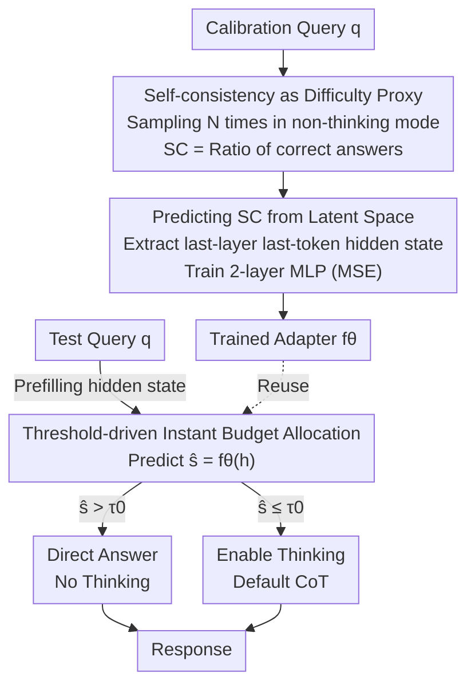

# Adaptive Thinking: Large Language Models Know When to Think in Latent Space

**Conference**: ICLR 2026  
**OpenReview**: [https://openreview.net/forum?id=2i6Rp0gCq6](https://openreview.net/forum?id=2i6Rp0gCq6)  
**Area**: LLM Reasoning  
**Keywords**: Adaptive Thinking, Self-consistency, Latent Space Representation, Test-time Compute, Thinking Budget Allocation

## TL;DR
This paper proposes Sonata: using a lightweight MLP adapter to directly predict "self-consistency" from the last-layer hidden states of a query during the prefilling stage. This allows the model to decide whether and how much to think before decoding, reducing thinking tokens by 20%–60% while maintaining accuracy.

## Background & Motivation
**Background**: Reasoning-heavy large language models (e.g., Qwen3, GPT-OSS) improve accuracy on complex problems by generating a chain-of-thought (CoT) before the final answer, a process known as "test-time compute scaling." Generally, a larger thinking budget leads to better performance.

**Limitations of Prior Work**: Thinking budgets are a double-edged sword. Overthinking on simple problems not only wastes compute but can also degrade accuracy; conversely, insufficient thinking on complex problems leads to errors. However, determining "how much thinking a specific query requires" is nearly impossible before generating the response. Existing methods either use **surface-level proxies** (e.g., next-token logit entropy, attention entropy), which fail to capture true reasoning difficulty, or depend on **expensive online computation** or per-sample calibration, making them costly to deploy.

**Key Challenge**: A trade-off exists between performance and efficiency. To reach the optimal "allocation on demand" point in this trade-off, one must be able to estimate the intrinsic reasoning difficulty of each query **before decoding begins**—which is the most difficult part.

**Goal**: (1) Identify a reliable proxy signal for "whether to think"; (2) Ensure this signal can be predicted with near-zero cost during inference; (3) Dynamically allocate thinking budgets based on this signal.

**Key Insight**: The authors observe that "self-consistency" (the proportion of multiple sampling paths converging to the same answer) across multiple reasoning paths is strongly correlated with query difficulty—higher difficulty leads to lower self-consistency (Figure 1). Crucially, they find that queries with different self-consistency levels are highly separable in latent space (forming natural clusters in PCA visualizations), implying this signal **can be learned from hidden states** without actual multi-path sampling.

**Core Idea**: An invisible, offline-trained lightweight adapter predicts self-consistency directly from the last-layer hidden state of a query. This transforms the "sampling-required difficulty signal" into a "single-forward-pass signal," which is then used for budget allocation before thinking begins.

## Method

### Overall Architecture
The core of Sonata (Self-Consistency-Guided Adapter for Thinking Allocation) is shifting "difficulty judgment" forward to the prefilling stage, replacing expensive multi-path sampling with a single extra MLP forward pass. The pipeline consists of two phases: **Offline**, an adapter is trained on a calibration set—for each calibration query, $N$ answers are sampled in non-thinking mode to compute the ground-truth self-consistency label, and the hidden state of the last token in the last layer is extracted to train a two-layer MLP mapping hidden states to self-consistency (MSE loss). **Online**, for a test query, the same hidden state is extracted during the prefilling stage (before decoding starts). The trained adapter predicts self-consistency $\hat{s}$, which is compared against a threshold $\tau_0$ to decide whether to trigger thinking. The adapter introduces < 1‰ computational overhead during inference and is "model-dependent but task-agnostic"—trained once for an LLM, it generalizes across math, science, and coding tasks.

### Key Designs

**1. Self-consistency as a Proxy for "Whether to Think": Anchoring Difficulty in Model Confidence**

Existing methods use surface-level uncertainties like logit entropy or attention entropy as proxies, but high token-level entropy might simply reflect "multiple valid wordings" rather than intrinsic difficulty. This paper adopts a more fundamental signal: self-consistency, defined as the accuracy rate over multiple repeated samplings $SC(q) = \frac{1}{N}\sum_{i=1}^{N} \mathbb{I}[a_i = a^*]$ ($N=32$, using a verifier for accuracy rather than majority voting to provide precise labels for calibration). The authors verify its indication of "thinking necessity": for each calibration query, they measure non-thinking self-consistency and the accuracy gain from thinking $\Delta_{\text{think}}(q) = \text{Acc}_{\text{think}}(q) - \text{Acc}_{\text{non-think}}(q)$. They find a strong negative correlation—queries with low self-consistency benefit significantly from thinking, while those with high self-consistency show almost no gain (Figure 2). This demonstrates that self-consistency directly measures "model confidence," making it a closer proxy to true reasoning difficulty than surface entropy.

**2. Predicting Self-consistency from Latent Space: Replacing Expensive Sampling with a Single Forward Pass**

While self-consistency is effective, computing it requires multiple samplings, contradicting "efficient inference." The key discovery is that self-consistency patterns are highly separable in latent space. PCA projections of the last-layer hidden state $H \in \mathbb{R}^d$ show that high-self-consistency queries naturally form tight clusters, while low-self-consistency queries are more dispersed (Figure 3, Observation 1). Furthermore, this separability strengthens with layer depth, peaking at the final layer (Observation 2), consistent with the law that deeper layers encode more abstract, reasoning-related knowledge. Based on this, a two-layer MLP adapter $f_\theta$ (with sigmoid) is trained to map final hidden states to self-consistency scores using MSE loss (Algorithm 1). Once trained, it generalizes across tasks without fine-tuning. During inference, it only requires a lightweight MLP pass on already computed prefilling hidden states, adding no extra LLM forward passes.

**3. Threshold-driven Instant Budget Allocation: Deciding to Think Before Decoding**

With an instantly predictable difficulty signal, the allocation strategy is simple: during testing, extract the prefilling hidden state $h = \text{LLM}_L(q)$, predict $\hat{s} = f_\theta(h)$, and compare it with a preset threshold $\tau_0$ (uniformly set to $\tau_0 = 0.3$). If $\hat{s} > \tau_0$, the model is confident and answers directly; otherwise, it follows the default thinking process (Algorithm 2). This reflects the intuition that "high predicted self-consistency → simple problem → omit thinking." The allocation requires only one MLP forward pass, introducing near-zero latency relative to LLM inference. Furthermore, adjusting $\tau_0$ from 0 to 1 allows for a smooth Pareto frontier between accuracy and token usage, outperforming fixed budgets. This controller acts as an "outer when-to-think switch" and is orthogonal to existing CoT compression or early-stopping methods (e.g., REFRAIN). Sonata can decide whether to think, while early-stopping methods decide when to stop once thinking has started, yielding further token savings.

### Loss & Training
The adapter is trained using MSE regression on self-consistency labels within a calibration set. The set consists of 1,000 randomly sampled math problems (difficulty 6/7) from OpenMathReasoning. For each problem, true self-consistency is computed from $N=32$ answers in non-thinking mode. The adapter is a two-layer MLP + sigmoid, which is model-dependent but task-agnostic. Inference uses temperature=0.6, top-p=0.95, and reports pass@1.

## Key Experimental Results

### Main Results
Evaluations were conducted on 4 models of varying scales (Qwen3-8B / 32B, GPT-OSS-120B, Qwen3-235B-A22B) and 5 benchmarks (AIME25, MATH-500, GSM8K, LiveCodeBench, GPQA). Average results across models are shown below (#Tokens in parentheses represent the ratio relative to vanilla):

| Model | Method | Avg. Acc.↑ | Avg. #Tokens↓ |
|------|------|-----------|--------------|
| Qwen3-8B | vanilla | 74.1 | 9154 (100%) |
| Qwen3-8B | Const. Budget | 64.9 | 4096 (45%) |
| Qwen3-8B | Self-Judge | 72.7 | 8364 (91%) |
| Qwen3-8B | **Sonata** | **75.3** | **7535 (82%)** |
| Qwen3-32B | vanilla | 78.0 | 7853 (100%) |
| Qwen3-32B | **Sonata** | **77.8** | **7074 (90%)** |
| GPT-OSS-120B | vanilla | 86.6 | 6708 (100%) |
| GPT-OSS-120B | **Sonata** | **85.4** | **5973 (89%)** |
| Qwen3-235B-A22B | vanilla | 82.8 | 6878 (100%) |
| Qwen3-235B-A22B | **Sonata** | **84.0** | **5698 (83%)** |

Savings are particularly noticeable on simpler tasks: on GSM8K, Qwen3-8B/32B tokens are reduced by ~55%–56% without accuracy loss. On GPQA (out-of-domain science reasoning), Qwen3-8B accuracy improved by 1.9% while cutting tokens by 52%. End-to-end efficiency (Table 2, MATH-500, B200 GPU) shows latency reductions of 27% (Qwen3-8B) to 36% (Qwen3-235B-A22B) with < 1% memory increase; larger models benefit more from adaptive allocation.

### Ablation Study

| Configuration | Dimension | Qwen3-8B Avg. Acc. | Qwen3-8B Avg. #Tokens |
|------|------|-------------------|----------------------|
| Self-Consistency (Sonata) | Proxy Signal | 79.6 | 6156 (79%) |
| LM Logits Entropy | Proxy Signal | 66.3 | 3518 (45%) |
| Attention Entropy | Proxy Signal | 68.3 | 3647 (47%) |
| 2-Layer MLP (Sonata) | Adapter Structure | 79.6 | 6156 (79%) |
| Linear | Adapter Structure | 76.8 | 6122 (78%) |
| 3-Layer MLP | Adapter Structure | 79.3 | 6144 (78%) |
| Sonata (1k samples) | Calibration Size | 79.6 | 6156 (79%) |
| Sonata (200 samples) | Calibration Size | 78.4 | 6272 (80%) |
| Sonata (100 samples) | Calibration Size | 79.0 | 6472 (83%) |
| Sonata + REFRAIN | Stacked Stop | 78.7 | 64% of vanilla |

### Key Findings
- **The proxy signal is the decisive factor**: Both entropy proxies severely under-allocate budget for hard problems (AIME25)—LM logit entropy yields only 23.3% accuracy and attention entropy 30.0% on Qwen3-8B, as token-level uncertainty fails to capture true reasoning difficulty. Self-consistency raises accuracy to 63.3%, validating the core hypothesis.
- **Lightweight non-linear adapters suffice**: A two-layer MLP significantly outperforms linear projection (approx. 3% higher accuracy), but adding a third layer provides almost no gain—confirming that self-consistency clusters are well-separated in latent space and fit well with a lightweight non-linear boundary.
- **Calibration is highly efficient**: Using only 100 calibration samples still yields 79.0% average accuracy and 17% token savings, nearly comparable to 1,000 samples (79.6%, 21% savings), making it suitable for low-resource deployment.
- **Cross-domain generalization**: Calibration on math problems generalizes to GPQA (Physics/Chemistry/Biology) and LiveCodeBench (Code Generation). GPQA token savings (17%–52%) match math tasks, suggesting self-consistency captures cross-disciplinary reasoning difficulty.
- **Orthogonality**: Combined with REFRAIN early-stopping, Sonata saves an additional 15% tokens (reducing to 64% of vanilla) with only a marginal accuracy drop, proving its value as an "outer switch" orthogonal to existing compression methods.

## Highlights & Insights
- **Distilling "Sampling-required Labels" into "Forward-attainable Predictions"**: Self-consistency usually requires multiple samplings, which contradicts efficiency. This paper leverages latent space separability to turn it into an offline regression target, requiring zero extra sampling during inference. This "expensive signal → lightweight predictor" approach is transferable to any metric requiring trial-and-error.
- **Empirical validation before methodology**: The authors first used PCA and cross-layer analysis to prove the separability of self-consistency in latent space (and its depth-dependence) before deciding to use last-layer hidden states—each step of the method is supported by interpretable empirical evidence rather than intuition.
- **Orthogonal and composable design philosophy**: Sonata is positioned as an outer "whether-to-think" controller, leaving "how to save while thinking" to existing methods. This makes it naturally stackable and enhances its practical value.

## Limitations & Future Work
- **Model-dependent adapters**: A new adapter must be retrained for each LLM architecture (though calibration cost is low), preventing direct cross-model reuse.
- **Binary thinking decisions**: The online strategy is essentially a binary "think/don't think" threshold. Continuous self-consistency scores have not yet been used for fine-grained budget mapping (e.g., "how many tokens to think"), though adjusting $\tau_0$ enables a global Pareto slide.
- **Dependency on verifier for calibration**: Training relies on a verifier to compute true self-consistency. Obtaining self-consistency labels for open-ended tasks without verifiable answers remains an open question.
- **Fixed Threshold**: A uniform $\tau_0=0.3$ is used throughout. Adaptive thresholds across different tasks or models have not been explored, which may be suboptimal for extreme difficulty distributions.

## Related Work & Insights
- **vs. Fixed Budget / Self-Judge**: Fixed budgets treat all queries equally, leading to under-thinking on hard tasks or waste on simple ones. Self-judge (asking the model to report its budget) is occasionally effective but unstable. Sonata uses learned latent difficulty signals for fine-grained, query-adaptive allocation, outperforming others on the Pareto frontier.
- **vs. Entropy Proxies (Logit/Attention Entropy)**: These capture surface-level token uncertainty and systematically under-allocate budget for hard problems. Self-consistency measures "whether the model can solve it stably," which is closer to intrinsic reasoning difficulty.
- **vs. CoT Compression/Early-stopping (REFRAIN, length-regularized RL)**: Those methods manage "how to save tokens while thinking," whereas Sonata manages "whether to think." They are orthogonal and can be stacked for further savings.
- **vs. Latent Space Reasoning Research**: Existing work suggests LLMs perform implicit latent reasoning; this paper operationalizes the "latent representation-reasoning capability" insight into a practical difficulty prediction tool.

## Rating
- Novelty: ⭐⭐⭐⭐ Using latent space predictability of self-consistency for budget allocation is a novel perspective with solid empirical support.
- Experimental Thoroughness: ⭐⭐⭐⭐⭐ Comprehensive ablations across 4 models, 5 benchmarks, proxy signals, structures, and calibration sizes.
- Writing Quality: ⭐⭐⭐⭐ Clear chain of logic from motivation to observation to method, well-supported by charts.
- Value: ⭐⭐⭐⭐ Near-zero overhead, task-agnostic, and orthogonal to existing methods, offering high practical utility.

<!-- RELATED:START -->

## Related Papers

- [\[ICLR 2026\] On the Thinking-Language Modeling Gap in Large Language Models](on_the_thinking-language_modeling_gap_in_large_language_models.md)
- [\[ICLR 2026\] StreamingThinker: Large Language Models Can Think While Reading](streamingthinker_large_language_models_can_think_while_reading.md)
- [\[ICLR 2026\] Latent-Guided Reasoning: Empowering Small LLMs with Large-Model Thinking](latent-guided_reasoning_empowering_small_llms_with_large-model_thinking.md)
- [\[ICLR 2026\] Deep Think with Confidence](deep_think_with_confidence.md)
- [\[ICLR 2026\] $\nabla$-Reasoner: LLM Reasoning via Test-Time Gradient Descent in Latent Space](nabla-reasoner_llm_reasoning_via_test-time_gradient_descent_in_latent_space.md)

<!-- RELATED:END -->
