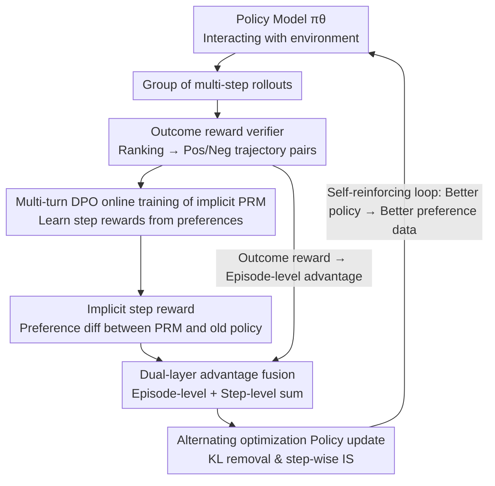

# Agentic Reinforcement Learning with Implicit Step Rewards

**Conference**: ICLR2026  
**OpenReview**: [https://openreview.net/forum?id=ooROvpmxMV](https://openreview.net/forum?id=ooROvpmxMV)  
**Code**: https://github.com/Tongyi-ConvAI/Qwen-Character/tree/main/CharacterRL-iStar  
**Area**: LLM Agent / Reinforcement Learning / Credit Assignment  
**Keywords**: agentic RL, implicit process rewards, credit assignment, multi-turn DPO, step-level advantage

## TL;DR
This paper proposes iStar, a universal credit assignment strategy for multi-turn reinforcement learning of LLM agents. By alternately optimizing an **implicit process reward model (PRM)** and a policy model, iStar learns dense rewards for each action step through a multi-turn DPO objective. Step-level advantages are combined with episode-level advantages to update the policy. iStar achieves SOTA results on WebShop, VisualSokoban, and the open-ended social environment SOTOPIA, demonstrating superior sample efficiency and training stability.

## Background & Motivation
**Background**: LLMs are evolving from passive text generators into autonomous agents capable of reasoning, acting, and adjusting strategies over long horizons in interactive environments (search agents, web/mobile navigation, software engineering assistants, social and embodied agents). Training these agents typically utilizes reinforcement learning (agentic RL), with the LLM serving as the policy model.

**Limitations of Prior Work**: Unlike RLHF in single-turn static tasks, agentic RL faces three unique challenges. First, rewards are **sparse and delayed**, with feedback often available only as an outcome reward at the end of a trajectory, making credit assignment extremely difficult. Second, trajectories are **long and non-Markovian**; since each step consists of a "chain-of-thought + executable action," forcing credit assignment to the token level significantly amplifies variance. Third, environments and opponents are **non-stationary and open**, and rewards are often **unverifiable** (e.g., in dialogue). Consequently, trajectory-level optimization relying solely on outcome rewards fails in credit assignment, leading to high variance, fragile exploration, and limited gains in agent tasks.

**Key Challenge**: While dense feedback for intermediate steps is needed, current process supervision approaches have critical flaws. Manually designed step labels (scoring tool calls or meta-reasoning) are costly, biased, and prone to reward hacking. Generative reward models (LLM-as-judge) save annotation costs but suffer from cross-domain noise and inconsistency. Implicit PRMs (e.g., PRIME), while effective for single-turn tasks, produce **token-level** rewards that are **too fine-grained** for agent training, causing training instability as trajectories lengthen. Another class of methods (e.g., GiGPO) relies on **grouping identical states** to calculate step-level advantages, but this assumption fails in open-ended linguistic environments where identical states rarely recur. Thus, the core problem is: How to design a credit assignment strategy that is **label-efficient, stable, scalable to multi-turn interactions, and robust to both verifiable and unverifiable rewards**?

**Goal**: To provide dense, low-variance, and cross-domain universal step-level credit signals for multi-turn agentic RL without relying on extra rollouts or explicit step labels.

**Key Insight**: The authors observe that implicit reward modeling can reverse-engineer rewards from preferences (e.g., DPO is proven to automatically learn Q-functions). By elevating this approach from "single-turn token-level" to "multi-turn step-level," an implicit PRM can directly score **entire action sequences**, maintaining denseness while controlling granularity at a more manageable "step" level.

**Core Idea**: Alternately optimize an implicit PRM with the policy. The fact that the "PRM prefers a certain action more than the old policy" is converted into a step reward for that action. This step reward is then combined with the outcome reward for a dual-layer advantage update, forming a self-reinforcing loop.

## Method

### Overall Architecture
iStar aims to precisely assign credit to each action step in multi-turn, long-horizon agentic RL. It attaches an implicit PRM alongside the standard RL loop and updates the PRM and policy model **alternately**. The data flow in one training round is as follows: The policy model $\pi_\theta$ generates a set of multi-step rollouts in the environment; the outcome reward verifier (or model) scores these trajectories to form "positive trajectory $\tau^+$ / negative trajectory $\tau^-$" preference pairs; the implicit PRM $\pi_\phi$ is updated online using a **multi-turn DPO objective** on these pairs; the updated PRM calculates an **implicit step reward** for each action (measuring how much "more likely" the action is under the new PRM compared to the old policy $\pi_{\theta_{old}}$); finally, the **episode-level advantage** from outcome rewards and the **step-level advantage** from step rewards are summed to update the policy model. Stronger policy $\rightarrow$ better preference data $\rightarrow$ more accurate PRM $\rightarrow$ more accurate step rewards $\rightarrow$ even stronger policy, creating a self-reinforcing cycle. This method requires no step labels or extra rollouts and can be integrated with various RL algorithms such as GRPO, RLOO, REINFORCE++, and DAPO.

### Key Designs

**1. Implicit Step Reward: Using "PRM Preference over Old Policy" as Dense Signals**

This addresses the pain point of sparse rewards and difficult credit assignment. Instead of explicitly labeling step quality, the authors provide an implicit definition: for the $t$-th action $a_t$ in trajectory $\tau=(o_1,a_1,\dots,o_T,a_T)$, the step reward is defined as:

$$r_\phi(o_{1:t}, a_t) = \beta \log \frac{\pi_\phi(a_t \mid o_{1:t}, x)}{\pi_{\theta_{old}}(a_t \mid o_{1:t}, x)}$$

Where $\pi_\phi$ is the implicit PRM, $\pi_{\theta_{old}}$ is the previous snapshot of the policy, and $\beta\in[0,1]$ is a scaling temperature. Intuitively, this represents how much more likely the action is under the "newly learned PRM" than the "old policy." A positive value indicates the PRM believes the action contributed to recent progress and should be encouraged. Crucially, it is calculated **step-by-step**, providing dense feedback to guide exploration, yet it stops at the "action sequence" level rather than the token level, keeping granularity coarse enough to suppress variance—a core difference from token-level implicit rewards like PRIME.

**2. Multi-turn DPO Online Training of Implicit PRM: Learning Step-level Reward Functions from Trajectory Preferences**

How is $\pi_\phi$ in Design 1 obtained? Instead of a separate labeling process, the authors directly train the PRM online using positive/negative trajectory pairs sampled by the old policy, with the objective:

$$J_{PRM}(\phi) = -\mathbb{E}_{(\tau^+,\tau^-)}\Big[\log \sigma\big(\beta \log \tfrac{\pi_\phi(\tau^+\mid x)}{\pi_{\theta_{old}}(\tau^+\mid x)} - \beta \log \tfrac{\pi_\phi(\tau^-\mid x)}{\pi_{\theta_{old}}(\tau^-\mid x)}\big)\Big]$$

Here $\pi(\tau\mid x)=\prod_t \pi(a_t\mid o_{1:t},x)$ is the product of action probabilities at each step, and labels come from the outcome reward verifier. This differs from standard DPO in two ways: first, the reference model is a **rolling snapshot of the old policy** $\pi_{\theta_{old}}$ rather than a frozen initial policy; second, the objective is derived from a **multi-step MDP** rather than a single-step bandit. Theoretical analysis (Section 3.2) proves that this objective is equivalent to a Bradley-Terry model with a **step-level reward function**, i.e., for any trajectory pair starting from the same state, $P(\tau_1\succ\tau_2)=\sigma\big(\sum_t r^*_\phi(o^1_{1:t},a^1_t) - \sum_t r^*_\phi(o^2_{1:t},a^2_t)\big)$, where $r^*_\phi$ takes the form in Design 1. In other words, multi-turn DPO on trajectory preferences mathematically guarantees the learning of a valid step-level reward. Note that the loss is calculated only on action tokens.

**3. Dual-layer Advantage Fusion: Episode-level for Success, Step-level for Contribution**

Intermediate rewards alone aren't enough—rewarding intermediate actions without the "gatekeeping" of final success can lead to reward hacking. The authors combine the two signals at the **advantage layer**. For $N$ trajectories sampled for a prompt, the episode-level advantage $A_E(\tau_i)=(r_o(\tau_i)-\text{mean}(R_o))/\text{std}(R_o)$ is calculated first. Then, the step reward for each action is computed using the latest PRM and standardized across all step rewards $R_s$ in the group to get the step-level advantage $A_S(a^i_t)=(r_\phi(a^i_t)-\text{mean}(R_s))/\text{std}(R_s)$. The final advantage is:

$$A(a^i_t) = A_E(\tau_i) + \alpha\, A_S(a^i_t)$$

$\alpha$ balances the two signals. This allows the advantage to distinguish "good vs. bad trajectories" while also identifying "beneficial vs. harmful steps" within the same group. Multiple trajectories starting from the same state provide counterfactual scenarios, yielding a more accurate state-value baseline and stabilizing step-level advantage estimation compared to estimating advantages within a single trajectory (which is often polluted by policy noise). Ablations show that **merging rewards directly** into the outcome reward yields only marginal gains; fusion at the advantage layer is essential.

**4. Alternating Optimization Loop with KL Removal and Step-wise Importance Sampling**

The policy is updated using a standard surrogate objective: $J_{policy}(\theta)=\mathbb{E}\big[\frac{1}{NT}\sum_i\sum_t \min(\rho_\theta(a^i_t)A(a^i_t),\,\text{clip}(\rho_\theta(a^i_t),1\pm\epsilon)A(a^i_t))\big]$, where the importance sampling ratio $\rho_\theta(a^i_t)=\pi_\theta(a^i_t\mid o^i_t,x)/\pi_{\theta_{old}}(a^i_t\mid o^i_t,x)$ is taken at the **step level** to align with step rewards, ensuring low variance over multi-step rollouts. Two details stabilize the loop: first, **alternating optimization** ensures the PRM and policy use rollouts from the current policy, minimizing off-policy bias and covariate shift; second, the authors **remove the KL penalty**. In online agentic RL, successful behavior often deviates significantly from the frozen LM default; removing KL allows the policy to explore critical problem-solving regions more freely (verified in Table 7).

### Loss & Training
- **PRM Loss**: Multi-turn DPO objective $J_{PRM}(\phi)$ (Eq. 2), with the rolling old policy snapshot as reference; log probability ratios calculated only on action tokens.
- **Policy Loss**: Step-level clipped surrogate (Eq. 6), with dual-layer advantage fusion $A(a^i_t)=A_E+\alpha A_S$ and **no KL penalty**.
- **Key Hyperparameters**: Policy LR $5\times10^{-7}$, PRM LR $10^{-6}$ (AdamW); batch size 64, micro-batch 8; advantage coefficient $\alpha=1.0$, DPO temperature $\beta=0.05$; 8 rollouts per prompt; 8×A100 training. PRM initialized from base policy (except VisualSokoban: Policy uses Qwen2.5-VL-7B, PRM uses Qwen2.5-7B). Positive trajectory criteria: Success rate >0 for WebShop/VisualSokoban, goal completion score >6 for SOTOPIA.

## Key Experimental Results

### Main Results
Three environments: WebShop (text browsing, multi-step decision), VisualSokoban (6×6 Sokoban, spatial reasoning + planning, multimodal), and SOTOPIA (social dialogue, unverifiable rewards). Bases: Qwen2.5-7B-Instruct / Qwen2.5-VL-7B-Instruct.

| Method | WebShop Success | WebShop Score | VisualSokoban Success |
|------|------|------|------|
| GPT-5 (ReAct) | 37.5 | 66.1 | 16.6 |
| Claude-Sonnet-4-Thinking | 35.2 | 62.0 | 19.1 |
| Base (ReAct) | 21.5 | 47.3 | 14.1 |
| + GRPO | 80.1 | 89.3 | 85.6 |
| + PRIME (token-level process reward) | 81.5 | 91.3 | - |
| + GiGPO (state grouping) | 84.1 | 91.2 | 85.9 |
| **+ RLOO w/ iStar** | **86.5** | **93.6** | **91.7** |

SOTOPIA (Goal completion 0-10, GPT-4o judge): iStar improves self-chat goal completion by 14% (7.92→8.06) in hard social scenarios and up to 48% (6.68→7.16) when interacting with GPT-4o. It surpasses frontier LLMs and specialized methods (GiGPO/PRIME) which are either inapplicable or outperformed in open-state spaces.

iStar provides plug-and-play improvements for various RL algorithms: success rates rise by 6.3% on both WebShop and VisualSokoban when added to RLOO, with similar trends for REINFORCE++ and GRPO.

### Ablation Study

| Configuration | WebShop Success | WebShop Score | VisualSokoban Success |
|------|------|------|------|
| RLOO (Outcome only) | 76.6 | 84.2 | 85.9 |
| w/ Env original step rewards | - | - | 87.5 |
| w/ Merged rewards (direct sum) | 81.3 | 90.7 | 88.3 |
| w/ Token-level process rewards | 82.0 | 90.0 | 89.1 |
| **w/ iStar (Advantage fusion + step-level)** | **89.1** | **94.7** | **93.0** |

### Key Findings
- **Advantage Layer Fusion is Critical**: Adding step rewards directly to outcome rewards (merged) yields only small improvements. Separately combining episode-level and step-level signals at the advantage layer ensures intermediate actions are rewarded while final outcomes maintain "gatekeeping," preventing reward hacking.
- **Step-level > Token-level**: Token-level process rewards (like PRIME) are too fine-grained for long multi-turn sequences, introducing noise and instability. iStar’s step-level rewards are dense but not overly fine, keeping variance controllable. Figure 4 shows PRIME matching iStar early on but then stagnating or fluctuating, while iStar continues to rise.
- **Sample Efficiency**: iStar reaches the score of vanilla RLOO in only 105 steps on WebShop (~2× speedup). With more compute, the stability advantage becomes more pronounced—vanilla RLOO and GiGPO tend to become unstable or degrade in late-stage training.
- **Efficient Exploration**: Step rewards rise first, followed by episode rewards, indicating that the method first identifies local beneficial action heuristics before composing them into high-reward trajectories. A byproduct is shorter episode lengths (fewer redundant actions) without sacrificing success rates.
- **Limited Effect of Original Env Rewards**: Using the native step penalties in VisualSokoban was barely better than vanilla RL, suggesting the implicit step rewards learned by iStar are superior credit signals.

## Highlights & Insights
- **"Elevating DPO to Step-level" is the core ingenuity**: While token-level implicit rewards exist, this work extends the concept from single-step bandits to multi-step MDPs and proves BT equivalence. This provides theoretical legitimacy for "implicit step rewards" rather than relying on heuristics.
- **Using a rolling old policy as reference** instead of a frozen initial policy is key to calibrating the PRM to the agent's current behavior, a necessary shift for transitioning from offline alignment to online agentic RL.
- **Advantage fusion over reward merging** is a transferable insight: Many process reward works simply add dense rewards to the outcome reward, which weakens the outcome's "gatekeeping" effect. Combining them in the advantage layer preserves reward gating and is a trick worth adopting for any mixed credit assignment.
- **The combination of KL removal and step-wise importance sampling** is exploration-friendly for long horizons, suggesting that online agentic RL should not blindly copy KL constraints from RLHF.

## Limitations & Future Work
- **The PRM and policy are currently separate models**, increasing VRAM usage. Future work could unify them into a single model trained with different objectives to share representations.
- **In SOTOPIA, the PRM only learns the "goal completion" preference**. This could be extended to a multi-objective implicit PRM (handling safety, empathy, etc., simultaneously).
- **Not yet verified on Math/Code generation**: Experiments focused on interactive agent tasks; whether the method provides good implicit rewards for intermediate math CoT steps or search guidance remains future work.
- Author's observation: Positive/negative trajectory partitioning depends on an outcome reward verifier; noise in the verifier (e.g., GPT-4o scoring in SOTOPIA) will propagate to the PRM.

## Related Work & Insights
- **vs PRIME (Cui et al., 2025)**: Both use joint PRM/generator training, but PRIME produces **token-level** rewards and uses CE loss to optimize the PRM (limited to binary outcome tasks). iStar produces **step-level** rewards via multi-turn DPO, resulting in lower variance and applicability to open environments with unverifiable rewards.
- **vs GiGPO (Feng et al., 2025)**: GiGPO relies on **identical state grouping** for step-level advantages, which works in finite spaces but fails in open-ended language environments where states rarely overlap. iStar uses implicit rewards, enabling generalization to SOTOPIA-style tasks.
- **vs Manual/Judge-based PRMs**: Manual labels or LLM-as-judge are costly, biased, and noisy across domains. iStar learns rewards implicitly from preferences, ensuring label efficiency.
- **vs Step-level Q-learning (Choudhury, 2025)**: Fixed PRMs for Q-value estimation can be inaccurate for unseen actions; iStar's alternating online updates maintain better distribution alignment.

## Rating
- Novelty: ⭐⭐⭐⭐⭐ Elevating implicit DPO rewards to multi-turn step-level with BT equivalence proof is a clear and theoretically sound contribution.
- Experimental Thoroughness: ⭐⭐⭐⭐⭐ Three heterogeneous environments, multiple bases, plug-and-play across RL algorithms, and comprehensive analysis of efficiency/stability/exploration.
- Writing Quality: ⭐⭐⭐⭐ Motivations are well-structured; method and theory are well-connected. Some reliance on appendices for figures.
- Value: ⭐⭐⭐⭐⭐ Provides a universal, label-efficient, and robust credit assignment strategy for agentic RL that integrates into mainstream algorithms.

<!-- RELATED:START -->

## Related Papers

- [\[ACL 2026\] HISR: Hindsight Information Modulated Segmental Process Rewards for Multi-turn Agentic Reinforcement Learning](../../ACL2026/llm_reasoning/hisr_hindsight_information_modulated_segmental_process_rewards_for_multi-turn_ag.md)
- [\[CVPR 2026\] Scaling Agentic Reinforcement Learning for Tool-Integrated Reasoning in VLMs](../../CVPR2026/llm_reasoning/scaling_agentic_reinforcement_learning_for_tool-integrated_reasoning_in_vlms.md)
- [\[ICLR 2026\] Emergent Hierarchical Reasoning in LLMs through Reinforcement Learning](emergent_hierarchical_reasoning_in_llms_through_reinforcement_learning.md)
- [\[ICLR 2026\] Process-Verified Reinforcement Learning for Theorem Proving via Lean](process-verified_reinforcement_learning_for_theorem_proving_via_lean.md)
- [\[ICLR 2026\] Learning to Reason over Continuous Tokens with Reinforcement Learning (HyRea)](learning_to_reason_over_continuous_tokens_with_reinforcement_learning.md)

<!-- RELATED:END -->
