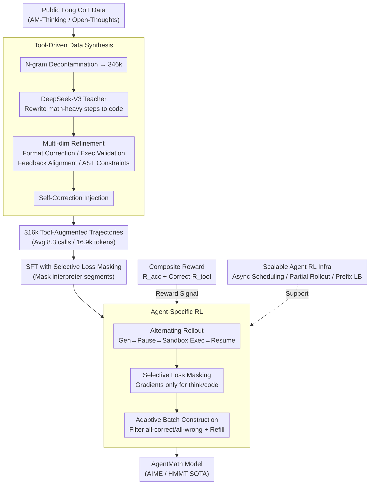

# AgentMath: Empowering Mathematical Reasoning for Large Language Models via Tool-Augmented Agent

**Conference**: ICLR 2026  
**arXiv**: [2512.20745](https://arxiv.org/abs/2512.20745)  
**Code**: N/A  
**Area**: LLM Reasoning  
**Keywords**: Mathematical Reasoning, Tool Augmentation, Reinforcement Learning, Code Interpreter, Agent Framework

## TL;DR
AgentMath proposes a tool-augmented agent framework that seamlessly integrates LLM reasoning with the computational precision of a code interpreter through automated data synthesis, multi-turn interactive reinforcement learning (RL), and an efficient asynchronous training system. It achieves SOTA performance on AIME24/25 and HMMT25 at the 30B-A3B scale (90.6%/86.4%/73.8%), surpassing o3-mini and Claude-Opus-4.0-Thinking.

## Background & Motivation
Large Reasoning Models (LRMs) such as o3 and DeepSeek-R1 have made significant progress in long-chain-of-thought reasoning but still suffer from low computational efficiency and insufficient accuracy when handling problems requiring precise mathematical operations—inherent limitations of pure text reasoning lead to frequent calculation errors and redundant corrections. Existing tool-augmented methods face three major challenges: (1) High-quality tool-use data is extremely scarce, with manual annotation being costly and non-scalable; (2) The potential of Agent RL for optimizing tool-use policies is under-explored; (3) Competition-level math problems involve ultra-long reasoning chains (96k tokens, 96 tool calls), which traditional batch-synchronous RL training cannot handle. The **Core Idea** of this paper is to build an end-to-end agent framework that addresses data scarcity via automated synthesis, learns optimal tool-use policies through Agentic RL, and resolves efficiency bottlenecks via an asynchronous training architecture.

## Method

### Overall Architecture
AgentMath models tool-augmented mathematical reasoning as a Markov Decision Process (MDP). The LLM policy alternates between producing natural language reasoning segments and executable code blocks, then continues reasoning after receiving execution results from a sandbox environment. Three states are distinguished by structured tags: `<think>` for reasoning, `<code>` for executable code, and `<interpreter>` for execution feedback. The pipeline consists of two stages: first, SFT on synthesized tool-augmented trajectories to establish basic tool-use habits; second, large-scale Agentic RL to let the model explore the optimal strategy of "when to write code and how much." A specialized asynchronous infrastructure supports the training of ultra-long trajectories (96k tokens, nearly 100 tool calls) during the RL phase.

### Key Designs

**1. Tool-Driven Data Synthesis: Growing code from calculation-heavy steps** High-quality tool-use trajectories are nearly impossible to annotate manually. AgentMath employs a three-stage automated pipeline to "transform" existing pure-text CoT into tool-augmented trajectories. First, it aggregates long CoT data from sources like AM-Thinking and Open-Thoughts, filtering overlap with evaluation sets to leave 346k clean samples. DeepSeek-V3 acts as a teacher to replace computation-intensive steps with executable code blocks, while intentionally keeping simple calculations as text to prevent over-reliance on tools. Second, multi-dimensional refinement is performed: format consistency correction, sandbox execution validation, and alignment check where Qwen3-32B ensures reasoning matches execution results (replacing simulated teacher outputs with real results). AST depth and line count constraints are also applied to filter inefficient code. Third, self-correction capabilities are injected by sampling failed trajectories and having the teacher generate "diagnose error → fix code → rerun → continue" sequences. This yields a 316k training set with an average of 8.3 tool calls per sample.

**2. Agent-Specific RL: Backpropagating gradients only for model decisions** While data synthesis teaches imitation, optimal tool strategies require RL exploration. AgentMath adapts GRPO for agents in three ways. First is alternating trajectory construction: rollouts follow a "generate-pause-execute-resume" loop, concatenating model outputs and sandbox feedback into a hybrid trajectory (up to $T$ tool calls). Second is selective loss masking—advantage signals are only applied to tokens in `<think>` and `<code>` segments. Feedback tokens in the `<interpreter>` segment, being environment-sourced and not model-generated, are masked to prevent noise in gradient updates. Third is adaptive batch construction: questions where all samples are correct or all are wrong (providing no gradient signal) are filtered and replaced with new samples to maintain a constant batch size and ensure effective learning steps.

**3. Composite Reward: Rewarding tool efficiency after correctness** The reward function targets both answer accuracy and tool efficiency: $R_{total} = R_{acc} + \mathbb{I}(R_{acc}=1) \cdot R_{tool}$. Here, $R_{acc}$ is a binary feedback based on mathematical equivalence. $R_{tool} = \min(R_{max}, \alpha + \beta \cdot N_{code})$ is a capped linear reward based on the number of code calls $N_{code}$, activated only when the answer is correct. This gated design prevents the model from generating nonsense code just to farm tool rewards, while encouraging efficient tool use given a correct answer.

**4. Scalable Agent RL Infrastructure: Handling 96k tokens × 96 tool calls** Competition trajectories often reach 96k tokens with nearly 100 tool calls, which would stall traditional batch-synchronous RL. AgentMath achieves a 4–5x speedup using four engineering optimizations. First, CPU-intensive code execution is offloaded to a distributed sandbox cluster, reducing tool-call latency from 175s to 1.2s. Second, request-level asynchronous rollout scheduling is implemented: each trajectory is an independent long-running request; when one pauses for execution, the engine processes other ready requests, eliminating head-of-line blocking. Third is Agent Partial Rollout, which splits ultra-long trajectories into budget-constrained segments $\tau = \tau^{(1)} \oplus \tau^{(2)} \oplus \ldots$ limited by $L_{seg}$ and $T_{seg}$, providing a 2.2–2.5x speedup. Finally, prefix-aware weighted load balancing assigns dynamic weights $w_j = \lfloor L_j / L_{base} \rfloor + w_{base}$ based on prefix length, used with LRU sticky sessions to maximize KV-cache reuse.

### Loss & Training
The SFT phase uses an autoregressive loss with selective masking: $\mathcal{L}_{SFT-masked} = -\sum_t \sum_k (1 - \mathbb{I}(z_{t,k})) \log \pi_\theta(z_{t,k} | \cdot)$, masking `<interpreter>` tokens. Training is done for 6 epochs via Llama-Factory with a 6e-5 learning rate. The RL phase uses verl 0.5.0 with a 1e-6 learning rate, batch size 64, and 8 rollouts per problem. A multi-stage adaptive capacity expansion strategy is used: when the truncation rate exceeds 10%, budgets are automatically increased (context 48k→72k→96k, tool calls 48→72→96, segments 2→3→4) to gradually release longer reasoning chains.

## Key Experimental Results

### Main Results

| Dataset | Metric | AgentMath-8B | AgentMath-30B-A3B | AgentMath-235B-A22B-SFT | Prev. SOTA (Same Scale) | Gain |
|---------|--------|--------------|-------------------|-------------------------|-------------------------|------|
| AIME24  | avg@32 | 89.8%        | 90.6%             | 93.4%                   | 86.0% (DS-0528-Qwen3-8B) | +3.8% |
| AIME25  | avg@32 | 84.7%        | 86.4%             | 90.8%                   | 76.3% (DS-0528-Qwen3-8B) | +8.4% |
| HMMT25  | avg@32 | 71.3%        | 73.8%             | 81.7%                   | 61.5% (DS-0528-Qwen3-8B) | +9.8% |

AgentMath-30B-A3B (only 3B active parameters) surpasses OpenAI-o3-mini (87.3%/86.3%) and Claude-Opus-4.0-Thinking (83.0%/72.0%) on AIME24/25, approaching DeepSeek-R1-671B (91.4%/87.5%).

### Ablation Study

| Configuration | AIME24 | AIME25 | Note |
|---------------|---------|--------|------|
| Unrefined Synthetic Data | 35.3% | 25.7% | Poor performance due to inconsistency |
| + Format Correction | 47.4% | 40.1% | +12.1%/+14.4% |
| + Executability Validation | 52.8% | 44.8% | +5.4%/+4.7% |
| + Feedback Alignment | 56.3% | 48.3% | +3.5%/+3.5% |
| + Self-Correction Injection | 58.6% | 50.8% | +2.3%/+2.5% |
| + SFT Selective Masking | 60.5% | 53.3% | Final SFT performance |
| Text-Based vs AgentMath SFT | 57.1% vs 60.5% | 49.2% vs 53.3% | Benefit of tool-augmented data |
| Text-Based vs AgentMath RL | 68.7% vs 76.2% | 57.5% vs 67.5% | 4x efficiency gain in RL |

### Training Efficiency

| Method | Step Time | Speedup |
|--------|-----------|---------|
| Static Sync Rollout | 3600-4000s | - |
| + Async Scheduling | 2100-2500s | 1.5-1.8x |
| + Partial Rollout | 1100-1300s | 3.0-3.3x |
| + Prefix LB | 750-900s | 4.0-5.0x |

## Key Findings
- Tool-augmented models reach 76.2% (AIME24) in ~400 RL steps, whereas text-only models need ~1600 steps to reach 68.7%, a 4x efficiency gain.
- Emergent code self-correction behavior appeared during multi-stage RL training.
- Reasoning sequence length decreased by ~4k tokens (~14%) as code replaced lengthy manual calculations.
- Scaling laws are evident: as data increased from 2k to 300k, AIME24 performance jumped from 27.2% to 78.4%.

## Highlights & Insights
- **Systematic Loop Closure**: Addresses data scarcity (synthesis), policy optimization (Agentic RL), and efficiency (async infra) in a complete cycle.
- **Emergent Self-Correction**: Models autonomously learned to diagnose and fix code errors during RL, an emergent behavior not explicitly trained.
- **MoE Efficiency**: The 30B-A3B model, with only 3B active parameters, rivals 671B models, suggesting tool-augmentation can compensate for smaller parameter counts.
- **Elegant Partial Rollout**: Decomposing ultra-long trajectories solves tail latency without compromising accuracy (~70% consistency across different N settings).

## Limitations & Future Work
- The 235B model only underwent SFT due to compute limits; RL might yield further gains.
- Evaluation is focused on math competitions; generalization to science or engineering is unverified.
- The tool-use reward is relatively simple and may not optimally guide calling timing.
- Interpreters are limited to Python/SymPy; other tools (Mathematica, SageMath) are not yet integrated.

## Related Work & Insights
- **Comparison with ToRL/ReTool**: These also explore RL + tools but lack the data quality and training efficiency of AgentMath.
- **Comparison with CoRT**: CoRT relies on expensive human labels; AgentMath's synthesis is scalable.
- **Engineering Insights**: The async training designs (Async scheduling + Partial Rollout + Prefix LB) are highly generalizable to other Agent RL scenarios.
- **Agent System Design**: This work shows that simple outcome-based rewards like GRPO are sufficient for agents without complex process rewards.

## Rating
- Novelty: ⭐⭐⭐⭐
- Experimental Thoroughness: ⭐⭐⭐⭐⭐
- Writing Quality: ⭐⭐⭐⭐⭐
- Value: ⭐⭐⭐⭐⭐

<!-- RELATED:START -->

## Related Papers

- [\[ICLR 2026\] TUMIX: Multi-Agent Test-Time Scaling with Tool-Use Mixture](tumix_multi-agent_test-time_scaling_with_tool-use_mixture.md)
- [\[ACL 2026\] TInR: Exploring Tool-Internalized Reasoning in Large Language Models](../../ACL2026/llm_reasoning/tinr_exploring_tool-internalized_reasoning_in_large_language_models.md)
- [\[ICLR 2026\] THOR: Tool-Integrated Hierarchical Optimization via RL for Mathematical Reasoning](thor_tool-integrated_hierarchical_optimization_via_rl_for_mathematical_reasoning.md)
- [\[ICLR 2026\] SealQA: Raising the Bar for Reasoning in Search-Augmented Language Models](sealqa_raising_the_bar_for_reasoning_in_search-augmented_language_models.md)
- [\[ICLR 2026\] Latent-Guided Reasoning: Empowering Small LLMs with Large-Model Thinking](latent-guided_reasoning_empowering_small_llms_with_large-model_thinking.md)

<!-- RELATED:END -->
