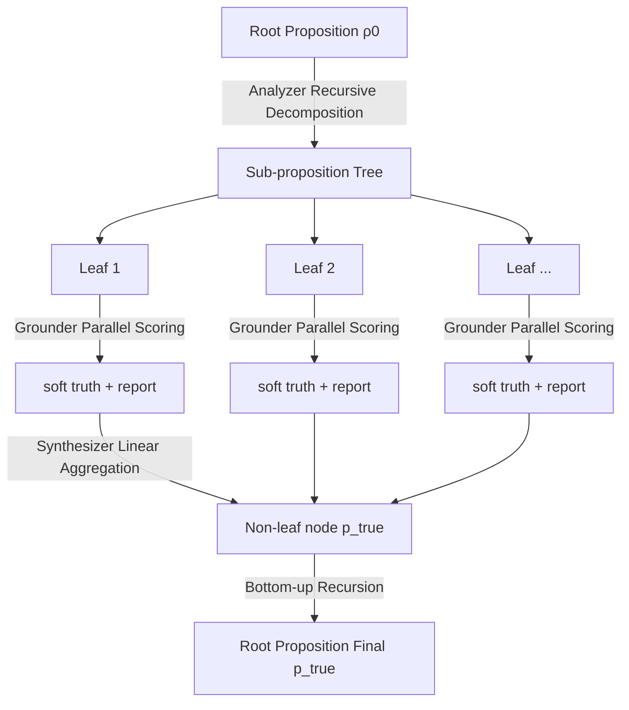

# Analytica: Soft Propositional Reasoning for Robust and Scalable LLM-Driven Analysis

**Conference**: ICLR 2026  
**OpenReview**: [https://openreview.net/forum?id=9cFT6u82uh](https://openreview.net/forum?id=9cFT6u82uh)  
**Code**: [https://github.com/chengjunyan1/analytica](https://github.com/chengjunyan1/analytica)  
**Area**: LLM Reasoning / Agent Architecture / Neuro-symbolic Systems  
**Keywords**: soft propositional reasoning, bias-variance decomposition, divide-and-conquer agent, forecasting, linear synthesis  

## TL;DR
The framework reformulates complex analysis as an estimation of "soft truth values" for propositions, using bias-variance decomposition as a design principle. By combining a divide-and-conquer tree to reduce bias and linear synthesis rules to reduce variance, it achieves Analytica—a verifiable, scalable, and noise-resistant LLM-driven prediction agent architecture.

## Background & Motivation
**Background**: LLM agents are increasingly deployed in open-ended complex analysis such as financial forecasting and scientific discovery. Recent large reasoning models and Deep Research architectures rely on test-time scaling to encourage "deep thinking."

**Limitations of Prior Work**: These methods essentially depend on **free-text reasoning**, where the process is stochastic and unstable (results fluctuate across multiple runs) and lacks a verifiable, composable structure. This makes it difficult to meet the precision and reliability requirements of financial or scientific decision-making. Structured reasoning methods like CoT, ToT, GoT, and FoT mostly remain in the discrete text space and do not directly integrate model confidence into the aggregation process.

**Key Challenge**: Pure text reasoning is flexible but uncontrollable; traditional relational/probabilistic AI (e.g., PGMs, Markov logic) is controllable but struggles with open-world linguistic tasks. How can a balance be achieved between the two?

**Goal**: To build an analytical framework that leverages LLM linguistic capabilities while maintaining a mathematically analyzable error structure.

**Core Idea (Soft Propositional Reasoning, SPR)**: Reformulate complex analysis as an estimation problem of "assigning a soft truth value (degree of belief) to each candidate outcome proposition." Once formalized this way, the **bias-variance decomposition of mean squared error (MSE)** can be used to decompose "accuracy" into two optimizable sources, systematically minimizing total error.

## Method

### Overall Architecture
Based on SPR, Analytica operates with a highly parallel three-stage divide-and-conquer strategy. Given a root hypothesis (e.g., "Going long on NVDA for one year is the optimal strategy"), the **Analyzer** recursively decomposes it into a tree of sub-propositions until reaching testable leaf nodes. The **Grounder** then uses tool-augmented LLM agents to verify and score each leaf in parallel. Finally, the **Synthesizer** aggregates scores bottom-up to calculate the soft truth of the root proposition. The core design minimizes error via the bias-variance split: **Tree decomposition (simplifying leaves + strong grounding) reduces bias, while linear synthesis (averaging out child node noise) reduces variance.**

### Key Designs

**1. SPR and Bias-Variance Decomposition: Translating "Good Analysis" into an Optimizable Mathematical Goal.** The objective of SPR is to accurately estimate the true soft truth $p^{gt}_{true}$ of complex propositions. A robust agent minimizes the MSE of this estimate. The paper decomposes the standard MSE: $\text{MSE}(p_{true}) = \underbrace{(E[p_{true}]-p^{gt}_{true})^2}_{\text{Bias}^2} + \underbrace{E[(p_{true}-E[p_{true}])^2]}_{\text{Variance}}$, where the expectation is taken over the randomness of the reasoning process (sampling randomness, tool output fluctuations). This step is the pivot of the paper: it transforms the vague complaint that "agents are unstable" into two mathematically defined sub-goals—reducing bias and variance—which can be attacked separately through architectural choices.

**2. Bias Reduction via Divide-and-Conquer: Simplifying Leaves for Accurate Grounding.** SPR assumes the truth of a complex proposition is recursively supported by its sub-propositions: $\rho_p.p_{true} = f(\rho_{c1}.p_{true}, \dots, \rho_{cn}.p_{true})$. Once the Analyzer decomposes the root into testable leaves, the root bias can be written as a weighted sum of leaf biases: $\text{Bias}(p_{true}) = \sum_i \beta'_i \text{Bias}(l_{i,true})$. Bias is reduced through two paths: first, as analysis deepens, leaves approach simple atomic propositions where $\text{Bias}(l_{i,true}) = \delta_i \text{Bias}(\text{root})$ with $0<\delta_i<1$, making the weighted sum smaller than the direct root bias; second, stronger grounders further lower leaf bias. The most advanced grounder is a **Jupyter Notebook agent** that mimics human analysts by alternating between Markdown (qualitative reasoning) and Python (program execution) cells, connecting to financial/search APIs, running simulations, and debugging itself.

**3. Variance Reduction via Linear Synthesis Rules: Averaging Noise with Factor-Model-Style Weighting.** The Synthesizer aggregates child nodes using a linear rule: $\rho_i.p_{true} = \beta_0 + \sum_j \beta_j \cdot \bar{\rho}_{ij}.p_{true}$, where $|\beta_j|<1$ and $|\beta_0|<c$, and the LLM outputs coefficients as JSON. Expanding the tree, the root variance is $\text{Var}(p_{true}) = \sum_i \beta'^2_i \text{Var}(l_{i,true}) + \sum_{i\ne j}\beta'_i\beta'_j \text{Cov}(l_{i,true},l_{j,true})$. As the number of leaves $k\to\infty$, this tends toward zero: leaf variance is suppressed by squared weights $\beta'^2_i$, and the Analyzer is tasked with finding independent factors to minimize covariance. The paper proves (Proposition 1) from first principles that linear rules have a constant sensitivity to input noise $\partial P / \partial C_j = \beta_j$, satisfying the criteria of "bounded sensitivity, smooth averaging, and graceful degradation"—explaining why linear rules are more robust than vanilla LLM output or simple fuzzy logic operators.

**4. Recursive Self-Similarity and "What-if" Resynthesis: Balancing Scalability and Scenario Analysis.** Analytica can call itself recursively at the leaf level (denoted as Analytica$^n$), allowing each leaf to expand into a new tree and bypassing single-tree size limits. Since the components (synthesizer/grounder/Analytica) possess locality—processing only a node and its children—the system is massively parallelizable with near-linear time complexity relative to depth. This locality also enables **Resynthesis**: if a user modifies a truth value, statement, or report at any node (e.g., "What if inflation doesn't cool?"), the system only re-calculates the path from the affected node to the root, supporting interactive counterfactual exploration without re-running the full process.

## Key Experimental Results

### Main Results (Structured Reasoning Comparison, o3 Model, 736 Real-world Forecasting Tasks)

| Method | Accu. | Gain | Var | Cost | Time |
|------|-------|------|-----|------|------|
| Random | 48.10 | - | 48.53 | - | - |
| Basic Search | 53.94 | - | 10.30 | $0.02 | 0.54m |
| + Tree of Thoughts | 60.19 | 11.59 | 9.21 | $0.28 | 6.55m |
| + Graph of Thoughts | 57.88 | 7.30 | 10.12 | $0.18 | 4.72m |
| + Forest of Thoughts | 60.73 | 12.59 | 8.28 | $0.55 | 10.32m |
| + Analytica-V (vanilla) | 63.18 | 17.13 | 10.89 | $0.24 | 5.42m |
| + Analytica-S (simple logic) | 57.61 | 6.80 | 7.45 | $0.23 | 5.38m |
| **+ Analytica-L (linear)** | **65.62** | **21.65** | **6.46** | $0.26 | 5.49m |

The linear rule achieves the highest accuracy and lowest variance under the same Basic Search grounder, validating the theoretical "variance reduction via linear synthesis."

### Ablation Study (Different Grounders, Comparison with Deep Research)

| Grounder + Rule | Accu. | Var | Cost | Time |
|------|-------|-----|------|------|
| Deep Research | 63.04 | 9.28 | $4.02 | 7.60m |
| + Analytica-L | **71.06** | **6.02** | $14.10 | 30.01m |
| Jupyter NB | 61.96 | 12.28 | $0.07 | 2.61m |
| + Analytica-L | 70.11 | 7.28 | $1.36 | 14.15m |

### Key Findings
- **Average Accuracy Gain of 15.84%**: The best variant (with Deep Research grounder) achieves **71.06% accuracy + lowest 6.02% variance**.
- **Efficiency of Jupyter NB Grounder**: Its 70.11% accuracy is only 1.34% lower than Deep Research while saving **90.35% in cost and 52.85% in time**—the grounder choice is the primary determinant of cost-effectiveness.
- **Scalability**: As the number of nodes grows exponentially (up to 54×), computation time only increases near-linearly (12×), with accuracy improving steadily with analysis depth.
- **Noise Robustness**: After injecting normal/uncertain/reverse noise, simple logic rules deteriorate rapidly, while linear rules remain highly robust, confirming Proposition 1.
- The simple logic rule provided the smallest improvement (4.22%), consistent with the theory regarding the sensitivity instability of fuzzy logic operators.

## Highlights & Insights
- **Using bias-variance decomposition as a design language for agent architecture** is the most elegant aspect of this work. It moves beyond "trying tricks" to a state where "each component corresponds to a mathematical source of error."
- **Counter-intuitive nature of linear synthesis**: While fuzzy logic or probabilistic operators seem more "correct" intuitively, the paper proves that simple linear weighting is more robust to noise—simplicity leads to robustness.
- **The Jupyter Notebook grounder** effectively realizes the "agent as data analyst" concept (code, simulation, debugging, APIs, reports) and significantly outperforms heavy Deep Research agents in cost-benefit analysis.
- **Resynthesis locality** makes interactive "what-if" analysis nearly free, a practical feature unattainable by free-text CoT or ToT methods.

## Limitations & Future Work
- **Linear Additivity Assumption**: Modeling root truth as a linear combination of leaves may fail for real-world problems involving strong non-linear interactions (e.g., threshold effects, tipping points); the authors acknowledge this as a "soft relaxation."
- **Dependency on Factor Independence**: Variance reduction assumes low covariance between child nodes, but in practice, LLM-generated sub-propositions are often highly correlated.
- **Grounder-Driven Costs**: While analysis/synthesis overhead is negligible, the single-task cost remains high ($14 / 30 mins) when paired with Deep Research, hindering large-scale deployment.
- **Evaluation Domain Bias**: The 736 tasks are concentrated in financial/political prediction. While extended to scientific claim verification (Matter-of-Fact), the generalizability of SPR to broader open-ended analysis remains to be seen.
- The coefficients $\beta_j$ output by the LLM itself may be inaccurate or unstable, shifting part of the "aggregation reliability" back onto the LLM.

## Related Work & Insights
- **Structured Reasoning**: Unlike CoT/ToT/GoT/FoT which reason along linear or search paths, Analytica aggregates **solutions to different sub-problems** (recursive decomposition) rather than different reasoning paths for the same problem.
- **Neuro-symbolic Reasoning**: Instead of direct coupling with symbolic solvers (e.g., Logic-LM), this work distills agent outputs into a classical structure—treating agent outputs as an if-then structure and reasoning with softened, noisy logic operators, akin to a linear Bayesian network.
- **Insight**: When an agent task is "unstable or unreliable," formalizing it as an estimation problem with a clear error structure is often more effective than stacking prompts. This "error-decomposition-driven architecture design" is transferable to many agent scenarios.

## Rating
- **Novelty**: ⭐⭐⭐⭐⭐ — Using bias-variance decomposition as a first-principle for agent architecture is highly novel and self-consistent.
- **Experimental Thoroughness**: ⭐⭐⭐⭐ — 736 tasks, multiple grounders, diverse baselines, and evaluation of scalability/noise/cost-effectiveness.
- **Writing Quality**: ⭐⭐⭐⭐ — Clear mapping between theory and experiments; complete derivations with intuitive illustrations.
- **Value**: ⭐⭐⭐⭐ — High practical value in the Jupyter grounder efficiency and Resynthesis interactivity.

<!-- RELATED:START -->

## Related Papers

- [\[AAAI 2026\] Chain-of-Thought Driven Adversarial Scenario Extrapolation for Robust Language Models](../../AAAI2026/llm_reasoning/chain-of-thought_driven_adversarial_scenario_extrapolation_for_robust_language_m.md)
- [\[ICLR 2026\] Are Reasoning LLMs Robust to Interventions on Their Chain-of-Thought?](are_reasoning_llms_robust_to_interventions_on_their_chain-of-thought.md)
- [\[ICLR 2026\] Elastic Reasoning: Scalable Chain-of-Thought via Elastic Reasoning](scalable_chain_of_thoughts_via_elastic_reasoning.md)
- [\[ICLR 2026\] Soft Tokens, Hard Truths](soft_tokens_hard_truths.md)
- [\[ICLR 2026\] TumorChain: Interleaved Multimodal Chain-of-Thought Reasoning for Traceable Clinical Tumor Analysis](tumorchain_interleaved_multimodal_chain-of-thought_reasoning_for_traceable_clini.md)

<!-- RELATED:END -->
