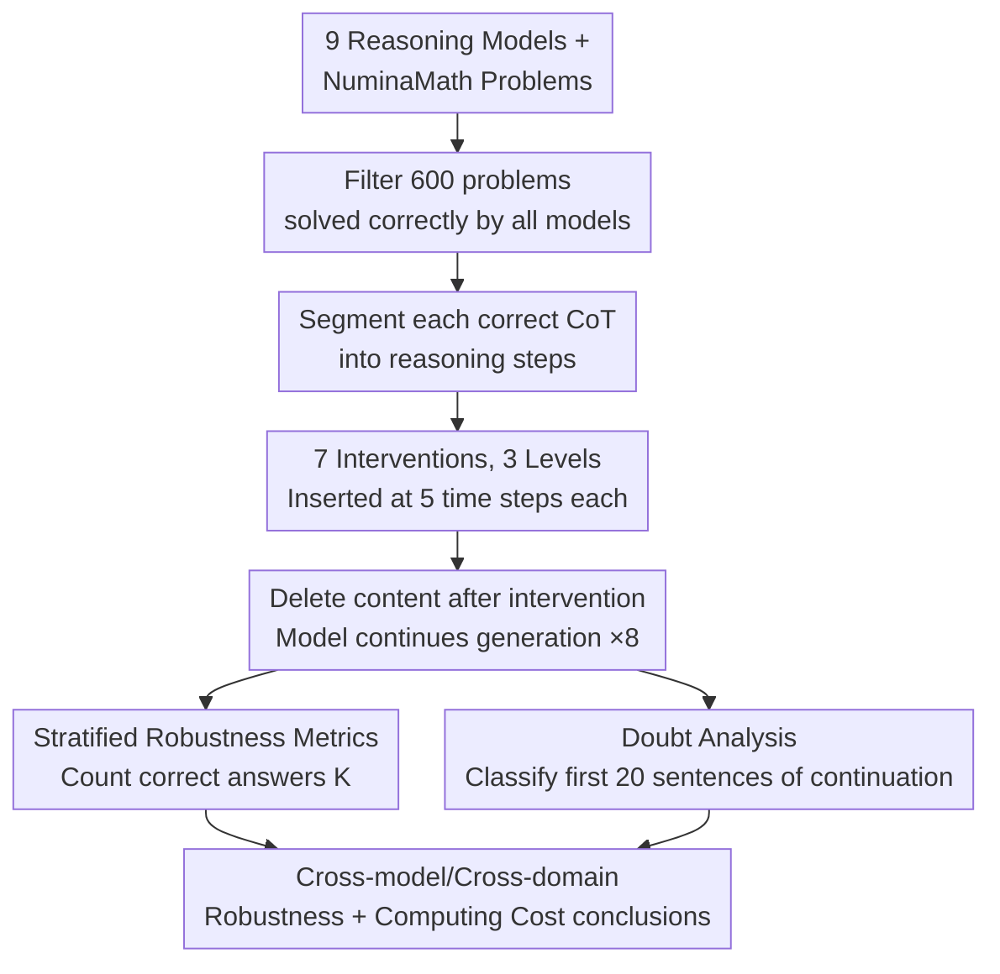

# Are Reasoning LLMs Robust to Interventions on Their Chain-of-Thought?

**Conference**: ICLR 2026  
**arXiv**: [2602.07470](https://arxiv.org/abs/2602.07470)  
**Code**: None  
**Area**: LLM Reasoning  
**Keywords**: reasoning LLM, chain-of-thought, robustness, self-correction, doubt mechanism

## TL;DR
This paper systematically evaluates the robustness of reasoning LLMs to various interventions (benign, neutral, adversarial) in their Chain-of-Thought (CoT). It finds that while models are generally robust and can recover from interventions, paraphrasing the CoT suppresses "self-doubt" expressions, leading to decreased accuracy. Furthermore, the recovery process incurs significant computational overhead, with CoT expansion reaching up to 665%.

## Background & Motivation
**Background**: Reasoning LLMs (e.g., DeepSeek-R1, QwQ) enhance performance on complex tasks by generating step-by-step CoTs. However, in practical deployment, CoTs may be disturbed by noisy tool outputs, adversarial injections, or internal hallucinations.

**Limitations of Prior Work**: It is well-documented that traditional (non-reasoning) LLMs have limited self-correction capabilities—often changing correct answers to incorrect ones. There is a lack of systematic research on whether reasoning models trained via RLVR have acquired stronger robustness and self-correction abilities.

**Key Challenge**: There exists a trade-off between reasoning robustness and efficiency—models might recover the correct answer, but at the cost of massive CoT expansion and soaring inference costs.

**Goal**: (1) Can reasoning LLMs recover from interventions in their CoT? (2) What factors influence this recovery capability? (3) What is the computational cost of recovery?

**Key Insight**: A controlled experimental framework is designed to apply 7 types of interventions to CoTs that the model originally generated correctly, measuring the model's ability to still reach the correct conclusion.

**Core Idea**: Reasoning LLMs are generally robust to CoT interventions, but this robustness relies on a metacognitive mechanism called "self-doubt" (doubt). Paraphrasing styles suppress this doubt and impair performance.

## Method

### Overall Architecture
This paper investigates whether reasoning models can "rescue" an answer after their CoT has been "disrupted" mid-way. The authors established a controlled intervention framework. First, 600 math problems from NuminaMath were filtered—specifically those that all tested models could solve correctly independently. This ensures that the model "knew how to do it," allowing any changes after intervention to be attributed to the intervention itself. The CoT is then sliced into steps or segments. At 5 relative time steps ($t = 0.1, 0.3, 0.5, 0.7, 0.9$, representing 10%–90% of the reasoning process), an intervention is inserted, original content following the intervention point is deleted, and the same model is prompted to continue reasoning. Eight independent samples are taken for each case to calculate the recovery rate.

The evaluation scale is extensive: 9 open-source reasoning models × 600 math problems × 7 interventions × 5 time steps × 8 samples. For math alone, this involves ~1.52 million reasoning chains. Including Science (231 problems) and Logic (326 problems), the total reaches ~2.92 million chains, supporting statistically significant cross-model and cross-domain conclusions.

### Key Designs

**1. Seven Interventions across Three Levels: Probing Robustness Boundaries with Benign to Adversarial Perturbations**

Simply measuring accuracy is insufficient; it is necessary to identify which disruptions cause sensitivity. The authors categorized interventions into three levels based on intent. **Benign** (2 types): (a) Using another model to continue one correct step, (b) Paraphrasing—rewriting the entire CoT while preserving semantics. **Neutral** (2 types): (c) Inserting random garbled characters, (d) Replacing the current step with an irrelevant Wikipedia paragraph. **Adversarial** (3 types): (e) Inserting an incorrect reasoning continuation, (f) Inserting fake mathematical facts, (g) Replacing current content with the start of an off-topic CoT. Four interventions require context-aware generation (using Qwen-2.5-32B-Instruct), while three are context-independent. This design covers both "seemingly harmless rewrites" and "obvious malicious injections."

**2. Stratified Robustness Metrics: Characterizing Recovery Stability through Three Stringency Levels**

To determine robustness across 8 independent samples, the authors defined $K$ as the number of correct outcomes and established three levels: at-least-once-robust ($K \geq 1$), majority-robust ($K \geq 5/8$), and all-robust ($K = 8$). Analysis primarily uses majority-robust as it filters out "lucky guesses" without being overly punitive towards normal sampling fluctuations.

**3. Doubt Analysis: Quantifying "Self-Doubt" as a Statistical Metacognitive Signal**

The authors observed that reasoning models often produce hesitant expressions like "Wait" or "Let me check" after errors. To quantify this "self-doubt," they used an LLM classifier to perform binary classification (doubt / non-doubt) on the first 20 sentences of the continuation. They calculated the proportion of doubt sentences and compared it against the baseline (0.153). This transforms qualitative observations into quantitative data for cross-intervention and cross-model comparison.

## Key Experimental Results

### Main Results: Majority Robustness (Mathematics)

| Findings | Details |
|------|------|
| General Robustness | Except for the smallest models, majority robustness is near 1.0 for all models across interventions. |
| Size Effect | R1-Distill-Qwen-1.5B is the least robust; 32B models are the strongest. |
| Time Step Effect | Earlier interventions ($t=0.1$) have a greater impact. |
| Sole Exception | Paraphrasing is the only intervention that consistently causes a performance drop across all models. |

### CoT Length Expansion (% Change vs. Original CoT)

| Model | Benign:Rewrite | Neutral:Add Text | Neutral:Insert Chars | Adv:Wrong Cont. |
|------|----------------|------------------|---------------------|-----------------|
| R1-Distill-Qwen-1.5B | -37% | **+665%** | +111% | +32% |
| R1-Distill-Qwen-7B | -60% | +124% | +34% | +9% |
| R1-Distill-Qwen-14B | -62% | +54% | +6% | +10% |
| QwQ-32B | -44% | +167% | +6% | +16% |

### Key Findings
- **Doubt is the core mechanism for recovery**: Doubt expressions increase significantly after interventions, with adversarial interventions triggering the strongest signals. Successful recovery traces show slightly higher doubt than failed ones, suggesting doubt supports but does not guarantee recovery.
- **The fatal issue with Paraphrasing**: Rewriting the CoT reduces the doubt rate from 0.153 to 0.068-0.076. Models switch to a more "confident" but error-prone style. At $t=0.1$, paraphrasing shortens the CoT by 59-61% but decreases accuracy.
- **Robustness is consistent across domains**: Recovery patterns in Math, Science, and Logic are fundamentally identical.
- **Small models are significantly more fragile**: The 1.5B model exhibits a 665% CoT expansion under Neutral interventions, whereas larger models range from 54-167%.

## Highlights & Insights
- **Discovery of Doubt as Metacognition**: This is the first systematic quantification of the functional role of self-doubt expressions like "Wait/Let me check" in reasoning LLMs. They are active recovery mechanisms—trained metacognitive abilities—rather than redundant outputs. This is crucial for understanding emergent behaviors from RLVR.
- **Lack of Style Invariance**: Paraphrasing preserves semantics but alters style, leading to performance degradation. This suggests that current reasoning LLM robustness relies partly on specific linguistic styles (hedging, self-questioning) rather than pure logical reasoning.
- **Practical Implications—Risks of Tool Output Injection**: In Agent systems, tool results are inserted into CoTs. This paper quantifies the impact of such injections (up to +665% compute overhead), providing an empirical basis for optimizing reasoning efficiency.

## Limitations & Future Work
- Only open-source models were evaluated; closed-source models like o1/o3 were not included.
- The 600 math problems are limited to those all models could solve, likely overestimating robustness—recovery might be worse on harder problems.
- Interventions were applied at a single step; real scenarios may involve multiple sequential disruptions.
- Did not explore improving style invariance through training (e.g., including paraphrased traces in RLVR).

## Related Work & Insights
- **vs. BIG-Bench Mistake**: That benchmark measures error localization; this paper extends it to error recovery. Reasoning LLMs significantly outperform traditional LLMs in error localization (66-94% vs. 17-62% for GPT-4).
- **vs. Yang et al. (2025)**: While they injected misleading content at the start of CoT, this paper intervenes at arbitrary time steps using the model's own CoT, which is more representative of real scenarios.
- **Implications for Training**: RLVR training should preserve doubt expressions, enhance style robustness, and develop efficient recovery strategies to control token overhead.

## Rating
- Novelty: ⭐⭐⭐⭐ First systematic robustness benchmark for reasoning LLM CoTs; discovery of the doubt mechanism is a key insight.
- Experimental Thoroughness: ⭐⭐⭐⭐⭐ 9 models × 7 interventions × 3 domains × 2.92M chains; the scale is impressive.
- Writing Quality: ⭐⭐⭐⭐ Clear structure, detailed experimental data, and rich visualizations.
- Value: ⭐⭐⭐⭐ Provides systematic evidence for reasoning LLM robustness, guiding both deployment safety and training improvements.

<!-- RELATED:START -->

## Related Papers

- [\[ICLR 2026\] When More Is Less: Understanding Chain-of-Thought Length in LLMs](when_more_is_less_understanding_chain-of-thought_length_in_llms.md)
- [\[AAAI 2026\] Chain-of-Thought Driven Adversarial Scenario Extrapolation for Robust Language Models](../../AAAI2026/llm_reasoning/chain-of-thought_driven_adversarial_scenario_extrapolation_for_robust_language_m.md)
- [\[ICLR 2026\] Elastic Reasoning: Scalable Chain-of-Thought via Elastic Reasoning](scalable_chain_of_thoughts_via_elastic_reasoning.md)
- [\[ICLR 2026\] DAG-Math: Graph-of-Thought Guided Mathematical Reasoning in LLMs](dag-math_graph-of-thought_guided_mathematical_reasoning_in_llms.md)
- [\[ICLR 2026\] InT: Self-Proposed Interventions Enable Credit Assignment in LLM Reasoning](int_self-proposed_interventions_enable_credit_assignment_in_llm_reasoning.md)

<!-- RELATED:END -->
