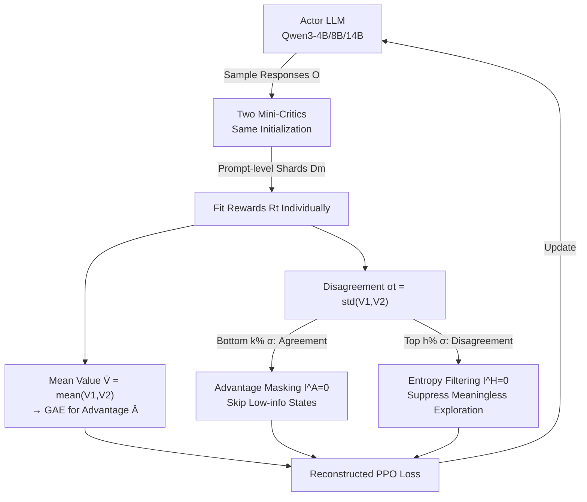

# Asymmetric Proximal Policy Optimization: Mini-Critics Boost LLM Reasoning

**Conference**: ICLR 2026  
**OpenReview**: [https://openreview.net/forum?id=0vgzrcv4Dr](https://openreview.net/forum?id=0vgzrcv4Dr)  
**Code**: TBD  
**Area**: LLM Reasoning / RL4LLM  
**Keywords**: PPO, asymmetric actor-critic, mini-critic ensemble, value estimation, entropy regularization, RLVR  

## TL;DR
AsyPPO replaces the bulky critic (same size as the actor) with two lightweight mini-critics trained on non-overlapping data shards at the prompt level. This restores the utility of the PPO value function while maintaining GRPO-level overhead. Furthermore, it leverages the "disagreement" signal between the two critics for advantage masking and entropy filtering, stably outperforming GRPO and classic PPO on Qwen3-4B/8B/14B.

## Background & Motivation
**Background**: PPO is the most effective actor-critic algorithm in classic deep RL. Adapting it to RLVR (Reinforcement Learning from Verifiable Rewards) to "reward correct answers" has also been successful. However, PPO defaults to a symmetric design where the critic is as large as the actor. Training a full-sized critic at the LLM scale is expensive and often leads to inaccurate estimations under sparse rewards and long reasoning chains. Consequently, mainstream methods like GRPO, DAPO, and GSPO discard the critic entirely, using group-sampled average advantages as a coarse baseline.

**Limitations of Prior Work**: While discarding the critic simplifies training, it removes a core RL capability—robust state-value estimation, which mitigates advantage bias and prevents training collapse, especially in off-policy (sample reuse) scenarios. Critic-free methods like GRPO often become unstable when sample reuse ratios are high.

**Key Challenge**: The goal is to obtain fine-grained, robust value estimation without the computational cost of a symmetric critic. Can PPO be redesigned to move beyond the symmetric actor-critic architecture, achieving lightweight yet robust value estimation?

**Goal**: Redefine the critic bottleneck in RL4LLM as an **architectural problem** rather than a purely algorithmic or optimization one, restoring the role of the critic while maintaining efficiency at the LLM scale.

**Core Idea**: The key insight is that **the inherent representation power of pre-trained models makes "small critics guiding large actors" feasible in RL4LLM** (a major departure from classic RL agents that learn from scratch). A 0.6B critic can surprisingly provide meaningful guidance to an 8B actor. However, a single small critic is inferior to symmetric PPO, leading to the introduction of a critic ensemble. Since LLM critics initialized from the same checkpoint tend to lack diversity, the authors propose **non-overlapping data shards**. Finally, they find that the "agreement/disagreement" patterns between the two critics are valuable signals for reconstructing the policy loss.

## Method

### Overall Architecture
AsyPPO transforms the symmetric PPO architecture into a setup with "one large actor + two lightweight mini-critics." Both mini-critics are initialized from the same pre-trained model but are trained on non-overlapping prompt-level data subsets to learn diverse yet calibrated value estimations. Their mean is used to correct advantages for GAE. Furthermore, the standard deviation $\sigma_t$ of the two value estimations is used as a proxy for "state information/uncertainty" to rewrite the PPO loss: masking advantages in states with high critic agreement and filtering entropy regularization in states with high critic disagreement.

### Key Designs

**1. Asymmetric mini-critic + prompt-level non-overlapping shards: Creating true diversity in small critic ensembles**. The authors first verify that a single 0.6B critic can guide an 8B actor, proving the feasibility of asymmetric architectures, though it still falls short of symmetric PPO. While ensembles reduce bias, LLM critics initialized from the same checkpoint and trained on the same data typically behave identically. To solve this, the authors feed each critic **different data**. To prevent "perceptual desynchronization" across reasoning patterns, they split data uniformly at the prompt (group) level. Each critic receives an equal but non-overlapping set of responses per prompt. The training objective for the ensemble is:
$$L_{\text{critic}}(\phi)=\sum_{m=1}^{M}\mathbb{E}_{(s_t,R_t)\sim D_m}\big[(V(s_t;\phi_m)-R_t)^2\big],\quad D=\bigcup_m D_m,\ D_i\cap D_j=\varnothing$$
The corrected advantage uses the mean value for GAE: $\bar V(s_t)=\frac1M\sum_m V_m(s_t;\phi_m)$, $\bar A_t=\sum_l(\gamma\lambda)^l\delta_{t+l}$, $\delta_t=r_t+\gamma\bar V(s_{t+1})-\bar V(s_t)$. Two critics are found to be the sweet spot for reliability and efficiency.

**2. Value agreement-based advantage masking: Dropping states with low learning potential**. With diverse critics, the standard deviation $\sigma_t=\mathrm{std}(\{V(s_t;\phi_m)\})$ serves as a measure of state information. Low $\sigma_t$ indicates that the state's downstream dynamics are already well-modeled by the policy, representing high-frequency, low-information samples. Updating on these risks overfitting. AsyPPO masks the advantage for the bottom $k\%$ of states by adding an indicator $I^A_t$ to the loss:
$$J_{\text{PPO}}(\theta)=\mathbb{E}\frac1{|o|}\sum_{t=1}^{|o|}I^A_t\cdot\min\!\big(IS_t\cdot\bar A_t,\ \mathrm{clip}(IS_t,1-\epsilon,1+\epsilon)\bar A_t\big),\quad I^A_t=\begin{cases}0,&\sigma_t\in\mathrm{Low}_k(\sigma)\\1,&\text{otherwise}\end{cases}$$
Masking the bottom 20% stabilizes training and improves performance by ~6 points under high sample reuse (UTD=4).

**3. Value disagreement-based entropy filtering: Avoiding exploration in "non-decision" states**. Conversely, high $\sigma_t$ suggests the state is weakly coupled to the final outcome or has complex future dynamics (e.g., semantic noise or filler tokens). Performing entropy-based exploration here is wasteful. A "safe entropy regularization" term filters out the top $h\%$ states with the highest value-std:
$$J_{\text{PPO}}(\theta)=\mathbb{E}\frac1{|o|}\sum_{t=1}^{|o|}\Big[I^A_t\cdot\min(\cdots)+\beta\cdot I^H_t\cdot H[\pi_\theta(\cdot|s_t)]\Big],\quad I^H_t=\begin{cases}0,&\sigma_t\in\mathrm{Top}_h(\sigma)\\1,&\text{otherwise}\end{cases}$$
This prevents entropy collapse and steers the policy toward higher-reward convergence. Interestingly, high value-std states and high entropy states do not perfectly overlap, indicating that value-std is a more precise measure of state-level uncertainty.

## Key Experimental Results

### Main Results (Scaling to large models, 14B actor, average@4)
Evaluated on MATH-500, Minerva Math, AMC 2023, and OlympiadBench. Actor: Qwen3-14B-Base, UTD=4, Batch 1024, Length 8192, LR 1e-6.

| Method | Configuration | Relative Performance |
|------|------|---------|
| GRPO | No critic, group baseline | Baseline |
| Naive AsyPPO | Single 1.7B critic for 14B | **Fail** (Insufficient capacity) |
| Naive AsyPPO | Single 4B critic for 14B | Effective learning restored |
| Symmetric PPO | 14B critic | High overhead |
| **AsyPPO** | Dual 4B critic + 20% Masking + 20% Filtering | **SOTA on all four, ~3pt avg > GRPO** |

**Key Observation**: Single critics have a "capacity threshold"—a 1.7B critic can guide an 8B actor but fails for a 14B actor. **AsyPPO lowers this threshold**, allowing dual 1.7B critics to effectively improve a 14B actor. Computationally, AsyPPO reduces peak memory and step time by ~20% compared to symmetric PPO.

### Ablation Study

| Dimension | Conclusion |
|------|------|
| Critic Size | Follows a scaling law: larger critics yield higher policy peaks. |
| Critic Count | **Dual critics provide a qualitative shift**; more critics add compute without extra gain. |
| Group Size | 32 is the most robust setting. |
| Value Aggregation | Mean is superior to Min, suggesting overestimation is not the primary issue in RL4LLM. |
| Masking Ratio | 20% masking for low value-std states provides the best gain. |
| Filtering Ratio | 20% filtering provides the best exploration-exploitation balance. |

### Key Findings
- Using only 5k open-source samples, AsyPPO improves Qwen3-4B-Base by >6% over classic PPO and ~3% for 8B/14B models.
- Advantage masking (~6 pts) and entropy filtering (~7 pts) independently contribute significant gains.
- Low value-std states typically show low entropy, but low entropy states do not always show low value-std, making value-std a more accurate uncertainty metric.

## Highlights & Insights
- **Redefining "to critic or not" as an architectural question**. While others avoid critics (GRPO), this paper argues the issue is the symmetric assumption. Breaking it allows for both robustness and efficiency.
- **Leveraging Pre-training Priors**. Small critics in RL4LLM inherit pre-trained representations, making "small-guiding-large" feasible, unlike in classic RL where agents start from scratch.
- **Economical Signal Usage**. The standard deviation of the ensemble acts as both an "informativeness" signal (masking) and a "non-decision" signal (filtering).
- **Practical Engineering Utility**. The "dual critic sweet spot" simplifies hyperparameter tuning for ensemble sizes.

## Limitations & Future Work
- Experiments were restricted to the Qwen3 series; cross-family critic ensembles (e.g., Llama) were not tested.
- Maximum sequence length was 8k; performance under extremely long reasoning chains (budgeted CoT) was not evaluated.
- Small number of random seeds; more seeds are needed to verify conclusion robustness.
- Future work: Heterogeneous ensembles, confidence-weighted aggregation, and deeper analysis of the relationship between value uncertainty and entropy.

## Related Work & Insights
- **Critic-free RL4LLM**: GRPO, DAPO, and GSPO replace the value function with group-sampled averages.
- **Critic Enhancement**: T-PPO uses critics to stabilize long-tail asynchronous training; Implicit PRM and PRIME use critic-like models for token-level supervision.
- **Asymmetric Architectures**: While previous work investigated small actors (pruning), this is the **first systematic exploration of "small critic guiding large actor"** in the RL4LLM context.
- **Insight**: Uncertainty signals from ensembles (reminiscent of Bootstrapped DQN) are effectively reactivated for LLM RL.

## Rating
- **Novelty**: ⭐⭐⭐⭐⭐ High. Counter-trend restoration of critics via asymmetric design and innovative signal usage.
- **Experimental Thoroughness**: ⭐⭐⭐⭐ Good coverage of scales and math benchmarks; extensive ablation. Small seed count and single model family are minor drawbacks.
- **Writing Quality**: ⭐⭐⭐⭐ Very clear logic and takeaways; intuitive diagrams.
- **Value**: ⭐⭐⭐⭐⭐ High practical value for engineering; provides a robust path for RLVR with low overhead.

<!-- RELATED:START -->

## Related Papers

- [\[ICLR 2026\] Reference-guided Policy Optimization for Molecular Optimization via LLM Reasoning](reference-guided_policy_optimization_for_molecular_optimization_via_llm_reasonin.md)
- [\[ICLR 2026\] HiPO: Self-Hint Policy Optimization for RLVR](hipo_self-hint_policy_optimization_for_rlvr.md)
- [\[ICLR 2026\] Slow-Fast Policy Optimization: Reposition-Before-Update for LLM Reasoning](slow-fast_policy_optimization_reposition-before-update_for_llm_reasoning.md)
- [\[ICLR 2026\] Scaf-GRPO: Scaffolded Group Relative Policy Optimization for Enhancing LLM Reasoning](scaf-grpo_scaffolded_group_relative_policy_optimization_for_enhancing_llm_reason.md)
- [\[ICLR 2026\] Inpainting-Guided Policy Optimization for Diffusion Large Language Models](inpainting-guided_policy_optimization_for_diffusion_large_language_models.md)

<!-- RELATED:END -->
