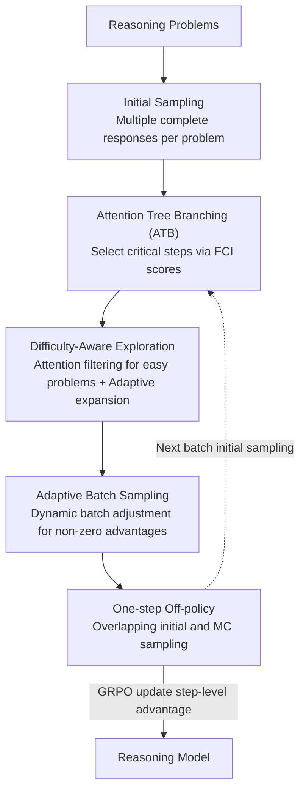

# Attention as a Compass: Efficient Exploration for Process-Supervised RL in Reasoning Models

**Conference**: ICLR2026  
**OpenReview**: [https://openreview.net/forum?id=NCN8oUsiNf](https://openreview.net/forum?id=NCN8oUsiNf)  
**Code**: https://github.com/RyanLiu112/AttnRL  
**Area**: Reinforcement Learning / LLM Reasoning  
**Keywords**: Process-Supervised RL, Attention Branching, Adaptive Sampling, Exploration Efficiency, Mathematical Reasoning

## TL;DR
AttnRL uses the model's own attention scores as a "compass" to perform tree branching on critical reasoning steps (rather than using fixed lengths or entropy). Combined with difficulty-adaptive sampling and a one-step off-policy training pipeline, it enables Process-Supervised RL (PSRL) to improve mathematical reasoning while saving computation—achieving a 7.5% average gain on 1.5B models with shorter wall-clock time than TreeRL.

## Background & Motivation
**Background**: Reinforcement Learning from Verifiable Rewards (RLVR) has become a mainstream post-training paradigm for enhancing LLM reasoning, especially following DeepSeek-R1. The most common approach is **Outcome-Supervised RL (OSRL)** like GRPO, which assigns the same training signal to all tokens in a response based only on final correctness. A more granular branch is **Process-Supervised RL (PSRL)**, which uses Monte Carlo (MC) sampling to "fork" multiple continuations from middle points of a reasoning path to estimate step-level advantage and perform fine-grained credit assignment.

**Limitations of Prior Work**: Existing PSRL methods suffer from three specific inefficiencies in exploration. First, **branching locations are chosen arbitrarily**—either by fixed token lengths or entropy, ignoring output semantics and often resulting in branches at unimportant steps. Second, **sampling is uniform across all problems**—easy problems (which are 100% correct in initial sampling) have a 70%-80% probability of remaining entirely correct across rounds, yielding a constant advantage of zero and contributing nothing to training while wasting budget. Third, **each update requires two sampling rounds** (initial sampling followed by MC sampling), doubling the generation cost which is typically the bottleneck of RL training.

**Key Challenge**: PSRL requires fine-grained process signals via MC sampling of intermediate steps, but the locations, targets, and rounds of these trials are inefficient. This creates a sharp trade-off between "granularity" and "computational cost." making PSRL practical requires resolving these three inefficiencies simultaneously.

**Key Insight**: The authors noted clues from interpretability research showing that "massive attention values" in self-attention often mark tokens critical to the response. They hypothesize that in complex reasoning tasks, these high-attention steps correspond to **reasoning behaviors** like planning and self-verification. If true, attention could serve as a "importance compass" without requiring an extra reward model.

**Core Idea**: Use attention scores to locate the most critical reasoning steps and **branch at these locations** (exploring where it matters). This is combined with difficulty-adaptive sampling filters and a one-step off-policy pipeline to simultaneously boost both exploration and training efficiency for PSRL.

## Method

### Overall Architecture
AttnRL is a PSRL framework built upon TreeRL (Tree-based Advantage Estimation). It takes mathematical reasoning problems as input and outputs an RL-finetuned reasoning model. A training iteration consists of three collaborative components: first, initial sampling generates complete responses; then, **Attention Tree Branching (ATB)** identifies critical steps for MC continuation to form a tree and estimate step-level advantages; meanwhile, **Adaptive Sampling** performs difficulty-aware filtering and expansion at the problem level while dynamically adjusting batch size; finally, a **One-step Off-policy Pipeline** overlaps "initial sampling for the next batch" with "MC sampling for the current batch" in a single generation pass. These address the three pain points: branching location, sampling target/scale, and sampling rounds.

### Key Designs

**1. Attention Tree Branching (ATB): Branching on "Real Reasoning" Steps**

This targets the "arbitrary branching" issue. Responses are split into $T_k$ steps based on double newlines (`\n\n`). Attention is extracted and aggregated to the step level to obtain a step-to-step matrix $\alpha^{l,h}_{j,k}$ (attention of step $j$ on step $k$ at layer $l$, head $h$). Based on this, the **Forward Context Influence (FCI) score** is defined: $y^{l,h}_k = \sum_{j=k+\Delta}^{T_k} \alpha^{l,h}_{j,k}$, where $\Delta=4$ skips immediate neighbors to focus on long-range influence. The final score is the maximum across layers and heads $y_k = \max_{l,h}\{y^{l,h}_k\}$. Higher $y_k$ indicates deeper influence on downstream generation. Visualization shows high-FCI steps correspond to planning/verification (e.g., "Let me check..."). Perturbation experiments confirm that zeroing attention for the top 20% FCI steps significantly degrades accuracy, whereas perturbing others has little impact. ATB selects the set $C$ of steps in the top $\rho=0.2$ quantile as candidates. To prevent "Tunnel Vision" (early errors derailing the path), only the **earliest $N=2$** steps from $C$ are used as branching points.

**2. Difficulty-Aware Exploration: Attention Filtering + Adaptive Tree Expansion**

This addresses uniform sampling wastage. The framework uses attention signals for **Attention Filtering**: problems with 100% initial accuracy and low average FCI scores ($\frac{1}{G}\sum_i \frac{1}{T_{i,k}}\sum_k y_{i,k}$) are filtered out, as they are likely to yield zero advantages. Only problems $D_{\text{MC}}$ with attention above the global mean are kept. Then, **Difficulty-adaptive Expansion** is applied: difficulty $z_n$ is defined by initial accuracy. Harder problems receive more branches: $M = \text{Round}(\exp(-z_n)\times M')$ (with baseline $M'=6$). Attention acts as a filter and difficulty as an allocator, shifting MC budget from easy to hard problems.

**3. Adaptive Batch Sampling: Dynamic Batching for Non-zero Advantage**

Even with filtering, many responses still yield zero advantage after MC sampling. A dynamic batching mechanism is introduced: given a target training batch $B'$, the current effective batch $B''_m$, and the prompt batch $B_m$, the next sampling scale is updated via $B_{m+1} = \text{Round}(\lambda B_m + (1-\lambda)\frac{B'}{B''_m}B_m)$ with $\lambda=0.9$ as EMA smoothing. If effective samples are few, sampling is increased. All zero-advantage responses are discarded, ensuring **every sample in the training batch has a non-zero advantage**.

**4. One-step Off-policy Pipeline: Compressing Two Rounds into One**

This addresses the PSRL generation bottleneck. Traditional PSRL uses two separate generation passes (initial and MC) per iteration. AttnRL performs **one** sampling pass per training step by overlapping the MC sampling of batch $m$ with the initial sampling of batch $m+1$. While this means MC sampling uses a policy one step behind the current one (one-step off-policy), empirical results show this minor divergence does not harm performance while reducing wall-clock time by approximately 8% compared to TreeRL.

### Loss & Training
The policy optimization follows the GRPO objective with step-level advantages derived from TreeRL's tree estimation. Node value $V(s_k)$ is the mean accuracy of its children. The step-level advantage $\hat{A}_{i,k} = \frac{1}{\sqrt{|L(s_k)|}}\big[(V(s_k)-V(s_1)) + (V(s_k)-V(p(s_k)))\big]$ combines global and local advantages, with $\sqrt{|L(s_k)|}$ scaling to prevent overfitting at non-leaf nodes. The training uses the verl framework with vLLM, token-level policy loss, Clip-Higher ($\varepsilon_{\text{high}}=0.28$), and a KL weight of 0.001.

## Key Experimental Results

### Main Results
On six mathematical benchmarks (AIME24/25, AMC23, MATH-500, Minerva, OlympiadBench), using DS-R1-Distill-Qwen-1.5B/7B as backbones:

| Model / Method | AIME24 | AIME25 | AMC23 | MATH-500 | Minerva | Olympiad | Avg |
|------------|--------|--------|-------|----------|---------|----------|------|
| DS-R1-Distill-Qwen-1.5B (Base) | 28.3 | 23.0 | 71.8 | 84.8 | 35.6 | 54.9 | 49.7 |
| GRPO | 36.9 | 27.2 | 77.7 | 88.4 | 39.5 | 60.4 | 55.0 |
| DeepScaleR-Preview-1.5B | 40.5 | 28.3 | 81.0 | 89.5 | 38.1 | 61.8 | 56.5 |
| TreeRL | 36.7 | 27.1 | 78.9 | 88.5 | 38.7 | 60.9 | 55.1 |
| **AttnRL (1.5B)** | 39.7 | 28.5 | **83.2** | **90.0** | 40.3 | 61.4 | **57.2** |
| DS-R1-Distill-Qwen-7B (Base) | 54.0 | 40.0 | 89.8 | 94.1 | 48.1 | 70.0 | 66.0 |
| TreeRL (7B) | 55.4 | 40.0 | 92.2 | 94.3 | 49.0 | 70.7 | 66.9 |
| **AttnRL (7B)** | **59.3** | **42.5** | **92.5** | **95.4** | **49.3** | **73.3** | **68.7** |

AttnRL (1.5B) gains +7.5% over the base and outperforms DeepScaleR (which uses 24K context expansion and 1750 steps) using only 8K length and 500 steps. 7B results show consistent +1.8% gains over TreeRL.

### Ablation Study
On DS-R1-Distill-Qwen-1.5B (Average Pass@1):

| Config | Avg | Description |
|------|------|------|
| TreeRL | 55.1 | Baseline (Entropy-based branching + uniform sampling) |
| w/ Early 2 steps | 55.4 | Branching at the first 2 steps without FCI |
| w/ ATB | 56.3 | Adding Attention Tree Branching (+1.2% over TreeRL) |
| w/ ATB + ADS (no attention filter) | 56.4 | Adaptive sampling without easy-problem filtering |
| w/ ATB + ADS (no adaptive expansion) | 56.8 | Without difficulty-based tree scaling |
| **AttnRL (Full)** | **57.2** | Complete ATB + ADS |

### Key Findings
- **ATB is the primary driver**: Adding ATB alone improves results by 1.2% over TreeRL, confirming that branching at high-FCI steps identifies more effective samples.
- **Moderate filtering is key**: Hard filtering (removing all initially correct problems) hurts performance; AttnRL's soft filtering using attention thresholds provides better signals.
- **Efficiency gains**: AttnRL achieved 930.4M effective training tokens within 62.6 wall-clock hours, whereas TreeRL only generated 274.6M in 67.7 hours.
- **Healthy Training Dynamics**: AttnRL maintains higher entropy (more diverse exploration) and achieves faster reward/accuracy growth with shorter average response lengths.

## Highlights & Insights
- **Interpretability as an RL Compass**: By utilizing FCI scores, the model's internal attention—a byproduct of inference—is transformed into an exploration guide, bypassing the need for expensive reward model training.
- **Targeted Solutions for Three Inefficiencies**: Branching location (ATB), sampling target/scale (ADS), and sampling rounds (One-step Off-policy) are addressed via modular designs that can be integrated into existing PSRL frameworks.
- **Importance of Early Steps**: The "Tunnel Vision" hypothesis and perturbation experiments prove that early steps are more critical. AttnRL's "High Impact ∩ Early" constraint is a simple but effective heuristic for tree search.
- **Ensuring Non-zero Advantage**: The dynamic batching ensures every training step is productive, solving a common overhead in RLVR where zero-advantage samples dominate.

## Limitations & Future Work
- **Domain Specificity**: Validated only on mathematical reasoning with R1-distilled models; robustness in coding, science, or multimodal tasks is unproven.
- **Heuristic Thresholds**: Parameters ($\rho=0.2$, $N=2$, etc.) are empirically set; their sensitivity across model scales or datasets hasn't been fully mapped. 
- **Off-policy Boundaries**: The impact of larger policy lags (beyond one-step) or significantly longer contexts remains unanalyzed.
- **Potential Improvements**: Refining FCI by selecting specific heads/layers and unifying filtering and expansion into a more principled budget allocation framework.

## Related Work & Insights
- **vs GRPO (OSRL)**: GRPO ignores process quality; AttnRL uses MC sampling for step-level advantages, making it notably stronger on difficult problems.
- **vs TreeRL**: AttnRL improves upon TreeRL by replacing entropy-based branching with FCI-based branching and adding efficiency-focused sampling pipelines.
- **vs DeepScaleR**: While DeepScaleR relies on context length scaling, AttnRL demonstrates that efficiency in exploration can achieve superior results with much less compute.
- **vs DAPO**: unlike DAPO which might discard effective samples or repeat sampling, AttnRL uses EMA-based dynamic batching for smoother and more efficient resource management.

## Rating
- Novelty: ⭐⭐⭐⭐ Innovative use of FCI as a PSRL compass.
- Experimental Thoroughness: ⭐⭐⭐⭐ Solid across multiple benchmarks and scales, though limited to math.
- Writing Quality: ⭐⭐⭐⭐ Clear correspondence between pain points and design choices.
- Value: ⭐⭐⭐⭐ Practical improvements for PSRL efficiency and performance.

<!-- RELATED:START -->

## Related Papers

- [\[ICLR 2026\] Co-rewarding: Stable Self-supervised RL for Eliciting Reasoning in Large Language Models](co-rewarding_stable_self-supervised_rl_for_eliciting_reasoning_in_large_language.md)
- [\[ICLR 2026\] FROST: Filtering Reasoning Outliers with Attention for Efficient Reasoning](frost_filtering_reasoning_outliers_with_attention_for_efficient_reasoning.md)
- [\[ICLR 2026\] Beyond Markovian: Reflective Exploration via Bayes-Adaptive RL for LLM Reasoning](beyond_markovian_reflective_exploration_via_bayes-adaptive_rl_for_llm_reasoning.md)
- [\[ACL 2026\] Reinforced Efficient Reasoning via Semantically Diverse Exploration](../../ACL2026/llm_reasoning/reinforced_efficient_reasoning_via_semantically_diverse_exploration.md)
- [\[ACL 2025\] An Efficient and Precise Training Data Construction Framework for Process-Supervised Reward Model in Mathematical Reasoning](../../ACL2025/llm_reasoning/an_efficient_and_precise_training_data_construction_framework_for_process-superv.md)

<!-- RELATED:END -->
