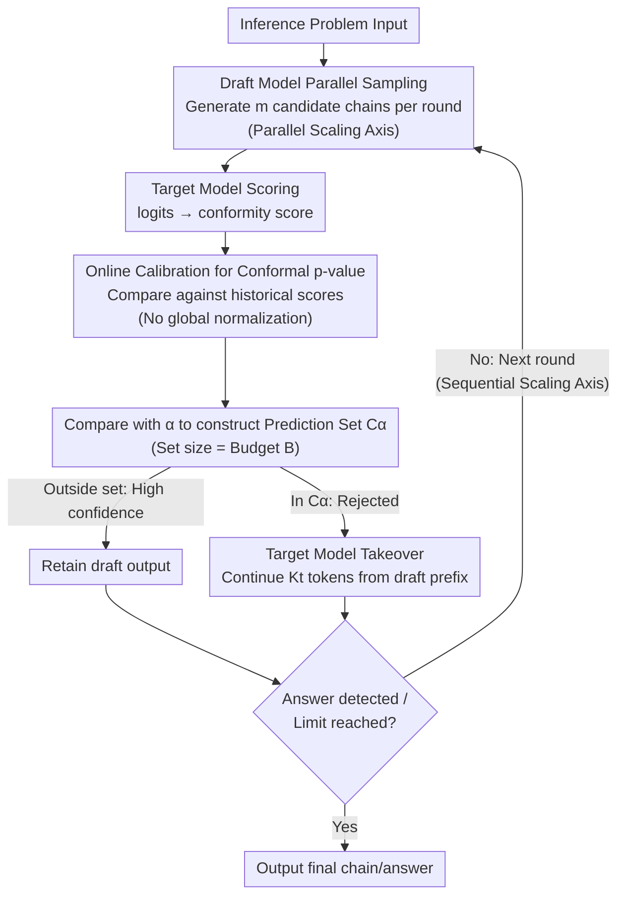

# ATTS: Asynchronous Test-Time Scaling via Conformal Prediction

**Conference**: ICLR 2026  
**arXiv**: [2509.15148](https://arxiv.org/abs/2509.15148)  
**Code**: [https://github.com/menik1126/Asynchronous-Test-Time-Scaling](https://github.com/menik1126/Asynchronous-Test-Time-Scaling)  
**Area**: LLM Inference  
**Keywords**: Test-time scaling, speculative decoding, conformal prediction, asynchronous inference, rejection sampling

## TL;DR
This paper proposes ATTS, an asynchronous test-time scaling framework based on conformal prediction. By reframing rejection sampling as a hypothesis testing process to eliminate synchronization overhead, it achieves up to 56.7x speedup and 4.14x throughput improvement on mathematical reasoning tasks such as MATH and AIME without accuracy loss. A 1.5B/70B draft/target model combination reaches the AIME performance level of o3-mini (high).

## Background & Motivation
**Background**: Test-time scaling (increasing compute budget during inference) significantly enhances Large Language Model (LLM) reasoning capabilities through sequential scaling (longer reasoning chains) and parallel scaling (more sampling). Speculative decoding is a natural candidate for accelerating this process by using small models for generation and large models for verification.

**Limitations of Prior Work**: Speculative decoding encounters two primary bottlenecks during test-time scaling: (1) **Memory bottleneck**—high-concurrency sampling leads to KV cache explosion and GPU Out-of-Memory (OOM) errors; (2) **Synchronization overhead**—standard rejection sampling requires global ranking or softmax normalization of all candidates, resulting in synchronization wait times that grow exponentially with the number of sampling rounds.

**Key Challenge**: Efficient test-time scaling requires simultaneous scaling along both parallel and sequential dimensions. However, global synchronization operations for ranking and normalization make asynchronous execution impossible, as every candidate must wait for others to be completed before ranking can occur.

**Goal**: How to eliminate the synchronization bottleneck of rejection sampling in test-time scaling while maintaining statistical guarantees?

**Key Insight**: Introduce conformal prediction to construct prediction sets, utilizing p-values instead of normalized softmax scores for ordinal classification. This allows each candidate to be judged for acceptance or rejection independently without waiting for a global ranking.

**Core Idea**: Utilize the p-values from conformal prediction to replace global ranking, enabling asynchronous rejection sampling and eliminating the synchronization bottleneck in test-time scaling.

## Method

### Overall Architecture
ATTS addresses the problem where global ranking and normalization in speculative decoding force all candidates to wait for each other, causing synchronization overhead to scale exponentially with sampling rounds. The core mechanism involves transforming the decision of "which candidates to reject" from a global ranking operation into individual hypothesis tests conducted independently for each candidate.

The pipeline consists of a three-stage, iterative rejection sampling loop. In each round, the Draft model first samples $m$ candidate reasoning chains in parallel. The Target model assigns a conformity score to each candidate, which is then converted into a conformal p-value. This p-value is compared against a threshold $\alpha$ to independently determine whether the candidate should be accepted or rejected, without requiring information from other candidates. Candidates falling within the prediction set $C_\alpha$ are identified as low-confidence and handed to the Target model for continuation based on the draft prefix, while high-confidence candidates outside the set retain the draft's output. If no answer is detected by the end of a round, the process proceeds to the next round with the generated content. Sequential scaling is achieved through multiple rounds, while parallel scaling is achieved through multiple candidates per round—both dimensions can be scaled without accumulating synchronization delays.

### Key Designs

**1. Asynchronous Arithmetic Intensity: Proving Synchronization as the Bottleneck**

To justify the necessity of asynchronous execution, the authors quantify the cost of synchronization. Traditional arithmetic intensity balances computation against memory access, but in test-time scaling, the primary bottleneck is synchronization wait time. Empirical measurements show that synchronization overhead grows **exponentially** with the number of sampling rounds and linearly with concurrent samples. ATTS defines asynchronous arithmetic intensity as:

$$r = \frac{T_c}{T_m + T_s} = \frac{t_c \times f}{t_m \times b + T_s} \approx \frac{T_c}{T_s},$$

where $T_c$ is computation time, $T_m$ is memory access time, and $T_s$ is synchronization overhead. $T_m$ is approximated away because $T_s$ significantly exceeds $T_m$ at large sampling scales. As the number of samples increases, $r$ continues to decrease, quantitatively demonstrating that the bottleneck lies in "waiting for others" rather than raw compute or memory bandwidth.

**2. Conformal p-value Ordinal Classification + Online Calibration: Removing Global Normalization**

The root of synchronization is the requirement for softmax normalization or global ranking in rejection sampling. ATTS reformulates this as a hypothesis testing problem under ordinal classification. For each candidate $k$, an **unnormalized** conformity score $s_\xi^k = -\ell(X_\xi, \hat{Y}_\xi^k)$ is calculated using Target model logits (higher scores indicate higher reliability). Its conformal p-value is then calculated as:

$$p_\xi^k = \frac{\sum_{i=1}^{n}\sum_{j=1}^{m}\mathbf{1}(s_\xi^k \le s_i^j) + 1}{nm + 1}.$$

This ranks the current candidate's score against $n \times m$ historical scores from a calibration set. Since this depends only on the specific candidate and historical data, each candidate can be evaluated independently and asynchronously. Statistical guarantees are maintained such that $\mathbb{P}(y \in C_\alpha(Y)) \geq 1 - \alpha$, ensuring high-quality candidates are not discarded. Since a pre-existing calibration set is unavailable during test-time scaling, ATTS populates a dynamic calibration set online by pre-sampling $m$ outputs for each test input.

**3. Three-Stage Rejection Sampling Pipeline: Parallel and Sequential Scaling**

The sampling loop executes three phases per round. **Draft Model Sampling**: The draft model $q_d$ proposes $m$ candidate continuations of length $K_d$. **Verification**: The target model $q_t$ computes conformity scores and p-values. The threshold $\alpha$ is set such that the size of $C_\alpha$ matches a preset budget $B$ (number of rejected candidates), effectively capping KV cache usage to prevent OOM. **Target Model Sampling**: Low-confidence candidates in $C_\alpha$ are continued by the target model for up to $K_t$ tokens, rather than being fully resampled, saving token budget. High-confidence candidates retain the draft output.

### Loss & Training
Ours is training-free and lossless. ATTS operates entirely at inference time, does not modify model weights, and is agnostic to the specific draft/target model architecture.

## Key Experimental Results

### Main Results (Across Different Draft-Target Model Families)

| Dataset | Draft Model | Target Model | Accuracy | Mar Speedup | Con Speedup |
|---------|------------|-------------|----------|-------------|-------------|
| MATH100 | Qwen2.5-7B-Inst | QwQ-32B | 96.0% (=TM) | **7.19x** | 5.35x |
| AIME24 | Qwen2.5-7B-Inst | QwQ-32B | 46.7% | **5.71x** | 10.10x |
| AIME25 | Qwen2.5-7B-Inst | QwQ-32B | 40.0% | **14.50x** | 12.82x |
| AMC23 | Qwen2.5-7B-Inst | QwQ-32B | 76.0% | **10.42x** | 8.20x |

### Large-Scale Scaling Results

| Configuration | Description |
|------|------|
| Up to 56.7x speedup | Under test-time scaling scenarios |
| 4.14x throughput gain | Simultaneous sequential and parallel scaling |
| 1.5B/70B draft/target | Reaches o3-mini (high) AIME performance |
| Accurate Rejection Rate | Highly consistent with preset $\alpha$ |

### Key Findings
- **Cross-Family Effectiveness**: ATTS provides significant acceleration even when draft and target models belong to different families (e.g., Qwen to QwQ).
- **Lossless Acceleration**: Accuracy after acceleration equals or exceeds the target model baseline.
- **Asynchronous Advantage**: The benefits of the asynchronous approach become more pronounced as the number of samples increases, as synchronization overhead is exponential while asynchronous overhead is constant.
- **Coverage Trade-offs**: Conditional coverage (per-instance guarantee) is more reliable but generally more conservative than marginal coverage.

## Highlights & Insights
- **Innovation**: Elegant combination of conformal prediction theory and systems engineering to solve the synchronization bottleneck in speculative decoding.
- **Metrics**: Introduction of the asynchronous arithmetic intensity index provides a quantitative tool for identifying bottlenecks in test-time scaling.
- **Practicality**: The framework is training-free, model-agnostic, and provides statistical guarantees, making it ready for production deployment.

## Limitations & Future Work
- Online calibration requires sufficient historical scores; accuracy may be lower during the "cold start" phase.
- Performance depends significantly on draft model quality; weak draft models may result in lower accuracy than the target model baseline.
- Evaluation was limited to mathematical reasoning; applicability to open-ended generation tasks remains unverified.
- Simultaneous deployment of both draft and target models increases GPU resource requirements.

## Related Work & Insights
- **vs. Standard Speculative Decoding**: ATTS extends the concept from token-level to chain-level and resolves the specific synchronization issues of test-time scaling.
- **vs. Best-of-N (BoN)**: BoN requires all $N$ chains to be completed before selection; ATTS enables asynchronous, step-wise filtering.
- **vs. TPT Early Stopping**: While early stopping might prune correct reasoning paths, ATTS uses conformal guarantees to ensure high-quality candidates are preserved.

## Rating
- Novelty: ⭐⭐⭐⭐⭐
- Experimental Thoroughness: ⭐⭐⭐⭐
- Writing Quality: ⭐⭐⭐⭐
- Value: ⭐⭐⭐⭐⭐

<!-- RELATED:START -->

## Related Papers

- [\[ICLR 2026\] Plan and Budget: Effective and Efficient Test-Time Scaling on Reasoning LLMs](plan_and_budget_effective_and_efficient_test-time_scaling_on_reasoning_large_lan.md)
- [\[ICLR 2026\] Understanding the Role of Training Data in Test-Time Scaling](understanding_the_role_of_training_data_in_test-time_scaling.md)
- [\[ICLR 2026\] Efficient Test-Time Scaling for Small Vision-Language Models](efficient_test-time_scaling_for_small_vision-language_models.md)
- [\[ICLR 2026\] Strategic Scaling of Test-Time Compute: A Bandit Learning Approach](strategic_scaling_of_test-time_compute_a_bandit_learning_approach.md)
- [\[ICLR 2026\] CaTS: Calibrated Test-Time Scaling for Efficient LLM Reasoning](cats_calibrated_test-time_scaling_for_efficient_llm_reasoning.md)

<!-- RELATED:END -->
