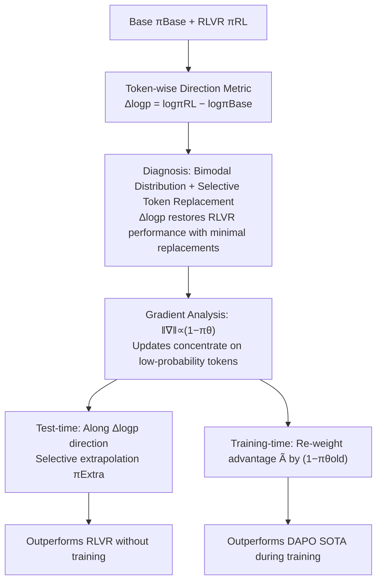

# Beyond Magnitude: Leveraging Direction of RLVR Updates for LLM Reasoning

**Conference**: ICLR 2026  
**OpenReview**: [https://openreview.net/forum?id=r6Pw3RiMYL](https://openreview.net/forum?id=r6Pw3RiMYL)  
**Code**: [https://github.com/Hesse73/RLVR-Directions](https://github.com/Hesse73/RLVR-Directions)  
**Area**: LLM Reasoning / Reinforcement Learning (RLVR)  
**Keywords**: RLVR, GRPO/DAPO, Update Direction, log-prob difference, low-probability tokens, test-time extrapolation, advantage re-weighting  

## TL;DR
This paper points out that previous analyses of RLVR focused only on update "magnitude" (entropy, KL), whereas the true key is the update "direction". Using the signed token-wise log-probability difference $\Delta\log p$, the authors precisely locate sparse but critical tokens for reasoning. Based on this, they propose two plug-and-play enhancement methods: test-time selective extrapolation and training-time low-probability token re-weighting.

## Background & Motivation
- **Background**: RLVR (Reinforcement Learning with Verifiable Rewards) has become the core algorithm for reasoning models like o1, DeepSeek-R1, and Qwen3. To understand what RLVR changes, a common practice is to compare the token-level differences between the base model $\pi_{\text{Base}}$ and the RL-tuned model $\pi_{\text{RL}}$. The consensus is that RLVR modifications are **sparse**, affecting only a small subset of tokens in a sequence.
- **Limitations of Prior Work**: Existing works measure sparsity almost exclusively via the **magnitude** of changes—characterized by high-entropy tokens (Wang et al.), KL divergence (Huan et al.), or gradient norms (Yang et al.). However, the histograms of these magnitude metrics on base and RL model outputs almost entirely overlap (Fig. 1b), suggesting that magnitude alone fails to distinguish the "transition from Base to RLVR."
- **Key Challenge**: Magnitude metrics only answer "how much did this token change," while discarding "in which direction it changed"—whether RLVR prefers it more or the base model prefers it more. Without directional information, it is impossible to determine which modifications truly benefit reasoning.
- **Goal**: To precisely identify "sparse but critical" reasoning tokens using a signed, direction-aware metric and translate this diagnostic conclusion into practical methods for directly improving reasoning accuracy.
- **Key Insight**: **[Direction > Magnitude]** The authors propose the signed token-wise log-probability difference $\Delta\log p = \log\pi_{\text{RL}} - \log\pi_{\text{Base}}$ as a directional diagnostic metric. It presents a clear **bimodal** distribution in histograms (positive tail = RLVR preferred, negative tail = Base preferred), a feature entropy/KL lacks. It further reveals that **high $\Delta\log p$ tokens are precisely low-probability tokens**, leading to two enhancement strategies.

## Method

### Overall Architecture
The paper consists of two parts: **Diagnosis** (Sec. 3), proving that $\Delta\log p$ identifies critical reasoning tokens better than magnitude metrics and explaining the source of sparsity through gradient analysis; and **Utilization** (Sec. 4), implementing the diagnosis into two methods: selective extrapolation along the $\Delta\log p$ direction at test time and low-probability token re-weighting during training.

### Key Designs

**1. Directional Diagnostic Metric $\Delta\log p$: Using sign to distinguish "who prefers this token."** Given a token $y_t$, $\Delta\log p(y_t|x,y_{<t}) = \log\pi_{\text{RL}}(y_t|x,y_{<t}) - \log\pi_{\text{Base}}(y_t|x,y_{<t})$ is defined, where positive values indicate RLVR increased the probability and negative values indicate a decrease. Unlike symmetric quantities like entropy $H_\pi = \mathbb{E}[-\log\pi]$ or KL divergence $D_{\text{KL}}$ that only measure "change size," $\Delta\log p$ carries direction. Statistical analysis on AIME-24 shows that entropy and KL histograms for Base/RLVR outputs almost overlap, whereas $\Delta\log p$ shows two distinct tails—a directional signal invisible to magnitude metrics, consistent across ORZ, DAPO, and UniReason models.

**2. Selective Token Replacement: Verifying metric accuracy via "replacements needed to restore RLVR performance."** Following Meng et al., intervention experiments are conducted: at each decoding step, tokens are sampled from $\pi_{\text{Base}}$, and a criterion $f^\tau$ decides whether to replace the choice with $\pi_{\text{RL}}$ (for $\Delta\log p$, $f^\tau_{\text{logp}}=\mathbb{I}(\Delta\log p < \tau)$ is used to replace tokens suppressed by RLVR). For fair comparison, replacement rates are controlled by $\tau$. The results show that replacing 5–30% of tokens allows the base model to match RLVR performance, while random replacement is much slower—proving these tokens are sparse but critical. More importantly, the ranking is **$\Delta\log p$ > KL Divergence > Entropy**: $\Delta\log p$ requires only ~10% replacement to reach RLVR accuracy, whereas magnitude metrics require significantly more, proving directional information is more precise.

**3. Gradient Explanation for Sparsity: Updates naturally concentrate on low-probability tokens.** Lemma 3.1 states that for a softmax policy, the $\ell_1$ norm of the DAPO objective gradient with respect to logits is $\|\nabla_z J_{\text{DAPO}}\|_1 = 2|w_{i,t}|\cdot(1-\pi_\theta(y_{i,t}|x,y_{i,<t}))$, where $w_{i,t}=r_{i,t}\hat A_{i,t}$. Due to the $(1-\pi_\theta)$ factor, lower-probability tokens receive larger gradients—despite being infrequently sampled, they contribute most of the gradient mass (Fig. 3a). Fig. 3b shows that high $\Delta\log p$ tokens have low probabilities in both models, linking "sparse updates = gradient concentration on low-probability tokens" with "high $\Delta\log p$ tokens." Top-p filtering of low-probability tokens drastically degrades training performance (Fig. 3c), causally verifying their necessity.

**4. Test-time Selective Extrapolation: Treating $\Delta\log p$ as a direction to proceed further.** Since $\Delta\log p$ is the "reasoning direction" from Base to RLVR, extrapolating along this direction allows one to exceed RLVR performance. The extrapolation policy is $\log\pi^\gamma_{\text{Extra}} = (1+\gamma)\log\pi_{\text{RL}} - \gamma\log\pi_{\text{Base}} + z(\cdot)$, equivalent to re-weighting the RLVR distribution by $\exp(\gamma\,\Delta\log p)$ in probability space, treating $\Delta\log p$ as a token-level reward for reward-guided decoding. Since $\Delta\log p$ is negligible for most tokens, global extrapolation would ruin calibrated tokens; thus, the authors only sample from the extrapolated distribution at positions with large negative $\Delta\log p$ selected by $f^\tau_{\text{logp}}$. Theorem 4.1 proves that under a simplified NPG tabular softmax setting, there exists $\gamma>0$ such that the extrapolation strategy's expected reward is not lower than the original policy, improving accuracy without additional training.

**5. Training-time Advantage Re-weighting: Directly magnifying learning signals for low-probability tokens.** Since high $\Delta\log p$ corresponds to low-probability tokens, the training phase actively reinforces them. Advantages in DAPO are multiplied by a probability-dependent factor: $\tilde A_{i,t} = \big(1+\alpha\cdot(1-\pi_{\theta_{\text{old}}}(y_{i,t}|x,y_{i,<t}))\big)\cdot\hat A_{i,t}$, where $\alpha$ controls intensity. This shifts learning focus towards critical reasoning positions indicated by $\Delta\log p$ while keeping other DAPO hyperparameters unchanged, consistent with the finding that top-p filtering degrades performance.

## Key Experimental Results

### Main Results Table (Training-time Re-weighting vs. DAPO, three math benchmarks)

| Model | Method | AIME24 Avg@32 | AIME25 Avg@32 | AMC Avg@32 | Average Avg@32 | Average Pass@16 |
|------|------|------|------|------|------|------|
| Qwen2.5-Math-7B | Base | 14.79 | 6.67 | 40.62 | 20.69 | 51.52 |
| Qwen2.5-Math-7B | DAPO | 35.73 | 17.60 | 73.04 | 42.12 | 57.86 |
| Qwen2.5-Math-7B | **Ours** | **39.06** | **18.54** | **73.64** | **43.75** | **62.33** |
| Qwen3-8B-Base | DAPO | 36.98 | 26.67 | 69.13 | 44.26 | 69.19 |
| Qwen3-8B-Base | **Ours** | **38.13** | **31.15** | **71.05** | **46.78** | **72.52** |

Both accuracy (Avg@32) and exploration capability (Pass@16) improve simultaneously, showing the gains do not come at the cost of diversity.

### Ablation Study Table (Comparison of re-weighting strategies, Qwen2.5-Math-7B)

| Metric | PPL (Deng et al.) | Dominate (Yang et al.) | **Ours** |
|------|------|------|------|
| AIME24 Avg@32 | 35.63 | 36.35 | **39.06** |
| AIME25 Avg@32 | 16.46 | 13.02 | **18.54** |
| Average Avg@32 | 41.38 | 43.11 | **43.75** |
| Average Pass@16 | 61.08 | 53.63 | **62.33** |

Directly magnifying low-probability tokens (Ours) is overall superior in Avg@32 and Pass@16. Dominate results in lower training entropy due to aggressive clip-higher, restricting exploration and lowering Pass@k.

### Key Findings
- **Test-time Extrapolation**: On ORZ-32B / DAPO-32B / UniReason-14B, Selective Extrapolation exceeds original RLVR performance (e.g., DAPO-32B 52.50→55.42) on AIME24 Avg@32, whereas Selective Replace only matches but does not exceed it.
- **Extrapolation on $\pi_{\text{RL}}$ is also effective**: Extrapolating the RLVR model with increasing thresholds shows AIME24 performance initially rising before plateauing (Table 1: 52.50→55.31), reinforcing the sparsity law that only magnifying a few key tokens is effective.
- **Metric Accuracy Ranking is Stable**: $\Delta\log p$ > KL Divergence > Entropy, holding true across various KL/entropy variants. KL is consistently better than entropy, suggesting RLVR modifications are not limited to high-entropy positions.
- **Healthy Training Dynamics**: Response length for the re-weighting method grows steadily with training while accuracy improves synchronously, a typical signal of effective reasoning RLVR training.
- **Root Cause of Sparsity**: RLVR gains do not stem from global distribution shifts but from high-intensity gradient updates to a few low-probability tokens.

## Highlights & Insights
- **"Direction vs. Magnitude" is a clean and counter-intuitive entry point**: A single observation—"everyone looks at size, but no one looks at the sign"—unifies the critique of magnitude-based analyses. The $\Delta\log p$ bimodal plot is highly persuasive.
- **Elegant loop from diagnosis to method**: The same $\Delta\log p$ metric serves as a diagnostic microscope (token replacement), a test-time reward (extrapolation), and indirectly derives training-time re-weighting. The logical chain is self-consistent.
- **Unifying three concepts**: High $\Delta\log p$ ⟺ Low-probability tokens ⟺ Large gradients, with a mechanistic explanation provided by the $(1-\pi_\theta)$ factor in Lemma 3.1.
- **Lightweight methods**: Extrapolation has zero training cost, and re-weighting requires changing only one line in the advantage formula.
- **Simultaneous improvement in accuracy and diversity**: Training-time re-weighting outperforms DAPO in both Avg@32 and Pass@16, showing that focusing on low-probability tokens does not sacrifice exploration—a positive counter-example to the common "accuracy up, Pass@k down" dilemma in RLVR.

## Limitations & Future Work
- **Extrapolation requires two models**: Running both Base and RLVR at test time doubles GPU memory and computation; the authors suggest using parameter-efficient fine-tuning to mitigate this.
- **Hyperparameter sensitivity**: Extrapolation introduces two hyperparameters, threshold $\tau$ and intensity $\gamma$, which currently require manual tuning. Adaptive combinations could be explored.
- **Limited evaluation scope**: Verification was primarily on mathematical reasoning (AIME/AMC) and 7B–32B scales. Generalization across larger models and non-mathematical tasks is yet to be examined.
- **Gap between theory and practice**: Theorem 4.1 relies on monotonic update assumptions of idealized NPG, which differs from real-world RLVR sparse updates, necessitating selective extrapolation.

## Related Work & Insights
- **RLVR Algorithm Lineage**: GRPO (group-relative advantage, no critic) → DAPO (clip-higher, dynamic sampling, token-level loss, no KL). This paper uses DAPO as a baseline.
- **Understanding RLVR effects**: High-entropy tokens (Wang et al.), KL divergence (Huan et al.), gradient norms (Yang et al.), and token replacement (Deng et al., Meng et al.) all point toward "sparse updates." This paper adds the "direction" dimension.
- **Reward-Guided Decoding**: The extrapolation method shares the same framework as reward-guided decoding (Khanov et al., Liu et al.), with $\Delta\log p$ acting as a token-level reward, suggesting that "log-prob difference from a model pair" is a generalizable decoding enhancement strategy.
- **Insights for Tuning**: Low-probability tokens should not be filtered (top-p should not be too small). Advantage re-weighting is more stable than "suppressing low-probability tokens" (Dominate) or "preferring low-PPL responses" (PPL), providing direct actionable experience for RLVR recipe design.

## Rating
- **Novelty**: ⭐⭐⭐⭐⭐ The "direction over magnitude" perspective is clear and counter-intuitive, the $\Delta\log p$ bimodal evidence is strong, and the derivation of methods from diagnosis is highly original.
- **Experimental Thoroughness**: ⭐⭐⭐⭐ Covers multiple model pairs, benchmarks, and dual-line verification (extrapolation/re-weighting) + causal gradient intervention. However, it is limited to math reasoning and small-to-mid scales.
- **Writing Quality**: ⭐⭐⭐⭐ The storyline (diagnosis → mechanism → utilization) is smooth. Figure 1 is worth a thousand words. Academic rigor is maintained with formulas and theorems.
- **Value**: ⭐⭐⭐⭐ Provides a new principle for understanding RLVR, with two plug-and-play, low-cost methods that are directly useful for RLVR researchers (code is open-sourced).

<!-- RELATED:START -->

## Related Papers

- [\[ICLR 2026\] Quantile Advantage Estimation: Stabilizing RLVR for LLM Reasoning](quantile_advantage_estimation_stabilizing_rlvr_for_llm_reasoning.md)
- [\[ICLR 2026\] HiPO: Self-Hint Policy Optimization for RLVR](hipo_self-hint_policy_optimization_for_rlvr.md)
- [\[ICLR 2026\] Beyond Markovian: Reflective Exploration via Bayes-Adaptive RL for LLM Reasoning](beyond_markovian_reflective_exploration_via_bayes-adaptive_rl_for_llm_reasoning.md)
- [\[ICLR 2026\] ChainGPT: Dual-Reasoning Model with Recurrent Depth and Multi-Rank State Updates](chaingpt_dual-reasoning_model_with_recurrent_depth_and_multi-rank_state_updates.md)
- [\[ICLR 2026\] MAGO: Beyond Fixed Hyperparameters with Multi-Objective Pareto Optimization for Hybrid LLM Reasoning](mago_beyond_fixed_hyperparameters_with_multi-objective_pareto_optimization_for_h.md)

<!-- RELATED:END -->
