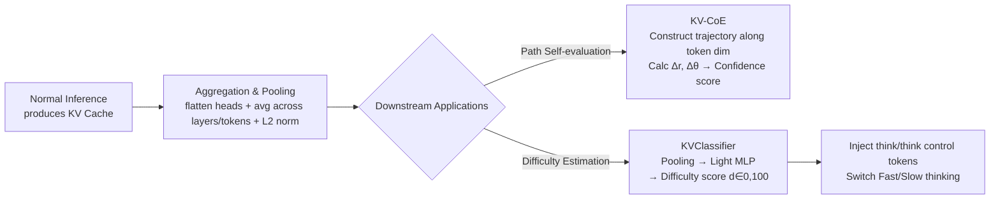

# Beyond Speedup - Utilizing KV Cache for Sampling and Reasoning

**Conference**: ICLR 2026  
**OpenReview**: [https://openreview.net/forum?id=GUhmiJaAzv](https://openreview.net/forum?id=GUhmiJaAzv)  
**Code**: [https://github.com/cmd2001/ICLR2026_KV-Embedding](https://github.com/cmd2001/ICLR2026_KV-Embedding)  
**Area**: LLM Inference / Efficient Inference / Representation Reuse  
**Keywords**: KV Cache, KV-Embedding, Chain-of-Embedding, Adaptive Inference, Fast/Slow Thinking, Self-evaluation  

## TL;DR
This work reuses the KV cache—which already exists during inference but is traditionally used only to accelerate decoding—as "free lightweight representations." Without needing to store additional hidden states, it enables self-evaluation of reasoning paths (KV-CoE) and difficulty-adaptive fast/slow thinking switching (KVClassifier), reducing reasoning token volume by up to 1/5.7 with almost zero overhead.

## Background & Motivation
- **Background**: KV cache is a core abstraction in modern LLM inference—systems like vLLM's PagedAttention and Ollama's session-level caching manage it as a first-class citizen, reducing per-step attention complexity from $O(T^2)$ to $O(T)$. However, the academic community almost exclusively treats it as an "accelerator," with few exceptions like cache steering that modifies initial cache values to guide generation.
- **Limitations of Prior Work**: Another active research line—using internal model states for self-evaluation (Chain-of-Embedding, INSIDE/EigenScore, confidence probes) and adaptive inference (ASRR, PATS, DOTS)—all rely on **storing full hidden states**. This is costly in terms of VRAM: Figure 1 shows that for Qwen3-32B in long-context scenarios, storing additional hidden states inflates VRAM usage to 1.86×.
- **Key Challenge**: Hidden state information is rich but expensive to store; KV cache is already available for free in the inference pipeline ($C_{\text{hidden}} \gg C_{\text{KV}} \approx 0$), yet it is treated as "waste" that only serves acceleration. Can this free byproduct support downstream tasks?
- **Goal**: Systematically treat KV cache as reusable task representations, verifying its "sufficiency" for self-evaluation and adaptive inference scenarios with near-zero extra overhead, no architectural changes, and direct compatibility with existing inference stacks.
- **Key Insight**: **[Representation Reuse]** Although KV cache is not trained for general embeddings (it serves next-token prediction), simple pooling aggregation can extract semantic signals sufficient for "local, task-conditioned" discrimination. **[Sufficiency Argument]** The key insight is that these applications only require **relative separability** within a candidate set rather than globally calibrated semantics, making "weak" embeddings sufficient.

## Method

### Overall Architecture
The paper proposes the KV-Embedding framework: aggregating the key-value tensors $\{K^{(l)}_{1:T}, V^{(l)}_{1:T}\}$ already cached during inference into lightweight embeddings via pooling along layer/head/token dimensions. These are then fed into two downstream modules: KV-CoE (reasoning path self-evaluation) and KVClassifier (fast/slow thinking switch). The entire pipeline avoids storing hidden states, re-computation, or hooks, resulting in additional VRAM $\Delta M \approx 0$.

### Key Designs

**1. Sufficiency Argument for KV as an Embedding Source: Why weak representations work.** The authors first honestly demonstrate on the MTEB classification benchmark that KV-derived embeddings are far inferior to specialized models (gemini-embedding-001) due to three reasons: optimization for causal language modeling over contrastive learning (leading to poor anisotropy), inherent token/position dependence requiring heuristic pooling, and projection into low-dimensional head spaces $d_{\text{head}} \ll d_{\text{model}}$ losing discriminative power. However, they provide a key argument: both target applications only require correct ranking within a **local, restricted candidate set**, not global separability. Formally, for a decision rule $f$ and scoring margin $\gamma(x) = f_{y_i}(x) - f_{y_j}(x)$, it only needs to satisfy $\min_{y \in \mathcal{C}} \gamma(y) > 0$ on a small candidate set $\mathcal{C}$. Coupled with the fact that pooled embeddings $e = g(x, \iota)$ are already conditioned on input and instructions, the "weak but free" KV cache proves effective enough.

**2. KV-CoE: Moving Chain-of-Embedding from the layer dimension to the token dimension.** The original CoE aggregates hidden states along the **layer** dimension, obtaining a sentence-level representation $s_l = \frac{1}{T}\sum_t h_l^{(t)}$ for each layer, and then characterizes the reasoning trajectory's geometry through magnitude changes $\Delta r_l = \|s_{l+1}-s_l\|_2$ and directional changes $\Delta\theta_l = \arccos\frac{s_{l+1}\cdot s_l}{\|s_{l+1}\|\|s_l\|}$ to compute confidence scores (CoE-R in real space and CoE-C in complex space). The "twist" in KV-CoE is **changing the axis**: since the KV cache is stored along tokens, the authors instead aggregate across layers for each token $t$ to get $e_t = \frac{1}{L}\sum_{l=1}^{L}\text{flatten}(K^{(l,t)}, V^{(l,t)})$, forming a trajectory $\{e_1, \dots, e_T\}$ along the token dimension. By replacing the layer index with the token index in the CoE formulas for $\Delta r$ and $\Delta\theta$, they retain the analysis framework while eliminating the expensive hidden state storage/re-computation. The reduction required is negligible compared to a full forward pass and is compatible with `past_key_values` or vLLM.

**3. KVClassifier: Using pooled KV to predict continuous difficulty scores for fast/slow switching.** Instead of binary classification, a continuous difficulty score $d = f_\theta(\text{Pool}(KV^{(1:L)}_{1:T})) \in [0,100]$ is estimated from the pooled KV representations. `Pool` performs mean pooling across layers, heads, and tokens, while $f_\theta$ is a lightweight two-layer MLP (512 hidden units, ReLU). Supervision comes from a labeling scheme where a base model generates fast (no CoT) and slow (with CoT) answers for each training question, with discrete labels assigned based on correctness and length: $d{=}0$ (fast correct & short <128 tokens), $d{=}25$ (fast correct but long), $d{=}75$ (fast wrong & slow correct), $d{=}100$ (both wrong), creating a smooth gradient for $f_\theta$ to learn scores correlated with both correctness and reasoning cost.

**4. One-step and Two-step Switching via Control Token Injection.** Inference modes are toggled by injecting special tokens `<think>` / `</think>` into the decoding stream. **One-step switching (KV-Classification)**: Before generation starts, $d$ is compared against a threshold $\tau$. If $d > \tau$, `<think>` is prepended to trigger slow thinking; otherwise, fast thinking is used. This is a classification-style controller. **Two-step switching (KV-Generative)**: In addition to the initial decision, $d$ is recalculated using the updated KV cache at set checkpoints during decoding. If $d < \tau_{\text{fast}}$ during slow thinking, `</think>` is appended to terminate reasoning early; if $d > \tau_{\text{slow}}$ during fast thinking, `<think>` is injected to restart slow thinking mid-way. This is a generative controller allowing fine-grained, difficulty-aware regulation of reasoning depth. Since the KV cache is ready after the prefill stage, both initial and ongoing evaluations incur almost zero overhead.

## Key Experimental Results

### Main Results 1: KV-CoE Self-evaluation (MATH / TheoremQA)
Evaluation metrics: AUROC↑ and FPR95↓, comparing against MaxProb / PPL / Entropy and original CoE:

| Model | Method | MATH AUROC↑ | MATH FPR95↓ | TheoremQA AUROC↑ | TheoremQA FPR95↓ |
|------|------|-------------|-------------|------------------|------------------|
| Llama-3.1-8B | Entropy | 62.74 | 84.14 | 47.37 | 97.82 |
| Llama-3.1-8B | CoE-R† (Hidden States) | 72.54 | 75.61 | 63.12 | 89.83 |
| Llama-3.1-8B | KV-CoE-R (Ours) | 64.36 | **63.82** | **74.74** | **62.93** |
| Llama-3.1-8B | KV-CoE-C (Ours) | 64.13 | 67.42 | 74.93 | 62.46 |
| Qwen2-7B | CoE-C (Hidden States) | 76.68 | 64.48 | 62.70 | 87.42 |
| Qwen2-7B | KV-CoE-R (Ours) | 76.92 | 49.83 | **88.87** | 54.30 |
| Qwen2-7B | KV-CoE-C (Ours) | **84.12** | **44.82** | 83.27 | 58.35 |

KV-CoE significantly outperforms MaxProb/PPL/Entropy and even noticeably exceeds the original CoE (using hidden states) on TheoremQA, with a substantial reduction in FPR95.

### Main Results 2: Fast/Slow Thinking Switching (GSM8K / MATH500, Accuracy / Avg. Tokens)

| Dataset | Method | DeepSeek-R1-14B | Qwen3-8B |
|--------|------|------------------|----------|
| GSM8K | Fast Thinking | 0.845 / 218 | 0.904 / 211 |
| GSM8K | Reasoning (Full Slow) | 0.847 / 432 | 0.933 / 1632 |
| GSM8K | KV-Classification | 0.845 / 218 (-49.5%) | 0.914 / 554 (-66.1%) |
| GSM8K | KV-Generative | 0.835 / 242 (-44.0%) | 0.892 / 273 (-83.3%) |
| MATH500 | Reasoning (Full Slow) | 0.590 / 1839 | 0.610 / 4150 |
| MATH500 | KV-Classification | 0.578 / 1506 (-18.1%) | 0.604 / 3963 (-4.5%) |
| MATH500 | KV-Generative | 0.566 / 657 (-64.3%) | 0.578 / 727 (-82.5%) |

On Qwen3-8B / MATH500, the two-step generative switch reduces average tokens from 4150 to 727 (**5.7× reduction**) with only a 3.2% drop in accuracy (0.610→0.578). The one-step classification switch is more conservative, maintaining accuracy while still saving tokens.

### Key Findings
- **KV embedding is a weak general embedding but sufficient**: While KV-derived embeddings are far inferior on MTEB (e.g., DBpedia 0.5937 vs Gemini 0.9476), they capture meaningful semantics for restricted candidate tasks.
- **Axis-switching is effective**: After switching CoE from the layer dimension to the token dimension, the token-level evolution of the KV cache provides rich signals for identifying correct reasoning paths, especially in multi-step problems.
- **Difficulty scores generalize across models/tasks**: The same KV difficulty estimator effectively balances accuracy and efficiency across different models and datasets.
- **One-step vs. Two-step trade-off**: One-step classification preserves accuracy, while two-step generation saves more tokens, catering to different deployment preferences.

## Highlights & Insights
- **"Free Lunch" Perspective**: Redefining an existing inference byproduct (KV cache) as a reusable representation is an under-explored angle. It incurs almost zero cost while supporting both self-evaluation and adaptive reasoning.
- **Honest "Sufficiency Argument"**: The paper does not oversell KV embedding capabilities. Instead, it proves its weakness on MTEB and then provides a rigorous argument explaining why weak representations are sufficient for target scenarios requiring only relative separability in restricted sets.
- **Non-invasive & Engineering Friendly**: The method directly interfaces with `past_key_values` or vLLM without modifying architecture, re-computation, or hooks, making it very accessible.
- **Elegance of Axis-Switching**: KV-CoE changes "layer aggregation" to "token aggregation," eliminating the most expensive aspect of CoE—hidden state storage—with minimal changes to the framework.

## Limitations & Future Work
- **Applicability Boundaries**: The authors clarify that KV embeddings are not suitable for tasks requiring "globally comparable semantics across diverse queries" (e.g., broad-domain retrieval); findings are limited to restricted candidate sets and local trajectory geometry.
- **Baseline Alignment**: CoE-R/C baseline numbers are taken from the original paper (run on Llama3-8B), whereas this work uses Llama3.1-8B. The authors acknowledge potential alignment discrepancies.
- **Heuristic Pooling and Hyperparameters**: The embedding construction (which dimensions to concat, normalization, which layers/tokens to select) and thresholds $\tau, \tau_{\text{fast}}, \tau_{\text{slow}}$ require tuning; robustness and automated parameter selection need more exploration.
- **Extended Directions**: Expanding KV reuse to other downstream areas (e.g., RAG, safety detection), combining with "write" operations like cache steering to form a read-write loop, and systematic learning of KV pooling representations.

## Related Work & Insights
- **Hidden State Self-evaluation**: CoE (trajectory geometry), INSIDE/EigenScore (spectral consistency), InternalInspector (contrastive probes)—the difference here is using "only existing KV cache."
- **Adaptive Fast/Slow Reasoning**: ASRR (length reward), PATS (step-level switching with PRM), DOTS (reasoning as atomic action search)—these usually require explicit CoT, external reward models, or re-decoding. This work is orthogonal, using pooled KV features for gating.
- **KV Cache Intervention**: KV Cache Steering (adding layer-wise vectors to induce reasoning) focuses on "writing" to the cache; this work focuses on "reading" the cache for difficulty gating. The two are complementary.

## Rating
- **Novelty**: ⭐⭐⭐⭐ Repositioning the KV cache as a free reusable representation and providing a rigorous "weak but enough" argument is a novel perspective.
- **Experimental Thoroughness**: ⭐⭐⭐⭐ Covers 2 applications, 4 models, and 4 benchmarks. Solid main results plus honest MTEB controls and ablations.
- **Writing Quality**: ⭐⭐⭐⭐ Clear motivation, intuitive diagrams, and sound formalization of the sufficiency argument.
- **Value**: ⭐⭐⭐⭐ Non-invasive and compatible with vLLM/Transformers. The 5.7× token reduction has real-world significance for lowering inference costs.

<!-- RELATED:START -->

## Related Papers

- [\[ICLR 2026\] KaVa: Latent Reasoning via Compressed KV-Cache Distillation](kava_latent_reasoning_via_compressed_kv-cache_distillation.md)
- [\[ICLR 2026\] Bottlenecked Transformers: Periodic KV Cache Consolidation for Generalised Reasoning](bottlenecked_transformers_periodic_kv_cache_consolidation_for_generalised_reason.md)
- [\[ICML 2026\] ForesightKV: Optimizing KV Cache Eviction for Reasoning Models by Learning Long-Term Contribution](../../ICML2026/llm_reasoning/foresightkv_optimizing_kv_cache_eviction_for_reasoning_models_by_learning_long-t.md)
- [\[ICLR 2026\] Taming Imperfect Process Verifiers: A Sampling Perspective on Backtracking](taming_imperfect_process_verifiers_a_sampling_perspective_on_backtracking.md)
- [\[ICLR 2026\] Reasoning with Sampling: Your Base Model is Smarter Than You Think](reasoning_with_sampling_your_base_model_is_smarter_than_you_think.md)

<!-- RELATED:END -->
