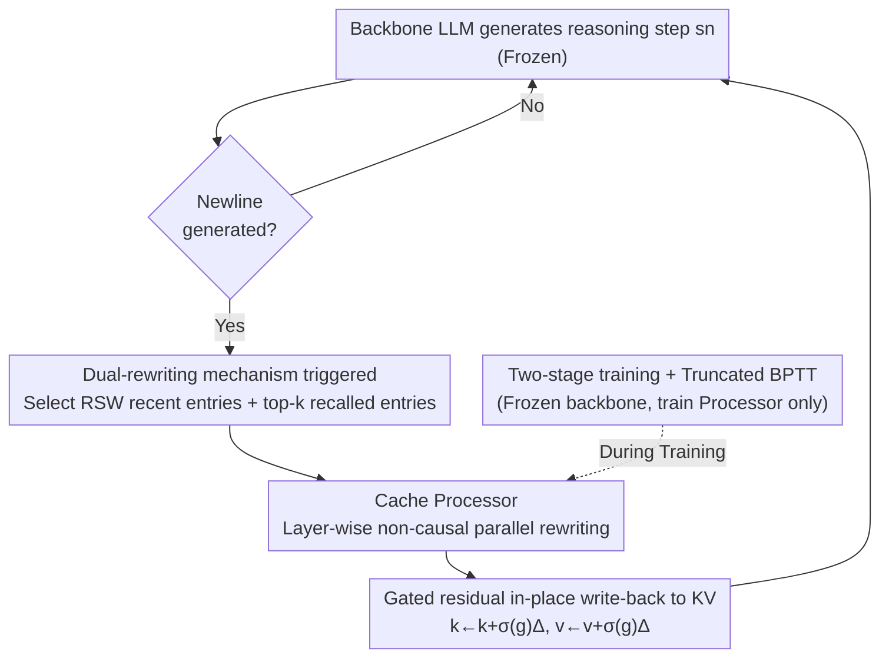

# Bottlenecked Transformers: Periodic KV Cache Consolidation for Generalised Reasoning

**Conference**: ICLR2026  
**OpenReview**: [https://openreview.net/forum?id=fWgKnl4itC](https://openreview.net/forum?id=fWgKnl4itC)  
**Code**: To be confirmed  
**Area**: LLM Reasoning  
**Keywords**: KV Cache Rewriting, Information Bottleneck, Memory Consolidation, Latent Space Computation, Mathematical Reasoning

## TL;DR
The authors attach a small external Cache Processor to a frozen backbone LLM. At the end of each reasoning step (triggered by a newline), it **rewrites the KV cache in-place**—"consolidating" recently written entries while "reconsolidating" a few historical entries recalled via attention. Explained through Information Bottleneck theory, this mechanism improves generalization, yielding up to a +6.6pp improvement across seven mathematical reasoning benchmarks.

## Background & Motivation

**Background**: Increasing computational effort during inference to improve LLM performance typically involves generating explicit Chain-of-Thought (CoT) in **token space**. An emerging alternative involves compressing extra computation into the model's **latent space**, termed Auxiliary Latent-Space Computation (ALSC). This involves transformations of the KV cache or final hidden states between decoding steps without emitting intermediate natural language tokens.

**Limitations of Prior Work**: Existing sequence-level ALSC methods are categorized into three types, each with specific gaps: (i) **Token-mediated**—injecting pause/filler tokens or feeding hidden states back (e.g., Coconut), which essentially lengthens the cache; (ii) **Residual operators**—modifying only the current hidden state $o_t$ for style or safety control without touching the cache; (iii) **Cache operators**—almost exclusively designed for **memory compression** (eviction, merging, summarization) rather than enhancing reasoning. A mechanism specifically designed to "rewrite working memory to improve reasoning generalization" remains largely unexplored.

**Key Challenge**: From an Information Bottleneck (IB) perspective, the authors identify a counter-intuitive conclusion: **autoregressive training forces the KV cache toward "over-retaining input information."** IB theory posits that generalization arises from an optimal balance between "compressing input information $I(X;Z)$" and "retaining predictive information $I(Z;Y)$." However, the next-token objective encourages both $I(S_{0:n};\hat{Z})$ and $I(\hat{Z};S_{n+1})$ to be maximized. This results in a cache filled with historical details irrelevant to future "sequence-level prediction," hindering generalization. While compression-based cache methods reduce $I(X;Z)$, they **indiscriminately reduce $I(Z;Y)$ as well**, leading to sub-optimal generalization.

**Goal**: To find an inference-time mechanism that can **selectively suppress $I(X;Z)$ while preserving or enhancing $I(Z;Y)$**, thereby improving "predictive efficiency" $I(Z;Y)/I(X;Z)$.

**Key Insight**: The authors draw inspiration from **memory consolidation and reconsolidation** in neuroscience—where new memories are stabilized after formation (consolidation), and old memories enter a plastic state upon recall, integrating new information before re-stabilizing (reconsolidation). In Transformers, this corresponds to "in-place rewriting of recently written KV segments" and "in-place rewriting of recalled historical KV segments."

**Core Idea**: Periodically **rewrite the KV cache in-place** (without dimensionality reduction) using an external Cache Processor at reasoning step boundaries. This trains the cache to become a new, more predictive bottleneck, enhancing reasoning generalization.

## Method

### Overall Architecture

The Bottlenecked Transformer augments a **pre-trained decoder backbone** $M^{\text{LLM}}_\theta$ with a smaller **Cache Processor** $T^{\text{proc}}_\omega$. The backbone generates tokens autoregressively as usual. Whenever a reasoning step $s_n$ ends (signaled by a newline character), the Processor is triggered to perform in-place rewriting on two types of cache entries: (i) the **Recent Step Window (RSW)**, corresponding to the newly generated step $s_n$—representing "consolidation"; and (ii) **top-$k$ recalled segments**, historical entries from $s_{0:n-1}$ selected by attention weights relative to the recent segment—representing "reconsolidation." Other entries remain unchanged. After rewriting, decoding continues conditioned on the updated cache. This mechanism serves as an inference-time "working memory reorganization" plugin without retraining the backbone.

### Key Designs

**1. Information Bottleneck Motivation: Using IB theory to justify "Why rewrite KV"**

This serves as the theoretical foundation. The authors formalize (Theorem 4.1) that in a decoder Transformer, the **KV cache plus the final hidden state** $C_{0:n}=(K_{0:n},V_{0:n},O_n)$ derived from the input $S_{0:n}$ constitutes the **terminal bottleneck** $\hat{Z}$. They further prove (Theorem 4.2) that autoregressive training provides two upper bounds for log-likelihood:

$$L(\theta) \le \sum_n I(S_{0:n};C_{0:n}) - \sum_n H(S_{n+1}\mid S_{0:n}), \quad L(\theta) \le \sum_n I(C_{0:n};S_{n+1}) - H(S_{n+1})$$

Maximizing $L(\theta)$ **simultaneously increases** $I(S_{0:n};C_{0:n})$ and $I(C_{0:n};S_{n+1})$. Consequently, the cache becomes a high-fidelity "step-by-step" trajectory of shifted token predictions rather than a compressed summary, retaining many input details useless for sequence-level generalization. Given the Data Processing Inequality, any transformation $T$ of $\hat{Z}$ satisfies $I(X;\hat{Z})\ge I(X;\hat{Z}')$. By training $T$ to preserve future predictive information, one can lower $I(X;Z)$ without harming $I(Z;Y)$, pushing the cache into a higher generalization regime. This distinguishes the work from compression methods that indiscriminately slash $I(Z;Y)$.

**2. Newline-triggered Dual-rewriting: Consolidation + Reconsolidation**

This design defines "who" and "when" to rewrite. The Processor does not modify the entire cache constantly; it is triggered at reasoning step boundaries (newlines) and targets specific entries: (i) **RSW**, the recent KV segment of length $R$—for "consolidation"; (ii) **top-$k$ recalled entries**, historical segments from $s_{0:n-1}$ with the highest **attention quality** relative to the recent segment—for "reconsolidation." Using the "newline = reasoning step boundary" as a trigger aligns with the step-by-step nature of mathematical reasoning. The top-$k$ recall ensures reconsolidation is spent on truly relevant history rather than total recomputation.

**3. Cache Processor: Layer-wise Non-causal Parallelism + Gated Residual Rewriting**

For an $L$-layer backbone, the Processor consists of $L$ small Transformer blocks, each aligned with a backbone layer. In layer $\ell$, selected KV entries are concatenated into "KV-tokens" and projected into the Processor's latent space: $u^{(\ell)}=[k^{(\ell)}_{(s)},v^{(\ell)}_{(s)}]W^{(\ell)}_{\text{in}}$. Crucially, this block processes the entire segment $u^{(\ell)}$ in parallel **without a causal mask**, allowing recalled and recent segments to see each other. This enables "look-back" updates impossible in standard autoregressive caches. The output is projected back to KV dimensions $(\Delta_k,\Delta_v)$ and written back via a **gated residual**:

$$k^{(\ell)}_{(s)} \leftarrow k^{(\ell)}_{(s)} + \sigma(g^{(\ell)})\,\Delta^{(\ell)}_k, \qquad v^{(\ell)}_{(s)} \leftarrow v^{(\ell)}_{(s)} + \sigma(g^{(\ell)})\,\Delta^{(\ell)}_v$$

where $g^{(\ell)}$ is a learnable per-layer scalar, initialized to a small value. This **suppresses early drift** and prevents the Processor from destroying backbone capabilities before it learns useful updates. No dimensionality reduction is performed to avoid the pitfalls of compression.

**4. Two-stage Training and Truncated BPTT: Training for "Next-step Accuracy"**

Training is split into two stages. Stage one involves standard SFT (next-token cross-entropy) for the backbone. In stage two, the **backbone is frozen, and only Processor parameters $\omega$ are updated**. For each reasoning step $s_n$, the backbone writes tokens to the cache, the Processor rewrites selected entries, and the cross-entropy loss for the *next* step $s_{n+1}$ is calculated conditioned on the modified cache. **BPTT is truncated at step boundaries**, ensuring the Processor focuses exclusively on "improving the next reasoning step's prediction." Notably, no explicit IB/compression loss is added; the authors rely on SGD noise for **implicit compression** of $I(X;Z)$ once the pressure to maximize input fidelity is removed.

### Loss & Training
- Stage 1: Backbone SFT, standard next-token cross-entropy.
- Stage 2: Frozen backbone, Processor only; objective is cross-entropy for the next reasoning step after rewriting, using truncated BPTT.
- Processor Config: Latent dimension $d_p=512$, intermediate dimension 2240, 16 heads per block, reconsolidation budget $k=32$; trained on 128k samples from OpenMathInstruct-2.

## Key Experimental Results

### Main Results
Evaluated on seven reasoning benchmarks (GSM8K, MATH, SVAMP, TheoremQA, LogiQA, Gaokao-Math, GSM-Hard) across four backbones, comparing against SFT, SFT+pause (16 pause tokens), and SFT+latent rollout (Coconut-style). Scores are pass@1 with greedy decoding.

| Backbone | Task | Ours | SFT | Gain |
|------|------|------|------|------|
| Llama-3.2 1B | SVAMP | 44.6 | 38.0 | **+6.6** |
| Llama-3.2 3B | GSM8K | 51.33 | 46.78 | +4.6 |
| Qwen-3 0.6B | MATH | 29.08 | 26.68 | +2.4 |
| Llama-3.1 8B | LogiQA | 23.81 | 20.74 | +3.1 |

**Ours** outperforms both ALSC baselines in nearly all backbone-task combinations, with strong gains in in-distribution math benchmarks. The main weakness was Gaokao-MathQA (Chinese), attributed to distribution/language shift beyond the Processor's training exposure. The pause-token baseline was only effective when used with continued pre-training; latent rollout often performed worse and crashed on the 8B model due to instability.

### Ablation Study

| Configuration | Key Observation |
|------|---------|
| top-$k$ (Table 2) | $k\approx32$–$64$ is optimal for most; MATH prefers $k\approx128$–$256$ due to longer range dependencies. |
| Recent Window $R$ (Table 3) | Stable across $R\approx16$–$96$, with $R\approx64$–$96$ slightly better. |
| Equal Epoch Budget (Fig. 3) | Bottlenecked@N outperforms SFT@N on most benchmarks given the same training budget. |
| Rewrite Magnitude (Fig. 4) | Value vectors change significantly; Key vectors barely change. Modifications are concentrated in shallow layers. |

### Key Findings
- **Content over Addressing**: Rewriting primarily affects value vectors rather than key vectors, suggesting the Processor modifies "what is in memory" rather than "how to index it."
- **Non-degenerate Dynamics**: Rewriting magnitude peaks during the first several calls and then plateaus, neither collapsing to an identity map nor drifting uncontrollably, thanks to gated initialization.
- **Implicit Compression**: Without an explicit loss term, the model focuses on next-step predictive information, effectively treating the cache as a more efficient bottleneck.

## Highlights & Insights
- **Theorizing the Cache Overfit**: Theorems 4.1/4.2 provide formal grounds for rewriting the KV cache, identifying it as a terminal bottleneck prone to input over-retention.
- **Selling "Non-compression"**: Avoiding dimensionality reduction is framed as a feature to prevent the loss of predictive information $I(Z;Y)$, which is a common failure mode in previous compression work.
- **Reusable Injection Paradigm**: The "small gated residual + non-causal parallel block" is a stable paradigm for in-place modifications without destabilizing the backbone.
- **Executable Neuroscience Analogy**: The consolidation/reconsolidation mapping provides a concrete definition of which cache entries to modify and when.

## Limitations & Future Work
- **Noisy Credit Assignment**: Relying solely on the next-step cross-entropy provides weak supervision for the Processor, which may struggle to escape strong local optima of the backbone.
- **Lack of Explicit Compression**: Since $I(X;Z)$ isn't minimized via an objective, compression happens passively. Future work could explore denoising/diffusion in the cache space.
- **Squeezing Two Processes into One**: Biological consolidation and reconsolidation operate on different timescales. This work uses a single online Processor triggered fixedly by newlines, which could be replaced by a more adaptive triggering mechanism.
- **Cross-distribution Weakness**: Performance drops on out-of-distribution tasks like Gaokao-MathQA, indicating the Processor's generalization is limited by its training data.

## Related Work & Insights
- **vs Token-mediated ALSC (Pause/Coconut)**: These lengthen the cache by adding tokens; **Ours** rewrites existing cache entries in-place. **Ours** is more stable on larger models.
- **vs Compression Cache Operators (H2O/StreamingLLM)**: These aim to reduce memory footprint and often sacrifice $I(Z;Y)$; **Ours** does not compress, aiming for "predictive efficiency" instead.
- **vs Residual Operators (Activation Steering)**: These target $o_t$ for style/safety; **Ours** targets the cache $h_t$ as the primary repository of redundant history.

## Rating
- Novelty: ⭐⭐⭐⭐⭐ Grounding neuroscience-inspired rewriting in IB theory is a highly original angle.
- Experimental Thoroughness: ⭐⭐⭐⭐ Extensive benchmarks and ablations, though model scales remain $\le 8B$.
- Writing Quality: ⭐⭐⭐⭐ Clear chain of logic; formal theorems well-integrated with the mechanism.
- Value: ⭐⭐⭐⭐ The shift from "compressing cache" to "rewriting for efficiency" is insightful and practically useful.

<!-- RELATED:START -->

## Related Papers

- [\[ICLR 2026\] KaVa: Latent Reasoning via Compressed KV-Cache Distillation](kava_latent_reasoning_via_compressed_kv-cache_distillation.md)
- [\[ICLR 2026\] Beyond Speedup - Utilizing KV Cache for Sampling and Reasoning](beyond_speedup_-_utilizing_kv_cache_for_sampling_and_reasoning.md)
- [\[ICML 2026\] ForesightKV: Optimizing KV Cache Eviction for Reasoning Models by Learning Long-Term Contribution](../../ICML2026/llm_reasoning/foresightkv_optimizing_kv_cache_eviction_for_reasoning_models_by_learning_long-t.md)
- [\[ICLR 2026\] MoDr: Mixture-of-Depth-Recurrent Transformers for Test-Time Reasoning](modr_mixture-of-depth-recurrent_transformers_for_test-time_reasoning.md)
- [\[ICLR 2026\] HATSolver: Learning Gröbner Bases with Hierarchical Attention Transformers](hatsolver_learning_gröbner_bases_with_hierarchical_attention_transformers.md)

<!-- RELATED:END -->
