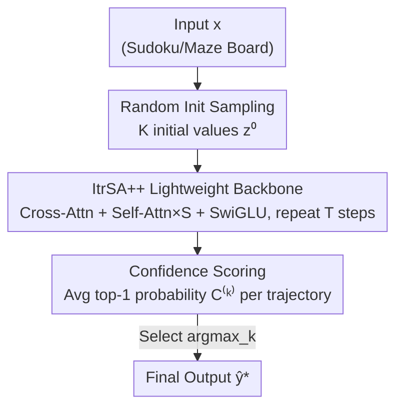

# C-Voting: Confidence-Based Test-Time Voting without Explicit Energy Functions

**Conference**: ICLR2026  
**OpenReview**: [https://openreview.net/forum?id=kYQFfEKtx5](https://openreview.net/forum?id=kYQFfEKtx5)  
**Code**: To be confirmed  
**Area**: LLM Reasoning / Test-Time Scaling  
**Keywords**: Test-time scaling, recurrent models, voting strategy, confidence calibration, Sudoku solving  

## TL;DR
For "recurrent" reasoning models that repeatedly apply the same layer, this paper proposes C-voting—a test-time voting strategy that requires no explicit energy function. By sampling multiple trajectories from random initial hidden states and selecting the one with the "highest average top-1 probability" (i.e., the most confident), it outperforms energy-based voting (E-voting) on AKOrN by 4.9% in Sudoku-hard. Furthermore, combined with a lightweight model ItrSA++ (3M parameters), it improves the HRM benchmark from 55.0% to 95.2% on Sudoku-extreme.

## Background & Motivation

**Background**: Recently, recurrent models have been viewed as a promising path to reasoning capabilities. These models repeatedly apply the same network layer $f$ to a hidden state $z_{t+1}=f(z_t, x;\theta)$, functioning as a time-invariant non-linear dynamical system. Models like HRM and AKOrN excel at tasks requiring consistent logic under complex constraints (e.g., Sudoku, mazes)—tasks where even mainstream LLMs struggle. Their primary advantage is **test-time scaling**: improving performance during inference without further training.

**Limitations of Prior Work**: There are two main paths for test-time scaling. The first is "increasing recurrence steps," which suffers from performance **saturation** and is strictly serial, leading to slower inference. The second is "sampling multiple trajectories and selecting one," known as voting. AKOrN's **E-voting (Energy-voting)** strategy runs multiple trajectories from different random initializations and selects the one with the lowest final energy. This approach can improve Sudoku board accuracy by approximately 40% using 4096 candidates.

**Key Challenge**: While E-voting is effective, it has a fatal limitation: it **requires an explicitly defined energy function** $E$, such that the dynamics can be expressed as gradient descent $z_{t+1}=z_t-\alpha\nabla_z E(z_t;\theta)$. However, most promising reasoning models (e.g., HRM, recurrent Transformers) lack explicit energy functions; specifically, for those with residual connections $z_{t+1}=z_t+g(z_t;\theta)$, $g$ generally cannot be written as the gradient of a scalar function. Consequently, E-voting **cannot be applied** to these models.

**Goal**: This research addresses two questions: (RQ1) Can a **model-agnostic voting strategy** be designed without requiring energy functions? (RQ2) Is there a **simple, lightweight** recurrent architecture that, combined with such voting, can match or exceed SOTA performance?

**Key Insight**: The authors observe that low energy serves as a proxy for a "good answer" because it seeks the trajectory the model is most "certain" about. Instead of energy, one can directly quantify model "certainty." In classification tasks, readout softmax probabilities naturally serve as confidence signals—**as long as the model is reasonably calibrated, higher predicted probabilities correlate with correct answers**. This signal is available in any classification-based recurrent model and does not depend on an energy function.

**Core Idea**: Substitute "energy" with "confidence" as the voting criterion. Calculate the "average top-1 probability" across the final state of each candidate trajectory and select the most confident one. Simply: **sample & choose, take the most confident one**.

## Method

### Overall Architecture
C-voting is a **purely inference-time, plug-and-play** voting strategy. Using a pre-trained recurrent model, $K$ different initial hidden states $\{z^{(k)}_{i,0}\}_{k\in[1,K]}$ are sampled from a distribution (e.g., standard Gaussian). Each initial value independently runs $T$ recursion steps to reach a final state $z^{(k)}_{i,T}$. Every final state undergoes readout and softmax to calculate prediction probabilities for each position, resulting in a "confidence" score for the entire trajectory. The trajectory with the highest confidence is selected as the final prediction. The process requires no changes to model weights, involves no energy functions, and the $K$ trajectories are independent and **fully parallelizable**.

To verify if a simplified model tailored for C-voting could be more effective, the authors also developed **ItrSA++** (approx. 3M parameters), an extremely minimal recurrent model used alongside C-voting as an end-to-end demonstration.

### Key Designs

**1. Confidence Voting Criterion: Replacing Energy with Average Top-1 Probability**

This is the core contribution. C-voting utilizes signs existing in any classification model. For the $k$-th candidate trajectory, logits are read out from the final state and softmaxed to get the probability $P_{j,l}(z^{(k)}_{i,T})$ of class $j$ at position $l$. The top-1 probability for each position is $\hat{P}_l(z^{(k)}_{i,T})=\max_j P_{j,l}(z^{(k)}_{i,T})$. The confidence for the trajectory is defined as the average across all predicted positions $L$:

$$C^{(k)}_i=\frac{1}{|L|}\sum_{l\in L}\hat{P}_l(z^{(k)}_{i,T}).$$

The trajectory $k^*_i=\arg\max_k C^{(k)}_i$ is chosen. The authors argue that if the model is well-calibrated, $\Pr[y_{i,l}=\hat{y}^{(k)}_{i,l}\mid \hat{P}_l]\simeq \hat{P}_l$. Thus, picking the most confident candidate is approximately equivalent to picking the candidate with the highest expected accuracy. Experimental evidence suggests that for Sudoku, **confidence is a more direct proxy for accuracy than energy**.

**2. Trajectory Diversity via Random Initialization**

Voting is only meaningful if the $K$ trajectories are distinct. C-voting requires the model to start from random initial values $z_{i,0}$. The authors leverage the "path independence" discovery: recurrent models trained with random initialization learn to converge to the same steady state from different starting points. This aids generalization and allows multiple trajectories to evolve into **meaningfully different predictions** for the same input. Conversely, if a model was trained with a fixed initial state (like HRM), injecting randomness at inference time breaks its assumptions, leading to unstable or redundant candidates.

**3. ItrSA++ Lightweight Backbone: Minimal Architecture for C-voting**

The authors designed ItrSA++ to test if a simple model optimized for C-voting could outperform complex architectures. The core is a block applied $T$ times consisting of: (i) **Cross-attention** to mix input with the random initial state; (ii) **Self-attention** (repeated $S$ times) for inter-token reasoning; (iii) **Periodic SwiGLU** layers for non-linear transformation. The model uses RMSNorm and Geometry-Aware Attention. With only 3M parameters (1/9th of HRM), it is perfectly suited for C-voting due to its training with random initial states.

### Loss & Training
ItrSA++ is trained using standard cross-entropy for board prediction. Initial values are sampled from a standard normal distribution. Recurrence steps $T$ are set to 32 for Sudoku and 64 for Mazes. C-voting **requires no changes to the training process**; it is strictly an inference-stage rule that can be applied to any existing model trained with random initialization (tested on AKOrN without modification).

## Key Experimental Results

### Main Results
Tasks include Sudoku, Sudoku-hard, Sudoku-extreme, and Maze-hard. The metric is **board accuracy** (the percentage of entirely correct boards).

| Task | Baseline | Prev. SOTA | Ours (ItrSA++ + C-voting) | Gain |
| :--- | :--- | :--- | :--- | :--- |
| Sudoku-hard | AKOrN | 89.5% | 94.4% | +4.9% |
| Sudoku-extreme | HRM | 55.0% | 95.2% | +40.2% |
| Maze-hard | HRM | 74.5% | 78.6% | +4.1% |

When applying C-voting to the **same AKOrN model** instead of E-voting (Sudoku-hard, 4096 candidates), C-voting achieved $94.4\pm0.1\%$ compared to E-voting's $89.5\pm2.5\%$. This confirms that confidence is a superior criterion even when an energy function is available.

### Ablation Study

| Configuration | Key Finding |
| :--- | :--- |
| C-voting vs E-voting (AKOrN) | C-voting leads consistently; the gap remains stable as candidate count increases. |
| ItrSA++ without voting | Still outperforms AKOrN/HRM across all three tasks, proving the backbone is robust. |
| C-voting on HRM | Non-trivial but limited gains, due to HRM's fixed initialization design. |
| Temperature Scaling | ECE is lowest at T=2, but average accuracy remains unchanged; C-voting depends on relative ranking. |

### Key Findings
- **Confidence > Energy**: In models like AKOrN where energy is available, C-voting still wins, suggesting model "certainty" is closer to ground-truth accuracy.
- **Random Init is Prerequisite**: C-voting is effective on AKOrN and ItrSA++ (random init) but limited on HRM (fixed init).
- **Maze vs. Sudoku**: Visualizing confidence shows that in Mazes, models often exhibit "false confidence"—high confidence in incorrect answers—making it harder for voting to rank candidates correctly.
- **Calibration is not Critical**: Temperature scaling affects the Expected Calibration Error (ECE) but does not change the relative ranking of candidates, thus accuracy remains stable.

## Highlights & Insights
- **Replacing "Low Energy" with "Model Confidence"** removes the need for explicit energy functions. This criterion is available in any classification recurrent model, making it truly model-agnostic and plug-and-play.
- **The calibration-based equivalence argument** provides a theoretical foundation: selecting the most confident candidate effectively selects the one most likely to be correct.
- **Strong Transferability**: Any recurrent model trained with random initialization can apply C-voting for parallelized test-time scaling, which is faster and more effective than serial recurrence.
- **Confidence Visualization as a Diagnostic Tool**: Using the distribution of confidence in incorrect samples to explain why voting works better in some tasks than others is a valuable analytical method.

## Limitations & Future Work
- **Reliance on training setup**: C-voting depends on the model's ability to diversify trajectories from random starts. It provides limited benefits to models trained with fixed initial states like HRM.
- **"False Confidence" issues**: In tasks like Mazes, if a model is confidently wrong, the ranking mechanism fails.
- **Unclear Mechanism**: There is currently no rigorous theoretical proof for why confidence is a better proxy than energy beyond empirical observation.
- **Task Scope**: Evaluation is restricted to logic puzzles/grid classification; transferability to generative tasks or sequence decision-making remains an open question.
- **Linear Computational Cost**: Cost scales linearly with candidate count $K$, which must be weighed against performance gains in compute-constrained environments.

## Related Work & Insights
- **vs. E-voting (AKOrN)**: E-voting selects the lowest energy; C-voting selects the highest confidence. C-voting is more universal and empirically superior on AKOrN.
- **vs. HRM**: HRM scales via deeper recursion (serial). This paper shows that parallel voting can break the performance saturation of deeper recursion.
- **vs. LLM Self-consistency**: Similar "sample-and-select" logic, but while self-consistency relies on majority voting of text, C-voting uses internal trajectory confidence of hidden states.

## Rating
- Novelty: ⭐⭐⭐⭐ Simple but impactful replacement of energy with confidence.
- Experimental Thoroughness: ⭐⭐⭐⭐ Covers multiple tasks and models with diagnostic visualizations.
- Writing Quality: ⭐⭐⭐⭐ Clear reasoning and honest assessment of limitations.
- Value: ⭐⭐⭐⭐ Practical, parallelizable, and model-agnostic scaling strategy.

<!-- RELATED:START -->

## Related Papers

- [\[AAAI 2026\] Stable Voting and the Splitting of Cycles](../../AAAI2026/llm_reasoning/stable_voting_and_the_splitting_of_cycles.md)
- [\[ICLR 2026\] CaTS: Calibrated Test-Time Scaling for Efficient LLM Reasoning](cats_calibrated_test-time_scaling_for_efficient_llm_reasoning.md)
- [\[ICLR 2026\] Understanding the Role of Training Data in Test-Time Scaling](understanding_the_role_of_training_data_in_test-time_scaling.md)
- [\[ICLR 2026\] Optimal Aggregation of LLM and PRM Signals for Efficient Test-Time Scaling](optimal_aggregation_of_llm_and_prm_signals_for_efficient_test-time_scaling.md)
- [\[ICLR 2026\] ROC-n-Reroll: How Verifier Imperfection Affects Test-Time Scaling](roc-n-reroll_how_verifier_imperfection_affects_test-time_scaling.md)

<!-- RELATED:END -->
