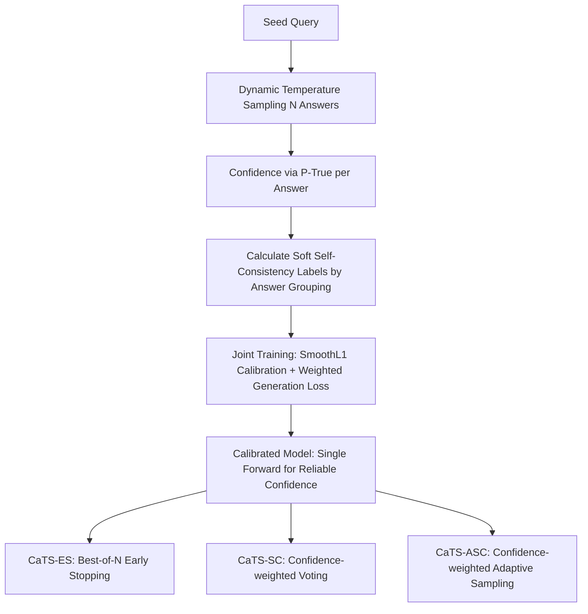

# CaTS: Calibrated Test-Time Scaling for Efficient LLM Reasoning

**Conference**: ICLR 2026  
**OpenReview**: [https://openreview.net/forum?id=jrSc4RJXy1](https://openreview.net/forum?id=jrSc4RJXy1)  
**Code**: [https://github.com/Chengsong-Huang/Self-Calibration](https://github.com/Chengsong-Huang/Self-Calibration)  
**Area**: LLM Reasoning / Test-time Scaling  
**Keywords**: Test-time Scaling, Confidence Calibration, Self-consistency, Best-of-N, Adaptive Sampling, Early Stopping  

## TL;DR
By distilling confidence derived from self-consistency back into the model itself (Self-Calibration), LLMs can provide reliable confidence in a single forward pass. This enables calibrated test-time scaling (CaTS) for repeated sampling methods like Best-of-N and Self-consistency, dynamically allocating compute based on task difficulty. This approach significantly improves accuracy under the same sampling budget and saves substantial compute at the same accuracy level.

## Background & Motivation
**Background**: Increasing test-time compute is the most direct means of improving LLM response quality. Repeated sampling methods—Best-of-N (selecting the highest score among N samples) and Self-Consistency (majority voting among N samples)—are simple and effective, becoming the mainstay for reasoning tasks.

**Limitations of Prior Work**: These methods use a fixed $N$ for every query, ignoring task difficulty. This wastes compute on easy questions like "2+3=?" while providing insufficient exploration for hard problems. Existing adaptive sampling methods (ASC, ESC, RASC) can stop sampling dynamically but mostly rely on hand-crafted features or heuristics (e.g., "stop if the same answer appears three times consecutively"), limiting generalization across tasks and models.

**Key Challenge**: Model confidence is an intrinsic signal reflecting uncertainty, naturally suited for driving dynamic sampling. However, LLMs are notoriously **overconfident**. The raw P(True)/logit-based confidence deviates severely from actual accuracy (especially in small models), making it unusable. While self-consistency provides more accurate confidence, it requires generating many samples first, returning to the issue of high compute costs.

**Goal**: Design a **task-agnostic, model-agnostic, and heuristic-free** test-time sampling framework that obtains reliable confidence in a single forward pass to adaptively allocate compute based on difficulty.

**Key Insight**: **Confidence Self-Distillation**—Since self-consistency provides accurate but expensive confidence, it can be treated as a "soft label" to be distilled into the model itself. This allows the model to learn to output calibrated confidence in one forward pass. This cheap and reliable confidence is then integrated into Best-of-N / SC / ASC to form Calibrated Test-Time Scaling (CaTS).

## Method

### Overall Architecture
The method consists of two phases: **Offline Self-Calibration Training** and **Online CaTS Inference**. The training phase requires no human annotation. It first performs self-sampling on seed data and assigns soft confidence labels using Soft Self-Consistency. The model is then jointly trained using SmoothL1 (for calibration) and generation loss (to maintain reasoning ability). During inference, the confidence from a single forward pass of the trained model is used as a quality metric for three sampling strategies, achieving dynamic budget allocation.

### Key Designs

**1. Soft Self-Consistency Labels: Upgrading "Voting Frequency" to "Confidence-Weighted Frequency".** Since training data lacks human labels, the key is generating accurate confidence for each response. Using raw P(True) (the probability of the "Yes" token for "Is the answer correct?") leads to overconfidence, while pure self-consistency only considers frequency. This work fuses them: for a query sampled $N$ times $\{(x,y_n,c_n)\}$, each response has its own confidence $c_n$. The labels are aggregated as $\mathrm{SSC}(y)=\frac{\sum_{i:y_i=y} c_i}{\sum_{i=1}^N c_i}$, representing the proportion of confidence sum for a specific answer. This reflects support frequency while downweighting low-quality responses. Table 1 shows SSC ECE reaching 3.42/3.75 on GSM8K/SVAMP, superior to P(True) (12.03/28.94) and pure SC (4.48/4.94). The triplets $(x,y_i,\mathrm{SSC}(y_i))$ serve as training data.

**2. Joint Loss: Calibrating Confidence While Preserving Reasoning.** Training solely on confidence might cause the model to "score well but solve poorly." The method uses SmoothL1 to pull the predicted $p_\theta(\text{Yes}\mid x,y,I)$ toward the soft label $c$, while adding a standard CoT generation loss for high-quality responses—specifically, only responses with confidence above a threshold $\eta$ contribute to the generation loss. The total loss is:
$$\mathcal{L}_{total}(\theta)=\sum_{(x_j,y_j)\in D}\mathrm{SmoothL1}\!\big(p_\theta(\text{Yes}\mid x_j,y_j,I),\,c_j\big)+\omega\!\!\sum_{\substack{(x_i,y_i)\\ c_i>\eta}}\!\!\big(-\log p_\theta(y_i\mid x_i)\big),$$
where $\omega$ balances the terms. Sampling also utilizes Entropy-based Dynamic Temperature (EDT), which increases temperature when distribution entropy is low to enhance diversity without sacrificing quality.

**3. Three CaTS Inference Variants: One Confidence Metric, Three Efficiency Strategies.** The trained model provides reliable $c_i$ in one pass. **CaTS-ES** (Early Stopping for Best-of-N) samples sequentially and stops immediately if $c_i\ge\tau$. **CaTS-SC** (for Self-Consistency) replaces "one vote per response" with confidence-weighted voting $y=\arg\max_z\sum_{i=1}^N c_i\mathbf{1}(y_i=z)$. **CaTS-ASC** (for Adaptive SC) replaces cumulative frequency with confidence-weighted frequency $\hat r_k(z)=\frac{\sum_{i=1}^k c_i\mathbf{1}(y_i=z)}{\sum_{i=1}^k c_i}$ for stopping decisions.

**4. Mechanism: CaTS-SC is exponentially better than vanilla SC when confidence is accurate.** The paper provides a rigorous proof that when the confidence signal satisfies:
$$\frac{\mu_q^2}{2v_q+\frac{2}{3}\mu_q}>\frac{\mu_{MV}^2}{2v_{MV}+\frac{2}{3}\mu_{MV}}$$
(where $\mu$ and $v$ are the margin mean and variance for weighted vs. majority voting, and $q$ is the true correctness probability given confidence), the error rate of CaTS-SC improves at an exponential rate over vanilla SC. Intuitively, weighted voting wins as long as the confidence is "accurate enough."

## Key Experimental Results

### Main Results
Three models across three OOD datasets (Object Counting / MathQA / ARC Challenge), with a fixed budget of 16. Gains relative to baselines are shown in parentheses:

| Method | Llama-8B Obj C. | Llama MathQA | Llama ARC C. | Qwen MathQA | DS-R1-1.5B ARC C. |
|---|---|---|---|---|---|
| SC | 69.1 | 73.7 | 85.2 | 83.3 | 60.8 |
| **CaTS-SC** | **76.8 (+7.7)** | **83.6 (+9.9)** | **87.7 (+2.5)** | **87.8 (+4.5)** | **66.5 (+5.7)** |
| Best-of-N | 62.3 | 73.7 | 84.5 | 83.8 | 54.1 |
| **CaTS-ES** | **76.8 (+14.5)** | **83.6 (+9.9)** | **87.7 (+3.2)** | **87.8 (+4.0)** | **66.5 (+12.4)** |
| ASC | 67.9 | 72.7 | 84.6 | 83.2 | 59.5 |
| **CaTS-ASC** | **75.2 (+7.3)** | **81.9 (+9.2)** | **86.6 (+2.0)** | **87.2 (+4.0)** | **65.1 (+5.6)** |

All three CaTS variants consistently outperform their baselines across nine datasets. CaTS-ES improves DeepSeek-R1-1.5B on Object Counting from 48.1 to 70.8 (+22.7) and outperforms strong adaptive baselines like ESC/RASC.

### Ablation Study
**Confidence vs. External Reward Model** (Best-of-16, validating that self-calibrated confidence can replace external RMs):

| Model | Dataset | Reward Model | CaTS Confidence |
|---|---|---|---|
| Llama | MathQA | 82.1 | **84.0** |
| Llama | ARC Challenge | 86.2 | **86.6** |
| Qwen | ARC Challenge | 89.6 | **89.8** |

Self-calibrated confidence achieves comparable or higher accuracy than external reward models while saving memory, inference time, and the complexity of dataset-specific normalization.

### Key Findings
- **High Efficiency**: As shown in Fig. 1, reaching 85.0 accuracy on MathQA using CaTS-SC saves **94.2%** of sampling volume compared to vanilla SC. Savings across different accuracy levels were 39.8% / 50.4% / 94.2%.
- **Best-of-N performance**: At very small budgets, Best-of-N slightly outperforms CaTS-ES if the stopping threshold is too low, indicating the need for threshold calibration.
- **SSC Accuracy**: SSC provides the most accurate calibration (lowest ECE), forming the foundation for reliable soft labels.

## Highlights & Insights
- **Elegant Distillation Loop**: Using expensive but accurate self-consistency as a teacher to distill cheap, accurate single-forward confidence converts "compute-for-confidence" into a "train once, benefit forever" model.
- **Unified Confidence for All Sampling**: Best-of-N / SC / ASC can all be upgraded to CaTS versions in a plug-and-play manner, offering high versatility and low deployment costs.
- **Theoretical and Empirical Synergy**: The work doesn't just chase benchmarks; it provides sufficient conditions for CaTS-SC's exponential superiority, clarifying why accurate confidence guarantees better results.
- **Practical Alternative to Reward Models**: It eliminates the overhead and latency of external scoring models, making it friendly for large-scale deployment.

## Limitations & Future Work
- **Threshold Dependency**: Stopping thresholds for CaTS-ES/ASC currently require dataset-specific calibration. Robustness in unknown scenarios remains to be verified.
- **Upfront Training Cost**: While inference is efficient, the model requires fine-tuning with self-sampled data, which may be less feasible for closed-source or massive-scale models.
- **Confidence Upper Bound**: Benefits depend on confidence accuracy; performance may degrade on OOD or adversarial tasks if calibration fails.
- **Model Scale**: Evaluation focuses on 1.5B–8B models. Performance on larger models and more complex reasoning (long-chain CoT) needs further exploration.

## Related Work & Insights
- **Repeated Sampling**: Best-of-N, Self-Consistency, and Adaptive Self-Consistency are the primary targets of improvement; ESC and RASC serve as strong adaptive baselines.
- **Confidence Estimation**: P(True), Self-consistency confidence, CISC, and Self-Certainty are sources / baselines for confidence signals. This work fuses them via SSC.
- **Inspiration**: The strategy of distilling expensive aggregate signals into a single forward pass can be applied to other online estimation tasks (e.g., process reward, difficulty prediction). The theoretical framework for weighted voting can also be generalized.

## Rating
- **Novelty**: ⭐⭐⭐⭐ Distilling self-consistency confidence back into the model to drive three test-time scaling methods is novel and supported by theory.
- **Experimental Thoroughness**: ⭐⭐⭐⭐ Evaluated on nine datasets across three models (In-domain and OOD), with comparisons against RMs and strong adaptive baselines.
- **Writing Quality**: ⭐⭐⭐⭐ Clear framework, convincing visualizations (compute-saving curves), and formal mathematical definitions.
- **Value**: ⭐⭐⭐⭐ Significantly reduces test-time costs, provides plug-and-play upgrades, and offers a viable alternative to reward models.

<!-- RELATED:START -->

## Related Papers

- [\[ICLR 2026\] Optimal Aggregation of LLM and PRM Signals for Efficient Test-Time Scaling](optimal_aggregation_of_llm_and_prm_signals_for_efficient_test-time_scaling.md)
- [\[ICLR 2026\] Efficient Test-Time Scaling for Small Vision-Language Models](efficient_test-time_scaling_for_small_vision-language_models.md)
- [\[ICLR 2026\] Plan and Budget: Effective and Efficient Test-Time Scaling on Reasoning LLMs](plan_and_budget_effective_and_efficient_test-time_scaling_on_reasoning_large_lan.md)
- [\[ICLR 2026\] ROC-n-Reroll: How Verifier Imperfection Affects Test-Time Scaling](roc-n-reroll_how_verifier_imperfection_affects_test-time_scaling.md)
- [\[ICLR 2026\] Test-Time Scaling with Reflective Generative Model](test-time_scaling_with_reflective_generative_model.md)

<!-- RELATED:END -->
