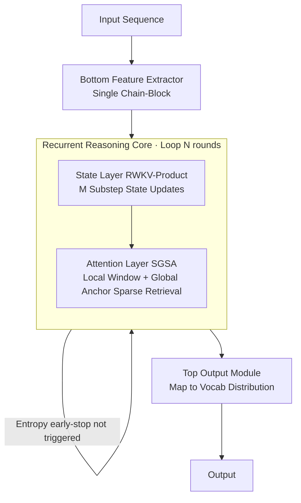

# ChainGPT: Dual-Reasoning Model with Recurrent Depth and Multi-Rank State Updates

**Conference**: ICLR 2026  
**OpenReview**: [https://openreview.net/forum?id=kdZbxizwGK](https://openreview.net/forum?id=kdZbxizwGK)  
**Code**: TBD  
**Area**: Foundation Model Architecture / LLM Reasoning  
**Keywords**: Latent Space Reasoning, Recurrent Depth, Multi-Rank State Updates, RWKV, Sparse Attention, Hybrid Architecture  

## TL;DR
ChainGPT shifts reasoning from "generating more tokens" into the latent space. By combining **intra-layer multi-substep state updates (RWKV-Product) + State-Guided Sparse Attention (SGSA)** for deep local computation with **cross-layer recurrent depth** for iterative refinement, it enables small models to achieve reasoning capabilities exceeding fixed-depth Transformers at near-linear complexity.

## Background & Motivation
**Background**: Standard fixed-depth Transformers fall within circuit classes like $AC^0/TC^0$ in computational complexity theory. Under finite precision, they are not Turing complete and struggle with end-to-end multi-step planning, symbolic manipulation, and combinatorial search tasks that scale with problem size. The mainstream solution is Chain-of-Thought (CoT), which "deepens" effective computation depth by generating intermediate natural language steps.

**Limitations of Prior Work**: CoT represents reasoning as discrete token sequences, which is limited by linguistic expressivity, struggles with non-linear/parallel reasoning, and incurs computational costs that explode with generation length. Strategies like ToT and Self-Consistency further push costs to exponential levels. Another efficiency route relies on RNN/hybrid architectures (RWKV-7, Mamba, Jamba, Samba), but pure RNNs' finite-dimensional state matrices cannot store fine-grained context (leading to performance drops in multi-hop reasoning), while most hybrid architectures are simple sequential concatenations: retaining global attention hits $O(N^2)$ scalability bottlenecks, while limiting it to local windows fails to address state matrix capacity issues.

**Key Challenge**: A superior solution must simultaneously tackle two hard problems—enabling reasoning beyond simple token generation (sufficient depth) while maintaining computational efficiency and long-range dependencies (sufficient cost-efficiency). Existing works often sacrifice one for the other.

**Goal**: Design an architecture that moves reasoning into an implicit computational space, achieving both reasoning depth and efficiency at near-linear complexity.

**Core Idea**: **Dual Recursive Reasoning**—using intra-layer multi-substep state updates for "multi-round reasoning within a single layer," and inter-layer recurrent depth for iterative refinement. Both shift "iteration" from token generation to latent space optimization.

## Method

### Overall Architecture
ChainGPT consists of multiple stacked Chain-Blocks. Each Block = a State Layer (centered on RWKV-Product) + an Attention Layer (SGSA). At a higher level, the model is divided into three stages: a bottom feature extractor → a recurrent reasoning core → a top output module. The recurrent core iteratively refines the hidden state until convergence, forming a "intra-layer multi-substep + cross-layer recurrent depth" dual recursion.

### Key Designs

**1. RWKV-Product: Stacking "Low-Rank" into "High-Rank" via LoRA Multi-Substeps.** The state matrix evolves as $s_t = A(x_t)s_{t-1} + B(x_t)$. The key is splitting the single-step update into $M$ sub-steps, with the transition matrix written as a product form: $A(x_t)=\prod_{j=0}^{M-1}\big(\mathrm{diag}(a_{t,j}) - \beta_{b,j}\,k^{(b)}_{t,j}{k^{(b)}_{t,j}}^{\top}\big)$. Each sub-step is a "channel decay diag + rank-1 correction." After cumulative multiplication of $M$ sub-steps, the overall structure is "diagonal + rank-M." This is a trade-off relative to RWKV-7 (rank-1 per step, limited expressiveness) and DeltaProduct (multi-step Householder, but parameter overhead is impractical). All keys/values use a "shared baseline + LoRA increment" (e.g., $k^{(b)}_{t,j}=k^{base}_t + x_t W^{(b,k1)}_j W^{(b,k2)}_j$). Sub-step-specific step sizes $\beta_{b,j},\beta_{c,j}$ are given by sigmoid gates. This dynamically increases the effective rank of state updates to the adjustable hyperparameter $M$ with only ~0.1M additional parameters, effectively "running multiple reasoning rounds within one layer," leading to faster convergence and stronger representations. Theoretically, expressiveness increases strictly monotonically with $M$ (Appendix A).

**2. State-Guided Sparse Attention (SGSA): Splitting Global Recall into "Write + Pointer Read".** Unlike pure RNNs that compress the entire history into a finite state, SGSA focuses only on two types of keys above the state layer output: neighbors within a local window $W$ around the query, and global anchors sampled at stride $G$. Mechanism-wise, RWKV-Product aggregates local segments and writes them to anchors; SGSA then retrieves content via sparse addressing like a "pointer," allowing the state space to expand naturally with sequence length and distributing memory into block-level segments. Complexity is reduced from $O(T^2)$ in dense attention to $O(T(W + T/G))$, which is near-linear. The paper further proves that with appropriate hyperparameters, Chain-Block can solve Multi-Query Associative Recall (MQAR) on arbitrarily long sequences: as long as $q_j=k_i$, $v_i$ can be retrieved (Appendix B). This design precisely addresses the dilemma where "pure window attention (Samba) has state bottlenecks, while retaining global attention (Jamba) has $O(N^2)$ bottlenecks."

**3. Recurrent Depth + Adaptive Early-Stop: Controllable Trade-off between Reasoning Depth and Computation Time.** Cross-layer iteration of the hidden state through the recurrent core can theoretically simulate any Turing machine and model any computable function given sufficient memory and time (Appendix C provides formal proof). To avoid redundant iterations, entropy-based early stopping is introduced: each round decodes the core output into $p_t=\mathrm{softmax}(\ell_t)$, calculating prediction entropy $H_t(b)=-\sum_i p_{t,i}(b)\log(p_{t,i}(b)+\varepsilon)$. Recurrence stops when the entropy drop between intervals $\Delta H_t(b)=H_{t-k}(b)-H_t(b)\le\tau$. The threshold $\tau$ is a fixed constant, allowing the model to perform fewer iterations for easy samples and more for hard ones.

**4. Two-Phase Training Stabilization: Gradient-Free Warmup + Truncated Backpropagation.** Direct end-to-end backpropagation through deep recursion faces gradient explosion/vanishing and VRAM pressure. The paper adopts a "gradient-free warmup + truncated backpropagation" two-phase strategy: first, the recurrent core iterates until near-stability without backpropagating gradients, then truncated backpropagation is performed only on the final few steps. Combined with entropy early stopping, this makes training for variable-step recurrent depth both stable and computationally controllable.

## Key Experimental Results

Experiments were conducted on 8×NVIDIA L20; pre-training used FineWeb, evaluations via lm-eval-harness zero-shot.

### Main Results (Overall Performance, FineWeb 20B/40B tokens, zero-shot)

| Model | ARC-c | ARC-e | HellaSwag | PIQA | SciQ | GLUE | Avg. |
|---|---|---|---|---|---|---|---|
| Qwen2.5-0.5B | 0.2218 | 0.4082 | 0.3224 | 0.6425 | 0.5290 | 0.4664 | 0.4317 |
| **ChainGPT-0.5B** | 0.2389 | 0.4773 | 0.3644 | 0.6632 | 0.5330 | 0.4679 | **0.4575** |
| Qwen2.5-1.5B | 0.2696 | 0.5488 | 0.4091 | 0.6915 | 0.6380 | 0.4783 | 0.5059 |
| **ChainGPT-1.5B** | 0.2986 | 0.5779 | 0.4269 | 0.7018 | 0.6860 | 0.4836 | **0.5291** |

ChainGPT leads across all metrics at the same parameter count, with significant gains in reasoning-heavy tasks like ARC-Challenge and HellaSwag.

### Arithmetic Reasoning Comparison (GOAT dataset, all from scratch)

| Model | Accuracy |
|---|---|
| Qwen3 | 33.82% |
| RWKV-7 | 23.69% |
| Qwen3 + Loop | 50.54% |
| RWKV-7 + Loop | 24.81% |
| HRM | 54.00% |
| **ChainGPT** | **57.53%** |
| Qwen3 + CoT | 88.43% |
| **ChainGPT + CoT** | **99.98%** |

Without CoT supervision, ChainGPT outperforms all recurrent reasoning baselines (including HRM); with CoT, it nearly reaches a perfect score.

### Ablation Study

**(a) Effectiveness of LoRA Sub-step Mechanism** (modded-nanogpt-rwkv)

| Model | Training Steps | Validation Loss |
|---|---|---|
| GPT2 | 19560 | ≈3.28 |
| RWKV-7 | 3200 | 3.2715 |
| RWKV-Product | 2500 | 3.2684 |
| RWKV-Product | 3200 | 3.1901 |

With only +0.1M parameters, it achieves lower loss in fewer steps.

**(b) MQAR Associative Recall** (SGSA resolving state bottlenecks)

| Model | (128,8) | (256,16) | (512,64) | (1024,128) | (2048,256) |
|---|---|---|---|---|---|
| RWKV-7 | >99% | >99% | 98.43% | 95.01% | 72.93% |
| **ChainGPT** | >99% | >99% | >99% | >99% | **>99%** |

**(c) Global Anchor Strategy** (PG-19 Perplexity): Pure sliding window attention (Samba-style) degrades after 8K context; adding sparse periodic anchors (G=32/64/128) results in a perplexity trajectory nearly identical to expensive global attention (Jamba-style) (~16.08 at 16K).

### Key Findings
- **Sub-step Count $M$**: Validation loss decreases monotonically with $M$, with $M=2$ being most cost-effective.
- **Decoupled State Propagation Path**: Under matched parameters, the decoupled version outperforms the coupled one consistently.
- **Recurrent Depth**: From ×1 to ×16 iterations, validation perplexity decreases steadily, optimizing at ×12.

## Highlights & Insights
- **The "dual recursion" perspective unifies two routes for deepening reasoning**: intra-layer multi-substeps (horizontally widening effective rank) + inter-layer recurrent depth (vertically deepening iteration). Both move "iteration" from expensive token generation to the latent space with a clean conceptual approach.
- **RWKV-Product uses LoRA to achieve "multi-step high-rank updates" at near-zero parameter cost**, filling the gap between the limited expressiveness of RWKV-7's rank-1 updates and the excessive parameter weight of DeltaProduct.
- **The "Write-Pointer Read" abstraction of SGSA is elegant**: it welds "RNN state compression" and "Attention precise recall" together, maintaining near-linearity while proving the ability to solve MQAR for any length, satisfying both theory and engineering.
- **Small models gain reasoning benefits**: At the 0.5B/1.5B scale, it shows consistent advantages over Qwen2.5 and surpasses HRM on GOAT without CoT.

## Limitations & Future Work
- **Scale Ceiling**: Maximum scale in experiments is 1.5B with 20–40B tokens; whether advantages hold at 7B+/trillion-token scales is unverified. Turing completeness is a theoretical conclusion under "ideal conditions."
- **Baseline Scope**: Main comparisons are primarily against same-sized Qwen2.5. Lacks end-to-end head-to-head comparisons against Mamba-2, RWKV-7, Jamba/Samba under identical pre-training budgets (these mostly appear in sub-item ablations).
- **Multiple Hyperparameters**: Sub-step count $M$, anchor interval $G$, window $W$, entropy threshold $\tau$, and recurrence limits all require tuning; universal applicability of optimal values ($M=2$, ×12 iterations) across tasks is to be tested.
- **Inference Overhead**: Although recurrent depth has early stopping, the impact of variable-step iterations on actual throughput/latency and engineering trade-offs regarding KV-cache friendliness are not extensively discussed.

## Related Work & Insights
- **RNN Expressiveness Bottleneck**: Merrill et al., Grazzi et al., and Jelassi et al. point out that finite-precision diagonal RNNs (Mamba) struggle even with basic state tracking—this is the direct motivation for RWKV-Product's multi-substeps and SGSA's anchors.
- **Hybrid Architectures**: Jamba (1:7 Mamba+Transformer, retains global attention) and Samba (Mamba+sliding window) are primary benchmarks; ChainGPT uses sparse anchors to bypass the bottlenecks of both.
- **Reasoning Beyond Fixed Depth**: From CoT/ToT/Self-Consistency (generative) to Universal Transformer, Looped Transformer, HRM, and Depth-Recurrent (internal state iteration)—ChainGPT belongs to the latter but adds an intra-layer multi-substep dimension.
- **Insight**: Splitting "deepening reasoning" into two orthogonal knobs—"widening effective rank" × "deepening iteration"—and providing low-overhead implementations for each is a reusable paradigm for designing efficient reasoning architectures.

## Rating
- **Novelty**: ⭐⭐⭐⭐ — The combination of intra-layer multi-substeps (RWKV-Product) + cross-layer recurrent depth is original, as are the LoRA multi-rank updates and Write-Pointer Read abstraction.
- **Experimental Thoroughness**: ⭐⭐⭐ — Ablations (sub-steps/decoupling/anchors/recurrent depth/MQAR/GOAT) are solid, but main comparisons are limited to same-sized Qwen2.5 and small scales, lacking end-to-end tables against various hybrid architectures under a unified budget.
- **Writing Quality**: ⭐⭐⭐⭐ — Motivation-contradiction-solution logic is clear, with complete formulas and theoretical proofs (Turing completeness/MQAR) and well-integrated figures.
- **Value**: ⭐⭐⭐⭐ — Provides a principled design template for the next generation of "efficient yet deep reasoning" language model architectures, particularly valuable for reasoning enhancement in small models.

<!-- RELATED:START -->

## Related Papers

- [\[ICLR 2026\] MoDr: Mixture-of-Depth-Recurrent Transformers for Test-Time Reasoning](modr_mixture-of-depth-recurrent_transformers_for_test-time_reasoning.md)
- [\[ICLR 2026\] R-HORIZON: How Far Can Your Large Reasoning Model Really Go in Breadth and Depth?](r-horizon_how_far_can_your_large_reasoning_model_really_go_in_breadth_and_depth.md)
- [\[ICLR 2026\] Enhancing Language Model Reasoning with Structured Multi-Level Modeling](enhancing_language_model_reasoning_with_structured_multi-level_modeling.md)
- [\[ICLR 2026\] A State-Transition Framework for Efficient LLM Reasoning](a_state-transition_framework_for_efficient_llm_reasoning.md)
- [\[ICLR 2026\] Beyond Magnitude: Leveraging Direction of RLVR Updates for LLM Reasoning](beyond_magnitude_leveraging_direction_of_rlvr_updates_for_llm_reasoning.md)

<!-- RELATED:END -->
