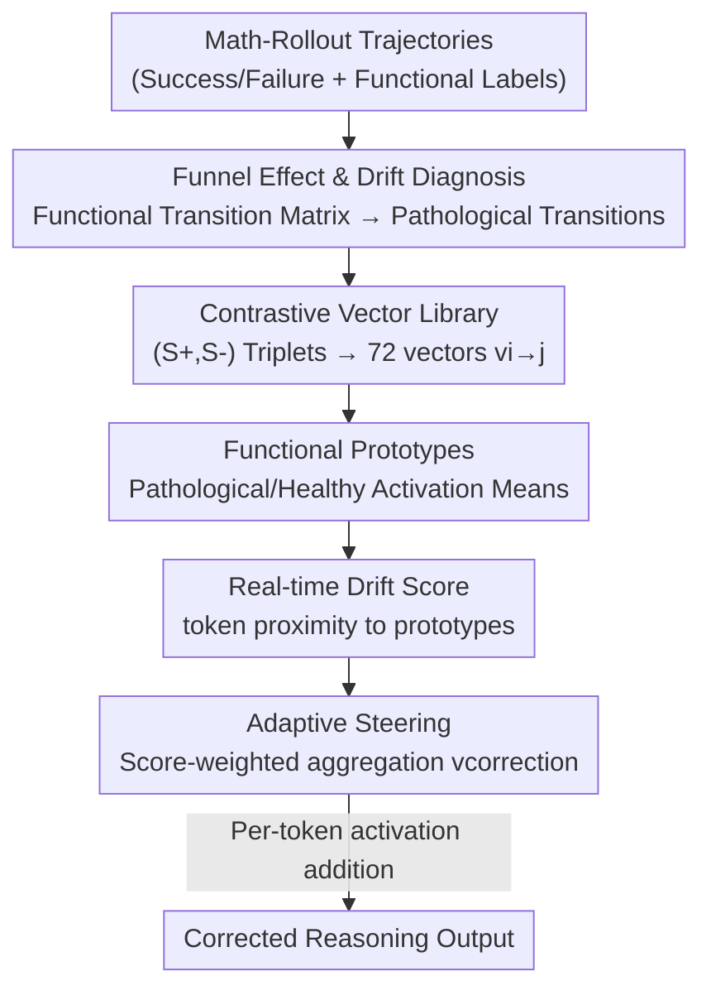

# Characterizing and Mitigating Reasoning Drift in Large Language Models

**Conference**: ICLR2026  
**OpenReview**: [https://openreview.net/forum?id=OphrMOQCCY](https://openreview.net/forum?id=OphrMOQCCY)  
**Code**: To be confirmed  
**Area**: LLM Reasoning  
**Keywords**: Reasoning Drift, Activation Steering, Chain-of-Thought Reliability, Functional State Transition, Inference-time Intervention

## TL;DR
This paper diagnoses a failure mode in Large Language Models (LLMs) termed "Reasoning Drift" using thousands of mathematical reasoning trajectories. It finds that models once entering a pathological functional state during the early high-plasticity phase, become locked into incorrect paths. To address this, Reasoning-Aware Activation Steering (RAAS) is proposed, which uses a pre-computed library of contrastive steering vectors to nudge activations back to healthy paths in real-time during inference, consistently improving accuracy on GSM8K, AIME, and GPQA with out-of-distribution transferability.

## Background & Motivation
**Background**: Chain-of-Thought (CoT) enables LLMs to explicitly write out multi-step reasoning, but the generation of this chain is inherently stochastic. To combat unreliable outcomes caused by randomness, mainstream approaches include self-consistency (majority voting after multiple samplings) and path search (Tree-of-Thoughts, beam search, PiCSAR, etc., which explore and prune multiple paths).

**Limitations of Prior Work**: These methods suffer from two major flaws. First, they are computationally expensive—relying on massive repeated sampling and directionless state exploration. Second and more fundamentally, they treat the LLM as a black box, merely increasing trial-and-error attempts without investigating the internal reasoning mechanisms or why failures occur, thus offering little insight into the reasoning process itself.

**Key Challenge**: The authors question a counter-intuitive phenomenon—why can resampling just one sentence in the middle of a reasoning chain flip the final answer from right to wrong or vice-versa? This suggests structured underlying mechanisms rather than pure noise. Answering this requires shifting from "sampling outside the black box" to "examining internal state transitions."

**Goal**: (1) Characterize how single-step substitutions influence global outcomes and identify transition patterns that determine reliability; (2) Design a lightweight, interpretable, and targeted intervention to pull the model back from failure modes.

**Key Insight**: The authors utilize the Math-Rollout dataset, where each reasoning step includes 100 random rollouts with success/failure labels. Each step is categorized into 8 "functional roles" (Problem Setup, Plan Generation, Fact Retrieval, Active Computation, Result Consolidation, Uncertainty Management, Self Checking, Final Answer Emission). This "functional ruler" maps raw text to functional state sequences, allowing statistical analysis of transitions strongly correlated with failure.

**Core Idea**: Reasoning failure is diagnosed as specific pathological functional transitions ("Reasoning Drift"). Activation steering is then used to apply a small correction vector to activations in real-time when these transitions are about to occur, pushing the model back to healthy transitions—guiding precise intervention with mechanistic diagnosis rather than blind sampling.

## Method

### Overall Architecture
The work follows a two-stage "Diagnosis-then-Intervention" paradigm. The diagnosis phase (Section 2) quantifies the impact of resampling on the Math-Rollout dataset, revealing a "funnel effect" where reasoning is highly plastic early on but solidifies quickly. It attributes failures to specific pathological state transitions via a functional transition matrix, distinguishing between Llama’s "Inertial Drift" and Qwen’s "Chaotic Drift." The intervention phase (Section 3, RAAS) utilizes an offline library of up to $9 \times 8 = 72$ steering vectors and functional prototypes. During inference, a "Drift Score" is calculated per token to determine if it is sliding toward a pathological state, and steering vectors are weighted and aggregated to correct activations in real-time.

### Key Designs

**1. Funnel Effect and Reasoning Drift Diagnosis: Quantifying failures into locatable transitions.**

This serves as the foundation. The authors define the **Outcome Polarity Flip Rate**—the probability that a rollout’s final outcome differs from the original path. Segmenting the reasoning process into early, middle, and late stages, they find that while $93\%$ of rollouts introduce textual changes, the flip rate is highest in the early stage ($>47\%$ for both models) and decreases significantly later. This "funnel effect" indicates that the first few steps are extremely plastic and decisive, while later paths become rigid and deterministic.

Mapping these to functional labels reveals three pathological patterns: ① Common failure: Jumping from Initial Question directly to Plan Generation (skipping Problem Setup). ② Common failure: Systemic avoidance of Uncertainty Management (bypassing self-reflection mechanisms). ③ Model-specific signatures: Llama exhibits **Inertial Drift** (stuck in diagonal self-loops), while Qwen exhibits **Chaotic Drift** (non-linear jumping and frequent regressing to old states).

**2. Contrastive Vector Library: Compressing "Healthy vs. Pathological" into 72 reusable directions.**

Differences are refined into injectable directions using triplets $(S_{<t}, S^+, S^-)$. In corrective scenarios, $S^+$ is a corrective rollout and $S^-$ is the original unpromising step. In drift scenarios, $S^+$ is a promising step and $S^-$ is an erroneous rollout.

Steering vectors are segmented by "Source function $i \to$ Target function $j$":
$$v_{i\to j} = \mathbb{E}_{(S^+,S^-)\in D_{i\to j}}\left[\mathrm{act}(S^+) - \mathrm{act}(S^-)\right]$$
Where $\mathrm{act}(S)$ is the mean-pooled token activation at layer $L$. This produces up to 72 fine-grained vectors that correct specific drift instances rather than blocking entire functional categories.

**3. Real-time Drift Score: Judging failure modes per token without knowing future states.**

To solve the temporal mismatch during generation, authors pre-compute **Functional Prototypes**: pathological prototypes $a^-_{i,j}$ and healthy prototypes $a^+_{i,j}$ using mean activations from the dataset. During inference, for current token activation $a_{\text{token}}$ and source class $i$:
$$\mathrm{DriftScore}(i,j) = \mathbb{I}\!\left(\cos(a_{\text{token}}, a^-_{i,j}) > \cos(a_{\text{token}}, a^+_{i,j})\right)\cdot \cos(a_{\text{token}}, a^-_{i,j})$$
A non-zero score occurs only when a token is closer to a pathological prototype, indicating it is aligning with a known failure mode.

**4. Inference-time Adaptive Steering: Context-aware correction via weighted aggregation.**

The correction vector is calculated as:
$$v_{\text{correction}} = \sum_{j=1}^{8} \mathrm{DriftScore}(i,j)\cdot v_{i\to j}$$
This is added to the original activation: $a'_{\text{token}} = a_{\text{token}} + v_{\text{correction}}$. Correction strength adapts automatically: zero displacement if no drift is detected, and strong thrust toward favorable directions if a failure mode is imminent.

### Loss & Training
RAAS requires no training or fine-tuning of the primary model. Steering vectors and prototypes are derived via offline statistics from Math-Rollout. Only a DistilBERT classifier is trained to assign functional labels. Layer $L$ selection details are provided in the appendix.

## Key Experimental Results

### Main Results
Evaluations were conducted on mathematical reasoning benchmarks OOD to the steering vector source data, using R1-Distill-Llama-8B and R1-Distill-Qwen-14B.

| Model | Method | GSM8K | AIME2024 | AIME2025 | GPQA-Diamond |
|------|------|------|----------|----------|--------------|
| R1-Distill-Llama-8B | Vanilla | 82.45 | 34.99 | 25.56 | 50.50 |
| R1-Distill-Llama-8B | CAAum | 85.06 | 45.00 | 30.00 | 52.52 |
| R1-Distill-Llama-8B | **Ours** | **87.56** | **55.56** | **31.70** | **55.52** |
| R1-Distill-Qwen-14B | Vanilla | 93.69 | 54.44 | 26.67 | 55.55 |
| R1-Distill-Qwen-14B | **Ours** | **95.60** | **62.49** | **36.67** | **57.57** |

Improvements are most significant in AIME (e.g., 34.99 $\to$ 55.56 on Llama), demonstrating that fine-grained functional vectors capture generalizable logical principles.

### Ablation Study

| Configuration | Phenomenon | Explanation |
|------|------|------|
| **Ours** (Precise $i\to j$ mapping) | Best Performance | Complete method |
| Random Source ($i_{\text{rand}}\to j$) | Slightly better than Vanilla | Retains general corrective direction |
| Random Target ($i\to j_{\text{rand}}$ | Slightly better than Vanilla | Retains general corrective direction |
| Fully Random | Severe degradation | Breaks reasoning logic |

### Key Findings
- **Precise mapping $(i \to j)$ is the primary driver of gain**: While any "preferred - unpreferred" vector provides a general corrective signal, specific functional context is vital for complex reasoning.
- **Mechanistic Validation**: Post-intervention analysis shows the method acts as a guardrail in the early stage, suppressing premature Plan Generation, encouraging Problem Setup, and increasing the probability of entering Uncertainty Management.
- **Cross-model Generalization**: Vectors learned from distilled models transfer effectively to non-distilled bases (e.g., Llama3.1-8B), though the magnitude of improvement depends on the base model's intrinsic reasoning capacity.

## Highlights & Insights
- **The "Funnel Effect + Functional Transition Matrix" paradigm is elegant**: It transforms the intuition of "one-sentence flips" into quantifiable flip-rate curves and locatable state grids.
- **Model-specific Drift Signatures (Inertial vs. Chaotic)**: Recognizing that drifting varies by architecture (Llama getting stuck vs. Qwen jumping randomly) suggests that intervention should not be one-size-fits-all.
- **DriftScore bypasses the "unknown state" bottleneck**: Using proximity to prototypes instead of explicit state prediction provides a lightweight, real-time solution for runtime intervention.

## Limitations & Future Work
- **Dependency on fine-grained labeling**: The method relies on the expensive Math-Rollout dataset; applying it to new domains requires defining and labeling new functional roles.
- **Mathematical focus**: The 8 functional roles are math-specific; their coverage for open-domain QA or long-term agent planning remains to be seen.
- **Late-stage drift persistence**: Interventions are most effective in the early high-plasticity window; late-stage failures remain difficult to correct once the path has solidified.

## Related Work & Insights
- **Comparison to SC/ToT**: Unlike black-box methods that rely on massive sampling, RAAS uses mechanistic insights to perform lightweight, interpretable, and low-cost corrections.
- **Comparison to Classic Activation Steering**: While previous work often used global vectors for high-level styles (e.g., refraining from answering), RAAS refines this into a $72$-dimensional library tailored for the granular steps of reasoning.

## Rating
- Novelty: ⭐⭐⭐⭐⭐ 
- Experimental Thoroughness: ⭐⭐⭐⭐ 
- Writing Quality: ⭐⭐⭐⭐⭐ 
- Value: ⭐⭐⭐⭐ 

<!-- RELATED:START -->

## Related Papers

- [\[ICLR 2026\] DRIFT: Decompose, Retrieve, Illustrate, then Formalize Theorems](drift_decompose_retrieve_illustrate_then_formalize_theorems.md)
- [\[AAAI 2026\] Answering the Unanswerable Is to Err Knowingly: Analyzing and Mitigating Abstention Failures in Large Reasoning Models](../../AAAI2026/llm_reasoning/answering_the_unanswerable_is_to_err_knowingly_analyzing_and.md)
- [\[ICLR 2026\] On the Thinking-Language Modeling Gap in Large Language Models](on_the_thinking-language_modeling_gap_in_large_language_models.md)
- [\[ICLR 2026\] StreamingThinker: Large Language Models Can Think While Reading](streamingthinker_large_language_models_can_think_while_reading.md)
- [\[ICLR 2026\] Vision-R1: Incentivizing Reasoning Capability in Multimodal Large Language Models](vision-r1_incentivizing_reasoning_capability_in_multimodal_large_language_models.md)

<!-- RELATED:END -->
