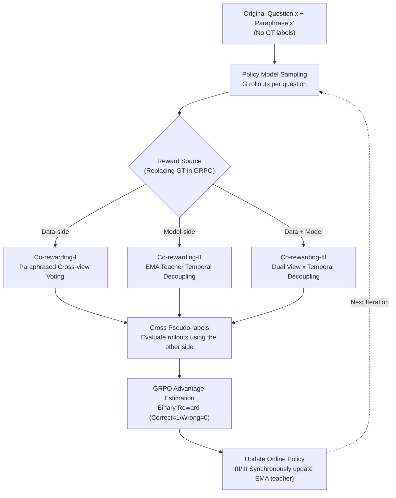

# Co-rewarding: Stable Self-supervised RL for Eliciting Reasoning in Large Language Models

**Conference**: ICLR 2026  
**arXiv**: [2508.00410](https://arxiv.org/abs/2508.00410)  
**Code**: [https://github.com/tmlr-group/Co-rewarding](https://github.com/tmlr-group/Co-rewarding)  
**Area**: Reinforcement Learning  
**Keywords**: Self-supervised RL, Label-free reasoning, Training collapse, GRPO, Contrastive learning

## TL;DR
Co-rewarding proposes a self-supervised RL framework that addresses training collapse in self-rewarding RL through two complementary supervision mechanisms: data-side (cross-view consistency of paraphrased problems) and model-side (pseudo-labels from an EMA teacher model). Without human labels, it achieves or exceeds the performance of RLVR (with labels) on multiple mathematical reasoning benchmarks.

## Background & Motivation

**Background**: RLVR (Reinforcement Learning with Verifiable Rewards, such as GRPO in DeepSeek-R1) is a mainstream method for enhancing LLM reasoning capabilities, but it relies on human-annotated ground-truth (GT) answers as reward signals.

**Limitations of Prior Work**:
   - GT annotation is costly and difficult to scale, especially for complex tasks.
   - Self-rewarding methods (self-certainty, entropy-based, majority voting) can substitute for GT, but frequently suffer from **training collapse**.
   - Cause of collapse: Reward signals originate from the model's own single-view output → leads to "self-consistent hallucination" → reward hacking.

**Key Challenge**: Entanglement between self-supervised signals and the current policy—the model gains high rewards by minimizing entropy or maximizing consistency, but actually converges to trivial solutions (repetitive strings, consistent but incorrect answers).

**Goal**:
   - How to achieve stable RL training without using GT labels?
   - How to break the self-consistent hallucination under a "single viewpoint"?
   - Can performance reach the level of RLVR with GT labels?

**Key Insight**: Inspired by self-supervised learning (SimCLR, BYOL, DINO)—true reasoning ability should manifest as invariance across views or time, rather than certainty in a single output.

**Core Idea**: Introduce complementary supervision perspectives through "paraphrased problem cross-validation" on the data side and "EMA teacher pseudo-labels" on the model side, increasing the difficulty of reward hacking to prevent training collapse.

## Method

### Overall Architecture
Co-rewarding aims to enable RL training without GT labels while preventing the model from collapsing like standard self-rewarding methods. It is built upon the GRPO framework, specifically replacing the reward source in advantage estimation. Instead of using human labels or single-view model outputs, it introduces pseudo-labels generated from **alternative perspectives** as cross-references. For each problem, a semantically equivalent paraphrased version is prepared. The policy model samples rollouts for both the original and paraphrased questions. A "cross-view majority voting" mechanism then generates pseudo-labels to evaluate the opposite side's rollouts, followed by standard GRPO advantage estimation to update the policy. The paper instantiates "alternative perspectives" in three progressive ways: I. Data-side second perspective (paraphrased questions), II. Model-side second perspective (EMA teacher), and III. Combining both for dual decoupling across views and time.

### Key Designs

**1. Co-rewarding-I (Data-side: Cross-view consistency validation via paraphrasing)**

The source of collapse in standard self-rewarding methods is that the reward signal and the current policy originate from the same input and viewpoint—the model gets high scores simply by making its output "self-consistent," leading to trivial, consistent-but-wrong solutions. Co-rewarding-I prepares a semantically equivalent paraphrase $x'$ for the original problem $x$, letting the two views act as each other's evaluators. Specifically, the policy model samples $G$ rollouts for both $x$ and $x'$, obtaining pseudo-labels $y_v$ and $y_v'$ via majority voting. Crucially, these are used **cross-wise**: $y_v'$ evaluates rollouts of $x$, and $y_v$ evaluates rollouts of $x'$. The advantage is calculated as $\hat{A}_i = \frac{r(y_v', y_i) - \text{mean}(\cdot)}{\text{std}(\cdot)}$. The underlying assumption is analogy-invariance: semantically equivalent problems should yield the same answer. This makes reward hacking difficult because the model cannot satisfy the reward solely by being self-consistent on a single input.

**2. Co-rewarding-II (Model-side: Decoupled supervision via EMA teacher in the temporal dimension)**

While Method I addresses the single-view data issue, the supervision still comes from the current policy. Method II further decouples supervision and policy in the **temporal dimension**. It maintains a teacher model updated via Exponential Moving Average (EMA):

$$\tilde{\pi}_{ref}^{(k)} \leftarrow \alpha^{(k)} \tilde{\pi}_{ref}^{(k-1)} + (1-\alpha^{(k)}) \pi_{\theta_{old}}^{(k)},$$

where the EMA weight $\alpha^{(k)}$ is adjusted via cosine annealing from $\alpha_{start}$ to $\alpha_{end}$. The teacher generates its own rollouts and produces a pseudo-label $\tilde{y}_v$ through majority voting, which is used to evaluate the online policy's rollouts. Because the teacher is a moving average, it does not immediately shift with instantaneous policy changes, breaking the immediate feedback loop of "model changes, reward changes"—similar to the momentum teacher approach in BYOL/DINO.

**3. Co-rewarding-III (Dual Decoupling of Data + Model)**

Method III combines the complementarities of both: the EMA teacher generates rollouts and pseudo-labels for the **paraphrased question**, which are then used to supervise the policy model's rollouts on the **original question** (and vice versa). This simultaneously decouples the data perspective (original vs. paraphrase) and the temporal supervision (online policy vs. EMA teacher). Method I blocks the "single-view data" loophole, Method II blocks the "supervision-policy entanglement" loophole, and Method III leaves no opening for reward hacking in either direction.

### Loss & Training
- The optimization follows GRPO: $\mathcal{J}(\theta) = \text{clipped surrogate objective} - \beta \cdot D_{KL}(\pi_\theta \| \pi_{ref})$, with the reward source in the advantage replaced by cross-pseudo-labels.
- Rewards are binary (Correct=1, Wrong=0), determined by pseudo-labels from one of the three methods.
- The EMA teacher follows cosine annealing: In early training, $\alpha$ is smaller for faster updates to keep pace with the policy; in later stages, $\alpha$ increases for stable supervision.
- Paraphrased data can be generated offline using an LLM to rewrite original math problems, adding no online training overhead.

## Key Experimental Results

### Main Results (MATH training set, Qwen3-8B-Base)

| Method | MATH500 | GSM8K | AMC | IFEval | MMLU-Pro |
|------|---------|-------|-----|--------|----------|
| Before RL | 72.4 | 27.8 | 20.9 | 50.9 | 52.9 |
| GT-Reward (RLVR) | 82.6 | 87.3 | 54.2 | 52.8 | 57.1 |
| Self-Certainty | 80.2 | 80.7 | 50.8 | 51.0 | 54.2 |
| Majority-Voting | 79.8 | 89.8 | 49.1 | 51.8 | 56.9 |
| **Co-rewarding-I** | 81.2 | **93.7** | 51.2 | 55.8 | **60.0** |
| **Co-rewarding-II** | 80.8 | 92.4 | 53.5 | **60.7** | 57.5 |
| **Co-rewarding-III** | **81.4** | 91.0 | **54.1** | 53.7 | 59.1 |

### Ablation Study / Training Stability

| Configuration | Training Collapse? | Math Reasoning Avg. Gain |
|------|----------|--------------|
| Self-Certainty | Frequent collapse | +3% |
| Entropy | Occasional collapse | +2% |
| Majority-Voting | Sometimes collapses | +4% |
| **Co-rewarding** | **No collapse** | **+7.49% (Llama-3.2-3B)** |

### Key Findings
- **GSM8K 94.01%**: Co-rewarding using Qwen3-8B reached 94.01% Pass@1 on GSM8K, surpassing RLVR with GT labels (87.26%)—label-free outperformed labeled training.
- **Training Stability**: While all self-rewarding baselines experienced collapse (spikes in validation loss), the training curves for Co-rewarding remained stable.
- **Average Gain +3.31%**: Across multiple reasoning benchmarks, Co-rewarding averaged 3.31% higher than the best self-rewarding baseline, with a gain of +7.49% on Llama-3.2-3B.
- **Cross-task Transfer**: Training only on MATH yielded significant improvements in Coding (LiveCodeBench) and Instruction Following (IFEval).
- **Variant Strengths**: I is strongest on GSM8K, II is strongest on IFEval, and III is the most balanced overall.

## Highlights & Insights
- **Elegant Transfer of SSL Philosophy**: Successfully migrating "dual-view consistency" from SimCLR and "momentum teacher" from BYOL/DINO to LLM RL training. This suggests a broader methodology: successful paradigms in self-supervised learning can be systematically adapted for RL.
- **Label-free Surpassing Labeled Performance**: The 94.01% vs 87.26% (GT-Reward) result on GSM8K is noteworthy; a possible explanation is that self-supervised signals allow for more diverse exploration, whereas binary GT rewards might over-constrain the policy.
- **Practicality of EMA Teacher + Paraphrased Validation**: Computational overhead is controlled (EMA requires no extra optimizer), and paraphrasing can be done offline. This scheme is more scalable than RLVR for unlabeled data.

## Limitations & Future Work
- Rewriting quality impacts Co-rewarding-I; high-quality paraphrase models are required.
- EMA teacher hyperparameters ($\alpha_{start}, \alpha_{end}$) require tuning.
- Validation is limited to mathematical reasoning; effects on general NLP reasoning or code generation require further study.
- Co-rewarding-III requires maintaining both an EMA teacher and paraphrased data, increasing memory overhead.
- Lack of deep theoretical analysis—formal guarantees on why cross-validation prevents collapse are currently missing.

## Related Work & Insights
- **vs. Self-Certainty (Zhao et al.)**: Single-view certainty signals lead to collapse; Co-rewarding introduces multi-view stability.
- **vs. RLVR (GT-Reward)**: RLVR's dependence on human labels limits scalability; Co-rewarding is label-free yet matches or exceeds performance in several settings.
- **vs. Majority-Voting (Shafayat et al.)**: Both use majority voting, but doing so on a single problem remains single-view; Co-rewarding introduces true complementary perspectives via paraphrasing or teachers.

## Rating
- Novelty: ⭐⭐⭐⭐ The conceptual transfer from SSL to RL is excellent, though the specific techniques (rewriting, voting, EMA) are individually established.
- Experimental Thoroughness: ⭐⭐⭐⭐⭐ Covers multiple model families (Qwen/Llama), multiple benchmarks, stability visualization, and thorough ablations.
- Writing Quality: ⭐⭐⭐⭐ Concepts are well-explained with a clear progression through the three versions, though math-heavy.
- Value: ⭐⭐⭐⭐⭐ Addresses a critical pain point in label-free RL training stability with a viable solution.

<!-- RELATED:START -->

## Related Papers

- [\[ICLR 2026\] RESTRAIN: From Spurious Votes to Signals — Self-Training RL with Self-Penalization](restrain_from_spurious_votes_to_signals_self-training_rl_with_self-penalization.md)
- [\[ICLR 2026\] Attention as a Compass: Efficient Exploration for Process-Supervised RL in Reasoning Models](attention_as_a_compass_efficient_exploration_for_process-supervised_rl_in_reason.md)
- [\[ICLR 2026\] Vision-R1: Incentivizing Reasoning Capability in Multimodal Large Language Models](vision-r1_incentivizing_reasoning_capability_in_multimodal_large_language_models.md)
- [\[ICLR 2026\] Dynamics-Predictive Sampling for Active RL Finetuning of Large Reasoning Models](dynamics-predictive_sampling_for_active_rl_finetuning_of_large_reasoning_models.md)
- [\[ICLR 2026\] Once-More: Continuous Self-Correction for Large Language Models via Perplexity-Guided Intervention](once-more_continuous_self-correction_for_large_language_models_via_perplexity-gu.md)

<!-- RELATED:END -->
