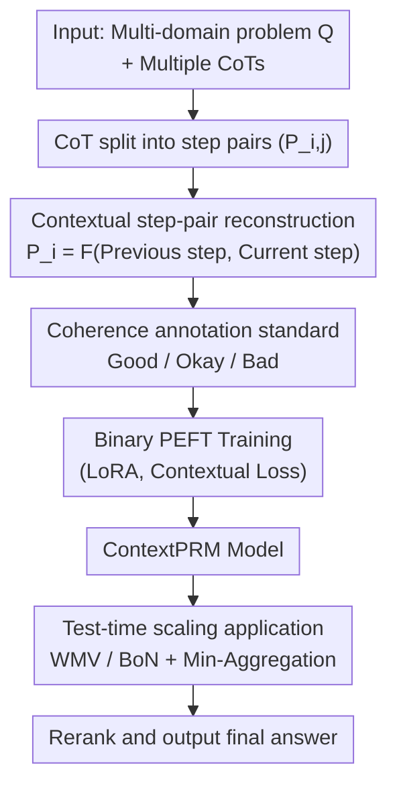

# ContextPRM: Leveraging Contextual Coherence for multi-domain Test-Time Scaling

**Conference**: ICLR2026  
**OpenReview**: [https://openreview.net/forum?id=9H0gBsNjCv](https://openreview.net/forum?id=9H0gBsNjCv)  
**Code**: https://github.com/shintaro329/ContextPRM  
**Area**: LLM Inference  
**Keywords**: Process Reward Model, Test-Time Scaling, Contextual Coherence, Cross-domain Generalization, CoT Annotation

## TL;DR
ContextPRM shifts the learning objective of Process Reward Models (PRMs) from "verifying whether a step is factually correct" to "evaluating whether the logical transition between adjacent reasoning steps is coherent." By proposing a coherence annotation standard and a context-aware training method, it enables a PRM trained only on mathematical data to generalize to non-mathematical domains such as law, history, and philosophy. It achieves a 6.5% average accuracy gain over the Majority Voting baseline on non-mathematical domains of MMLU-Pro, significantly surpassing the 2.2% gain of the previous SOTA, VersaPRM.

## Background & Motivation
**Background**: Test-time scaling (TTS) is a mainstream approach to enhancing LLM reasoning capabilities. It involves sampling $N$ Chains of Thought (CoT) for a single problem and using a verifier to score and rerank them to select the best answer. Process Reward Models (PRMs) represent the most powerful category of such verifiers: instead of only checking the final answer (as in Outcome Reward Model), they provide a scalar reward for **every step** in the CoT, offering finer-grained guidance signals.

**Limitations of Prior Work**: Most PRM research and data are concentrated in the mathematical domain. When mathematical PRMs are applied directly to non-mathematical tasks like law, history, or philosophy, performance degrades severely. VersaPRM was the first to systematically identify this issue and proposed a method for automatically generating multi-domain training data, slightly improving performance in non-mathematical areas—though the gain remained limited (only 2.2% over Majority Voting).

**Key Challenge**: Traditional PRMs model "step evaluation" as a **binary classification** task. Given problem $Q$ and the cumulative prefix up to step $i$, $T_i = Q \oplus S_1 \oplus \cdots \oplus S_i$, the model predicts whether step $i$ is correct (1) or incorrect (0). This "cumulative prefix + isolated correctness" paradigm has two fatal flaws: first, as reasoning length increases, the accumulating context makes it harder for the model to locate the **true root cause of a failure in the current step**; second, it learns "factual correctness," which inherently relies on **domain knowledge**. Since knowledge varies across disciplines, cross-domain transfer is difficult.

**Goal**: To find a **domain-agnostic** supervision signal that allows PRM capabilities to transfer across disciplines, unifying heterogeneous reasoning styles from symbol-heavy formal derivation in sciences to nuanced argumentation in humanities.

**Key Insight**: The authors observe that "good reasoning" shares an underlying structure across all domains: **whether the logical transition between steps is coherent**. Even if a step is isolatedly correct, it is harmful to the overall CoT if it is based on a misinterpretation of the previous step or introduces irrelevant, off-topic information. This "contextual coherence" is **domain-agnostic** and suitable as a learning objective for cross-domain generalization.

**Core Idea**: Replace the learning objective of "verifying isolated correctness" with "modeling contextual coherence between adjacent steps," implemented through a matching coherence annotation standard and context-aware training.

## Method

### Overall Architecture
The goal of ContextPRM is to train a PRM that evaluates "logical transitions" rather than "isolated correctness." The pipeline is as follows: given a multi-domain problem $Q$ and its multiple CoTs, each CoT is first decomposed into a sequence of **step pairs** $P_{i,j}$. Each step pair is labeled as coherent/incoherent using a newly proposed coherence standard (spanning four dimensions: correctness / understanding / logic / relevance). In the context-aware training phase, each annotated step pair is concatenated with the original problem $Q$ to form a binary classification training sample, which is fine-tuned using LoRA for Parameter-Efficient Fine-Tuning (PEFT). During inference, the model serves as a verifier integrated into TTS methods like WMV or BoN to rerank candidate answers.

The three core design points are: **how to reconstruct a step into a "contextual step-pair"** (replacing the cumulative prefix paradigm), **how to annotate these step pairs** to align with the new objective (coherence standard), and **how to apply the trained model in TTS**. Notably, the authors **did not generate new data** but reused VersaPRM’s training data, re-labeling it according to the new standard—ensuring a fair comparison where gains stem from the "training paradigm + annotation standard" rather than data volume.

### Key Designs

**1. Contextual Step-pair Reconstruction: Replacing "Cumulative Prefix" with the minimal coherence unit of "Previous Step + Current Step"**

Traditional PRM input is $T_i = Q \oplus S_1 \oplus \cdots \oplus S_i$—the entire cumulative prefix. The model outputs the correct/incorrect logit at the final step's token position, and the loss is calculated only at that position:
$$\mathcal{L}_{\text{PRM}}(\theta) = \sum_{i=1}^{k} \text{CrossEntropy}\big(o_{i,p_i}^{\{t_-,t_+\}},\, l_i\big)$$
The issue lies in "accumulation": as the context grows longer, it becomes harder for the model to distinguish whether the failure of the current step is a "standalone factual error" or a "contextual error built upon prior fallacies." ContextPRM constructs a **contextualized representation** $P_i = F(\tilde{S}_i, S_i)$ for each step $S_i$, where $\tilde{S}_i = Q$ (if $i=1$) or $\tilde{S}_i = S_{i-1}$ (if $i>1$). In other words, the "context" provided to the model only retains the **immediately preceding step**, with special tokens explicitly marking the boundaries between the context and the current step. A $k$-step CoT is thus split into $k$ independent training samples. The input is $\tilde{T}_i = Q \oplus P_i$, the supervision signal is the coherence label $c_i \in \{0,1\}$ (where 1 represents a coherent transition), and the loss is:
$$\mathcal{L}_{\text{ContextPRM}}(\theta) = \sum_{i=1}^{k} \text{CrossEntropy}\big(\tilde{o}_{i,\tilde{p}_i}^{\{t_-,t_+\}},\, c_i\big)$$
This modification forces the model to **stop fixating on isolated step correctness and focus instead on the logical validity of the transition between adjacent steps**. Using the previous step as the minimal context unit isolates "logical transition"—a domain-agnostic feature—making it the source of cross-domain generalization.

**2. Coherence Labeling Standard: Aligning labels with "Logical Transition" rather than reusing old correctness labels**

The authors emphasize that when the training paradigm changes, the supervision signal must follow; otherwise, a misalignment occurs where the model attempts to learn coherence while being supervised by correctness. They propose a three-level annotation standard (inspired by the 3-level annotation in Lightman et al.) to judge each step pair: **Good** (correct, verifiable, contextually appropriate, and contributing substantially to the solution), **Okay** (correct and verifiable but redundant or offering minimal progress), and **Bad** (exhibiting any of the following: Incorrect factual/calculation error, Misinterpretation of premises or goals, Logical Fallacy such as non-causal jumps or contradictions, or Misdirection via irrelevant information). Annotation proceeds sequentially along the CoT; **once the first "Bad" is hit, all subsequent step pairs are automatically labeled as incoherent**—this prevents the model from learning from steps built upon fallacious premises.

The value of this standard is quantified by re-labeling with GPT-4o-mini (see Table 1): in CoTs originally judged "entirely correct," the new standard identified errors in 24.67% of samples (a stricter logical consistency threshold). In CoTs that already contained errors, the first error was localized **earlier** in 57.04% of cases. The overall modification rate (Earlier Wrong ratio) reached 42.82%. Notably, ablation studies show that using this annotation **alone yields almost no gain** (only 0.84% higher than VersaPRM in non-math domains)—evidence that the standard's role is to "correct logical inconsistency" rather than inflate scores through label quality; true gains come from its **synergy** with the contextual training method.

**3. Test-time Scaling Application: Integrating Contextual PRM as a verifier into WMV / BoN Reranking**

The trained ContextPRM acts as a step-level scorer during inference for reranking-based TTS. For a problem, $N$ independent CoTs are sampled, and the PRM scores each step of each CoT. An **aggregation function** (min / mean / max) compresses these into a single score for the CoT; this paper consistently uses **Min-Aggregation** (taking the lowest step score, following the intuition that "a chain is only as strong as its weakest link"). Based on this: **Best-of-N (BoN)** selects the answer from the CoT with the highest aggregated score; **Weighted Majority Voting (WMV)** weights the answer votes of each CoT by their scores, combining "frequency" and "quality" signals. Majority Voting (MV) serves as a general baseline that does not rely on a PRM. The "coherence scores" provided by ContextPRM are better at distinguishing steps that seem correct in isolation but are logically unsound within the context, providing cleaner reranking signals and significantly boosting gains in non-mathematical domains.

### Loss & Training
The base configuration follows VersaPRM: starting from Llama-PRM800K (fully fine-tuned from Llama-3.1-8B-Instruct on PRM800K data), LoRA is applied to all linear layers ($r=16, \alpha=32$). Training lasts for 3 epochs with a learning rate of 1e-4 and a total batch size of 32. The loss follows the contextual cross-entropy in Equation (2). Training data **only updates labels without changing content**, using the same data as VersaPRM to ensure fair comparison. Hardware used: 8×RTX 5090.

## Key Experimental Results

### Main Results
Evaluation uses the MMLU-Pro-CoT-Eval (Unlabeled) test set released by VersaPRM, containing 2,063 problems covering all MMLU-Pro domains, each with 128 candidate CoTs generated by Llama-3.1-8B-Instruct. The test set is categorized into math-adjacent (Chemistry, CS, Engineering, Physics) and non-math-adjacent (Biology, Health, Psychology, Business, Econ, Law, History, Philosophy, and others). Comparison targets include mathematical PRMs (Qwen2.5-Math-PRM, Math-Shepherd, RLHFlow-Deepseek), the multi-domain SOTA VersaPRM, and the base Llama-PRM800K.

| Sampling Method | Domain | Baseline | Ours gain relative to MV | Comparison |
| :--- | :--- | :--- | :--- | :--- |
| WMV | Average (All) | Majority Voting | **+5.4%** | SOTA |
| WMV | Non-math-adjacent | Majority Voting | **+6.5%** | VersaPRM only +2.2% |
| BoN | Non-math-adjacent | Majority Voting | **+6.3%** | — |

In non-mathematical domains, ContextPRM increases the relative gain over Majority Voting from VersaPRM’s 2.2% (and other math PRMs' approx. 0.5%) to 6.5%. Simultaneously, it maintains competitive performance in math domains and remains SOTA in the "All" combined category.

### Ablation Study
Contextual training and Contextual labeling components were evaluated separately (Non-math-adjacent domain, relative to VersaPRM):

| Configuration | Context-train | Context-label | Non-math domain gain | Note |
| :--- | :---: | :---: | :---: | :--- |
| VersaPRM (Baseline) | ✗ | ✗ | — | Uses neither |
| Context-label Only | ✗ | ✓ | +0.84% | Label swap only, minimal gain |
| Context-train Only | ✓ | ✗ | +1.07% | Training swap only, small gain (Math +0.67%) |
| ContextPRM (Full) | ✓ | ✓ | **+4.3%** | Synergy between both, massive gain |

### Key Findings
- **Strong Synergy**: Each component used alone yields ~1%, but together they yield 4.3%, far exceeding linear superposition—demonstrating that the "contextual training paradigm" must be paired with "coherence labels" to be effective.
- **Acceptable Trade-off in Math**: The full ContextPRM drops by 2.2% in the math domain, which the authors deem a reasonable price for generalization; it still significantly outperforms the Llama-PRM800K base and maintains "All" domain SOTA.
- **Impressive Single-domain Generalization**: Fine-tuning on **single-domain** data (e.g., Law, Psychology, or Philosophy) still results in strong multi-domain performance; some single-domain models even outperform VersaPRM's full-data performance (2.7% avg. gain in non-math).
- **Logic Density and Gain**: Training on logic-intensive domains (Philosophy +3.4%, Psychology +3.6%, Health +2.9%) is more effective than on knowledge-intensive domains (History +1.2%, Physics +1.7%)—confirming the method leverages "logical structure" rather than "domain facts."
- **Error Type Analysis**: In a "Fixed Set" where VersaPRM failed but ContextPRM succeeded, ContextPRM primarily fixed logical errors (fallacies, misinterpretations), especially in humanities. Performance gain is strongly positively correlated with the domain's logical error ratio ($r = 0.80$), proving gains come from "enhanced contextual coherence" rather than "increased factual accuracy."

## Highlights & Insights
- **Redefining the objective is crucial**: Shifting from "verifying isolated correctness" to "modeling logical transition coherence" identifies the root cause of math PRM generalization failure: they learn domain knowledge, whereas coherence is domain-agnostic. This shift in perspective is more valuable than any engineering trick.
- **Clean experimental design "changing only labels, not data"**: Reusing the same data as VersaPRM and only re-labeling it attributes all gains to the "paradigm + annotation" rather than data scale, providing a very persuasive control.
- **Persuasive non-gains in ablation**: The authors specifically point out that "changing labels alone yields no gain" to prove the standard's purpose is correcting logic rather than inflating quality—this counter-intuitive honesty strengthens the argument.
- **Transferability**: The approach (using the previous step as minimal context + coherence labels) is transferable to any step-level evaluator requiring cross-domain generalization (e.g., agent trajectory evaluation, code reasoning verification). The core is stripping domain-agnostic structure away from domain-specific content.

## Limitations & Future Work
- **Acknowledged Trade-off**: The 2.2% drop in math domains is the price for generalization, which might not be worthwhile for pure math scenarios.
- **Minimal Context Window**: Using only the "previous step" as context might fail to capture long-range logical dependencies (e.g., a fallacy in step 3 only becoming apparent in step 8). Extending to variable-length context is a natural next step.
- **Labeling Dependency**: Coherence labels are generated by GPT-4o-mini, meaning quality is capped by that model's capabilities, and the "all steps after a Bad are wrong" rule might penalize independent, correct subsequent steps.
- **Single Base Model and Scale**: Experiments were only verified on Llama-PRM800K (8B); the scalability of the method to larger scales or different base models remains unknown.

## Related Work & Insights
- **vs VersaPRM**: VersaPRM contributed "automatic multi-domain data generation" but stuck to the traditional isolated correctness training paradigm, resulting in only 2.2% non-math gain. ContextPRM changes the training objective and annotation standard, pushing non-math gain to 6.5% using the same data. They are complementary—one solves "where data comes from," the other solves "what the objective should be."
- **vs Mathematical PRMs (Qwen2.5-Math-PRM / Math-Shepherd / RLHFlow-Deepseek)**: These are strong in math but show almost zero cross-domain transfer (+0.5% non-math) because they learn math-specific correctness patterns. ContextPRM learns domain-agnostic logical flow.
- **vs Generative/Corrective PRMs**: These usually involve generating intermediate reasoning or adding error type labels, which are often limited to knowledge-dense math domains and incur extra test-time generation costs. ContextPRM is discriminative, focuses on "inter-step transitions," incurs no extra generation overhead, and is explicitly multi-domain.

## Rating
- Novelty: ⭐⭐⭐⭐⭐ Redefining the PRM objective from "isolated correctness" to "contextual coherence" is a clear perspective shift that addresses cross-domain generalization.
- Experimental Thoroughness: ⭐⭐⭐⭐⭐ Main experiments + dual-component ablation + single-domain generalization heatmaps + error correlation analysis confirm gains come from logic, not knowledge.
- Writing Quality: ⭐⭐⭐⭐ The motivation and methodology chain is clear; some minor typos exist, and certain chart details require the Appendix.
- Value: ⭐⭐⭐⭐⭐ Sets a new SOTA for multi-domain test-time scaling; the "strip domain-agnostic structure" approach is valuable for broader step-level evaluators.

<!-- RELATED:START -->

## Related Papers

- [\[ICLR 2026\] Understanding the Role of Training Data in Test-Time Scaling](understanding_the_role_of_training_data_in_test-time_scaling.md)
- [\[ICLR 2026\] TUMIX: Multi-Agent Test-Time Scaling with Tool-Use Mixture](tumix_multi-agent_test-time_scaling_with_tool-use_mixture.md)
- [\[ICLR 2026\] ATTS: Asynchronous Test-Time Scaling via Conformal Prediction](atts_asynchronous_test-time_scaling_via_conformal_prediction.md)
- [\[ICLR 2026\] Optimal Aggregation of LLM and PRM Signals for Efficient Test-Time Scaling](optimal_aggregation_of_llm_and_prm_signals_for_efficient_test-time_scaling.md)
- [\[ICLR 2026\] Plan and Budget: Effective and Efficient Test-Time Scaling on Reasoning LLMs](plan_and_budget_effective_and_efficient_test-time_scaling_on_reasoning_large_lan.md)

<!-- RELATED:END -->
