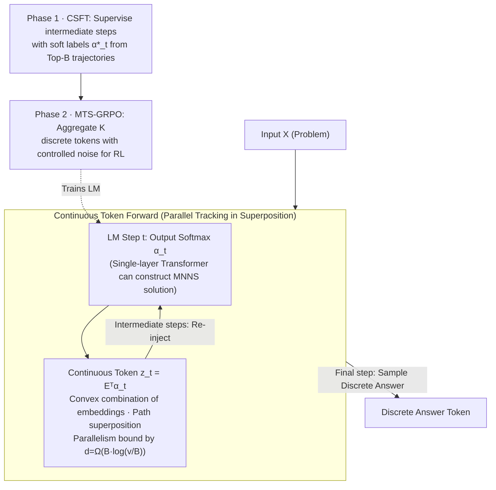

# Continuous Chain of Thought Enables Parallel Exploration and Reasoning

**Conference**: ICLR 2026  
**arXiv**: [2505.23648](https://arxiv.org/abs/2505.23648)  
**Code**: [https://github.com/alperengozeten/CoT2](https://github.com/alperengozeten/CoT2)  
**Area**: LLM Reasoning / Model Compression  
**Keywords**: Continuous Chain of Thought, Parallel Reasoning, Multi-trajectory Tracking, GRPO, Information Theory

## TL;DR
CoT2 proposes using continuous-valued tokens (convex combinations of vocabulary embeddings) instead of discrete tokens for chain-of-thought reasoning. This enables the model to track multiple reasoning paths in parallel within a single inference pass, which is theoretically equivalent to $K$-wise self-consistency or best-of-N sampling. Performance is further enhanced through GRPO reinforcement learning.

## Background & Motivation

**Background**: CoT reasoning in modern LLMs is achieved through autoregressive sampling of discrete tokens, combined with techniques like self-consistency (majority voting over multiple samples) or best-of-N decoding to improve accuracy.

**Limitations of Prior Work**:
   - Discrete sampling transmits at most $\log_2(v)$ bits of information per step, while each token embedding can store $O(d)$ bits—leading to severe underutilization of information.
   - Once a token is sampled, the model "commits" to a specific reasoning path, making it impossible to explore alternatives.
   - Self-consistency/best-of-N requires multiple forward passes, resulting in a linear increase in inference costs.

**Key Challenge**: The irreversibility of discrete sampling decisions causes errors to accumulate (the "snowball effect") in a single reasoning chain, while mitigation methods (repeated sampling) incur massive computational overhead.

**Goal**:
   - How can a model track multiple reasoning paths simultaneously in a single inference pass?
   - How powerful is the parallel tracking capability of continuous tokens? What is the theoretical relationship with multiple discrete samplings?
   - How should continuous token models be trained and deployed?

**Key Insight**: Instead of performing discrete sampling, the softmax output of the LM at each step is used directly as a continuous token (a weighted combination of all vocabulary embeddings) for the next step. This "superposition state" naturally encodes information from multiple paths.

**Core Idea**: Continuous tokens are convex combinations of vocabulary embeddings, naturally enabling parallel path tracking. Its effectiveness is theoretically equivalent to the aggregation of $K$ independent discrete CoTs—achieving the effect of $K$ samples in a single forward pass.

## Method

### Overall Architecture
CoT2 addresses the limitation where discrete CoT "can only take one path at a time." In standard models, sampling one token per step forces an early commitment to a branch in the reasoning tree. CoT2 avoids sampling altogether; it takes the probability distribution $\bm{\alpha}_t$ from the softmax output and multiplies it by the embedding matrix to obtain a continuous token $\bm{z}_t = \bm{E}^\top \bm{\alpha}_t$ for the next step. This continuous token is a convex combination of all embeddings, essentially folding multiple candidate paths into a single vector. Given input $\bm{X}$, the model generates $m$ tokens autoregressively. The first $m-1$ steps utilize these continuous tokens (re-injecting the current superposition to track paths in parallel), and only the final step samples a discrete answer token. The model's capability is supported by two theoretical results: a single-layer Transformer can solve problems in parallel using continuous tokens given sufficient dimensions, while the number of paths tracked is constrained by the embedding dimension upper bound. Training consists of two stages: Continuous Supervised Fine-Tuning (CSFT) to fit "multi-trajectory superposition" soft labels, followed by MTS-based GRPO reinforcement learning to prune irrelevant paths and improve accuracy.

### Key Designs

**1. Continuous Supervised Fine-Tuning (CSFT): Superposing trajectories as intermediate signals**

Discrete CoT supervision is one-hot—telling the model at each step that "this specific token is the correct answer," which forces it to learn only a single path. CSFT changes the objective: it first uses external search to find the $B$ best trajectories (Budget $B$), and then uses the empirical distribution of states across these $B$ trajectories at each step $t$ as soft labels, $\alpha_{t,g}^* = \frac{1}{B}\sum_{\pi \in \Pi_B} \mathbf{1}\{g_t(\pi)=g\}$. The final step remains one-hot (the correct answer), using cross-entropy/KL divergence to fit these soft labels. Here, $B$ acts as a continuous dial: when $B=1$, labels degrade to one-hot (discrete CoT); when $B=|\mathcal{T}|$, all possible trajectories are tracked. Thus, the Budget directly controls the trade-off between "simultaneous path tracking" and "model capacity."

**2. Budget–Embedding Dimension Trade-off**

Parallel tracking is not "the more the better"—to reliably decode $B$ superposed trajectories, the embedding must have sufficient dimensions to distinguish them. The paper provides an information-theoretic lower bound $d = \Omega(B\log(v/B))$, where $v$ is the vocabulary size. This explain two behaviors in experiments: when $d$ is large enough, increasing $B$ monotonically improves performance; when $d$ is insufficient, superposition interference occurs, creating a "sweet spot" for $B$. This explains why $B=8$ outperformed $B=16$ when $d=16$, whereas $B=16$ was optimal when $d=32$.

**3. Single-layer Transformer Construction (Proposition 1): Theoretical proof of parallel problem solving**

To demonstrate that the parallel capability is not just an empirical phenomenon, the paper constructively proves that a single-layer Transformer can solve the MNNS (Minimum Non-negative Sum) problem using CoT2. MNNS is essentially a subset sum variant: finding a minimum non-negative sum among $2^m$ combinations of $m$ numbers. Discrete CoT must choose one path. The construction uses trigonometric embeddings to encode $2^k$ intermediate states into non-overlapping $(\sin, \cos)$ representations. The attention layer expands states (adding/subtracting the next number in parallel), and the MLP layer filters them. The number of parallel states grows exponentially, and the final step selects the minimum non-negative sum without needing explicit expansion.

**4. Multi-Token Sampling (MTS) + GRPO: Injecting controlled noise for RL**

Post-CSFT, the base CoT2 is deterministic: for a given input, $\bm{\alpha}_t$ is unique. However, policy gradient methods like GRPO require a sampling distribution to calculate the policy ratio $r_t^{(i)}(\theta)$. MTS samples $K$ discrete tokens and averages them, $\bm{z}_t = \frac{1}{K}\sum_{r=1}^K \bm{e}_{i_r}$, providing an unbiased but noisy estimate of $\bm{\alpha}_t$—where larger $K$ reduces noise, approaching the deterministic continuous token. Proposition 3 proves that the MTS estimation error is equivalent to the aggregation of $K$ independent discrete CoTs. This implies that one forward pass with $K$-MTS has the sample complexity of $K$ discrete samples, providing a quantitative guarantee that "one forward pass $\approx$ $K$ self-consistency samples." With controlled noise, the GRPO clipped surrogate can be applied to fine-tune continuous reasoning.

### Loss & Training
- **CSFT Phase**: $\mathcal{L}_{CSFT} = \sum_{t=1}^m D(\bm{\alpha}_t^* \| \bm{\alpha}_t)$, using cross-entropy for soft labels in intermediate steps and standard CE for the final step.
- **GRPO Phase**: Standard GRPO clipped surrogate + KL regularization with sparse rewards (Success=1, Failure=0).
- Teacher forcing is used during CSFT, which outperformed self-feeding even though inference is autoregressive.

## Key Experimental Results

### Main Results (MNNS Task, 4-digit numbers 1-99)

| Method | d=16 acc | d=24 acc | d=32 acc |
|------|---------|---------|---------|
| No-CoT | ~15% | ~15% | ~15% |
| Discrete CoT (B=1) | ~55% | ~70% | ~75% |
| COCONUT | ~45% | ~60% | ~65% |
| **CoT2 (B=16)** | ~60% | **~95%** | **~98%** |

### Pass@k Comparison (d=24, MNNS)

| Method | Pass@1 | Pass@4 | Pass@8 | Pass@16 |
|------|--------|--------|--------|---------|
| Discrete CoT | ~70% | ~82% | ~88% | ~93% |
| **CoT2** | **~95%** | ~96% | ~97% | ~98% |

### Key Findings
- **CoT2 single inference $\approx$ Discrete CoT multi-sampling**: CoT2 Pass@1 matches the performance of Discrete CoT Pass@16.
- **Budget-Dimension sweet spot**: For $d=16$, $B=8$ is optimal; for $d=32$, $B=16$ is optimal.
- **GRPO is effective on CoT2**: RL fine-tuning teaches the model to prioritize relevant reasoning paths and reduces the entropy of continuous tokens.
- **CoT2 outperforms COCONUT**: Directly fitting multi-trajectory distributions with external search signals is more effective than hidden state substitution.
- **Theoretical alignment**: The lower bound $d=\Omega(B\log(v/B))$ is empirically validated.

## Highlights & Insights
- **Information Theoretic Insight**: Discrete tokens carry at most $\log_2 v$ bits per step, whereas continuous tokens can pack $B \cdot \log_2(v/B)$ bits—this argument elegantly explains why continuous tokens are more powerful.
- **Theoretical Guarantee for $1$ forward $\approx$ $K$ samples (Proposition 3)**: This is a powerful result that quantitatively links CoT2 to self-consistency, giving continuous tokens a clear practical interpretation.
- **Scaling RL to continuous action spaces for LLMs**: While traditional GRPO/PPO operates in discrete token spaces, CoT2's MTS strategy introduces controlled noise via "sample + average," making policy gradient methods applicable to continuous reasoning.

## Limitations & Future Work
- Only validated on synthetic tasks (MNNS, ProntoQA, ProsQA); lacks testing on real-world NLP tasks or large-scale LLMs.
- Assumption 1 (Markov property + linear superposition) might not hold strictly in real-world Transformers.
- Continuous tokens cannot be directly interpreted as natural language, sacrificing the interpretability of CoT.
- Orthogonality of the embedding matrix $\bm{E}$ affects superposition quality; in practice, embeddings might be highly correlated.
- Framework only outputs a discrete token at the final step; expansion is needed for multi-step discrete outputs (e.g., long-form answers).

## Related Work & Insights
- **vs COCONUT**: Both utilize continuous thought, but COCONUT relies on hidden states without explicit multi-trajectory supervision; CoT2 fits trajectory distributions via CSFT, achieving better results.
- **vs Self-Consistency**: Self-consistency requires $K$ samples and majority voting; CoT2 achieves equivalent results in one forward pass, improving efficiency by $K$ times.
- **vs Latent Reasoning (Coconut/Quiet-STaR)**: These focus on internalizing reasoning in latent space but lack the information-theoretic guarantees and explicit multi-path parallelism of CoT2.

## Rating
- Novelty: ⭐⭐⭐⭐⭐ Information-theory driven continuous reasoning + parallel tracking; solid theoretical contribution.
- Experimental Thoroughness: ⭐⭐⭐ Limited to synthetic tasks; lacks large-scale LLM validation.
- Writing Quality: ⭐⭐⭐⭐⭐ Clear theoretical derivation, intuitive explanations, and well-designed visuals.
- Value: ⭐⭐⭐⭐ Excellent contribution to the theoretical understanding of continuous reasoning, though practical utility requires further verification.

<!-- RELATED:START -->

## Related Papers

- [\[ICLR 2026\] Learning to Reason over Continuous Tokens with Reinforcement Learning (HyRea)](learning_to_reason_over_continuous_tokens_with_reinforcement_learning.md)
- [\[ICLR 2026\] Generalized Parallel Scaling with Interdependent Generations](generalized_parallel_scaling_with_interdependent_generations.md)
- [\[ICLR 2026\] Think in Parallel, Answer as One: Logit Averaging for Open-Ended Reasoning](think_in_parallel_answer_as_one_logit_averaging_for_open-ended_reasoning.md)
- [\[ICLR 2026\] e3: Learning to Explore Enables Extrapolation of Test-Time Compute for LLMs](e3_learning_to_explore_enables_extrapolation_of_test-time_compute_for_llms.md)
- [\[ICLR 2026\] Long Chain-of-Thought Reasoning Across Languages](long_chain-of-thought_reasoning_across_languages.md)

<!-- RELATED:END -->
