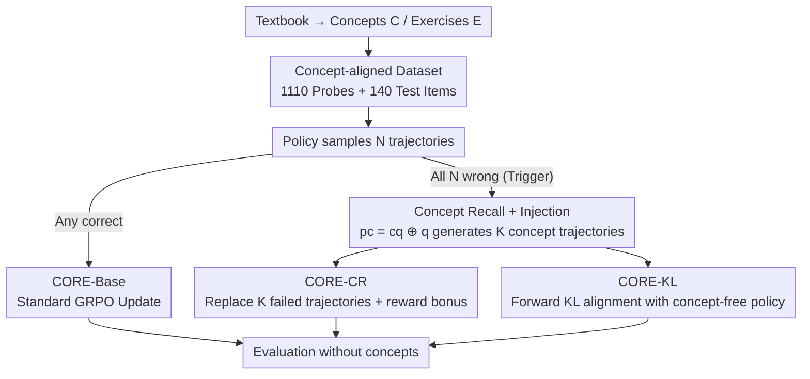

# CORE: Concept-Oriented Reinforcement for Bridging the Definition–Application Gap in Mathematical Reasoning

**Conference**: ICLR 2026  
**OpenReview**: [https://openreview.net/forum?id=pRSRiXdpkm](https://openreview.net/forum?id=pRSRiXdpkm)  
**Code**: https://github.com/ARC-ASU/CORE  
**Area**: LLM Reasoning  
**Keywords**: Concept Reasoning, Verifiable Reward RL, GRPO, Mathematical Reasoning, Definition-application Gap

## TL;DR
Addressing the issue where LLMs "can recite definitions but fail to apply concepts," CORE utilizes a clean linear algebra textbook to construct concept-aligned problems. During RL (GRPO) training, when a set of sampled trajectories are entirely incorrect, concept text is injected for correction. This is achieved either by directly replacing failed trajectories (CORE-CR) or by using forward KL to distill the "concept-guided" reasoning distribution into the "concept-free" policy (CORE-KL). Performance improves consistently during testing even without providing concepts.

## Background & Motivation
**Background**: The current mainstream training paradigm for mathematical reasoning LLMs is RLVR (Reinforcement Learning with Verifiable Rewards), utilizing policy gradient algorithms like GRPO to reinforce models based on "final answer correctness" as a verifiable reward. On benchmarks like GSM8K and MATH, models achieve high scores by imitating solution templates, concatenating routine algebraic steps, or even memorizing recurring patterns.

**Limitations of Prior Work**: High scores often mask fine-grained failures—models frequently **select the wrong concept** or **misapply it**. The paper illustrates this with a sanity probe: after GPT-4o fails a multiple-choice question, it can perfectly recite the "Rational Root Theorem" ($p \mid a_0, q \mid a_n$), yet it still reverses the divisibility relationship between numerator and denominator in the original problem. This is termed the **definition–application gap**: knowledge exists in the parameters but cannot be flexibly deployed during reasoning. Robustness experiments further show that when option orders are randomly shuffled 3 times, necessitating correctness across all 4 variants, the accuracy of OLMo-2-7B drops from 70%+ to below 50%, proving high scores rely on shallow heuristics rather than structural understanding.

**Key Challenge**: Two factors contribute to this gap. First, exercise-style corpora reward exploiting superficial patterns (format, keywords, step templates) rather than applying underlying concepts. Second, RLVR provides only a final outcome reward, which is **too coarse** to teach "which concept to invoke and how it supports intermediate steps." Concepts must be instantiated under specific goals to be verified, but final rewards are blind to this process.

**Goal**: To transform "explicit concepts" into controllable, fine-grained supervision signals within standard RL training, enabling models to truly learn concept selection and application even when **no concepts are provided at test time**.

**Key Insight**: The authors utilize a classic textbook, *Higher Algebra (3rd Ed.)*, which strictly organizes concept definitions (C), examples, and concept-aligned exercises (E) by chapter. Each chapter's exercises primarily test the concepts within that chapter, providing clear dependencies. By manually translating this Chinese textbook into English, the risk of data contamination common in English corpora is significantly reduced. This textbook serves as both an in-domain test set and a seed for generating training signals.

**Core Idea**: No changes are made to the model architecture or RL algorithm. Instead, a **conditional intervention during the sampling phase** is introduced: when a model fails completely on a problem (all rollouts in a group are wrong), the corresponding concept text is fed into the prompt for guidance. This "concept-guided reasoning" is then internalized into the policy via trajectory replacement or KL alignment.

## Method

### Overall Architecture
CORE is a framework wrapped around standard policy gradient RL (using GRPO in this paper). The pipeline consists of three stages: **Dataset Construction → Gap Diagnosis → Concept Reinforcement**. First, 236 concept texts, 703 examples, and 140 multiple-choice questions are extracted from the textbook. Qwen2.5-72B generates 5–8 multiple-choice questions per concept (1200 candidates), and GPT-4o is used as a cross-model evaluator to filter 90 low-quality items, resulting in 1110 high-quality "Concept Probes" for the training pool and 140 original textbook problems for in-domain testing (Textbook).

The core mechanism during training is **conditionally triggered concept intervention**: for each query, the policy $\pi_\theta$ samples a group of $N$ trajectories. If any trajectory in the group is correct, the default path **CORE-Base** (standard GRPO on concept problems) is followed. If all $N$ trajectories are **incorrect** (a conceptual failure event), the concept intervention sub-system is activated: Concept Recall retrieves the ground-truth concept text $c_q$ from the repository, and Concept Injection re-prompts the model with $p_c = c_q \oplus q$ to generate $K$ "concept-warmed" trajectories ($1 \le K < N$). These guided trajectories are used in two ways: **CORE-CR** replaces $K$ failed trajectories in the original group and adds a reward bonus; **CORE-KL** does not replace them but uses forward KL to align the concept-guided distribution with the concept-free distribution. Concepts are never provided during testing.

### Key Designs

**1. Concept-aligned Dataset and Quantitative Diagnosis of the Definition–Application Gap**

To train for correct concept application, verifiable data that distinguishes "solving a problem" from "understanding a concept" is required. CORE uses a strictly structured textbook with clear concept-exercise mappings and manual translation to avoid contamination. High-quality probes (1110 items) are generated using a cross-model pipeline (Qwen2.5-72B as harvester, GPT-4o as evaluator) to reduce harvester bias. The diagnosis hinges on a **robust evaluation protocol**: for each multiple-choice question, option orders are randomly permuted 3 times. A "robust solve" requires the original and all 3 variants to be **entirely correct**. This protocol exposes pseudo-capabilities where models achieve high scores via standard protocols (70%+) but plummet under robust protocols (below 50%).

**2. CORE-CR: Concept-guided Trajectory Replacement**

This design targets the "all wrong" scenario where a coarse final reward provides no positive signal. When all $N$ rollouts fail, it indicates a total lack of conceptual support. CORE-CR constructs a concept-guided prompt $p_c = c_q \oplus q$, samples $K$ new trajectories from the guided policy, and **randomly replaces** $K$ failed trajectories. These new trajectories are given an augmented reward:

$$R'(\tau_{c,j}) = R(\tau_{c,j}) + r_{\text{bonus}}$$

where $r_{\text{bonus}} > 0$ is a hyperparameter. GRPO updates are then performed on this "partially replaced, concept-guided" batch. The ingenuity lies in intervening only upon total failure, transforming an otherwise uninformative "failed group" into a learnable signal with conceptual support—effectively **self-generating** correct demonstrations when correction is most needed. The paper notes CORE-CR's similarity to the BREAD method, though BREAD relies on external teacher models, whereas CORE-CR's trajectories are self-generated under concept prompting.

**3. CORE-KL: Forward KL Distillation of Concept-guided Reasoning**

While CORE-CR performs explicit replacement at the trajectory/reward level, CORE-KL provides a fine-grained implicit constraint at the loss function level. Upon failure trigger, a high-quality reference trajectory $Y^* \sim \pi_\theta(\cdot \mid p_c)$ is sampled. At each time step $t$ given prefix $y^*_{<t}$, the forward KL between the "concept-guided" and "concept-free" next-token distributions is minimized as an auxiliary term to the GRPO objective:

$$L_{\text{total}} = L_{\text{GRPO}} + \lambda_{\text{KL}} \mathbb{E}_{Y^* \sim \pi_\theta(\cdot \mid p_c)}\left[\sum_{t=1}^{|Y^*|} D_{\text{KL}}\big(\pi_\theta(\cdot \mid p_c, y^*_{<t}) \,\|\, \pi_\theta(\cdot \mid q, y^*_{<t})\big)\right]$$

Choosing **forward** KL is intentional: it encourages the base policy to cover the entire distribution of reasoning paths considered by the guided "teacher" rather than collapsing to a single mode. This forces the internal reasoning for query $q$ to faithfully emulate the process as if concept $c_q$ were explicitly provided. CR and KL are complementary: CR corrects unmastered concepts via explicit trajectories, while KL performs implicit distribution alignment.

## Key Experimental Results

### Main Results
The primary model is Qwen2-Math-7B, reported with SC@21 (T=0.7). Comparisons across in-domain (Textbook) and out-of-domain benchmarks:

| Benchmark | Vanilla | SFT | CORE-Base | CORE-CR | CORE-KL |
|------|---------|-----|-----------|---------|---------|
| Textbook (TB) | 46.4 | 45.0 | 50.7 | 52.1 | **55.7** |
| GSM8K | 89.8 | 86.6 | **90.8** | 91.1 | 90.7 |
| TabMWP | 90.2 | 85.6 | 92.6 | **93.6** | 90.6 |
| MATH | 69.1 | 59.4 | **71.1** | 71.4 | 70.5 |
| Gaokao 2023 | 55.3 | 46.5 | 59.5 | 58.4 | **59.5** |
| TheoremQA | 34.6 | 44.2 | 40.4 | 42.3 | **44.2** |
| OlympiadBench | 28.7 | 19.7 | 33.9 | **34.5** | 32.9 |

In-domain Textbook saw a gain of up to +9.3% (46.4→55.7, CORE-KL), and TheoremQA gained +9.6% (34.6→44.2). Notably, **SFT decreased performance on most benchmarks** (e.g., MATH 69.1→59.4, OlympiadBench 28.7→19.7), suggesting supervised fine-tuning on concept problems harms generalization, whereas CORE's RL-based injection yields stable gains.

### Key Findings
- **CORE-KL is most effective for concept-dense in-domain tasks** (Textbook 55.7, TheoremQA 44.2) as it aligns the entire reasoning process at the distribution level. CORE-CR is more robust for tasks requiring general reasoning (highest on TabMWP, OlympiadBench).
- **Robustness Improvement**: When $K \in \{1,2,3\}$ irrelevant distractors are prepended, CORE (especially CORE-CR) exhibits a slower performance decay compared to Vanilla/CORE-Base, as measured by RUDK (Retention Under Distractors).
- **Not Just Knowledge Distillation**: Self-supervised experiments using Qwen2-Math-7B-Instruct as a generator for Qwen2-Math-7B as a learner (§5.4) show that concept trajectories generated by the model itself still improve performance, proving gains come from internal concept reinforcement rather than "stealing" signals from larger models.

## Highlights & Insights
- **"Trigger on total failure" is a low-cost, precise intervention**: Recalling concepts only when all rollouts fail focuses training compute on samples where the model lacks conceptual support. This avoids the overhead of injecting concepts into every problem and prevents interference in already-solved items.
- **Forward KL choice is deliberate**: Using forward instead of reverse KL ensures the base policy covers the full reasoning distribution of the guided teacher, preventing mode collapse. This is a strategic way to write "process alignment" rather than "answer alignment" into the loss.
- **Robust Evaluation Protocol** (correctness over all permutations) is a lightweight yet powerful diagnostic tool to unmask pseudo-capabilities in multiple-choice formats derived from position or heuristic biases.
- **Low-contamination data via translated classics**: Utilizing a strictly organized textbook with clean mapping and manual translation is a practical recipe for constructing verifiable concept signals.

## Limitations & Future Work
- **Small absolute gains**: Outside of in-domain Textbook (+9.3%) and TheoremQA (+9.6%), many out-of-domain improvements are within 1%. Average gains across three cross-model experiments are +0.3~+0.8%, indicating limited transfer to general mathematical reasoning.
- **Microscopic mechanism diagnosis**: The core conclusion regarding concept selection vs. heuristics is based on a tiny subset ($|W|=19$) and manual annotation, limiting statistical power.
- **Narrow domain**: The concept library is derived from a single linear algebra textbook. Generalization to fields without clean mappings (e.g., proofs, combinatorics) remains unverified.
- **Hyperparameter sensitivity**: $r_{\text{bonus}}$, $\lambda_{\text{KL}}$, and the number of replaced trajectories $K$ are new hyperparameters. The sparsity of the "total failure" trigger also means intervention frequency depends on the initial model quality.

## Related Work & Insights
- **vs. Standard RLVR / GRPO**: Standard methods use only final rewards, leaving concept selection "untaught." CORE injects concept text as conditionally triggered fine-grained supervision without altering the core algorithm.
- **vs. BREAD**: While structurally similar, CORE-CR trajectories are self-generated under concept prompts rather than distilled from a stronger teacher, emphasizing conceptual autonomy.
- **vs. SFT Concept Tuning**: SFT on concept problems harms generalization in these experiments; CORE's RL approach improves performance while maintaining generalization.
- **vs. Concept Benchmarks (THEOREMQA, COUNTERMATH)**: While prior work focuses on "diagnosis," CORE converts diagnostic ideas (probes, robust evaluation) into "signals" that can be injected into training.

## Rating
- Novelty: ⭐⭐⭐⭐ Quantifying the "definition-application gap" and unifying conditional concept injection (CR/KL) into RLVR is clear and algorithm-agnostic.
- Experimental Thoroughness: ⭐⭐⭐⭐ Includes 4 model families and over ten benchmarks with robustness/distillation analysis, though absolute gains are small and mechanism samples are few.
- Writing Quality: ⭐⭐⭐⭐ The motivation is vivid; the three variants are clearly positioned.
- Value: ⭐⭐⭐⭐ Provides a low-cost, structurally non-invasive recipe for injecting concept signals into RL, with direct relevance to research on conceptual reasoning and verifiable rewards.

<!-- RELATED:START -->

## Related Papers

- [\[ICLR 2026\] NFT: Bridging Supervised Learning and Reinforcement Learning in Math Reasoning](nft_bridging_supervised_learning_and_reinforcement_learning_in_math_reasoning.md)
- [\[ICLR 2026\] Generative Adversarial Reasoner: Enhancing LLM Reasoning with Adversarial Reinforcement Learning](generative_adversarial_reasoner_enhancing_llm_reasoning_with_adversarial_reinfor.md)
- [\[ICLR 2026\] Hybrid Reinforcement: When Reward Is Sparse, Better to Be Dense](hybrid_reinforcement_when_reward_is_sparse_better_to_be_dense.md)
- [\[ICLR 2026\] Temperature as a Meta-Policy: Adaptive Temperature in LLM Reinforcement Learning](temperature_as_a_meta-policy_adaptive_temperature_in_llm_reinforcement_learning.md)
- [\[NeurIPS 2025\] Mind the Gap: Bridging Thought Leap for Improved Chain-of-Thought Tuning](../../NeurIPS2025/llm_reasoning/mind_the_gap_bridging_thought_leap_for_improved_chain-of-thought_tuning.md)

<!-- RELATED:END -->
