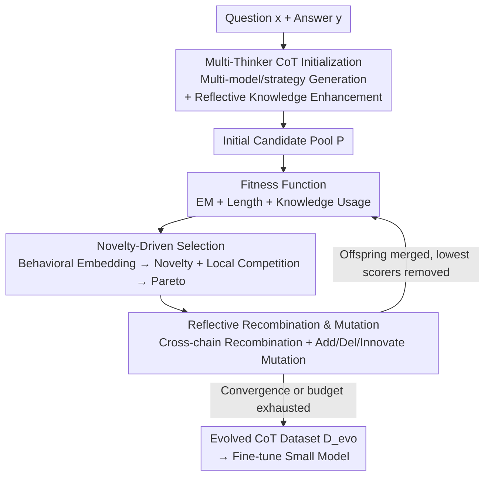

# CoT-Evo: Evolutionary Distillation of Chain-of-Thought for Scientific Reasoning

**Conference**: ICLR2026  
**OpenReview**: [https://openreview.net/forum?id=OMf3w00d95](https://openreview.net/forum?id=OMf3w00d95)  
**Code**: https://github.com/weiji-Feng/MAD-Eval  
**Area**: LLM Reasoning  
**Keywords**: Chain-of-Thought Distillation, Scientific Reasoning, Evolutionary Algorithms, Novelty Search, Data Synthesis

## TL;DR
CoT-Evo reformulates "multi-teacher Chain-of-Thought (CoT) distillation" into a genetic algorithm. It first generates a pool of reasoning trajectories using multiple LLM thinkers and retrieved knowledge, then scores them via a fitness function based on correctness, length appropriateness, and knowledge utilization. Selecting parents through novelty-driven search ensures diversity and quality, followed by reflective recombination and mutation to fuse them into a high-quality chain. Fine-tuning 7-8B models with the evolved dataset achieves SOTA performance on biology and chemistry reasoning benchmarks.

## Background & Motivation
**Background**: Distilling long CoT from strong reasoning models (e.g., DeepSeek-R1, OpenAI-o1/o3) into smaller models has become a standard approach for enhancing reasoning under compute constraints. Existing optimizations follow two paths: single-teacher refinement (compressing tokens, pruning errors) or multi-teacher aggregation (collecting multiple paths and selecting the most suitable one).

**Limitations of Prior Work**: In scientific domains, even powerful LLMs often generate erroneous or superficial reasoning for complex, knowledge-intensive tasks like molecular design or experimental protocols. Distilling such flawed outputs results in low-quality training data. Existing optimization paths are insufficient: single-teacher methods introduce bias and cannot guarantee correct knowledge usage by solely pruning redundancy; multi-teacher methods increase diversity but are limited to **inter-chain selection**—choosing one intact chain per sample—without fine-grained logic repair.

**Key Challenge**: Current methods essentially perform "inter-chain selection." However, in scientific reasoning, a single chain is often partially correct and partially flawed; no single chain is perfect. The actual requirement is to merge correct segments and knowledge from multiple chains into a single optimal one, which is "intra-chain aggregation"—a capability missing in existing frameworks.

**Goal**: Synthesize high-fidelity CoT datasets that are accurate, compact, and scientifically sound from a set of diverse but fallible LLM teachers.

**Key Insight**: The authors analogize CoT distillation to evolutionary optimization. A pool of candidate trajectories constitutes a population, evaluated by a fitness function, and iteratively approaches the optimum through selection, recombination, and mutation. Genetic algorithms are naturally suited for "merging the strengths of different individuals," addressing the need for "intra-chain aggregation."

**Core Idea**: Introducing **CoT-Evo**, the first evolutionary CoT distillation framework for intra-chain multi-trajectory aggregation. It uses an "evaluation → selection → mutation → update" evolutionary cycle to fuse reasoning snippets from multiple thinkers into a single high-quality chain.

## Method

### Overall Architecture
CoT-Evo takes a raw dataset without CoT, $D_{ori}=\{(x_i,y_i)\}_{i=1}^N$, and aims to produce a high-fidelity, compact CoT $t_i^\star$ for each question $x_i$. Following the genetic algorithm structure, it consists of four core modules in an iterative loop:

1.  **Multi-Thinker Initialization**: Creates a diverse and potential-rich candidate pool $P=\{t_1,\dots,t_n\}$.
2.  **Fitness Function**: Assigns a comprehensive score (correctness + length + knowledge usage).
3.  **Novelty-Driven Selection**: Avoids greedy selection by picking parents based on "diversity + local superiority."
4.  **Reflective Recombination & Mutation**: Fuses and rewrites parents into superior offspring.

Offspring are merged back into the population, and individuals with the lowest scores are eliminated to maintain a population size $n_{pop}$. This continues until convergence or the budget $B$ is exhausted. Finally, $t_i^\star=\arg\max_{t\in P_{x_i}}R(t)$ forms the evolved dataset $D_{evo}$.

### Key Designs

**1. Multi-Thinker CoT Initialization: Expanding the Pool via Heterogeneous Teachers and Automated Knowledge Retrieval**
Success depends on initial population diversity. Phase one, **CoT Generation**, utilizes a set of thinkers $L=\{l_1,\dots,l_m\}$ including different families/scales (DeepSeek-R1, Qwen3-235B) and different prompting strategies (CoT, ToT, Reverse Reasoning) to generate $P_G$. Phase two, **Knowledge Enhancement**, uses a proprietary model $\Theta$ to reflect on each QA pair to extract general knowledge $K_x$; this $K_x$ is fed into thinkers as extra context to generate $P_K$. The initial pool $P=P_G\cup P_K$ maximizes cognitive difficulty and strategy diversity.

**2. Fitness Function: Quantifying Scientific Reasoning Quality**
The fitness score is a weighted sum: $R(t)=s_{EM}+\lambda_1 s_{LEN}+\lambda_2 s_{KNOW}$. **Exact Match** $s_{EM}\in\{0,1\}$ validates the final answer against the ground truth. **Length Appropriateness** $s_{LEN}$ uses the 15%/85% quantiles of scientific dataset token lengths as bounds: too short scores 0.0, too long scores 0.5, and the golden range scores 1.0. **Knowledge Usage Correctness** $s_{KNOW}$ employs LLM-as-a-Judge to rate the accuracy of knowledge internal to the chain on a 1-5 scale. With $\lambda_1=0.3, \lambda_2=0.1$, the focus remains on correctness while encouraging conciseness and valid knowledge usage.

**3. Novelty-Driven Selection: Pareto Optimization for "Distinctiveness" and "Local Superiority"**
To avoid premature convergence, CoT-Evo adopts NSLC (Novelty Search with Local Competition). Chains are mapped into a $d$-dimensional behavior space $z_t=b(t)$ via embedding models. **Novelty** $N(t)$ measures the average distance to $k$-nearest neighbors. **Local Competition** $L(t)$ measures the fitness advantage over these neighbors. Selection targets the Pareto frontier of $(N(t), L(t))$, sampling parents with probability biased towards $L(t)$. This maintains stylistic diversity while pushing for quality.

**4. Reflective Recombination & Mutation: From "Inter-Chain Selection" to "Intra-chain Aggregation"**
**Recombination** triggers when a target chain $t_o$ is incorrect, performing an asymmetric crossover with a provider chain $t_p$. It identifies a binding point $B$ in $t_o$, extracts unique knowledge/steps $I$ from $t_p$, and generates a new chain $t'$ conditioned on $t_o[:B]$ and $I$. **Mutation** modifies $t_o$ through three types: **Add** (adding logical details), **Delete** (pruning redundancy), and **Innovate** (diagnosing errors using the ground truth and rewriting). Ablations show mutation is primary for error correction, while recombination enhances knowledge utilization.

### Loss & Training
The evolved dataset $D_{evo}=\{(x_i,t_i^\star,y_i)\}$ is distilled into Qwen3-8B, Qwen2.5-7B-Instruct, and Llama3.1-8B-Instruct via standard SFT. Hyperparameters include $n_{pop}=6$, budget $B=5$, and $k=2$ for novelty search. Synthesis uses varied thinkers and GPT-5-mini for knowledge reflection.

## Key Experimental Results

### Main Results
Evaluated on BioProBench and ChemCoTBench against single-teacher (ST), multi-teacher (MT), and Best-of-K (BoK) baselines. Qwen3-8B student performance:

| Student (Qwen3-8B) Method | BioProBench PQA Acc↑ | BioProBench ORD EM↑ | ChemCoT Edit Acc↑ | ChemCoT Reaction FTS↑ |
|:---|:---:|:---:|:---:|:---:|
| Base (Qwen3-8B-think) | 0.602 | 0.371 | 0.612 | 0.352 |
| + Single Teacher | 0.601 | 0.368 | 0.583 | 0.599 |
| + Multi Teacher | 0.603 | 0.434 | 0.647 | 0.424 |
| + Best-of-K | 0.603 | 0.369 | 0.651 | 0.516 |
| **+ Ours (CoT-Evo)** | **0.649** | **0.544** | **0.674** | **0.629** |

CoT-Evo improves by 12.6% over ST and 8.4% over MT on BioProBench, and surpasses strong baselines like Retro-Search and TwT.

### Experimental Thoroughness
GPT-5 evaluation of data quality:

| Method | BioPro Pass↑ | BioPro Quality↑ | BioPro WR↑ | Chem Pass↑ | Chem Quality↑ |
|:---|:---:|:---:|:---:|:---:|:---:|
| MT | 0.536 | 6.776 | 0.374 | 0.524 | 5.935 |
| BoK | 0.498 | 6.763 | 0.353 | 0.389 | 5.571 |
| **Ours (CoT-Evo)** | **0.729** | **8.230** | — | **0.704** | **7.847** |

CoT-Evo maintains >70% usable data with significantly higher quality scores.

### Ablation Study

| Config | Qwen3-8B | Qwen2.5-7B | Llama3.1-8B |
|:---|:---:|:---:|:---:|
| Ours (Full) | 0.612 | 0.579 | 0.572 |
| w/o Recombination | 0.591 | 0.564 | 0.553 |
| w/o Mutation | 0.568 | 0.548 | 0.534 |

### Key Findings
- **Mutation is more critical than recombination**: Removing mutation (error correction/reduction) resulted in larger performance drops as the evolution failed to converge on correct trajectories.
- **Novelty Selection > Greedy/Random**: Novelty-driven selection converges faster and more stably than greedy or random methods.
- **Gain is not from sampling volume**: CoT-Evo significantly outperforms Best-of-K with the same sampling budget, proving it "evolves" higher quality rather than just picking from a larger random pool.

## Highlights & Insights
- **Evolution from "Selecting a Chain" to "Crafting a Chain"**: While existing multi-teacher methods are inter-chain selection, CoT-Evo performs intra-chain aggregation, merging correct segments into one—a fundamental paradigm shift.
- **NSLC Dual-Objective Selection**: Treating "distinctiveness" and "local superiority" as Pareto objectives prevents diversity collapse, which is more robust than greedy quality-based selection.
- **Reflective Knowledge Enhancement**: Extracting "answer-required knowledge" as a context-independent snippet is a low-cost, effective trick for correcting domain-specific errors.

## Limitations & Future Work
- **Dependency on Strong Teachers**: The pipeline relies heavily on external models like DeepSeek-R1 for initialization and GPT-5 for knowledge/evaluation, incurring significant costs.
- **Linear Scaling of Cost**: Evolutionary overhead grows with population size and generations, posing a bottleneck for million-scale data synthesis.
- **Domain Coverage**: Validated only in biology and chemistry; efficacy in domains like mathematical proofs or physics modeling remains to be seen.
- **Fixed Hyperparameters**: Fitness weights and length quantiles are empirically set and may require recalibration for different tasks.

## Related Work & Insights
- **Vs. Single-Teacher Refinement**: Unlike methods that prune single chains, CoT-Evo uses heterogeneous teachers to supplement missing knowledge via recombination.
- **Vs. Multi-Teacher Selection (TwT)**: While they select one chain among many, CoT-Evo aggregates multiple chains into one, achieving higher fidelity than any original single chain.
- **Vs. Search-based Methods (Retro-Search)**: Retro-Search explores via MCTS backtracks, but CoT-Evo uses genetic operators to actively synthesize new trajectories, outperforming simple expansion of sampling budgets.

## Rating
- Novelty: ⭐⭐⭐⭐⭐ (Formulating CoT distillation as a GA for intra-chain aggregation is a breakthrough).
- Experimental Thoroughness: ⭐⭐⭐⭐ (Extensive benchmarks and student models, though limited to two domains).
- Writing Quality: ⭐⭐⭐⭐ (Clear framework, well-defined modules and formulas).
- Value: ⭐⭐⭐⭐⭐ (Provides a scalable path for high-fidelity scientific data synthesis).

<!-- RELATED:START -->

## Related Papers

- [\[ICLR 2026\] Uni-CoT: Towards Unified Chain-of-Thought Reasoning Across Text and Vision](uni-cot_towards_unified_chain-of-thought_reasoning_across_text_and_vision.md)
- [\[ICLR 2026\] SIM-CoT: Supervised Implicit Chain-of-Thought](sim-cot_supervised_implicit_chain-of-thought.md)
- [\[ICLR 2026\] CoT-RVS: Zero-Shot Chain-of-Thought Reasoning Segmentation for Videos](cot-rvs_zero-shot_chain-of-thought_reasoning_segmentation_for_videos.md)
- [\[ICLR 2026\] SCI-Verifier: Scientific Verifier with Thinking](sci-verifier_scientific_verifier_with_thinking.md)
- [\[ICLR 2026\] KaVa: Latent Reasoning via Compressed KV-Cache Distillation](kava_latent_reasoning_via_compressed_kv-cache_distillation.md)

<!-- RELATED:END -->
