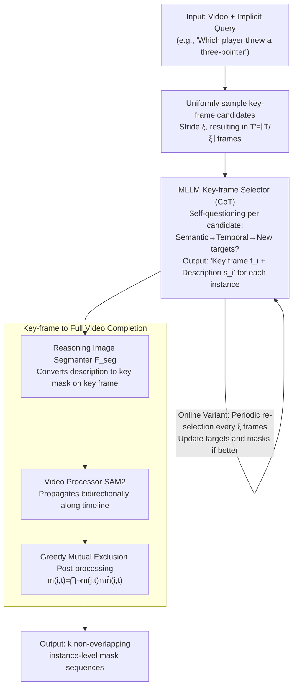

# CoT-RVS: Zero-Shot Chain-of-Thought Reasoning Segmentation for Videos

**Conference**: ICLR 2026  
**arXiv**: [2505.18561](https://arxiv.org/abs/2505.18561)  
**Code**: None  
**Area**: LLM Reasoning  
**Keywords**: Reasoning Video Segmentation, Chain-of-Thought, Zero-shot, Key-frame Selection, Multimodal Large Language Models

## TL;DR

Ours proposes CoT-RVS, a completely training-free multi-agent framework that leverages the zero-shot CoT reasoning capabilities of pre-trained MLLMs for temporal-semantic correlation analysis and key-frame selection. It significantly outperforms fine-tuning methods on reasoning video segmentation tasks (Refer-DAVIS J&F 79.1 vs 71.2, ReasonVOS J&F 65.5 vs 49.9).

## Background & Motivation

- **Background**: Reasoning Video Segmentation (Reasoning VOS) requires models to generate target mask sequences based on complex implicit text queries (e.g., "Which player threw a three-pointer"). This is one of the most challenging tasks in video understanding.
- **Limitations of Prior Work**: Existing methods (VISA/VideoLISA/HyperSeg) fine-tune MLLMs to generate segmentation tokens but perform poorly under time-sensitive queries. The core reason is that these methods lack inter-frame temporal reasoning—they focus on intra-frame semantic understanding but cannot effectively reason about "what happened during which time period."
- **Key Challenge**: While CoT reasoning segmentation in the image domain (Seg-Zero/ThinkFirst) has succeeded, the video domain requires additional temporal "thinking." Direct extension from image to video is unfeasible because target objects undergo occlusion, motion, or appear/disappear over time.
- **Key Insight**: Instead of fine-tuning, ours utilizes the zero-shot CoT capabilities of pre-trained MLLMs like GPT-4o or Gemma3. By designing task-specific prompts, the model is guided to perform temporal-semantic reasoning, aligning with the trend of test-time compute.
- **Core Idea**: MLLMs analysis key-frame candidates via CoT self-questioning. They establish correlations from both semantic (which objects match the query) and temporal (which frame's target is easiest to observe) dimensions, ultimately selecting the optimal key-frame for each instance.

## Method

### Overall Architecture

CoT-RVS is a multi-agent framework featuring three-module collaboration, decomposing the difficult task of "masking video based on implicit queries" into manageable steps. Given a video and a complex query, it first uniformly samples a set of key-frame candidates with a stride $\xi$. These are passed to the MLLM Key-frame Selector $\mathcal{F}_{key}$ for temporal-semantic reasoning to pick the best key-frame for each target instance and provide a text description. Then, the Reasoning Image Segmenter $\mathcal{F}_{seg}$ converts descriptions into key masks on the selected frames. Finally, the Video Processor $\mathcal{F}_{vid}$ (SAM2) propagates these masks across the timeline, followed by a greedy mutual exclusion post-processing to ensure masks of multiple instances do not overlap. All modules use pre-trained weights without fine-tuning; the critical "thinking" resides in the first CoT reasoning step. An online variant is also provided, which periodically re-evaluates instead of viewing the entire video, supporting real-time streams.

### Key Designs

**1. MLLM Key-frame Selector: Reasoning about "which frame to segment" via CoT**

This is the core innovation, addressing the issue where targets are occluded or moving. Blindly running segmentation on every frame is expensive and inaccurate. CoT-RVS samples $T' = \lfloor T/\xi \rfloor$ candidates and lets the MLLM synthesize a coarse-to-fine CoT sequence for each: generic semantic judgment ("what is in this frame"), temporal reasoning ("is it better than previous frames?"), and detail confirmation ("have new targets appeared?"). The output is a structured list: target instances, key-frame indices $f_i$, and text descriptions $s_i$ (e.g., "player in black jersey shooting the ball"). Designed for Reasoning VIS ($k\ge 1$ instances), it supports both closed-source (GPT-4o) and open-source (Gemma3-12B, LLaVA1.5-7B) models via CoT prompts.

**2. From Key-frame to Full Video: Mask completion via Segment-Track-Exclude**

After obtaining $f_i$ and $s_i$, the information is expanded to cover the entire video using off-the-shelf modules. $\mathcal{F}_{seg}$ (e.g., Seg-Zero) performs image-level segmentation on the key-frame using $s_i$ to generate a key mask $\tilde{m}_i$. This decouples difficult temporal judgment from intra-frame segmentation. The key mask is then passed to $\mathcal{F}_{vid}$ (SAM2) as a prompt for propagation, yielding preliminary sequences $\hat{m}_{i,t}$. To prevent overlaps between multiple instances, greedy mutual exclusion is applied:

$$m_{i,t} = \bigcap_{j=1}^{i-1} \neg m_{j,t} \cap \hat{m}_{i,t}$$

This removes pixels already assigned to preceding instances.

**3. Online Reasoning Expansion (Online CoT-RVS): Enabling streaming video support**

The offline version requires the entire video before selection. The online version invokes the MLLM every $\xi$ frames (at $t = n\xi + 1$) to output a binary signal $S_t\in\{0,1\}$, indicating if the current frame $I_t$ is better than the existing key-frame. If $S_t=1$, the key-frame $I^{key}_t$ and targets are updated; otherwise, it retains $I^{key}_{\max(t-\xi,0)}$. This streaming greedy strategy makes it the first method capable of streaming reasoning video segmentation.

### Loss & Training

Entirely training-free. All three modules use pre-trained weights directly. All "learning" is achieved through zero-shot CoT reasoning at inference time.

## Key Experimental Results

### Main Results

| Dataset | Metric | CoT-RVS(GPT-4o) | GLUS | SAMWISE | VideoLISA(Po) | VISA-13B |
| :--- | :--- | :---: | :---: | :---: | :---: | :---: |
| MeViS | J&F | **52.2** | 51.3 | 49.5 | 44.4 | 44.5 |
| Refer-DAVIS | J&F | **79.1** | — | 70.6 | 68.8 | 70.4 |
| ReasonVOS | J&F | **65.5** | 49.9 | — | 47.5 | — |

### Ablation Study

| Configuration | MeViS J&F | Refer-DAVIS J&F | Description |
| :--- | :---: | :---: | :--- |
| CoT-RVS-GPT-4o | 52.2 | 79.1 | Strongest closed-source configuration |
| CoT-RVS-Gemma3-12B | 44.2 | 74.6 | Strongest open-source configuration |
| CoT-RVS-LLaVA1.5-7B | 45.9 | 73.9 | Most lightweight open-source config |
| w/o CoT (Direct prompt) | — | ~65 | CoT reasoning provides ~14 pt gain |
| Online CoT-RVS(GPT-4o) | — | 77.8 | Online performance is near offline |

### Key Findings

- Gains of +15.6 points on ReasonVOS highlight advantages in time-sensitive queries (e.g., "shooting a three-pointer"), validating the value of temporal reasoning.
- The open-source Gemma3 version still outperforms fine-tuned methods like VISA/VideoLISA, suggesting universal MLLM reasoning is undervalued.
- The gap between Online CoT-RVS and the offline version is only ~1.3 points, demonstrating suitability for real-time applications.

## Highlights & Insights

- **Training-free Breakthrough**: The first zero-shot reasoning VOS framework compatible with both closed/open-source MLLMs, challenging the "fine-tuning is mandatory" paradigm.
- **Value of Temporal Reasoning**: The CoT process allows MLLMs to "think" about temporal semantic relations, a capability missing in token-based fine-tuning methods.
- **Modular Flexibility**: Segmenters (LISA/Seg-Zero) and video processors (SAM2/Cutie) are replaceable, meaning future improvements in these modules will directly enhance the system.
- **Streaming Practicality**: Online reasoning VOS is rare and highly relevant for monitoring and autonomous driving.

## Limitations & Future Work

- High inference cost for the GPT-4o version (multiple API calls per video).
- Large performance gap (8 points) between Gemma3 and GPT-4o on MeViS suggests MLLM visual reasoning remains a bottleneck.
- Uniform sampling might miss critical motion frames; adaptive sampling strategies (e.g., motion-guided) could be superior.
- Greedy post-processing is simple and struggles with heavy occlusion.
- End-to-end joint training of CoT modules with segmentation/tracking has not been explored.

## Related Work & Insights

- Compared to VISA/VideoLISA, CoT-RVS replaces fine-tuning with zero-shot reasoning, representing a distinct technical path.
- Inherits the lineage of Seg-Zero/ThinkFirst but adds the temporal dimension.
- Application of test-time compute trends to vision tasks.
- **vs VISA/VideoLISA**: These fine-tune MLLMs for tokens; CoT-RVS is zero-shot.
- **vs Seg-Zero/ThinkFirst**: Image-domain CoT segmentation; this work extends it to video temporal domains.
- **vs SAM2**: Used as a plug-and-play tracking module, showing potential for combination with reasoning systems.

## Rating

- Novelty: ⭐⭐⭐⭐ Zero-shot CoT for video temporal reasoning is pioneering.
- Experimental Thoroughness: ⭐⭐⭐⭐ 4 benchmarks + online expansion + modular ablations.
- Writing Quality: ⭐⭐⭐⭐ Vivid examples and clear architecture descriptions.
- Value: ⭐⭐⭐⭐ Training-free paradigm is practical but relies on strong MLLMs.

<!-- RELATED:START -->

## Related Papers

- [\[CVPR 2025\] Reason-before-Retrieve: One-Stage Reflective Chain-of-Thoughts for Training-Free Zero-Shot Composed Image Retrieval](../../CVPR2025/llm_reasoning/osrcir_reflective_cot.md)
- [\[ICLR 2026\] SIM-CoT: Supervised Implicit Chain-of-Thought](sim-cot_supervised_implicit_chain-of-thought.md)
- [\[ICML 2026\] Many-Shot CoT-ICL: Making In-Context Learning Truly Learn](../../ICML2026/llm_reasoning/many-shot_cot-icl_making_in-context_learning_truly_learn.md)
- [\[ICLR 2026\] Elastic Reasoning: Scalable Chain-of-Thought via Elastic Reasoning](scalable_chain_of_thoughts_via_elastic_reasoning.md)
- [\[ICLR 2026\] CoT-Evo: Evolutionary Distillation of Chain-of-Thought for Scientific Reasoning](cot-evo_evolutionary_distillation_of_chain-of-thought_for_scientific_reasoning.md)

<!-- RELATED:END -->
