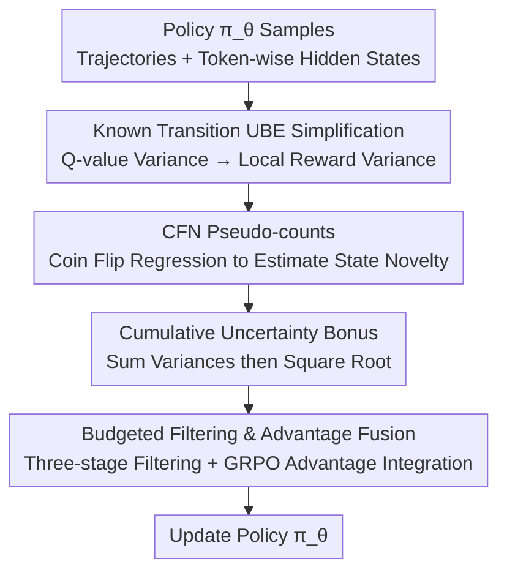

# Count Counts: Motivating Exploration in LLM Reasoning with Count-based Intrinsic Rewards

**Conference**: ICLR2026  
**OpenReview**: [https://openreview.net/forum?id=9xIBbfItGP](https://openreview.net/forum?id=9xIBbfItGP)  
**Code**: https://github.com/dd88s87/MERCI  
**Area**: Reinforcement Learning / LLM Reasoning  
**Keywords**: Intrinsic Rewards, Count-based Exploration, Uncertainty Bellman Equation, GRPO, LLM Reasoning

## TL;DR
Addressing the issue that value-free RL like GRPO/DAPO suffers from "insufficient exploration and premature convergence to repetitive patterns" in LLM reasoning, MERCI leverages the property that transitions in LLM generation are "known and deterministic" to simplify the Uncertainty Bellman Equation (UBE) into estimating only local reward variance. Using a lightweight "Coin Flip Network" (CFN) to estimate state novelty and convert it into intrinsic rewards, MERCI enables the policy to explore more diverse and coherent reasoning paths, consistently outperforming strong baselines on math and SQL benchmarks.

## Background & Motivation

**Background**: Enhancing LLM multi-step reasoning with RL has become mainstream, especially using value-free methods like GRPO and DAPO that abandon explicit value networks and use "within-group relative rewards" for advantage estimation. While training-efficient, these methods face sparse rewards—a 0/1 outcome is only available after generating a long reasoning chain and a final answer.

**Limitations of Prior Work**: Sparse rewards make exploration a core challenge. Existing practices largely rely on **entropy regularization** to encourage policy diversity, but entropy regularization only injects "undirected local noise" at the token level. It fails to provide "directional, temporally consistent" exploration signals over the long horizon of a reasoning trajectory. Consequently, policies tend to fall into repetitive, sub-optimal reasoning patterns and converge prematurely.

**Key Challenge**: Classical "deep exploration" methods in RL (pseudo-counts, Bootstrapped DQN, RND, ICM, UBE-based methods) could provide directional exploration, but the **cost of estimating epistemic uncertainty is not scalable for LLMs**: deep ensembles are too expensive; MC dropout has high inference overhead; density-based pseudo-counts rely on normalized probabilities and lack efficient batching; curiosity methods lack theoretical guarantees for reward decay. UBE is theoretically grounded but requires estimating "local uncertainty"—an notoriously difficult step often bypassed by heuristics. A fundamental mismatch exists between classical uncertainty quantification and the scale of LLMs.

**Key Insight**: The authors observe that for "self-contained" reasoning tasks (e.g., math problem solving where the model does not interact with an external stochastic world), the underlying MDP **transition function of autoregressive generation is known and deterministic**: selecting action $a$ (next token) at state $s$ (generated sequence) lead to next state $s'=(s,a)$ with zero ambiguity. While UBE originally propagates uncertainty from both reward estimation $\hat r$ and transition estimation $\hat P$, the epistemic uncertainty of $\hat P$ is zero when transitions are known. Thus, UBE reduces to "accumulating local reward uncertainty along the trajectory."

**Core Idea**: The property of "known transitions" reduces the difficult problem of estimating Q-value variance to estimating local reward variance. A scalable Coin Flip Network (CFN) is used to proxy "state novelty" as reward uncertainty, which is converted into an intrinsic reward bonus integrated into GRPO. This guides the policy to explore novel reasoning trajectories. The authors name this method MERCI.

## Method

### Overall Architecture

MERCI aims to design principled exploration for LLM reasoning. It operates with **two parallel LLMs**: a **policy network** $\pi_\theta$ updated by RL (initialized from SFT checkpoint $\pi_0$) responsible for generating trajectories; and a **CFN network** (also an LLM instance initialized from $\pi_0$ with a lightweight MLP head $f_\phi$ atop the last hidden state) whose sole responsibility is to estimate epistemic uncertainty.

The data flow for a training step is as follows: the policy $\pi_\theta$ first rolls out a reasoning trajectory $\tau$; the contextual hidden representation $s_{hidden}$ at each token position is fed into the CFN head to estimate the **local reward variance** $\mathbb{V}[\hat r(s)]=\frac{1}{d}\lVert f_\phi(s)\rVert^2$. These are aggregated into a trajectory-level exploration bonus by "summing variances first, then taking the square root," filtered through three stages to remove useless signals, and finally normalized within the group and scaled to be merged into the GRPO advantage term. The CFN network is co-trained with the policy using a supervised regression objective.

### Key Designs

**1. UBE Simplification under Known Transitions: Reducing Q-value Variance Estimation to Local Reward Variance Estimation**

This is the theoretical foundation of the paper. UBE originally propagates epistemic uncertainty (variance of the posterior Q-distribution) over time, involving sources from reward estimation $\hat r$ and transition estimation $\hat P$. The authors point out that in LLM reasoning, the MDP transition is a known delta function ($s'=(s,a)$ is certain), so the true $P$ is used directly in the posterior Bellman equation. Applying the law of total variance yields Proposition 1—the Uncertainty Bellman Equation under known transitions:

$$U^h(s,a)\le \mathbb{V}_t[\hat r^h(s)]+\sum_{s',a'}\pi^h_{s',a'}P^h_{s'sa}\,U^{h+1}(s',a'),$$

where $U^h(s,a)\triangleq\mathbb{V}_t[\hat Q^{\pi,h}(s,a)]$ is the posterior Q-variance, $s'$ is the unique next state from $(s,a)$, and $U^{H+1}(\cdot)=0$. This recursion shows that the uncertainty of a state-action pair is bounded by the "immediate reward uncertainty + expected uncertainty of the unique successor state." This rewrites the difficult task of estimating Q-variance into the actionable task of estimating local reward variance $\mathbb{V}_t[\hat r^h(s)]$. With $U^h(s,a)$, one can encourage exploration by optimizing $Q^{\pi,h}(s,a)+\alpha\sqrt{U^h(s,a)}$ following UCB, backed by low-regret theoretical guarantees. By standard concentration inequalities, uncertainty in reward mean estimation is inversely proportional to the state visit count, $\mathbb{V}_t[\hat r^h(s)]\propto 1/N(s)$—reducing the problem further to "how to count $N(s)$ in the high-dimensional language state space."

**2. CFN Pseudo-counts: Converting State Novelty to Reward Variance via Coin Flip Regression**

Exactly counting visits in language space is nearly impossible, so a scalable estimator capable of "generalized counting" is required. The authors adopt the Coin Flip Network (CFN): for each visit to state $s_i$, a $d$-dimensional random label $c_i\sim\{-1,1\}^d$ (a set of coin flip results) is sampled. An MLP head $f_\phi$ is trained to regress these labels via MSE:

$$f^*_\phi(s)=\arg\min_\phi\sum_{i=1}^{|\mathcal{D}_{cfn}|}\lVert c_i-f_\phi(s_i)\rVert^2.$$

Since the same state is paired with different random vectors in the dataset, the network cannot learn a perfect mapping and outputs the mean of all labels for that state: $f^*_\phi(s)=\frac{1}{n}\sum_{i=1}^n c_i$. Using the second moment of the sample mean for Rademacher distributions $\mathbb{E}[z_n^2]=1/n$, and reducing variance by a factor of $1/d$ by flipping $d$ coins, the pseudo-count estimate is $\frac{1}{d}\lVert f_\phi(s)\rVert^2\approx\frac{1}{N(s)}$. Linking this to Design 1 gives the local reward variance $\mathbb{V}[\hat r(s)]=\frac{1}{d}\lVert f_\phi(s)\rVert^2$. Here, "state" is the contextual hidden representation $s_{hidden}$ output by the LLM backbone at that token position, which naturally encodes the prefix. Compared to density pseudo-counts, this method requires solving only one supervised regression, is batchable with minimal overhead, and generalizes well to unseen but similar states.

**3. Cumulative Uncertainty Bonus: Summing Variances First, then Squaring Root**

This crucial algorithmic detail stems directly from Proposition 1. To calculate the uncertainty of a trajectory's value, the correct approach is to **sum the local reward variances of each step first, then take the square root of the total sum**—this yields the standard deviation of the cumulative Q-value posterior, the true intrinsic reward. Many RL exploration algorithms use a theoretically flawed heuristic: calculating a bonus proportional to the local standard deviation at each step and summing them (equivalent to "summing standard deviations"). The authors illustrate the difference with an example: for a horizon $H$ with step-wise local variance $\sigma^2=1$, the correct bonus is $\sqrt{\sum_{h=1}^H 1}=\sqrt{H}$, while the heuristic bonus is $\sum_{h=1}^H\sqrt{1}=H$. The latter **systematically overestimates** uncertainty over long horizons, causing agents to be overly optimistic and explore "long but not necessarily promising" paths ineffectively. MERCI strictly follows the former.

**4. Budgeted Bonus Filtering & Advantage Fusion: Keeping Dense Exploration Rewards Useful but Not Overpowering**

If non-sparse exploration bonuses become indiscriminately dense, they may entice the LLM to explore aimlessly just to farm bonuses, leading to instability. The authors apply "budgeted exploration" using three-stage filtering: **Percentile filtering** keeps only tokens with the strongest bonuses within each sample (e.g., top 50%), automatically following the global decay of bonus magnitudes without manual retuning; **Spatial coherence filtering** retains only continuous clusters of high-bonus tokens, discarding isolated spikes to stabilize updates; **Noise-suppression filtering** removes incentives attached to content unrelated to problem-solving (e.g., useless Python code, meaningless repetitions, or rare characters generated to game the bonus). After filtering, the normalized bonus is calculated from the indices $I$ of retained tokens:

$$B=\sqrt{\frac{1}{l}\sum_{i\in I}\Big(\frac{1}{d}\lVert f_\phi(s^i_{hidden})\rVert^2\Big)}.$$

To make trajectories comparable under the same prompt, the bonus is standardized within a group of size $G$ and negative values are truncated, keeping only positive exploration incentives $\hat A^i_{exploration}=\max\!\big(0,\frac{B_i-\mu}{\sigma}\big)$. Finally, it is scaled by exploration coefficient $\gamma$ and merged into the base advantage $\hat A^i_{old}$, with a clipping factor $\alpha\in(0,1)$ to prevent intrinsic terms from overwhelming the outcome reward:

$$\hat A^i_{new}=\begin{cases}\min\!\big(\hat A^i_{old}+\gamma\hat A^i_{exploration},\,(1+\alpha)\hat A^i_{old}\big),&\hat A^i_{old}\ge 0;\\[2pt]\min\!\big(\hat A^i_{old}+\gamma\hat A^i_{exploration},\,(1-\alpha)\hat A^i_{old}\big),&\hat A^i_{old}<0.\end{cases}$$

### Loss & Training
The CFN head is trained using the MSE supervised regression objective. The process has two phases: **pre-training** the CFN on training set rollouts from the backbone to gain an initial understanding of state rarity; then, during the RL phase, the CFN is initialized from pre-trained weights and **co-trained** with the policy. The policy still uses the original GRPO/DAPO objective, but with the merged advantage $\hat A^i_{new}$.

## Key Experimental Results

### Main Results

Math reasoning used Qwen2.5-Math-7B as the backbone and DAPO-17K as the training set, evaluated on AIME24/25, MATH500, etc. SQL generation used Llama-3.1-8B-Instruct on Bird and Spider. Baselines include vanilla GRPO/DAPO, Entropy Advantage, and RND-based intrinsic rewards (iMentor).

Math Reasoning Average Scores (MERCI leads consistently):

| Config | Avg pass@k | Avg mean@k |
|------|------------|------------|
| GRPO | 65.8 | 40.5 |
| GRPO w/ Entropy Adv. | 65.9 | 41.2 |
| GRPO w/ iMentor | 66.4 | 40.9 |
| **GRPO w/ MERCI** | **67.4** | **42.2** |
| DAPO | 66.9 | 42.2 |
| DAPO w/ Entropy Adv. | 67.9 | 43.2 |
| DAPO w/ iMentor | 67.3 | 44.1 |
| **DAPO w/ MERCI** | **69.0** | **44.9** |

Gains are most prominent on the difficult AIME suite. The consistent improvement in mean@k indicates more stable sample quality rather than just higher peak performance.

### Ablation Study

| Config | Description & Impact |
|------|-----------|
| Full MERCI | Optimal in both pass@k and mean@k. |
| w/o bonus filtering | Removing filtering makes bonuses indiscriminately dense, leading to instability; confirmed as a key component. |
| sum-of-std instead of sum-of-variance | Using heuristic "sum of standard deviations" results in inefficient exploration due to uncertainty overestimation. |
| Normalized trajectory aggregation | Confirmed as one of the baseline components for method success. |

### Key Findings
- **CFN bonuses align with "novel" positions**: High uncertainty tokens often correspond to novel reasoning paths, Python code outputs, or specific technical terms.
- **CFN generalizes across tasks**: A CFN trained on math reasonably estimates uncertainty for SQL; it captures semantic similarity for related trajectories.
- **Exploration is "smarter" rather than "wordier"**: MERCI concentrates probability mass on more diverse yet reliable solutions, using concise reasoning steps and suppressing meaningless length extension.

## Highlights & Insights
- **"LLM as its own perfectly known world model"**: Bridging "deterministic autoregressive transitions" with UBE to reduce Q-variance estimation to tractable local reward variance is a elegant theoretical jump.
- **Correction of sum-of-variance vs sum-of-std**: Identifying that summing step-wise bonuses (standard deviations) leads to systematic overestimation over long horizons is a valuable trick for any sequence-level intrinsic reward design.
- **CFN scalability**: Converting counting into a supervised regression problem with coin flip labels makes it batch-friendly and computationally efficient for large-scale systems.

## Limitations & Future Work
- **Restricted to "self-contained, deterministic transition" tasks**: The UBE simplification assumes no external stochastic environment. For tool-use or retrieval, transition uncertainty ($\hat P$) is non-zero, requiring theoretical revisions.
- **Extra network and hyperparameters**: While the CFN is lightweight, it requires maintaining a second LLM instance and tuning several hyperparameters (e.g., $\gamma$ schedule, percentile $p$).
- **Modest absolute gains**: Improvements are roughly +1-2 points over the strongest baselines, with gains concentrated on the most difficult tasks (AIME).

## Related Work & Insights
- **vs Entropy-based Exploration**: Entropy adds undirected noise and lacks a criterion for *where* to explore. MERCI provides directional, temporally consistent signals with UCB-like guarantees.
- **vs Curiosity/RND Intrinsic Rewards**: RND lacks theoretical guarantees for bonus decay and struggles with LLM dynamic lengths. MERCI derives aggregation rules (sum-of-variance) from UBE.
- **vs Density-based Pseudo-counts**: Classical density models are resource-heavy and hard to batch. MERCI uses the CFN regression route to make counting scalable.

## Rating
- Novelty: ⭐⭐⭐⭐⭐ First to derive deep exploration for LLM reasoning from "known transition UBE simplification."
- Experimental Thoroughness: ⭐⭐⭐⭐ Covers multiple domains and baselines, though absolute gains are modest.
- Writing Quality: ⭐⭐⭐⭐ Clear theoretical derivation and effective communication of the sum-of-variance correction.
- Value: ⭐⭐⭐⭐ Provides a scalable, principled intrinsic reward paradigm for LLM RL.

<!-- RELATED:START -->

## Related Papers

- [\[ICLR 2026\] Random Policy Valuation is Enough for LLM Reasoning with Verifiable Rewards](random_policy_valuation_is_enough_for_llm_reasoning_with_verifiable_rewards.md)
- [\[ICLR 2026\] Beyond Markovian: Reflective Exploration via Bayes-Adaptive RL for LLM Reasoning](beyond_markovian_reflective_exploration_via_bayes-adaptive_rl_for_llm_reasoning.md)
- [\[ICLR 2026\] Continuous Chain of Thought Enables Parallel Exploration and Reasoning](continuous_chain_of_thought_enables_parallel_exploration_and_reasoning.md)
- [\[ICLR 2026\] Agentic Reinforcement Learning with Implicit Step Rewards](agentic_reinforcement_learning_with_implicit_step_rewards.md)
- [\[ICLR 2026\] Attention as a Compass: Efficient Exploration for Process-Supervised RL in Reasoning Models](attention_as_a_compass_efficient_exploration_for_process-supervised_rl_in_reason.md)

<!-- RELATED:END -->
## Related Papers

- [\[ICLR 2026\] Random Policy Valuation is Enough for LLM Reasoning with Verifiable Rewards](random_policy_valuation_is_enough_for_llm_reasoning_with_verifiable_rewards.md)
- [\[ICLR 2026\] Beyond Markovian: Reflective Exploration via Bayes-Adaptive RL for LLM Reasoning](beyond_markovian_reflective_exploration_via_bayes-adaptive_rl_for_llm_reasoning.md)
- [\[ICLR 2026\] Continuous Chain of Thought Enables Parallel Exploration and Reasoning](continuous_chain_of_thought_enables_parallel_exploration_and_reasoning.md)
- [\[ICLR 2026\] Agentic Reinforcement Learning with Implicit Step Rewards](agentic_reinforcement_learning_with_implicit_step_rewards.md)
- [\[ICLR 2026\] Attention as a Compass: Efficient Exploration for Process-Supervised RL in Reasoning Models](attention_as_a_compass_efficient_exploration_for_process-supervised_rl_in_reason.md)

<!-- RELATED:END -->
