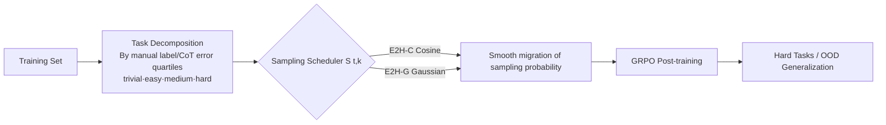

# Curriculum Reinforcement Learning from Easy to Hard Tasks Improves LLM Reasoning

**Conference**: ICLR 2026  
**OpenReview**: [https://openreview.net/forum?id=KJvHnl3kUv](https://openreview.net/forum?id=KJvHnl3kUv)  
**Code**: [https://github.com/divelab/E2H-Reasoning](https://github.com/divelab/E2H-Reasoning)  
**Area**: LLM Reasoning / RL Post-training  
**Keywords**: Curriculum Learning, Reinforcement Learning, GRPO, Reasoning, Task Scheduling, Sampling Strategy  

## TL;DR
The paper proposes **E2H Reasoner**, which decomposes training data into four difficulty levels—"trivial, easy, medium, and hard"—and utilizes a probability scheduler (Cosine or Gaussian) to smoothly shift the sampling focus from easy to hard. This approach enables small models to master complex reasoning tasks that are unsolvable zero-shot, while providing theoretical guarantees for CRL convergence and sample complexity.

## Background & Motivation
- **Background**: RL post-training (e.g., GRPO), as used in DeepSeek-R1 and OpenAI o1, has significantly enhanced the mathematical and code reasoning capabilities of LLMs. RL replaces SFT-style imitation supervision with sparse rewards based on final answer correctness.
- **Limitations of Prior Work**: For **intrinsically hard tasks** where base models have near-zero success rates, vanilla RL performs poorly. Rewards are only issued when the final answer is correct; the large distribution gap results in extremely few correct samples and sparse reward signals, preventing the model from acquiring learning signals.
- **Key Challenge**: Directly fitting a single hard target distribution leads to learning stagnation due to sparse rewards or overfitting to specific patterns, which harms generalization. Conversely, naive curriculum learning (switching tasks at fixed steps) introduces two new problems: **task forgetting** and **overfitting on easy tasks (reward hacking)**.
- **Goal**: Design a curriculum RL framework that smoothly bridges the "pre-training distribution $d_0$ $\rightarrow$ hard target distribution $d_K$" transition, mitigating reward sparsity while avoiding forgetting and overfitting, with a theoretical proof that it is more sample-efficient than direct learning.
- **Core Idea**: **[Task Decomposition + Probability Scheduling]** Reasoning tasks are decomposed into multiple levels as intermediate distributions. A sampling probability function that evolves with training steps controls when to focus on easy tasks and when to transition to hard ones. The key insight: **Easy tasks are crucial initially, but they must be "faded out" via proper scheduling to prevent overfitting.**

## Method

### Overall Architecture
E2H models LLM reasoning as a sparse-reward MDP (where the state is the token prefix and the action is the vocabulary; rewards are given only when the `<answer>` tag is closed and the answer is correct). Two layers are added atop GRPO: **Task Decomposition**, which categorizes the training set into trivial/easy/medium/hard levels (using manual labels or CoT error rate quartiles), and a **Sampling Scheduler** $S(t,k)$ that assigns sampling probabilities to each level at each training step $t$, shifting the focus from easy to hard.

### Key Designs

**1. Task Decomposition: Converting "sparse rewards" into "staged dense rewards."** The strategy uses difficulty gradients to replace manual reward shaping. Since hard reasoning tasks (e.g., 6-number Countdown) require simultaneous mastery of multiple skills, E2H interpolates intermediate distributions $\{d_k\}_{k=1}^{K}$ between the target distribution $d_K$ and the pre-training distribution $d_0$. This ensures that accuracy within each level is not too low, allowing the model to acquire "core skills" on easier levels before migrating to harder ones. Ablations in Table 1 verify this—training only on Hard tasks yields 0.0 accuracy, whereas including Trivial and Easy tasks allows the model to succeed on Hard and OOD levels.

**2. Cosine Schedule (E2H-C): Parameter-free reduction of easy task sampling.** The sampling probability is defined as $S_{\text{cosine}}(t,k)=\alpha_t\cdot(K-k-1)+(1-\alpha_t)\cdot k$, where $\alpha_t=0.5\cdot(1+\cos(\frac{\pi t}{T}))$, followed by normalization. Initially, the easiest levels have the highest probability; by the end of training, this is reversed. While effective for tasks like MATH where base models have some initial success, slow decay can lead to overfitting on easy levels in extremely sparse-reward tasks like Blocksworld.

**3. Gaussian Schedule (E2H-G): Precise control of "fade-out speed" to prevent overfitting.** Assuming the difficulty distributions are Gaussians with variance $\sigma$ and means $\mu_k=k-1$, the sampling probability is the likelihood of the current position $x_t$ under each level's Gaussian: $S_{\text{Gaussian}}(t,k)=\exp\!\big(-\frac{(x_t-\mu_k)^2}{2\sigma^2}\big)$, where $x_t=(\frac{t}{T})^{\beta}(K-1)$. Two hyperparameters control the process: $\sigma$ regulates sampling concentration, and $\beta$ controls the movement speed of $x_t$. When $\beta<1$, the model **fades out trivial/easy levels quickly** to prevent overfitting while still providing enough early exposure to kickstart learning.

**4. Convergence & Sample Complexity Guarantee: Proving sample efficiency within the Approximate Policy Iteration framework.** CRL is modeled as a sequence of MDPs $\{M_k\}$ sharing state-action spaces but with different rewards/transitions. Under the API framework, the final performance gap is bounded by $E_K\le\sum_k\big(\gamma^T\eta_k+\frac{2\gamma(1-\gamma^T)}{(1-\gamma)^2}\delta_k+\frac{2\gamma}{\beta(1-\gamma)^2}\big)+\sum_{k=1}^{K-1}\|Q_K^*-Q_k^*\|_{d_K}$. Theorem 3.2 proves that the total samples required for CRL, $M_{\text{CRL}}$, is less than direct learning, $M_{\text{Direct}}$, under specific geometric error conditions, theoretically supporting the empirical observation that staged learning is more efficient.

## Key Experimental Results

### Main Results
On Qwen-1.5B and LLaMA-3.2-3B across Blocksworld, Countdown, and MATH (categorized into Trivial/Easy/Med/Hard/OOD), E2H-G consistently leads in hard levels and OOD performance:

| Model/Method (Countdown) | Trivial | Easy | Med | Hard | OOD |
|---|---|---|---|---|---|
| Qwen-1.5B CoT | 16.0 | 5.6 | 1.7 | 0.1 | 0.1 |
| GRPO (All, Balanced) | 96.1 | 64.9 | 28.8 | 18.1 | 9.2 |
| GRPO (Hard Direct) | 0.0 | 43.9 | 16.4 | 18.1 | 6.5 |
| CL (Traditional Curriculum) | 57.7 | 85.8 | 57.2 | 31.5 | 12.6 |
| Self-Evolve | 96.6 | 65.3 | 34.2 | 17.8 | 9.5 |
| **E2H-G** | 97.9 | **87.2** | **70.4** | **41.0** | **19.2** |

On GSM8K and AQuA (using automatic difficulty splitting), E2H-G also achieved the highest average scores (GSM8K 78.7, AQuA 66.1).

### Ablation Study
Task decomposition analysis (Table 1) shows that a complete difficulty gradient is superior:

| Training Levels (Blocksworld) | Trivial | Easy | Med | Hard | OOD |
|---|---|---|---|---|---|
| Hard Only | 0.0 | 0.0 | 0.0 | 0.0 | 0.0 |
| Med+Hard | 2.0 | 0.0 | 0.0 | 0.0 | 0.0 |
| Easy+Med+Hard | 0.0 | 55.5 | 15.5 | 0.0 | 0.0 |
| **Trivial+Easy+Med+Hard** | 98.0 | 100 | 83.3 | 21.1 | 2.6 |

Comparison of scheduling strategies shows E2H-G(0.25, 0.75) reaching 32.9 on Blocksworld Hard, far exceeding CL (5.8) and Balanced (26.3). The combination of E2H and DAPO (Table 5) shows consistent gains, indicating E2H is complementary to specific RL algorithms.

### Key Findings
- **Direct learning on hard tasks is largely ineffective**: Qwen-1.5B trained directly on MATH Level-5 performed worse than the CoT baseline; GRPO (Hard/OOD) failed completely on Blocksworld.
- **Easy tasks must be "faded out"**: CL fails due to forgetting or overfitting. E2H-G uses $\beta<1$ to quickly move past easy levels, proving more stable than E2H-C in sparse-reward scenarios.
- **Task characteristics dictate the schedule**: Balanced performance across levels (like MATH) suits E2H-C, while high sparsity (Blocksworld/Countdown) requires E2H-G.

## Highlights & Insights
- The **"difficulty gradient as reward shaping"** perspective is elegant, delegating manual reward engineering to curriculum design, which is more generalizable across tasks.
- The **$\beta$ hyperparameter in Gaussian scheduling** explicitly addresses the hidden issue of "easy task overfitting," providing a core improvement over traditional curriculum learning and Self-Evolve.
- **Theory and empirical results are well-aligned**: Beyond providing a bound, the paper derives a verifiable inequality for "CRL < Direct" sample complexity, which is substantiated by experiments.

## Limitations & Future Work
- Difficulty categorization relies on manual labels or CoT error rate estimation (requiring 20 samples per question), which involves **high preprocessing costs**.
- The $(\beta, \sigma)$ parameters in E2H-G require manual tuning based on task sparsity; no automated selection scheme is provided.
- Experiments are concentrated on small models (1.5B/3B) and synthetic tasks; scalability to larger models and open-domain reasoning (e.g., competitive math) remains to be verified.
- Theoretical analysis relies on linear function approximation and API assumptions, which leaves a gap between theory and real LLM training.

## Related Work & Insights
- **RL Post-training**: Ours builds on GRPO and acts as an orthogonal plugin compatible with DAPO.
- **Curriculum RL for LLM**: Compared to Self-Evolve (sampling tasks with 50% success rate) or fixed-step curricula, this work uses **smooth probability scheduling** instead of discrete switches.
- **Insight**: In sparse-reward RL, "how to schedule task difficulty" is as critical as "how to design rewards." Differentiable/tunable probability functions for scheduling are superior to hard thresholds and are relevant for Embodied AI and Agent scenarios.

## Rating
- **Novelty**: ⭐⭐⭐⭐ — Probability scheduler (especially $\beta$ for fade-out control) + CRL sample complexity proof under API is a solid and refined contribution.
- **Experimental Thoroughness**: ⭐⭐⭐⭐ — Extensive benchmarks, multiple models, and multi-dimensional ablations (levels, scheduling, RL algorithms). Only penalized for small model scales.
- **Writing Quality**: ⭐⭐⭐⭐ — Clear problem decomposition and smooth integration of theory and empirical evidence.
- **Value**: ⭐⭐⭐⭐ — Provides a plug-and-play, theoretically backed curriculum solution for improving reasoning in small models.

<!-- RELATED:START -->

## Related Papers

- [\[ICLR 2026\] Emergent Hierarchical Reasoning in LLMs through Reinforcement Learning](emergent_hierarchical_reasoning_in_llms_through_reinforcement_learning.md)
- [\[ICLR 2026\] NFT: Bridging Supervised Learning and Reinforcement Learning in Math Reasoning](nft_bridging_supervised_learning_and_reinforcement_learning_in_math_reasoning.md)
- [\[ICML 2026\] The Easy, the Hard, and the Learnable: Confidence and Difficulty-Adaptive Policy Optimization for LLM Reasoning](../../ICML2026/llm_reasoning/the_easy_the_hard_and_the_learnable_confidence_and_difficulty-adaptive_policy_op.md)
- [\[ICLR 2026\] Learning to Reason over Continuous Tokens with Reinforcement Learning (HyRea)](learning_to_reason_over_continuous_tokens_with_reinforcement_learning.md)
- [\[ICLR 2026\] RL of Thoughts: Navigating LLM Reasoning with Inference-Time Reinforcement Learning](rl_of_thoughts_navigating_llm_reasoning_with_inference-time_reinforcement_learni.md)

<!-- RELATED:END -->
