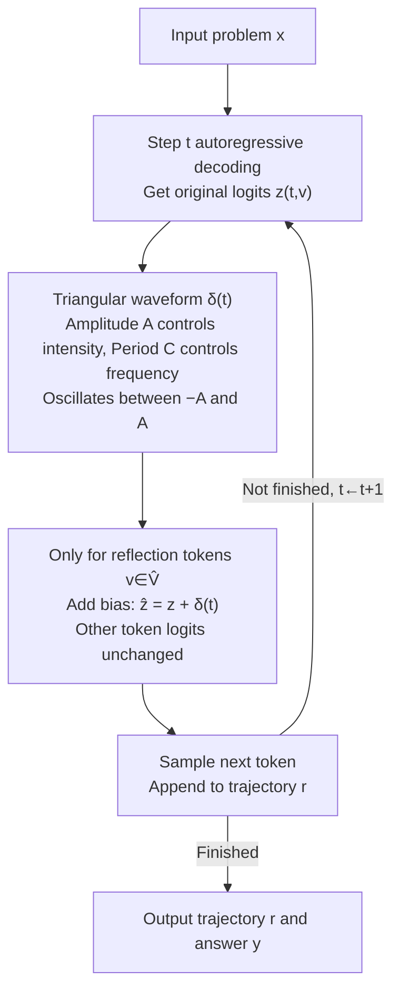

# CyclicReflex: Improving Reasoning Models via Cyclical Reflection Token Scheduling

**Conference**: ICLR 2026  
**arXiv**: [2506.11077](https://arxiv.org/abs/2506.11077)  
**Code**: [https://github.com/OPTML-Group/CyclicReflex](https://github.com/OPTML-Group/CyclicReflex)  
**Area**: LLM Reasoning  
**Keywords**: Large Reasoning Models, Reflection Token Scheduling, Test-time Scaling, Cyclical Learning Rate, Decoding Strategy

## TL;DR
Reflection tokens in reasoning processes (e.g., "wait", "but") are treated as schedulable "resources." Drawing from the concept of cyclical learning rates in optimization, CyclicReflex is proposed as a training-free decoding strategy. By dynamically regulating the logits of reflection tokens using a triangular waveform, it consistently improves the accuracy of 1.5B-8B models across multiple mathematical reasoning benchmarks (MATH500, AIME2024/2025, AMC2023).

## Background & Motivation
Large Reasoning Models (LRMs) such as OpenAI o1 and DeepSeek-R1 solve complex problems through multi-step reasoning guided by "reflection tokens" (e.g., "wait", "but", "alternatively"). These tokens serve as critical pivot points and self-evaluation mechanisms within reasoning trajectories.

However, existing LRMs suffer from two symmetrical issues:
- **Under-reflection**: Insufficient reflection tokens lead to premature termination of reasoning, preventing the model from fully exploring solution paths, analogous to optimization failing to converge due to a learning rate that is too small.
- **Over-reflection**: Excessive reflection tokens cause the model to loop repeatedly (e.g., outputting "wait" indefinitely), wasting computational resources and failing to converge on a correct answer, similar to optimization divergence caused by a learning rate that is too large.

Prior methods like TIP (Thought switching penalty) only suppress reflection tokens in one direction using fixed logit penalties, failing to address both under-reflection and over-reflection across problems of varying difficulty. The authors pose the **Core Problem: How to dynamically regulate the frequency and position of reflection tokens via resource allocation?** The **Key Insight** is to analogize reflection token scheduling to learning rate scheduling in optimization, specifically leveraging the "stepsize hedging" idea from cyclical learning rates.

## Method

### Overall Architecture
CyclicReflex is a training-free decoding strategy. Given a problem $\mathbf{x}$, the LRM generates a reasoning trajectory $\mathbf{r}$ and answer $\mathbf{y}$ autoregressively. The sole intervention occurs during each decoding step before softmax sampling: a bias $\delta(t)$, which oscillates periodically following a triangular waveform relative to the current token position $t$, is added to the logits of "reflection tokens" ($\hat{V}$). Logits of non-reflection tokens remain unchanged. This bias can be positive (encouraging reflection) or negative (suppressing reflection), reciprocating between bounds as reasoning progresses. This approach requires no parameter updates and incurs no additional inference overhead.

This mechanism is supported by two progressive ideas: first, formalizing reflection token quantity and placement as a **resource allocation** problem; second, analogizing reflection tokens to the **learning rate** and validating that under/over-reflection corresponds to insufficient/excessive learning rates through a "Landscape of Thoughts." Finally, a triangular waveform borrowed from **cyclical learning rates** is used to implement bidirectional scheduling.

### Key Designs

**1. Formalizing reflection tokens as "schedulable resources" and demonstrating the failure of fixed strategies**

The authors first abstract reflection tokens into a resource whose frequency and position determine whether the model converges prematurely (under-reflection) or loops (over-reflection). To demonstrate that existing methods are insufficient, they test TIP as a baseline, which applies a fixed penalty $\alpha \le 0$ to reflection tokens. On MATH500, problems were clustered into Easy/Medium/Hard. TIP improved performance on Hard problems but degraded it on Easy and Medium problems. Thus, a constant penalty independent of position $t$ fails to balance under-reflection and over-reflection. Additional experiments with "positive TIP," "random noise," and "linear decay" also failed to match CyclicReflex, suggesting that the bias must be **dynamic and bidirectional**.

**2. Reflection token ↔ Learning rate analogy: Symmetry of failure via Landscapes of Thoughts**

The authors analogize reflection tokens within the "thought landscape" to the learning rate within a "loss landscape"—both act as knobs controlling step size. To validate this, they use the Landscape of Thoughts tool to project each reasoning step $r_i$ onto a 2D plane based on its "distance" to the final answer $y$, defined as the length-normalized probability:

$$d(r_i, y) = p_{\text{LRM}}(y \mid r_i)^{1/|y|}$$

Visualizations reveal three trajectory types: under-reflection is too conservative and stays near the start; desired-reflection is well-structured and converges; over-reflection is subtle—the model approaches the correct region but overshoots due to excessive reflection. Sudden turns in trajectories are almost always triggered by reflection tokens. This mirrors "stepsize hedging" in optimization, where alternating between large and small steps compensates for their respective failure modes.

**3. Bidirectional logit modulation via triangular waveform: The core mechanism**

CyclicReflex applies a position-based bias $\delta(t)$ to each token in the reflection set $\hat{V}$:

$$\hat{z}_{t,v} = \begin{cases} z_{t,v} + \delta(t) & \text{if } v \in \hat{V} \\ z_{t,v} & \text{otherwise} \end{cases}$$

$$\delta(t) = A\left|\frac{4\big((t - C/4)\bmod C\big)}{C} - 2\right| - A$$

Here, amplitude $A$ controls intensity and period $C$ controls frequency. $\delta(t)$ is a triangular wave oscillating between $[-A, A]$: it peaks at $\delta=A$ (encouraging exploration) and bottoms at $\delta=-A$ (encouraging convergence). The rising phase promotes exploration via reflection, while the falling phase promotes convergence by suppressing it. This bidirectional approach hedges the risks of both premature convergence and oscillatory divergence.

### Loss & Training
This method is a pure inference-time strategy and involves no training or parameter updates. The two hyperparameters are determined via grid search: amplitude $A \in [1, 10]$ and period $C \in [200, 2000]$.

## Key Experimental Results

### Main Results

| Dataset | Model | Metric | Original | TIP | S1 | Silver | CyclicReflex |
|--------|------|------|----------|-----|----|----- --|-------------|
| MATH500 | Qwen-7B | Acc | 0.86 | 0.87 | 0.83 | 0.88 | **0.89** |
| AIME2024 | Qwen-7B | Acc | 0.43 | 0.43 | 0.33 | 0.37 | **0.50** |
| AIME2025 | Qwen-7B | Acc | 0.31 | 0.30 | 0.33 | 0.30 | **0.37** |
| AMC2023 | Qwen-7B | Acc | 0.81 | 0.85 | 0.85 | 0.85 | **0.90** |
| AIME2024 | Llama-8B | Acc | 0.42 | 0.47 | 0.43 | 0.47 | **0.53** |
| AMC2023 | Llama-8B | Acc | 0.81 | 0.85 | 0.75 | 0.85 | **0.90** |
| MATH500 | Qwen-1.5B | Acc | 0.74 | 0.75 | 0.73 | 0.75 | **0.77** |
| AIME2024 | Qwen-1.5B | Acc | 0.23 | 0.23 | 0.17 | 0.27 | **0.30** |

### Ablation Study

| Configuration | Key Metrics | Description |
|------|---------|------|
| Difficulty Levels | Improvements across Easy/Med/Hard | TIP only works on Hard; degrades Easy |
| +Best-of-N (N=8) | Consistent BoN gains | Compatible with external test-time methods |
| +Beam Search | Consistent BS gains | Higher gains at lower computational budgets |
| Initial Phase $\phi=0$ | Optimal | Encouraging reflection early and suppressing late is best |
| Period $C$ Importance | Higher sensitivity | $C=600$ is optimal for Qwen-7B on MATH500 |
| Amplitude $A$ | Length control | Larger $A$ leads to longer reasoning |

### Key Findings
- CyclicReflex provides consistent improvements across all model scales (1.5B-8B) and datasets while maintaining generation lengths comparable to original strategies.
- Self-correction capabilities are significantly enhanced; given an incorrect trajectory, CyclicReflex's correction rate is much higher than TIP.
- Thought landscapes are more concentrated with fewer interference regions, allowing trajectories to converge more easily.
- S1 (forced "Wait" insertion) performs poorly on AMC2023, indicating that simply increasing reflection tokens is insufficient.

## Highlights & Insights
- **Insightful Analogy**: Mapping reflection tokens to learning rates (under-reflection $\leftrightarrow$ small LR $\leftrightarrow$ premature convergence; over-reflection $\leftrightarrow$ large LR $\leftrightarrow$ divergence) is intuitive and validated by thought landscape visualizations.
- **Minimalist Design**: The method is a simple triangular wave function without learnable parameters, making it easy to implement with zero overhead.
- **Bidirectionality is Key**: Unlike the unidirectional suppression in TIP, CyclicReflex's ability to alternate between promoting and inhibiting reflection allows it to adapt to various problem difficulties.
- **Compatibility**: It works synergistically with existing test-time scaling methods like Best-of-N and Beam Search.

## Limitations & Future Work
- The theoretical foundation for why LRMs exhibit over/under-reflection remains to be fully elucidated.
- Hyperparameters ($A$ and $C$) require grid searching per dataset; adaptive mechanisms are lacking.
- Evaluation is limited to mathematical reasoning; code generation and logical reasoning tasks have not been tested.
- The definition of reflection tokens is heuristic and may differ across different models.
- The optimality of the initial phase $\phi=0$ suggests deeper underlying reasoning dynamics worth exploring.

## Related Work & Insights
- **TIP** (Wang et al., 2025a): Uses fixed penalties to solve overthinking; served as a direct baseline.
- **S1** (Muennighoff et al., 2025): Forces "Wait" insertion but shows unstable results.
- **Silver Stepsize Schedule** (Altschuler & Parrilo, 2024): A stepsize hedging strategy in optimization that theoretically accelerates convergence.
- **Cyclical Learning Rates** (Smith, 2017): The core inspiration for this position-based scheduling.
- **Insight**: Scheduling strategies from optimization theory may have broad applicability to guiding LLM reasoning processes.

## Rating
- Novelty: ⭐⭐⭐⭐ (Strong analogy, though the implementation is simple)
- Experimental Thoroughness: ⭐⭐⭐⭐⭐ (Detailed ablations, multi-model/dataset, excellent visualization)
- Writing Quality: ⭐⭐⭐⭐⭐ (Clear narrative and excellent diagrams)
- Value: ⭐⭐⭐⭐ (High utility, though theory could be stronger)

<!-- RELATED:START -->

## Related Papers

- [\[ICLR 2026\] Explain in Your Own Words: Improving Reasoning via Token-Selective Dual Knowledge Distillation](explain_in_your_own_words_improving_reasoning_via_token-selective_dual_knowledge.md)
- [\[ICLR 2026\] Improving Reasoning for Diffusion Language Models via Group Diffusion Policy Optimization](improving_reasoning_for_diffusion_language_models_via_group_diffusion_policy_opt.md)
- [\[ICLR 2026\] Overthinking Reduction with Decoupled Rewards and Curriculum Data Scheduling](overthinking_reduction_with_decoupled_rewards_and_curriculum_data_scheduling.md)
- [\[ICLR 2026\] Executable Counterfactuals: Improving LLMs' Causal Reasoning Through Code](executable_counterfactuals_improving_llms_causal_reasoning_through_code.md)
- [\[ICLR 2026\] Fixing the Broken Compass: Diagnosing and Improving Inference-Time Reward Modeling](fixing_the_broken_compass_diagnosing_and_improving_inference-time_reward_modelin.md)

<!-- RELATED:END -->
