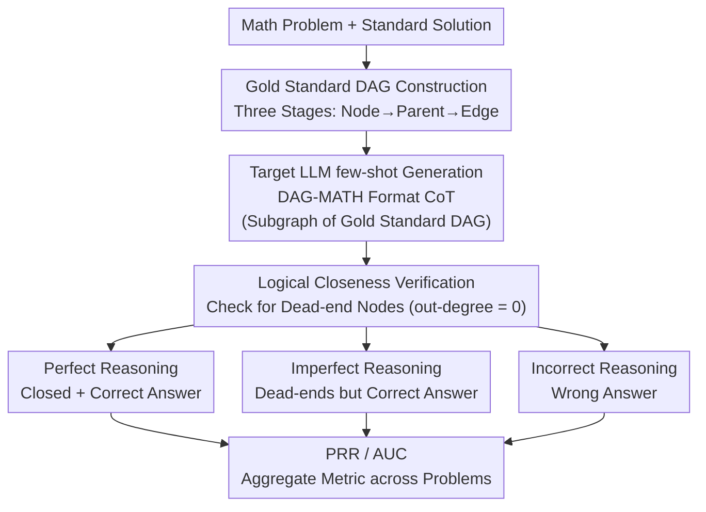

# DAG-Math: Graph-of-Thought Guided Mathematical Reasoning in LLMs

**Conference**: ICLR 2026  
**arXiv**: [2510.19842](https://arxiv.org/abs/2510.19842)  
**Code**: [https://github.com/YuanheZ/DAG-MATH](https://github.com/YuanheZ/DAG-MATH)  
**Area**: LLM Reasoning  
**Keywords**: mathematical reasoning, DAG, chain-of-thought, logical closeness, evaluation metric

## TL;DR
This paper formalizes CoT reasoning in LLMs as a rule-based stochastic process on Directed Acyclic Graphs (DAGs) and proposes the "logical closeness" metric to assess whether a model reaches an answer through search or rigorous logical derivation. By constructing the DAG-MATH benchmark with 2,894 gold-standard DAGs, the authors find that even models with similar PASS@k exhibit significant differences in reasoning faithfulness.

## Background & Motivation
**Background**: LLMs demonstrate strong performance in mathematical reasoning (e.g., o1, R1, Gemini-2.5), with CoT serving as the core strategy. However, the black-box nature of CoT makes it difficult to determine if a model arrives at the correct answer through logical deduction or via search/heuristics.

**Limitations of Prior Work**: (1) PASS@k only considers the final answer and ignores the logical consistency of the reasoning process—search-based exploration can still yield correct answers. (2) Formal verification like LEAN is rigorous but requires extensive expert effort to pre-formalize problems. (3) Existing graph models (Dziri 2023) utilize deterministic subgraph matching, overlooking diverse sampling and long-range dependencies.

**Key Challenge**: PASS@k may overestimate reasoning ability—models might find the correct answer by chance through "exploratory branches" rather than strict logical derivation. An evaluation framework is needed that falls between free-form CoT and formal proofs.

**Goal**: How to rigorously define and evaluate the mathematical reasoning capabilities of LLMs to distinguish "correct answers obtained via search" from "correct answers obtained via logical reasoning"?

**Key Insight**: Modeling CoT as a stochastic process on a DAG—where nodes are conclusions of derivation steps and edges represent the application of reasoning rules. "Logical closeness" is defined by requiring that every intermediate node is utilized by a subsequent node, eliminating useless exploratory branches.

**Core Idea**: Utilizing logical closeness on a DAG to measure whether an LLM is performing genuine logical reasoning instead of mere searching.

## Method

### Overall Architecture
This paper addresses a fundamental question: when an LLM correctly answers a math problem, is it "logically derived" or "found by chance through searching"? Metrics like PASS@k cannot distinguish these scenarios. DAG-Math reinterprets a CoT trajectory as a stochastic process on a Directed Acyclic Graph (DAG): source nodes represent premises, sink nodes represent final answers, intermediate nodes are conclusions from each step, and edges encode "which previous conclusions were used and which rule was applied."

The process involves two steps. First, a trusted gold-standard DAG is constructed **offline** for each problem (benchmark construction), serving as the reference for all subsequent metrics. Second, the target LLM is prompted via few-shot learning to generate CoTs in the DAG-MATH format, which are subgraphs of the gold-standard DAG. Once generated, **logical closeness** is used to check for "dead-end" nodes (nodes generated but not used later). Based on answer correctness, trajectories are classified into three categories: Perfect Reasoning (logically closed and correct answer), Imperfect Reasoning (contains useless branches but correct answer), and Incorrect Reasoning (wrong answer). Finally, these are aggregated into **PRR / AUC** metrics. The data flow is illustrated below:

### Key Designs

**1. Gold Standard DAG Construction: 2,894 Reference Graphs via Three-Stage Reverse Prompting**

Metrics like logical closeness and PRR require a "standard answer graph" as a reference to determine which nodes in a generated trajectory are redundant dead-ends. The authors constructed a benchmark of 2,894 gold-standard DAGs using a reverse sequence of **Node → Parent → Edge**. By fixing the node set before adding dependencies, verification is granularized to suppress error propagation. In Stage 1, GPT-4o-mini generates node sets step-by-step under the supervision of known solutions, forcing each node to contain a single sentence/mathematical assertion to unify granularity. SymPy and LLM-as-Judge (GPT-4o) verify each step against the final answer. In Stage 2, given the node set, the **minimal set of parent nodes** required to derive each node is identified to assemble an acyclic DAG. The graph is checked for logical closeness to the sink node; failure results in resampling (up to 5 times). In Stage 3, Qwen3 generates reasoning instructions for each edge using only the problem and parent nodes. Human auditing of 50 samples showed 49 passed, confirming reliability. Statistics show that harder problems have larger, sparser DAGs with higher maximum out-degrees, suggesting that logical complexity increases through **branching** (one step supporting multiple subsequent steps) rather than just chain length.

**2. Logical Closeness: Distinguishing Reasoning from Search via "Dead-end Nodes"**

PASS@k focuses solely on the final answer, ignoring intermediate processes where search-based exploration might happen to find the correct answer. Logical closeness examines the out-degree $d_{\text{out}}(v)$ of each intermediate node: a node that is generated but never referenced by subsequent steps ($d_{\text{out}}(v)=0$) is a "dead-end," indicating an unnecessary exploratory branch. A trajectory is "logically closed" only if no dead-end nodes exist. If its sink node is also the correct answer, it is termed **Perfect Reasoning**. A toy example demonstrates why the process is more revealing than the answer: on two parallel chain DAGs of length $L$, the probability of perfect reasoning decays exponentially as $(1/2)^{L-1}$, while final answer accuracy remains at $1/2$—accuracy alone fails to capture the fragility of the reasoning.

**3. Perfect Reasoning Rate (PRR): Quantifying Genuine Reasoning**

PRR provides a formal measure of reasoning capability by combining closeness and answer correctness:

$$\text{PRR}(\bm{X}_{\tt in}) = \mathbb{E}\big[\delta_{\text{close}} \cdot \delta_{\text{final}}\big]$$

where $\delta_{\text{close}}$ indicates logical closeness and $\delta_{\text{final}}$ indicates answer correctness. Unlike PASS@k, which only requires $\delta_{\text{final}}=1$, PRR enforces both. The difference between the two quantifies the portion of accuracy sustained by "search." To avoid overly harsh binary judgments, an AUC variant is provided by integrating over a curve that relaxes the required node closure proportion from 0% to 100%. A robustness check showed that AUC scores remained stable (23.8%–25.5%) across different parsing models, indicating it is an **intrinsic property** of the solution.

### Loss & Training
This work does not involve model training but rather an evaluation framework and benchmark. Target LLMs generate CoTs in DAG-MATH format directly via few-shot prompting, which are then evaluated using the aforementioned metrics.

## Key Experimental Results

### Main Results (Cross-Model PRR vs. PASS@1 Comparison)

| Finding | Description |
|------|------|
| Search Inflates PASS@1 | Exploratory branches increase PASS@1 by discovering correct paths by chance, while PRR remains unchanged. |
| PRR is Comparable Across Models | Despite large gaps in PASS@k, the perfect reasoning capabilities across model families are actually quite similar. |
| Perfect Reasoning Maps to Simple Problems | Problems with high PRR are typically low-difficulty, indicating weak logical reasoning for complex problems. |
| Faulty CoTs Stem from Capability Limits | Hardness arises from branching (merging multi-path derivations) rather than linear chain length. |

### Graph-Level Statistical Analysis

| Difficulty | Avg Nodes | Avg Edges | Branching Factor |
|------|----------|---------|---------|
| Easy | Few | Few | Low |
| Hard | Many | Many (Sparse) | High |

### Key Findings
- On MATH-500, GSM8K, and AIME24/25, the PASS@1 difference between Gemini, GPT, and Qwen3 families can reach 10%+, but the PRR difference is significantly smaller—suggesting high PASS@1 comes from search rather than reasoning.
- DAG structure analysis reveals that LLMs fail most frequently on problems requiring multi-step convergence (merging multiple intermediate conclusions into one step).
- The gap between PRR and PASS@1 quantifies the "exploratory overhead"—a larger gap indicates higher reliance on search.

## Highlights & Insights
- **First Formal Definition of LLM Reasoning Capability**: Translates the intuitive notion of "whether the model is truly reasoning" into a computable metric (PRR), analogous to formalizations of memorization vs. generalization in learning theory.
- **"Goldilocks Principle"**: The framework operates in a practical middle ground between free-form CoT (too loose) and LEAN formal proofs (too strict).
- **Diagnostic Value of DAG Complexity**: By analyzing DAG topology (depth vs. branching), one can precisely locate model weaknesses—whether they lie in linear reasoning or multi-path integration.

## Limitations & Future Work
- DAG construction relies on LLM + Human auditing and is not fully automated.
- Decomposition of nodes/edges may not be unique (semantic variants); although discussed, this is not fully resolved.
- Currently validated only on mathematical reasoning; generalization to other domains (e.g., law, science) requires adaptation.
- PRR applicability is limited for non-deterministic problems (e.g., open-ended reasoning).

## Related Work & Insights
- **vs. PASS@k**: PRR is a strict enhancement—requiring not only a correct answer but also a logically closed reasoning process.
- **vs. Dziri et al. (2023) Graph Matching**: They use deterministic subgraph matching which does not support multi-path or probabilistic sampling; DAG-Math uses a stochastic process model.
- **vs. LEAN Formal Verification**: LEAN is too strict and requires prior formalization; DAG-Math uses natural language with structural constraints, making it more practical.
- **vs. Kim et al. (2025) Markov Chain**: They use reversible Markov chains, which do not support directed acyclic structures or absorbing states.

## Rating
- Novelty: ⭐⭐⭐⭐⭐ First formal definition of LLM reasoning capability; the DAG + logical closeness framework is highly original.
- Experimental Thoroughness: ⭐⭐⭐⭐ Multi-model family comparisons, graph-level statistics, and multiple benchmarks.
- Writing Quality: ⭐⭐⭐⭐⭐ Rigorous theoretical derivation, clear conceptual definitions, and intuitive toy examples.
- Value: ⭐⭐⭐⭐⭐ Opens new directions for reasoning evaluation; likely to influence evaluation standards in the field.

<!-- RELATED:START -->

## Related Papers

- [\[ICLR 2026\] Verifying Chain-of-Thought Reasoning via Its Computational Graph](verifying_chain-of-thought_reasoning_via_its_computational_graph.md)
- [\[ICLR 2026\] Are Reasoning LLMs Robust to Interventions on Their Chain-of-Thought?](are_reasoning_llms_robust_to_interventions_on_their_chain-of-thought.md)
- [\[ICLR 2026\] Latent-Guided Reasoning: Empowering Small LLMs with Large-Model Thinking](latent-guided_reasoning_empowering_small_llms_with_large-model_thinking.md)
- [\[ICLR 2026\] Reasoning Scaffolding: Distilling the Flow of Thought from LLMs](reasoning_scaffolding_distilling_the_flow_of_thought_from_llms.md)
- [\[ICLR 2026\] MathFimer: Enhancing Mathematical Reasoning by Expanding Reasoning Steps through Fill-in-the-Middle Task](mathfimer_enhancing_mathematical_reasoning_by_expanding_reasoning_steps_through_.md)

<!-- RELATED:END -->
