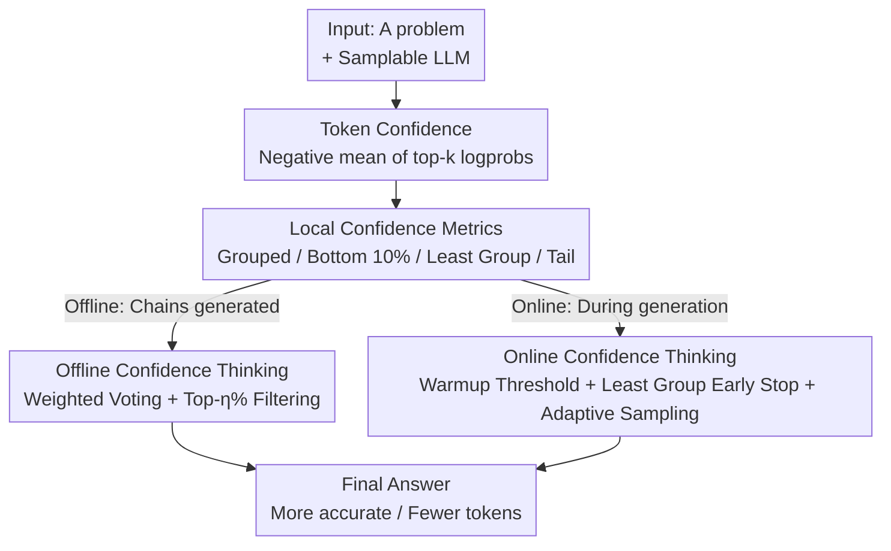

# Deep Think with Confidence

**Conference**: ICLR 2026  
**OpenReview**: [https://openreview.net/forum?id=8LqHs0KIM7](https://openreview.net/forum?id=8LqHs0KIM7)  
**Code**: https://github.com/facebookresearch/deepconf  
**Area**: LLM Inference  
**Keywords**: Test-time scaling, confidence, self-consistency, majority voting, inference efficiency

## TL;DR
DeepConf leverages local confidence signals inherent in LLM generation to dynamically filter low-quality reasoning chains atop parallel thinking (multi-sampling + majority voting). It uses confidence-weighted voting with Top-η% filtering in offline mode and employs the least grouped confidence as a trigger for early stopping and adaptive sampling in online mode. Without training or hyperparameter tuning, it improves GPT-OSS-120B accuracy to 99.9% on AIME 2025 while reducing generation tokens by up to 84.7%.

## Background & Motivation
**Background**: Currently, the mainstream test-time method for enhancing LLM reasoning is **self-consistency**, also known as parallel thinking. Multiple reasoning chains are sampled for the same problem, and the final answer is aggregated via majority voting. This approach significantly improves accuracy and is a standard for top-performing reasoning models on leaderboards.

**Limitations of Prior Work**: Parallel thinking is extremely expensive and faces diminishing returns. The paper provides a stark example: to increase the pass@1 of Qwen3-8B from 68% to 82% on AIME 2025, one needs to generate 511 additional chains per problem, consuming 100 million extra tokens. More importantly, accuracy often saturates or even declines as the number of chains increases because **standard majority voting treats all chains equally**, ignoring quality differences. If low-quality chains form the majority, the result is skewed.

**Key Challenge**: Prior works attempted to assess chain quality using internal token statistics (entropy, confidence) by averaging tokens into a **global confidence** (e.g., self-certainty). However, global averaging has two major flaws: first, averaging the entire chain **masks local reasoning collapse**, where a few high-confidence tokens can overshadow segments of low confidence, hiding critical errors. Second, global metrics require the **entire chain to be generated** before calculation, making it impossible to stop low-quality chains early to save computation.

**Goal**: To identify a confidence signal that accurately identifies poor chains and allows for real-time intervention during generation, making parallel thinking both more accurate and efficient.

**Key Insight**: The authors observe that reasoning chain collapse is often **local**. When a model consecutively outputs low-confidence tokens like "wait," "however," or "think again," the reasoning flow is interrupted, likely leading to errors. Furthermore, the final steps are crucial for mathematical answers. Since collapse is local, it should be captured by **local confidence** rather than a global average.

**Core Idea**: Use **local confidence** within sliding windows (especially the worst segment in a chain) as a proxy for chain quality. In offline scenarios, this is used for weighted voting and filtering; in online scenarios, it serves as an early-stopping trigger.

## Method

### Overall Architecture
The input to DeepConf is "a problem + an LLM capable of multi-sampling," and the output is "an aggregated final answer + significantly reduced token cost." The method centers on **token confidence** $C_i = -\frac{1}{k}\sum_{j=1}^{k}\log P_i(j)$, the negative mean of the log probabilities of the top-$k$ tokens (the paper uses top-20) at position $i$. Higher values indicate a sharper distribution and more model certainty. Based on token confidence, several **local aggregation** metrics are defined for two scenarios:

- **Offline Mode**: All reasoning chains are fully generated. The challenge is aggregation: using confidence-weighted voting + Top-η% filtering.
- **Online Mode**: Chain quality is assessed in real-time. Hopeless chains are dynamically stopped using the least grouped confidence as a trigger, combined with an offline warmup threshold and adaptive sampling.

### Key Designs

**1. Local Confidence Metrics: Representing chain quality by the worst segment**

These metrics address the issue of global averaging masking local collapse. Instead of averaging the entire chain, a series of **grouped confidences** are constructed using sliding windows: each token is associated with a window $G_i$ of the preceding $n$ tokens (e.g., $n=1024$ or $2048$). The mean within the group is $C_{G_i} = \frac{1}{|G_i|}\sum_{t \in G_i} C_t$. Overlapping windows yield a signal smoother than per-token data but more local than global averages.

From this, several chain-level metrics are derived: **Bottom 10% Grouped Confidence** $C_{\text{bottom-10}}$ averages the bottom 10% of grouped confidences in a chain to catch problematic segments. **Least Grouped Confidence** $C_{\text{least}} = \min_{G_j \in G} C_{G_j}$ is an extreme case focusing on the single worst group; because it can be updated on-the-fly, it is ideal for online early stopping. **Tail Confidence** $C_{\text{tail}}$ averages only the last fixed number of tokens (e.g., 2048), focusing on the critical concluding steps of math problems.

**2. Offline Confidence Thinking: Giving weights to high-confidence chains**

In offline scenarios, weighted voting is used. Standard majority voting $V(a) = \sum_{t \in T} \mathbb{I}(\text{answer}(t)=a)$ treats all chains equally. DeepConf upgrades this to **confidence-weighted voting** $V(a) = \sum_{t \in T} C_t \cdot \mathbb{I}(\text{answer}(t)=a)$, where $C_t$ is a chosen chain-level confidence metric.

This is layered with **confidence filtering**: chains are sorted by confidence, and only the Top-η% are kept for voting. $\eta=10\%$ provides aggressive filtering (keeping the ~1/10 most confident chains), offering high gains unless the model is overconfident in wrong answers. $\eta=90\%$ is a conservative option that maintains diversity.

**3. Online Confidence Thinking: Warmup, Early Stop, and Adaptive Sampling**

The online mode aims to **cut hopeless chains during generation**. It uses least grouped confidence in three steps:

First, **Offline Warmup**: For each new problem, generate $N_{\text{init}}$ (e.g., 16) complete chains to set a stop threshold $s = \text{Percentile}_{100-\eta}(\{C_t\})$. DeepConf-low uses $\eta=10\%$ (high threshold), and DeepConf-high uses $\eta=90\%$ (low, conservative threshold). Second, **Real-time Early Stopping**: During online generation, the grouped confidence $C_{G_i}$ is updated with every token. If $C_{G_i} < s$, the chain is terminated immediately. Third, **Adaptive Sampling**: Consensus $\beta = \frac{V(\hat a)}{\sum_a V(a)}$ measures problem difficulty. If $\beta \ge \tau$ (e.g., 0.95), sampling stops; otherwise, it continues until the budget $B$ is reached.

## Key Experimental Results

Experiments were conducted on five reasoning models (DeepSeek-8B, Qwen3-8B/32B, GPT-OSS-20B/120B) across five benchmarks (AIME24/25, BRUMO25, HMMT25, GPQA-Diamond).

### Main Results (Offline, K=512, Accuracy %)

| Model / Dataset | Pass@1 | Cons@512 | Bottom-10% Conf (η=10%) | Tail Conf (η=10%) |
|--------------|--------|----------|------------------------|-------------------|
| DeepSeek-8B / AIME25 | 76.9 | 82.3 | 87.5 | 87.4 |
| DeepSeek-8B / HMMT25 | 58.1 | 69.6 | 79.5 | 83.9 |
| Qwen3-32B / AIME24 | 80.6 | 85.3 | 90.8 | 89.4 |
| GPT-OSS-120B / AIME25 | 91.8 | 97.0 | 98.1 | **99.9** |

Confidence weighting + filtering consistently outperform standard majority voting. Aggressive filtering ($\eta=10\%$) yields the highest gains, with GPT-OSS-120B reaching 99.9% on AIME 2025.

### Online Experiments (K=512, Token Unit ×10⁸)

| Model / Dataset | Cons@512 Token | DeepConf-low Token (∆%) | DeepConf-low Acc |
|--------------|----------------|------------------------|------------------|
| DeepSeek-8B / AIME24 | 3.55 | 0.78 (-77.9%) | 92.5% (vs 86.7%) |
| DeepSeek-8B / AIME25 | 4.01 | 1.24 (-69.0%) | 86.4% |
| Qwen3-32B / AIME24 | 2.00 | 0.66 (-66.8%) | 89.5% |
| GPT-OSS-120B / AIME25 | 3.23 | 0.49 (-84.7%) | 97.9% |

DeepConf-low reduces token usage by 43–79% on math benchmarks while maintaining or improving accuracy.

### Key Findings
- **Local > Global**: Bottom-10% and Tail confidence distinguish correct from incorrect chains better than global averages, confirming that reasoning collapse is a local phenomenon.
- **Filtering Strength is a Double-Edged Sword**: $\eta=10\%$ provides the highest gains but can hurt accuracy if the model is overconfident in errors; $\eta=90\%$ is more robust.
- **Online ≈ Offline**: Since stopped chains would have been filtered offline, the online strategy closely approximates the offline results.
- **Cost Reduction**: At the same accuracy level, DeepConf-low/high saves 62.88% / 47.67% of tokens respectively on DeepSeek-8B.

## Highlights & Insights
- **The "worst segment" is the quality signal**: Replacing global averages with "least grouped confidence" resolves the masking problem and enables real-time updates for early stopping.
- **Zero-training, Zero-tuning, Plug-and-play**: DeepConf requires no weight changes or new hyperparameters. It relies on existing logprobs and can be integrated into current serving frameworks.
- **Unified Logic**: Online early stopping thresholds are set based on what would be filtered offline, ensuring theoretical and engineering consistency.

## Limitations & Future Work
- **Reliance on Confidence Calibration**: The method assumes high confidence equals high quality. If a model is overconfident in wrong answers, the local confidence signal fails.
- **Warmup Overhead**: Generating $N_{\text{init}}$ full chains per problem to set thresholds might be inefficient for very simple tasks.
- **Implicit Hyperparameters**: While "tuning-free," values like window size $n$, tail length, and $\tau$ are preset and might vary in robustness across tasks.
- **STEM Focus**: Observations like "final steps are critical" were primarily tested on math/STEM; their validity in open-ended or long-horizon agent tasks remains to be verified.

## Related Work & Insights
- **vs. Standard Self-Consistency**: DeepConf uses confidence-weighted filtering and early stopping to achieve higher accuracy with fewer tokens, rather than sampling blindly.
- **vs. Global Confidence Filtering**: Unlike methods that use session-wide statistics which mask local errors, DeepConf uses local sliding windows to identify collapse segments and intervene during generation.

## Rating
- Novelty: ⭐⭐⭐⭐ The unification of offline filtering and online early stopping via local confidence is practical and clear.
- Experimental Thoroughness: ⭐⭐⭐⭐⭐ Comprehensive coverage across five models, five benchmarks, and 64 re-samplings.
- Writing Quality: ⭐⭐⭐⭐ Logical progression with clear metrics.
- Value: ⭐⭐⭐⭐⭐ High deployment value due to its plug-and-play nature and significant token savings.

<!-- RELATED:START -->

## Related Papers

- [\[ICLR 2026\] Tricks or Traps? A Deep Dive into RL for LLM Reasoning](tricks_or_traps_a_deep_dive_into_rl_for_llm_reasoning.md)
- [\[ICLR 2026\] Think in Parallel, Answer as One: Logit Averaging for Open-Ended Reasoning](think_in_parallel_answer_as_one_logit_averaging_for_open-ended_reasoning.md)
- [\[ICLR 2026\] Adaptive Thinking: Large Language Models Know When to Think in Latent Space](adaptive_thinking_large_language_models_know_when_to_think_in_latent_space.md)
- [\[ICLR 2026\] C-Voting: Confidence-Based Test-Time Voting without Explicit Energy Functions](c-voting_confidence-based_test-time_voting_without_explicit_energy_functions.md)
- [\[ICLR 2026\] Reasoning with Sampling: Your Base Model is Smarter Than You Think](reasoning_with_sampling_your_base_model_is_smarter_than_you_think.md)

<!-- RELATED:END -->
