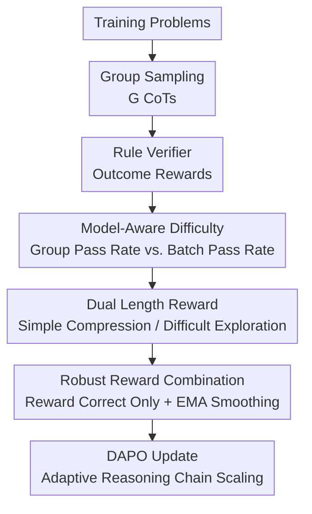

# DeepCompress: A Dual Reward Strategy for Dynamically Exploring and Compressing Reasoning Chains

**Conference**: ICLR2026  
**OpenReview**: [https://openreview.net/forum?id=K5A2jBmEBK](https://openreview.net/forum?id=K5A2jBmEBK)  
**Code**: https://github.com/Skytliang/DeepCompress  
**Area**: LLM Reasoning  
**Keywords**: Reasoning Chain Compression, Large Reasoning Models, Reinforcement Learning, Length Reward, Mathematical Reasoning  

## TL;DR
DeepCompress modifies the RL training of large reasoning models with a dual-length reward strategy of "compressing simple problems and exploring difficult problems," improving accuracy in mathematical and scientific reasoning while significantly reducing the average number of reasoning tokens.

## Background & Motivation
**Background**: Large Reasoning Models (LRMs) represented by o1, DeepSeek-R1, Gemini 2.5, and Claude 3.7 typically rely on long Chain-of-Thought (CoT), reflection, self-checking, and multi-step search to improve performance on complex tasks. On verifiable tasks like mathematical reasoning, Zero RL / RLVR has become the mainstream training route: the model samples multiple solutions for the same problem, a rule-based verifier provides correctness rewards, and the policy is updated using relative strategy optimization methods like GRPO or DAPO.

**Limitations of Prior Work**: Long CoT is not always beneficial. On simple problems, models exhibit "overthinking": generating redundant reasoning for steps that could be completed quickly, increasing inference costs and error exposure. On complex problems, they may "underthink": converging too early on a fragile line of thought, lacking useful exploration like enumeration, backtracking, or verification. Existing "reasoning chain compression" methods mostly use SFT to learn short CoTs or add length penalties to RL rewards; while these save tokens, they often lead to a decrease in accuracy.

**Key Challenge**: Reasoning length is not a variable where "shorter is globally better." Preliminary experiments by the authors found that for pass@1, shorter answers often perform better; however, in RL training settings like GRPO/DAPO where multiple answers are sampled, pass@k tends to improve with longer answers because they cover more potential solutions and generate more correct samples for difficult problems. Thus, uniform length penalties shrink the exploration space needed for complex problems, while uniform length rewards waste computation on simple problems.

**Goal**: This paper aims to solve the problem of reasoning budget allocation during model training: models should be concise and direct on problems they have already mastered, and longer and more explorative on problems they cannot yet solve. Crucially, this judgment should not rely on manual difficulty labels but should change dynamically with the model's training state.

**Key Insight**: The authors leverage signals observable during RL training: the proportion of correct samples after sampling $G$ responses for the same question serves as an instant estimate of "how easy the model finds this problem." The average accuracy of all problems in a batch reflects the overall model level. Subtracting these provides a measure of relative difficulty without additional labeling.

**Core Idea**: DeepCompress transforms the length reward from a fixed penalty into a model-aware dynamic adjustment: when the group pass rate of a problem is higher than the batch average, it rewards short answers; when lower, it rewards long answers. Simultaneously, length rewards are only applied to correct answers to prevent sacrificing accuracy for length signals.

## Method

### Overall Architecture
DeepCompress is a reward design integrated into the Zero RL training pipeline. During training, the model generates a group of answers for each math problem, and a rule-based verifier provides outcome rewards. The method then determines if the problem is simple or difficult for the "current model" based on the group pass rate versus the batch average, converting standardized response lengths into positive or negative length rewards. The final reward is used by RL algorithms like DAPO to update the model, enabling it to learn adaptive reasoning budgets.

In this pipeline, the rule verifier and DAPO serve as the training framework. The core contributions lie in three aspects: defining difficulty via the model's current pass rate, using the sign of difficulty to control the direction of the length reward, and ensuring robustness through conditional correctness and EMA. Rather than an external inference-time controller, this embeds the "when to think more or less" policy into the model itself during training.

### Key Designs
**1. Model-Aware Difficulty: Replacing static labels with group pass rates**

DeepCompress avoids using the dataset's internal easy/hard labels, which are expensive and become obsolete as the model improves. A problem that is difficult for a weak model might become simple later in training; static labels would continue to incorrectly encourage unnecessary exploration.

Specifically, for each problem $x_i$, $G$ responses are sampled, and the verifier provides a binary outcome reward $R_o=1$ for correct and $R_o=-1$ for incorrect. The group pass rate is $P_g(x_i)=\frac{\sum_{j=1}^{G} I(R_o(\hat y_i^j,y_i)=1)}{G}$, and the batch pass rate is $P_b=\frac{\sum_{i=1}^{B}P_g(x_i)}{B}$. If $P_g(x_i)>P_b$, the problem is relatively easy for the current batch; if $P_g(x_i)<P_b$, the model is unstable on this problem and treats it as a hard case. This "difficulty" is a relative learning signal rather than a static property.

**2. Dual Length Reward: Using the sign of $\beta$ to decide compression or exploration**

Traditional length penalties typically express one preference: shorter is better. DeepCompress introduces two modes. The authors calculate the length mean $\mu_i$ and standard deviation $\sigma_i$ within the $G$ responses of the same problem, standardizing a response length as $z_i=\frac{|\hat y_i|-\mu_i}{\sigma_i+\epsilon}$. This compares "relatively longer or shorter" within the same problem, avoiding incorrect penalties for complex problems that are naturally longer.

The length reward uses a sigmoid transformation: $R_z(\hat y,\beta)=\frac{1}{1+e^{\beta z_i}}$, multiplied by a weight $\alpha$ to get $R_l=\alpha R_z(\hat y,\beta)$. Crucially, $\beta$ is determined by $P_g(x_i)-P_b$. When $\beta>0$, smaller $z_i$ (shorter answers) yields higher $R_z$, encouraging compression for simple problems. When $\beta<0$, longer answers receive higher rewards, preserving reasoning, enumeration, and reflection for hard problems. $|\beta|$ also controls reward intensity.

**3. Correctness-Conditional Reward: Preventing reward hacking of incorrect answers**

Applying length rewards unconditionally to all answers creates a risk: incorrect answers that satisfy the length preference might be rewarded. For simple problems, models might learn to output short but unreliable answers; for hard problems, they might learn long but incorrect reasoning. 

DeepCompress limits length rewards to correct responses: if correct, $R=R_o+R_l$; if incorrect, $R=R_o$. This ensures length rewards only rank preferences among "already correct" candidates. Correctness remains the primary objective, with length as a secondary optimization goal.

**4. EMA Smoothing of Batch Pass Rate: Avoiding premature compression**

Using the raw batch pass rate $P_b^{true}$ introduces instability. Furthermore, early in training, the model is weak and $P_b^{true}$ is low; problems with a few lucky correct answers might be misclassified as simple, prematurely compressing exploration capabilities.

The authors maintain a smoothed batch pass rate via Exponential Moving Average (EMA): $P_{b,t}=\lambda P_{b,t-1}+(1-\lambda)P_{b,t}^{true}$. With $\lambda=0.99$ and an initial value of $1.0$, this optimistic initialization ensures the system initially treats most problems as difficult, preserving long reasoning. As the model improves, $P_b$ adjusts to the true level, allowing compression pressure to emerge gradually.

### Loss & Training
The training algorithm utilizes DAPO with Zero RL rule verifiers. The base outcome reward $R_o$ is binary ($\pm 1$). DeepCompress adds the conditional length reward $R_l$.

Using the `verl` framework, the authors trained DeepCompress-Zero-3B / 7B from Qwen2.5-3B and Qwen2.5-7B. Key hyperparameters include a learning rate of $1e-6$, training batch size of 512, rollout $G=32$, max response length of 10K, reward weight $\alpha=0.2$, and $\lambda=0.99$. Evaluations used 16-sample pass@1 with a temperature of 0.6.

## Key Experimental Results

### Main Results
Evaluation was conducted on math benchmarks including MATH-500, AMC 2023, OlympiadBench, Minerva Math, AIME 2024/2025, and PolyMath.

| Model | MATH-500 | AMC23 | Olympiad | Minerva | AIME24 | AIME25 | PolyMath | Avg Acc |
|-------|----------|-------|----------|---------|--------|--------|----------|---------|
| DeepMath-Zero-3B | 72.8 | 48.0 | 38.0 | 30.8 | 11.5 | 6.9 | 34.1 | 34.6 |
| DeepCompress-Zero-3B | 75.3 | 49.4 | 39.3 | 32.7 | 16.7 | 7.1 | 35.8 | 36.6 |
| DeepMath-Zero-7B | 85.6 | 64.7 | 51.3 | 45.4 | 19.4 | 13.1 | 42.6 | 46.0 |
| DeepCompress-Zero-7B | 85.6 | 67.8 | 53.3 | 47.4 | 23.5 | 19.6 | 44.0 | 48.7 |

The 3B model's average accuracy improved by 2.0; the 7B model improved by 2.7. Significant gains were observed on hard problems (AIME). The dynamic encouragement of long reasoning for hard problems successfully expanded the model's solvability boundary.

### Key Findings
- **Efficiency and Accuracy**: DeepCompress improves both simultaneously. Average response length was compressed by 57.9% for the 3B model and 16.6% for the 7B model. On AIME24, the 7B model improved by 4.1 points while using 35.2% fewer tokens.
- **Pass@1 vs. Pass@k Paradox**: Preliminary studies showed that shorter answers are strong for pass@1, but longer exploration is better for pass@32 as it covers more correct solutions. DeepCompress bridges this gap by incorporating this observation into the RL reward.
- **Improved Reflection Quality**: On hard questions, DeepCompress's reflection frequency is higher than DeepMath-Zero, yet the average length is shorter. This suggests it learns more efficient reflection rather than simply "thinking longer."
- **Policy Entropy**: Fixed length penalty reduces exploration and positive reward samples. DeepCompress allows entropy to rise initially for exploration before stabilizing as it learns to control length.

## Highlights & Insights
- The critical insight is treating reasoning chain length as a variable relative to current model capability rather than a static dataset attribute.
- Using $P_g - P_b$ as a continuous control for both difficulty and reward intensity is elegant, avoiding manual thresholding.
- Correctness conditioning is a vital engineering detail that ensures the model does not "reward hack" length at the cost of accuracy.
- This suggests that compression should not just happen post-hoc (e.g., distillation) but can be internalized through reward design, teaching the model where to spend its computational budget.

## Limitations & Future Work
- The method depends on sufficient length variance within the $G$ samples. If sampling becomes too homogeneous, the standardized signal $z_i$ loses effectiveness.
- The training length limit (10K) might cap the exploration potential for extremely complex problems like theorem proving.
- It currently relies on rule-based verifiers (math, code). Extending this to open-ended tasks without reliable outcome rewards requires alternative definitions for $P_g$.
- Future work could explore incorporating the quality of specific reasoning behaviors (backtracking, verification) into the reward rather than just total token count.

## Related Work & Insights
- **vs. Fixed Length Penalty RL**: Unlike methods that globally prefer shorter outputs (Kimi k1.5), DeepCompress preserves exploration for hard problems by using opposing length preferences for simple and hard tasks.
- **vs. SFT-based Compression**: Unlike distillation methods (C3oT) that use static short samples, DeepCompress dynamically shapes length preferences based on the model's real-time accuracy.
- **vs. Test-time Compute Scaling**: While some methods adjust length at inference via prompts or search, DeepCompress internalizes the budget allocation policy within the model parameters.

## Rating
- Novelty: ⭐⭐⭐⭐☆
- Experimental Thoroughness: ⭐⭐⭐⭐☆
- Writing Quality: ⭐⭐⭐⭐☆
- Value: ⭐⭐⭐⭐⭐ 

<!-- RELATED:START -->

## Related Papers

- [\[ICLR 2026\] Expanding Reasoning Potential in Foundation Model by Learning Diverse Chains of Thought Patterns](expanding_reasoning_potential_in_foundation_model_by_learning_diverse_chains_of_.md)
- [\[ACL 2026\] Strategy-Induct: Task-Level Strategy Induction for Instruction Generation](../../ACL2026/llm_reasoning/strategy-induct_task-level_strategy_induction_for_instruction_generation.md)
- [\[ICLR 2026\] Smarter Not Harder: Generative Process Evaluation with Intrinsic-Signal Driving and Ability-Adaptive Reward Shaping](smarter_not_harder_generative_process_evaluation_with_intrinsic-signal_driving_a.md)
- [\[ICLR 2026\] Making Slow Thinking Faster: Compressing LLM Chain-of-Thought via Step Entropy](making_slow_thinking_faster_compressing_llm_chain-of-thought_via_step_entropy.md)
- [\[ICLR 2026\] Linking Process to Outcome: Conditional Reward Modeling for LLM Reasoning](linking_process_to_outcome_conditional_reward_modeling_for_llm_reasoning.md)

<!-- RELATED:END -->
