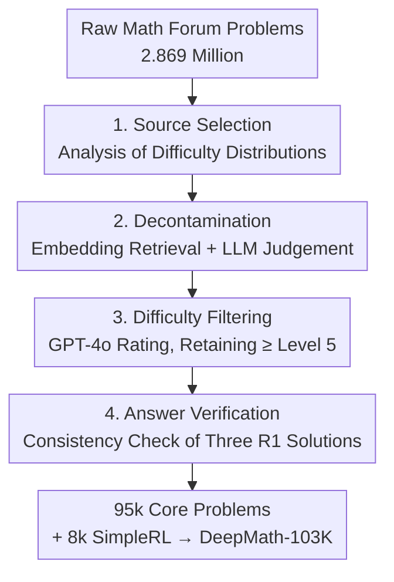

# DeepMath-103K: A Large-Scale, Challenging, Decontaminated, and Verifiable Mathematical Dataset for Advancing Reasoning

**Conference**: ICLR2026  
**OpenReview**: [https://openreview.net/forum?id=kHB5Te5IWm](https://openreview.net/forum?id=kHB5Te5IWm)  
**Code**: https://github.com/zwhe99/DeepMath | Dataset: https://hf.co/datasets/zwhe99/DeepMath-103K  
**Area**: LLM Reasoning / Mathematical Reasoning / Training Datasets / RLVR  
**Keywords**: Mathematical Reasoning Dataset, Verifiable Reward, Decontamination, Difficulty Filtering, Reinforcement Learning

## TL;DR
DeepMath-103K is a large-scale mathematical reasoning training set specifically designed for Reinforcement Learning from Verifiable Rewards (RLVR). Starting from 2.869 million raw math forum problems, it undergoes rigorous decontamination, difficulty filtering (primarily levels 5–9), and answer verifiability checks. The resulting 103,000 high-difficulty problems have almost no overlap with mainstream evaluation benchmarks, each featuring machine-verifiable answers and three R1-generated solutions. Models trained with RL on this dataset lead in benchmarks like AIME and MATH500, generalizing to non-mathematical reasoning tasks such as biology, physics, and chemistry.

## Background & Motivation
**Background**: Training large models for complex mathematical reasoning using Reinforcement Learning (RL)—represented by the RLVR route of DeepSeek-R1—has proven highly promising. By providing a **final answer verifiable by rules** (+1 for correct, -1 for incorrect), reasoning capabilities can be optimized directly without training a reward model, making it more resilient to reward hacking.

**Limitations of Prior Work**: However, this route is bottlenecked by training data. The authors analyzed existing public mathematical datasets and found they lack at least one of four dimensions crucial for RLVR: (1) **Insufficient Difficulty**—many problems concentrate at levels 1–5, failing to challenge strong models; (2) **Severe Contamination**—much of the data significantly overlaps with benchmarks like AIME, AMC, and MATH500, making high scores untrustworthy; (3) **Unverifiable Answers**—open-ended or overly complex answers cannot be automatically scored by rules, precluding RLVR usage; (4) **Scale**—it is difficult to satisfy the above criteria simultaneously at a large scale.

**Key Challenge**: A deeper issue is data **homogenization**. Most public datasets are recombinations of existing, well-formatted libraries like AIME, GSM8K, and MATH. This "repackaging" leads to massive overlaps and a lack of truly novel, diverse problems. Common resources are being repeatedly exploited and are reaching exhaustion.

**Goal**: To create a mathematical RLVR training set that simultaneously satisfies "High Difficulty + Decontaminated + Verifiable + Large Scale + High Diversity," and to prove it can train stronger, more generalizable reasoning models.

**Key Insight**: Instead of circling within structured but homogeneous public libraries, the authors turn to **more primitive, messy, but diverse** data sources—primarily informal discussion posts from math forums like Math StackExchange. These contents are poorly formatted and require extensive cleaning, but they contain many novel and difficult problems that have not been repeatedly harvested.

**Core Idea**: A four-stage pipeline: "Source difficulty analysis → Strict decontamination → Difficulty filtering → Answer consistency verification," distilling 103,000 structured, verifiable, high-difficulty problems from messy forum discussions.

## Method

### Overall Architecture
DeepMath-103K is not a "method/model" but a **dataset** and its construction pipeline. Thus, the "method" refers to how the data was created and the structure of each sample.

**Data Sample Structure**: Each problem is a comprehensive sample containing five fields: **Question** (problem statement), **Final Answer** (rule-extractable and verifiable, the basis for RLVR rewards), **Difficulty** (numerical score for curriculum learning/difficulty-aware training/adaptive compute), **Topic** (hierarchical tags covering sub-topics of calculus, algebra, geometry, number theory, discrete math, etc.), and **R1 Solutions** (three distinct reasoning paths generated by DeepSeek-R1, suitable for SFT and other training paradigms).

**Construction Pipeline**: Starting from a pool of 2.869 million raw questions, the data undergoes four stages: decontamination, difficulty filtering (retaining level $\ge 5$), and answer verifiability filtering to yield 95,000 core difficult problems. This is supplemented by 8,000 problems (levels 3–5) from SimpleRL to broaden difficulty coverage, resulting in 103,000 problems.

### Key Designs

**1. Source selection from "messy forums" rather than public libraries**

To address the bottleneck of "homogenization and insufficient difficulty," the authors first **analyzed the difficulty distributions of candidate sources**. Using methods from Gao et al. (2024), they found that datasets augmented from GSM8K/MATH (MetaMathQA, dart-math-hard, OpenMathInstruct-2) and NuminaMath-CoT are heavily biased toward low levels (1–5). In contrast, MMIQC and WebInstructSub, which crawl web content, have flatter distributions with significantly higher proportions of mid-to-high difficulty (5–9). Consequently, they selected the **Math StackExchange subset** from MMIQC and WebInstructSub as the primary source, adding NuminaMath-CoT for thematic diversity. This decision ensured the dataset's "difficult and diverse" foundation—t-SNE and deduplication analysis later showed **82.81K** problems unique to DeepMath-103K compared to other datasets.

**2. Semantic decontamination: Acknowledging and purging contamination**

To address untrustworthy evaluations due to "severe contamination," the authors performed a contamination analysis on the raw pool. Overlap with common benchmarks was strikingly high—**90%** for AIME24 and AMC23, 76.6% for MATH500, 35.7% for Minerva Math, and 33.6% for OlympiadBench. Without decontamination, models simply "memorize" benchmarks. They employed semantic-level decontamination using `paraphrase-multilingual-MiniLM-L12-v2` for embedding similarity to retrieve the top-$k$ ($k=5$) most similar samples from target benchmark test sets. An LLM-Judge (Llama-3.3-70B-Instruct) then compared the candidate with these five to identify paraphrases or duplicates. This caught not only exact matches but also "numerical changes" or "rewordings." Benchmarks covered included MATH, AIME, AMC, Minerva, OlympiadBench, Omni-MATH, GAOKAO, JEEBench, MMLU-STEM, GSM8K, GPQA, and more.

**3. Difficulty filtering using repeated GPT-4o scoring**

Following Zeng et al. (2025), which suggests that RL training data difficulty must align with model capability—and that strong models benefit specifically from hard problems—difficulty filtering was implemented as an independent stage. **GPT-4o** was prompted to rate each problem based on AoPS criteria. For robustness, **each problem was queried 6 times and averaged**. Only problems with a difficulty level $\ge 5$ were retained for the 95,000 core set, supplemented by 8,000 level 3–5 problems (from SimpleRL) to ensure a continuous difficulty range.

**4. Two-stage answer verification: Ensuring rule-based scoring**

This stage is critical for RLVR, where rule-based rewards are required. Challenges include open-ended questions without clear final answers and overly complex answers (e.g., long expressions) that defy automatic validation. The authors used: (1) **Question Filtering & Standardization**—GPT-4o processed raw questions to discard unsuitable formats and rewrite conversational prompts into standard "find a single value/symbolic answer" formats; (2) **Consistency Verification**—DeepSeek-R1 generated **three distinct reasoning paths**. A rule-based verifier extracted final answers from these (and the original source, if available). **Only problems where all extracted answers were identical** were retained. This filtered out unsolvable/unextractable cases and significantly reduced answer errors.

## Key Experimental Results

The authors trained a series of **DeepMath** models using two RL paradigms: **Zero RL** (starting from un-finetuned base models using GRPO with DAPO correction and +1/-1 rewards) and **RL** (starting from instruction-tuned models). Evaluation used pass@1 (average of 16 samples), temperature 0.6, top-p 0.95, and max tokens 32K, with all baselines re-tested under a unified script.

### Main Results (Mathematical Reasoning, pass@1)

| Model (Training Data = DeepMath-103K) | MATH500 | AMC23 | Olympiad | Minerva | AIME24 | AIME25 |
|------|------|------|------|------|------|------|
| Qwen-2.5-7B (base) | 54.8 | 35.3 | 27.8 | 16.2 | 7.7 | 5.4 |
| └ **DeepMath-Zero-7B** | **85.5** | **64.7** | **51.0** | **45.3** | **20.4** | **17.5** |
| Qwen-2.5-Math-7B (base) | 46.9 | 31.9 | 15.8 | 15.5 | 11.2 | 4.4 |
| └ **DeepMath-Zero-Math-7B** | **86.9** | **74.7** | **52.3** | **49.5** | **34.2** | **23.5** |
| OpenMath-Nemotron-1.5B | 91.8 | 90.5 | 70.3 | 26.3 | 61.3 | 50.6 |
| └ **DeepMath-Omn-1.5B** | **93.2** | **94.2** | **73.4** | **28.3** | **64.0** | **57.3** |

- Under Zero RL, DeepMath-Zero-Math-7B (starting from Qwen-2.5-Math-7B) gained +23.0 on AIME24 and +19.1 on AIME25, outperforming concurrent baselines like ORZ-7B and Eurus-2-PRIME.
- **DeepMath-Omn-1.5B scored 64.0 on AIME24 and 57.3 on AIME25, surpassing o1-mini (63.6 on AIME24) and low-compute o3-mini (60.0)**—a 1.5B model beating closed-source reasoning models.

### Ablation Study (Mean Acc., Table 3)

| Configuration | Mean Acc. | Description |
|------|------|------|
| Base (Qwen-2.5-Math-7B) | 21.2 | Starting Point |
| + ORZ-129K | 50.7 | Representative Open Set |
| + DeepMath-103K | 52.5 | Ours alone exceeds ORZ-129K |
| − Difficulty Filtering | 49.1 | Removing filtering drops acc from 52.5 to 49.1 |
| + Both (ORZ + DeepMath) | 53.0 | Complementary, best performance |

### Key Findings
- **Difficulty Filtering is Necessary**: Removing the filtering stage dropped accuracy from 52.5% to 49.1%, validating the strategy of retaining level $\ge 5$ problems.
- **DeepMath-103K is Complementary**: It outperforms ORZ-129K alone, but combined they yield the highest score (53.0). t-SNE reveals DeepMath-103K fills unique problem spaces.
- **Cross-Domain Generalization**: DeepMath models achieved top scores on GPQA-Diamond (Biology/Physics/Chemistry), MMLU-STEM, and BBH—e.g., DeepMath-Zero-7B achieved 41.7 on GPQA-Diamond (base: 25.3), suggesting pure math RL transfers multi-step reasoning to non-math domains.

## Highlights & Insights
- **Honest Approach to Contamination**: Instead of avoiding the 90% contamination rate in raw data, the authors exposed and used it as justification for rigorous decontamination, enhancing dataset credibility.
- **Reusable Paradigm**: Semantic decontamination (top-k retrieval + LLM Judge) and three-path consistency checks are paradigms easily transferable to other RLVR tasks like coding or science QA.
- **Source Diversity over Algorithmic Tweaks**: When public libraries become homogeneous, turning to messy but novel forum sources and building a structured cleaning pipeline is a more effective way to break the data bottleneck.
- **Math RL for General Reasoning**: A notable "Aha!" moment—performing RLVR solely on math problems significantly boosts bio/physics/chem reasoning, indicating that RLVR trains generalized multi-step reasoning rather than just math memorization.

## Limitations & Future Work
- **GPT-4o Dependency for Rating**: Difficulty scores depend on GPT-4o; while averaged and validated by humans, different models or versions might yield inconsistent calibrations.
- **Benchmark-Specific Decontamination**: Decontamination was performed against a fixed list; overlap with unknown or future benchmarks cannot be guaranteed.
- **Bias Toward Objective Questions**: The verification pipeline filters out open-ended or complex-structured problems, biasing the set toward single-value/symbolic answer problems and limiting coverage of proof-based reasoning.
- **Future Directions**: Introducing more empirical difficulty markers (e.g., multi-model pass rates) and expanding verifiability to formal proofs (e.g., using Lean).

## Related Work & Insights
- **vs ORZ-129K / DAPO-17K / Open-R1**: These are mostly re-packaged public libraries with overlapping distributions and lower difficulty. DeepMath-103K uses forum sources, strict filtering, and contains 82.81K unique problems.
- **vs DeepSeek-R1 (RLVR Paradigm)**: This work adopts the R1 rule-based reward logic and consistency check strategy. It focuses on the "what data to feed" aspect, proving data quality is the key bottleneck for RLVR gains.
- **vs SimpleRL (Zeng et al.)**: Adopts the insight that training difficulty should align with model capacity and incorporates 8k level 3–5 problems from SimpleRL for coverage.

## Rating
- Novelty: ⭐⭐⭐⭐ Dataset-focused; innovation lies in source strategy and the systematic pipeline combination.
- Experimental Thoroughness: ⭐⭐⭐⭐⭐ Evaluated across multiple scales/bases, math + cross-domain, with extensive ablation and contamination analysis.
- Writing Quality: ⭐⭐⭐⭐⭐ Clearly articulated four-stage pipeline; the rationale for data construction is transparent.
- Value: ⭐⭐⭐⭐⭐ Open-source data, code, and weights; 1.5B beating o1-mini makes it a high-value resource for the RLVR community.

<!-- RELATED:START -->

## Related Papers

- [\[ICLR 2026\] HardcoreLogic: Challenging Large Reasoning Models with Long-tail Logic Puzzle Games](hardcorelogic_challenging_large_reasoning_models_with_long-tail_logic_puzzle_gam.md)
- [\[ICLR 2026\] AgentMath: Empowering Mathematical Reasoning for Large Language Models via Tool-Augmented Agent](agentmath_empowering_mathematical_reasoning_for_large_language_models_via_tool-a.md)
- [\[ICLR 2026\] Pruning Long Chain-of-Thought of Large Reasoning Models via Small-Scale Preference Optimization](pruning_long_chain-of-thought_of_large_reasoning_models_via_small-scale_preferen.md)
- [\[ICLR 2026\] Random Policy Valuation is Enough for LLM Reasoning with Verifiable Rewards](random_policy_valuation_is_enough_for_llm_reasoning_with_verifiable_rewards.md)
- [\[ICLR 2026\] AceReason-Nemotron 1.1: Advancing Math and Code Reasoning through SFT and RL Synergy](acereason-nemotron_11_advancing_math_and_code_reasoning_through_sft_and_rl_syner.md)

<!-- RELATED:END -->
