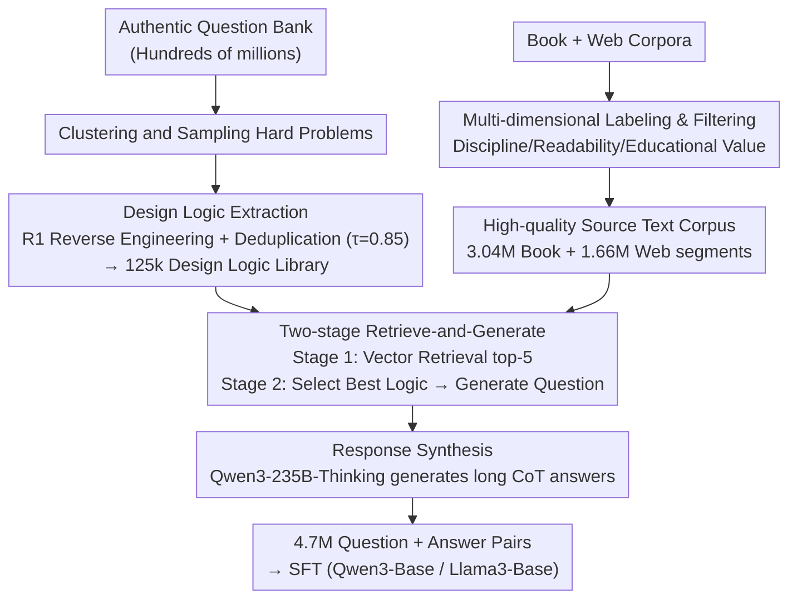

# DESIGNER: Design-Logic-Guided Multidisciplinary Data Synthesis for LLM Reasoning

**Conference**: ICLR 2026  
**arXiv**: [2508.12726](https://arxiv.org/abs/2508.12726)  
**Code**: [https://attention-is-all-i-need.github.io/Design-Logic-Reasoning](https://attention-is-all-i-need.github.io/Design-Logic-Reasoning)  
**Area**: LLM Reasoning  
**Keywords**: data synthesis, design logic, multidisciplinary reasoning, question generation, SFT

## TL;DR
This paper proposes Design Logic—reusable meta-knowledge reverse-engineered from authentic exam questions—to guide the synthesis of multidisciplinary reasoning problems from raw text. The authors constructed 4.7 million reasoning questions across 75 disciplines; base models fine-tuned on this data (SFT) even surpass official models that underwent full post-training.

## Background & Motivation

**Background**: LLMs have shown significant improvements in mathematical and programming reasoning (benefiting from abundant open question sources on competition platforms), but they still lag behind human experts in university-level multidisciplinary reasoning. The primary bottleneck is the severe lack of high-quality multidisciplinary reasoning training data.

**Limitations of Prior Work**: (a) **Query-centric methods** (e.g., Evol-Instruct) expand data by rewriting seed questions but are limited by seed coverage and model bias; (b) **Document-centric methods** generate questions from text but struggle to control difficulty and diversity, often devolving into simple factual recall; (c) Existing datasets have heavily skewed disciplinary distributions (with mathematics being the majority), lacking sufficient cross-disciplinary coverage.

**Key Challenge**: How to synthesize exam-level questions from raw text (books, web pages) on a large scale with multi-step reasoning depth, controllable difficulty, and high diversity? The lack of guiding principles prevents LLMs from knowing how to transform knowledge into complex problems.

**Goal**: To provide a systematic multidisciplinary reasoning data synthesis pipeline that synthesizes not just questions, but "question generation methodologies."

**Key Insight**: Human education experts follow a structured design process when creating questions (identifying goals → constructing context → designing reasoning paths → creating distractors → verification). If this "Design Logic" can be extracted from authentic questions, it can serve as a reusable template for new source texts.

**Core Idea**: Reverse-engineer 125,000 "Design Logics" (meta-knowledge for question generation) from authentic questions. Then, use retrieve-and-generate to match these logics with raw text, guiding the LLM to generate questions from new text following the same reasoning patterns.

## Method

### Overall Architecture
The core challenge addressed in this paper is how to synthesize university/graduate-level multidisciplinary exam questions with sufficient reasoning depth and controllable difficulty from "non-question" texts like books and web pages. The authors posit that simply letting an LLM "generate questions based on text" results in factual recall; what is missing is the "question generation methodology." Thus, the pipeline prepares two sets of inputs in parallel: one reverse-engineers **Design Logic** from 132,000 selected authentic questions to form a reusable logic library (125k entries); the other processes book and web corpora through multi-dimensional labeling and filtering to build a clean, multidisciplinary **High-Quality Source Text Corpus**. These inputs converge in a **Two-stage Retrieve-and-Generate** process: first, candidate logics are coarsely retrieved for each text segment via vector similarity, then a strong model selects the most suitable logic to strictly follow its steps for question generation. Finally, **Response Synthesis** provides a long CoT reference answer for each question, forming "question + answer" pairs for SFT.

### Key Designs

**1. Design Logic Extraction: Explicitly converting implicit human methodology into transferable meta-knowledge**

Generating questions directly from text often fails because LLMs do not understand how a "good question" is designed. This step externalizes the implicit process of human examiners: DeepSeek-R1 is used to analyze questions line-by-line to (i) infer the designer's thought process, (ii) trace the construction path from knowledge points to the final question, and (iii) abstract it into structured design principles (expressed in Mermaid format). After extraction, deduplication is performed based on Qwen3-Embedding semantic similarity and graph clustering, using a threshold of $\tau=0.85$ to merge redundant logics, resulting in 125,328 unique Design Logics. A key property of these logics is that they are **decoupled from specific disciplinary content**: the same logic (e.g., "given a set of constraints, infer the unique feasible solution") can be applied to different knowledge points in physics, economics, or law, making the "question generation ability" a transferable and scalable asset.

**2. High-quality Source Text Corpus Construction: Providing clean and broad "raw materials" for design logic**

Even with good logic, poor or biased source text will not yield good questions. This step filters the raw materials. Book corpora are processed at the chapter level: MinHash deduplication, discipline labeling via ModernBERT classifier, readability assessment via BERT, and educational value assessment via fineweb-edu-classifier, resulting in 3 million high-quality segments. Web corpora are filtered from 6.5B texts in FineFineWeb using Qwen3-30B for 5-tier scoring (retaining scores $\ge 3$), followed by discipline re-labeling to a unified 75-discipline taxonomy. The two sources are complementary: textbooks provide structure and depth, while web pages offer breadth and contemporary topics.

**3. Two-stage Retrieve-and-Generate Question Synthesis: Coarsely filtering then precisely matching to avoid combinatorial explosion**

Pairing 125k logics with millions of text segments would cause a combinatorial explosion, so synthesis is split into two stages. Stage 1 (Coarse Retrieval): Source text and all Design Logics are encoded into vectors, and the top-5 candidate logics are retrieved via cosine similarity. Stage 2 (Precise Matching + Generation): DeepSeek-R1 selects the most compatible logic from the 5 candidates and **strictly follows its steps** to generate a graduate-level exam question and reference solution from the source text. For example, for an economics text on "market equilibrium," the retrieval might return logics for "multi-constraint inference," and the precise match might select one requiring "calculating new equilibrium and explaining mechanisms given supply/demand functions and external shocks," resulting in an analytical problem rather than a simple definition.

**4. Response Synthesis: Equipping each question with high-quality long-chain reasoning answers**

Every question needs a learnable solution. In this step, Qwen3-235B-A22B-Thinking generates a long CoT answer for each synthesized question. The resulting "question + long reasoning answer" pairs are used for SFT. A strong "Thinking" model is used because the questions themselves are highly difficult, and the reasoning quality of the answer determines how much the student model can learn.

### Loss & Training
- SFT: Standard autoregressive loss, trained on Qwen3-Base and Llama3-Base.
- Data Scale: 3.04M DLR-Book + 1.66M DLR-Web = 4.7M questions, covering 75 disciplines.
- Deduplication: MinHash + 13-gram decontamination (targeted at all evaluation benchmarks).

## Key Experimental Results

### Main Results

| Model | MMLU | MMLU-Pro | GPQA-Diamond | SuperGPQA |
|------|------|----------|-------------|-----------|
| Llama-3.1-8B-Instruct (Official) | 70.86 | 47.38 | 23.18 | 20.08 |
| **Llama-3.1-8B-SFT (Ours: DLR-Web+Book)** | **84.13** | **76.04** | **65.45** | **45.06** |
| Qwen3-4B Thinking (Official) | 82.87 | 69.34 | 54.70 | 43.30 |
| **Qwen3-4B-Base-SFT (Ours: DLR-Web+Book)** | **85.00** | **73.06** | **63.69** | **46.15** |

The base model SFT-ed only with DLR data **surpasses** the official models that underwent full post-training!

### Ablation Study

| Data Source | MMLU | GPQA-Diamond | Note |
|--------|------|-------------|------|
| DLR-Web only | 83.55 | 53.74 | Web source |
| DLR-Book only | 84.73 | 62.58 | Book source is better (higher educational depth) |
| DLR-Web + Book | **85.00** | **63.69** | Combination is best |
| OpenThoughts3 (Baseline) | -- | ~50 | Design Logic data is superior |

### Key Findings
- **Design Logic synthesis significantly increases difficulty**: The proportion of "Very Hard" questions far exceeds all baseline datasets and benchmarks, while "Easy" questions account for only 0.27%-0.72%.
- **Diversity far exceeds baselines**: Leads across 5 semantic diversity metrics; 1-NN Distance is approximately twice that of baselines, indicating almost no semantic repetition.
- **Most balanced disciplinary coverage**: Covers 75 disciplines across STEM, Humanities, Social Sciences, and Applied Sciences, whereas existing datasets are heavily biased toward math.
- **Book source > Web source**: DLR-Book outperforms DLR-Web on most metrics because textbooks provide more structured, in-depth knowledge.
- **SFT Base > Official Post-training**: This is the most striking finding—SFT with high-quality synthetic data alone can outperform official models that include RL, DPO, and full post-training workflows.

## Highlights & Insights
- **Design Logic as Reusable Meta-knowledge**: This is a fundamental innovation—it synthesizes "question generation ability" rather than just data. 125k Design Logics can be infinitely reused on new texts to achieve scalability.
- **"Questions are more important than answers"**: Echoing Einstein's sentiment, the authors emphasize the core importance of high-quality questions. Given a good question, most models can generate an answer—similar to the insight that "a good prompt is more important than a good model."
- **4.7M questions across 75 disciplines**: This is currently the largest multidisciplinary reasoning dataset, with quality (difficulty + diversity) surpassing baselines.
- **Implications for Post-training**: SFT data quality >> full SFT+RL+DPO pipeline with lower-quality data. This challenges the assumption that RL is strictly necessary for high performance.

## Limitations & Future Work
- Design Logic extraction depends on existing question banks—if a discipline lacks available exam questions, logic cannot be extracted.
- answer CoT accuracy is ~71.48% (due to the diversity of open-ended questions), which may introduce noise during SFT.
- RL training was not explored—would adding RL/DPO on DLR data lead to further gains?
- The 75-discipline classification relies on LLM labeling, with an accuracy of 90.14%, implying ~10% mislabeling.

## Related Work & Insights
- **vs. Evol-Instruct (Query-centric)**: Limited by seed coverage and cannot easily cross disciplines. DESIGNER starts from text, allowing for much broader coverage.
- **vs. NaturalReasoning/WebInstruct (Document-centric)**: Lacks guidance for question design, often resulting in factual recall. Design Logic provides structured control.
- **vs. Nemotron-Post-Training**: Balanced disciplinary distribution but low difficulty. DLR outperforms in both difficulty and diversity.
- **vs. OpenThoughts3**: Good reasoning depth but heavily biased toward math. DLR shows a massive advantage in non-math disciplines.

## Rating
- Novelty: ⭐⭐⭐⭐⭐ The concept of Design Logic and the reverse-engineering methodology are major new contributions.
- Experimental Thoroughness: ⭐⭐⭐⭐⭐ Comprehensive evaluation across Qwen3 + Llama3, multiple benchmarks, data quality analysis, and ablations.
- Writing Quality: ⭐⭐⭐⭐ The pipeline is clearly described, though the paper is more engineering-oriented with less theoretical analysis.
- Value: ⭐⭐⭐⭐⭐ 4.7M multidisciplinary reasoning questions + 125k Design Logics are extremely valuable to the LLM post-training community.

<!-- RELATED:START -->

## Related Papers

- [\[ICLR 2026\] On the Design of KL-Regularized Policy Gradient Algorithms for LLM Reasoning](on_the_design_of_kl-regularized_policy_gradient_algorithms_for_llm_reasoning.md)
- [\[ICLR 2026\] Reference-guided Policy Optimization for Molecular Optimization via LLM Reasoning](reference-guided_policy_optimization_for_molecular_optimization_via_llm_reasonin.md)
- [\[ICLR 2026\] A Balanced Neuro-Symbolic Approach for Commonsense Abductive Logic](a_balanced_neuro-symbolic_approach_for_commonsense_abductive_logic.md)
- [\[ICML 2026\] An Information-Theoretic Criterion for Efficient Data Synthesis](../../ICML2026/llm_reasoning/an_information-theoretic_criterion_for_efficient_data_synthesis.md)
- [\[ICLR 2026\] HardcoreLogic: Challenging Large Reasoning Models with Long-tail Logic Puzzle Games](hardcorelogic_challenging_large_reasoning_models_with_long-tail_logic_puzzle_gam.md)

<!-- RELATED:END -->
