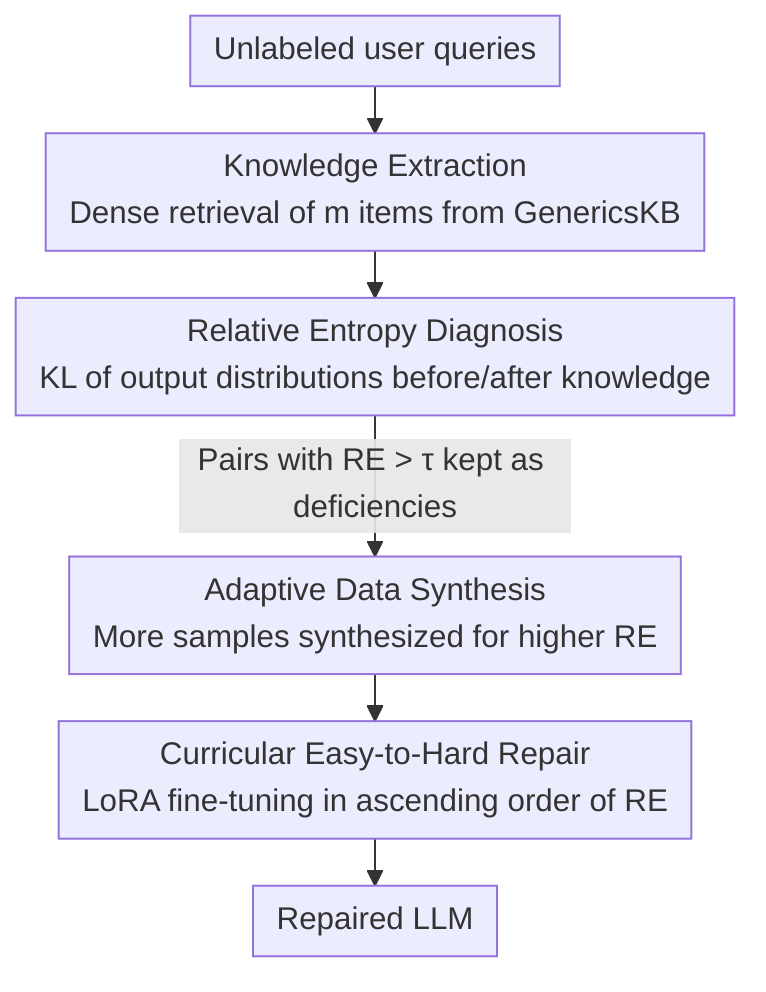

# Diagnosing and Remedying Knowledge Deficiencies in LLMs via Label-free Curricular Meaningful Learning

**Conference**: ICLR2026  
**OpenReview**: [https://openreview.net/forum?id=qVadFFSfrI](https://openreview.net/forum?id=qVadFFSfrI)  
**Code**: https://github.com/Waste-Wood/LaMer  
**Area**: LLM Reasoning / Knowledge Deficiency Diagnosis / Data Synthesis / Curriculum Learning  
**Keywords**: Relative Entropy, Label-free Diagnosis, Curriculum Learning, Meaningful Learning, Knowledge Augmentation

## TL;DR
LaMer utilizes the "relative entropy of model output distributions before and after incorporating external knowledge" as a **label-free** probe to locate and quantify knowledge deficiencies in LLMs. It then adaptively synthesizes data based on deficiency severity and repairs them through easy-to-hard curriculum fine-tuning, matching or exceeding label-dependent methods with only 40% of the training data.

## Background & Motivation
**Background**: To improve the reliability of pre-trained LLMs, the mainstream approaches are unsupervised language modeling (continued training on massive unlabeled corpora) and supervised fine-tuning (SFT) (training on labeled task data). The former allows implicit knowledge absorption, while the latter aligns the model with specific tasks.

**Limitations of Prior Work**: Both approaches operate "blindly." Unsupervised modeling and SFT tend to feed data **indiscriminately**. Knowledge the model already possesses is repeatedly reinforced, while actual weak points remain uncovered, leading to inefficiency and difficulty in addressing long-tail issues. Relying on labeled user queries to expose errors is costly, and using limited labeled samples to comprehensively evaluate a model with high generalization capability is inherently difficult.

**Key Challenge**: Knowledge acquisition in LLMs is **implicit**, making it opaque to external observers where the model's strengths and weaknesses lie. This opacity prevents targeted improvements. Furthermore, reasoning errors often stem not from a lack of reasoning ability, but from a **lack of knowledge or ineffective application of knowledge**.

**Goal**: Without relying on any labels, (1) diagnose and quantify the severity of knowledge deficiencies for each LLM; (2) repair these deficiencies efficiently and purposefully.

**Key Insight**: The authors leverage Relative Entropy (KL Divergence) from information theory, which measures the "additional information required to transform one distribution into another." If providing external knowledge causes a **drastic shift** in the model's predicted output distribution, it indicates the knowledge provides significant new information, exposing a deficiency. This signal naturally requires no labels.

**Core Idea**: Use the "relative entropy before and after knowledge supplementation" as a label-free deficiency probe, then perform "adaptive synthesis by severity quota + easy-to-hard curriculum training" to fix the diagnosed deficiencies. This creates a closed loop of "evaluation and repair" without human labeling (referred to as indirect supervision).

## Method

### Overall Architecture
LaMer takes a batch of **unlabeled** user queries and outputs an LLM with repaired knowledge deficiencies. The pipeline consists of three sequential steps: first, retrieve relevant knowledge from an external database for each query; second, use relative entropy to determine if the knowledge constitutes "new information" for the current model $L$, identifying (knowledge, query) pairs with high relative entropy as deficiencies and recording their severity; finally, adaptively synthesize varying numbers of training samples per deficiency based on severity and fine-tune $L$ using LoRA in an easy-to-hard curriculum order.

While the first step of "knowledge extraction" is a standard component (dense retrieval), the three core contributions are **relative entropy diagnosis**, **adaptive synthesis by severity**, and **curricular easy-to-hard repair**.

### Key Designs

**1. Relative Entropy Diagnosis: Using distributional shifts as label-free probes**

This is the pivot of the paper, addressing the lack of labels. External knowledge is treated as an intervention variable. Given a query $d$ (input $I$), the model $L$ generates $n$ candidate answers $O=\{o_1,\dots,o_n\}$. The negative log-likelihood (NLL) of each answer given only $I$ is calculated and normalized via softmax to obtain the **prior distribution** $P$. Then, a retrieved knowledge piece $k$ is prepended to the context, and NLLs are recalculated to obtain the **posterior distribution** $Q$:

$$p_i = L(o_i\mid I),\quad P=\mathrm{Softmax}([p_1,\dots,p_n]);\qquad q_i = L(o_i\mid k, I),\quad Q=\mathrm{Softmax}([q_1,\dots,q_n]).$$

The relative entropy quantifies the deficiency concerning $k$:

$$\mathrm{RE} = -\sum_{i} P_i\,(\log Q_i - \log P_i).$$

Higher RE indicates more "additional information" provided by $k$—either the model did not know it or knew it but could not apply it. Pairs where RE exceeds a threshold $\tau$ are kept, and RE serves as a **severity metric**. The authors retain two types of deficiencies: knowledge making the model **more certain of the correct answer** (helpful) and knowledge making it **more certain of an incorrect answer** (misleading). Both contribute significantly to the repair samples.

**2. Adaptive Data Synthesis: Feeding more where the gap is larger**

Diagnosis identifies "where and how weak" the model is. To address the inefficiency of indiscriminate data feeding, the synthesis budget is allocated based on RE. Drawing from "meaningful learning" (internalizing knowledge by applying it in diverse contexts) and the observation that models require more tokens/samples for unfamiliar knowledge, deficiencies are categorized into four tiers with fixed quotas: Easy ($0.1\le\mathrm{RE}<0.4$) gets 1 sample; Normal ($0.4\le\mathrm{RE}<0.7$) gets 2; Hard ($0.7\le\mathrm{RE}<1.0$) gets 3; Unfair ($\mathrm{RE}\ge1.0$) gets 4. Samples $\langle X, Y\rangle$ are generated via ChatGPT targeting different scenarios.

**3. Curricular Easy-to-Hard Repair: Fixing light deficiencies before hard ones**

The order of training matters. Using curriculum learning, all synthesized samples are **sorted by ascending RE** of their corresponding deficiencies. The model $L$ is fine-tuned sequentially using LoRA on the standard conditional language modeling loss:

$$\mathcal{L}(X, Y, \theta) = -\sum_{t} \log p_\theta(Y_t\mid X, Y_{<t}).$$

The intuition is that fixing light deficiencies builds a foundation for severe ones. Ablations show that while shuffling the order (LaMer$^*$) leads to a slight performance drop, the main gain comes from the diagnosis itself. LoRA parameters: rank 128, $\alpha=8$, 3 epochs, learning rate 5e-5.

## Key Experimental Results

### Main Results
Evaluated across 4 open-source LLMs (Mistral-7B, LLaMA-3-8B, Qwen2-7B, Gemma-1.1-2B) on 7 OOD reasoning/understanding benchmarks (Comm., AGIEval, ARC, MMLU, BBH, CRASS, GSM-Plus). Average scores:

| LLM | Base | AugGPT | Naive | Single (40% Data) | LaMer |
|-----|------|--------|-------|--------|-------|
| Mistral-7B | 50.62 | 52.33 | 52.52 | 52.74 | **56.09** |
| LLaMA-3-8B | 62.82 | 55.63 | 61.90 | 61.26 | **64.70** |
| Qwen2-7B | 63.34 | 60.04 | 65.31 | 63.81 | **66.13** |
| Gemma-1.1-2B | 33.07 | 32.50 | 32.58 | 31.51 | **34.08** |

LaMer ranks first across all models. Indiscriminate augmentation (AugGPT/Naive) caused **performance drops** on LLaMA-3 and Gemma-1.1 (redundant knowledge causing forgetting of useful knowledge). "Single" (one sample per deficiency) matched or exceeded Naive despite using only 40% of the data.

### Ablation Study

| Configuration | Key Metrics (Avg Trend) | Description |
|------|------|------|
| LaMer (Full) | Mistral 56.09 / LLaMA-3 64.70 / Qwen 66.13 / Gemma 34.08 | Full methodology |
| LaMer$^*$ (Shuffled) | Mistral 55.64 / LLaMA-3 64.47 / Qwen 65.50 / Gemma 33.80 | Slightly lower than LaMer but above all baselines |
| Diagnosis Sub-module (e-CARE, P/R/F1) | Relative Entropy 40.34 / 64.30 / **49.58** vs Perplexity 40.10 / Random 35.23 | RE recalls more deficiencies; F1 significantly higher than PPL |

### Key Findings
- **Diagnosis Signal is the Primary Gain**: LaMer$^*$ (shuffled order) outperforms all baselines, proving that "accurate diagnosis via relative entropy" is more critical than "training order."
- **Label-free Competes with Labeled**: Compared to LLM2LLM (which relies on labels to find errors), LaMer holds its own. While LLM2LLM finds precise errors, it is limited to the initial labeled set; LaMer's diagnosis has **broader coverage**.
- **Helpful vs. Misleading Knowledge**: Both deficiency types are equally important for repair. Misleading deficiencies (known but easily swayed) are slightly more significant as they have a larger impact.
- **Task Affinity**: AugGPT performs worst on multi-step reasoning (e.g., GSM-Plus) as it provides direct answers without computation processes, but performs well on single-step tasks (e.g., ARC on Qwen2).

## Highlights & Insights
- **Evaluation as a Differentiable Signal**: Using relative entropy to measure "strangeness" of knowledge bypasses labels and creates a closed loop. This "distributional perturbation as a probe" can be transferred to hallucination detection or boundary probing.
- **Pragmatic Severity-to-Quota Mapping**: Quantifying the synthesis budget based on RE avoids the common SFT pitfall of feeding massive amounts of data in the wrong places.
- **Misleading Knowledge as Deficiency**: While RAG systems often discard "knowledge that causes errors" as noise, this paper treats it as a specific deficiency ("known but easily misled") and repairs it, offering a novel perspective.
- **Diagnostic Utility**: LaMer provides a readable profile of an LLM's weaknesses (deficiency list + severity), offering direct value for iterative model development.

## Limitations & Future Work
- Diagnosis depends on the GenericsKB knowledge base (approx. 200K facts) and dense retrieval quality. If the query distribution is far from the DB (e.g., GSM8K math), ChatGPT must generate knowledge on the fly, adding noise and cost.
- The 4-tier quotas (1/2/3/4 samples) and threshold $\tau=0.1$ are heuristic. Their sensitivity across different data/models is not fully explored.
- Synthesis relies on gpt-3.5-turbo, inheriting its biases and quality limits. The efficacy of "distillation from a stronger model" for already powerful models remains unverified.
- Evaluation is limited to models ≤8B. Distribution estimation using $n=2$ candidate answers is relatively coarse; scalability to larger models/candidate sets is unknown.

## Related Work & Insights
- **vs. Unsupervised Continued Training / SFT (AugGPT, Naive)**: These feed data indiscriminately, causing redundant learning and potential forgetting. LaMer's targeted repair with 40% of the data avoids negative transfer.
- **vs. Single (1 sample per deficiency)**: Validates adaptive quotas—severe deficiencies require more diverse samples to be fully repaired.
- **vs. LLM2LLM (Label-dependent)**: LLM2LLM is precise but narrow; LaMer achieves broader coverage without labels.
- **vs. Perplexity Diagnosis**: RE significantly outperforms PPL on the e-CARE benchmark (F1 49.58 vs 40.10) because it measures "information gain" rather than simple output uncertainty.

## Rating
- Novelty: ⭐⭐⭐⭐ Using relative entropy as a label-free probe and treating misleading knowledge as a deficiency is novel, though individual components (retrieval, curriculum learning, distillation) are established.
- Experimental Thoroughness: ⭐⭐⭐⭐ 4 models × 7 benchmarks + comparison with labeled methods + diagnosis sub-module evaluation. Strong, though model sizes are small.
- Writing Quality: ⭐⭐⭐⭐ Logical flow from motivation to analysis. Clear examples.
- Value: ⭐⭐⭐⭐ Provides a low-cost, reusable toolkit for LLM deficiency diagnosis and repair, practical for improving open-source models.

<!-- RELATED:START -->

## Related Papers

- [\[ICLR 2026\] Enhancing LLMs for Knowledge Base Question Answering by Chain-of-Decomposition](enhancing_llms_for_knowledge_base_question_answering_by_chain-of-decomposition.md)
- [\[ACL 2026\] Learning to Edit Knowledge via Instruction-based Chain-of-Thought Prompting](../../ACL2026/llm_reasoning/learning_to_edit_knowledge_via_instruction-based_chain-of-thought_prompting.md)
- [\[ICML 2026\] Diagnosing Multi-step Reasoning Failures in Black-box LLMs via Stepwise Confidence Attribution](../../ICML2026/llm_reasoning/diagnosing_multi-step_reasoning_failures_in_black-box_llms_via_stepwise_confiden.md)
- [\[ICLR 2026\] Emergent Hierarchical Reasoning in LLMs through Reinforcement Learning](emergent_hierarchical_reasoning_in_llms_through_reinforcement_learning.md)
- [\[ICLR 2026\] Is In-Context Learning Learning?](is_in-context_learning_learning.md)

<!-- RELATED:END -->
## Related Papers

- [\[ACL 2026\] Learning to Edit Knowledge via Instruction-based Chain-of-Thought Prompting](../../ACL2026/llm_reasoning/learning_to_edit_knowledge_via_instruction-based_chain-of-thought_prompting.md)
- [\[ICLR 2026\] Emergent Hierarchical Reasoning in LLMs through Reinforcement Learning](emergent_hierarchical_reasoning_in_llms_through_reinforcement_learning.md)
- [\[ICLR 2026\] Is In-Context Learning Learning?](is_in-context_learning_learning.md)
- [\[ICLR 2026\] Beyond English-Centric Training: How Reinforcement Learning Improves Cross-Lingual Reasoning in LLMs](beyond_english-centric_training_how_reinforcement_learning_improves_cross-lingua.md)
- [\[ICLR 2026\] Fixing the Broken Compass: Diagnosing and Improving Inference-Time Reward Modeling](fixing_the_broken_compass_diagnosing_and_improving_inference-time_reward_modelin.md)

<!-- RELATED:END -->
