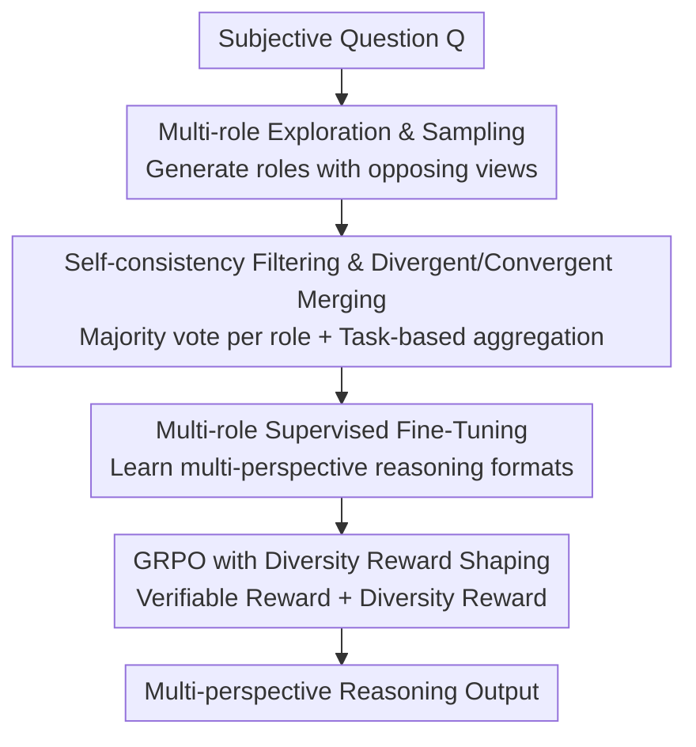

# Diversity-Enhanced Reasoning for Subjective Questions

**Conference**: ICLR 2026  
**OpenReview**: [https://openreview.net/forum?id=1Bf0tToGT1](https://openreview.net/forum?id=1Bf0tToGT1)  
**Code**: https://github.com/yumeng-10/multirole-r1 (Available)  
**Area**: LLM Reasoning  
**Keywords**: Subjective Reasoning, Diversity Enhancement, Role Perspective, GRPO, Reward Shaping

## TL;DR
This paper proposes MultiRole-R1, which integrates multiple stakeholder perspectives into a single long Chain-of-Thought (CoT) through "Role Perspective Diversity + Token-level Diversity." This is achieved via unsupervised SFT of synthesized reasoning chains followed by GRPO reinforcement learning with diversity reward shaping. The method improves both accuracy (by 10.6% on average) and diversity on subjective questions without unique correct answers, while also generalizing to objective math problems like AIME 2024.

## Background & Motivation
**Background**: Large Reasoning Models (LRMs) like DeepSeek-R1 and o1 excel at objective tasks with single standard answers (math, coding) through long-chain reasoning and Reinforcement Learning from Verifiable Rewards (RLVR).

**Limitations of Prior Work**: RLVR has a recognized side effect—it **compresses generation diversity**, forcing the model into a single mode that "converges to the unique correct answer." However, many real-world problems are **subjective**: answers vary based on the role, stance, and stakeholders of the questioner, meaning no unique right or wrong exists. Diversity enhancement methods in objective domains are built on optimization frameworks requiring a "ground truth," naturally learning to "find the correct answer," and fail to generate multiple answers valid for different roles.

**Key Challenge**: Subjective reasoning requires **semantic diversity anchored to real human stances**, rather than random noisy variations. However, RLVR suppresses diversity, and existing objective-domain methods do not align with the "multi-answer" nature of subjective tasks. Existing work on subjective questions is limited to multi-agent debate and prompt engineering, with **no specialized training methods** currently available.

**Goal**: Design a framework that directly trains LRMs for subjective reasoning, enabling them to learn "from which perspectives they should think" while maintaining sufficient diversity during inference.

**Key Insight**: The authors decompose diversity into two layers: (1) **Perspective/Semantic Diversity**: Using a set of real stakeholder roles to provide a "coherent scaffold," ensuring diverse outputs are semantically relevant and anchored to real populations; (2) **Token-level Diversity**: Expanding the search space of the reasoning chain. Pilot analysis revealed that longer thinking is beneficial for subjective tasks, but gains saturate at approximately 3 "Wait" tokens and 3 roles, leading to a "3-role + more-think" configuration.

**Core Idea**: Inject diversity into both the data and reinforcement stages via "Multi-role Reasoning Path Synthesis + GRPO with Diversity Reward Shaping," treating diversity itself as an optimization signal rather than a byproduct.

## Method

### Overall Architecture
Given a subjective question $Q$ and a reasoning model $M$, the objective is to produce a **diversified reasoning path** $T$. MultiRole-R1 operates in two sequential phases: **Phase 1** enhances perspective diversity by having the model synthesize reasoning chains merging multiple role perspectives for SFT, teaching it "not just to think deeper, but from which perspective to think." **Phase 2** enhances token-level diversity by running GRPO with diversity reward shaping on top of the SFT model, using diversity as an additional signal alongside verifiable rewards. The entire process is **trained only on subjective questions** but ultimately generalizes to objective tasks.

### Key Designs

**1. Multi-role Exploration & Sampling: Expanding Perspective Space with Opposing Roles**

Answers to subjective questions vary by stance, so the first step is to assemble a set of "conflicting" roles. The authors use few-shot prompting to generate $n$ question-related roles $R=\{R_1,...,R_n\}$ with **conflicting viewpoints** (experts, stakeholders, personas, etc.). Role selection probability is defined as $P(R_i|Q)=\mathrm{softmax}(E[M(R_i|Q)]+\alpha E_{R_i}[1-\mathrm{sim}(R_i,R_j)])$, where $\mathrm{sim}(R_i,R_j)=\cos(h_{R_i},h_{R_j}|Q)$ measures the cosine similarity of LLM embeddings. The intent is straightforward: ensuring roles are **relevant to the question** (first term) and **opposed to existing viewpoints** (higher $1-\mathrm{sim}$ is prioritized). This synthesis yields "perspective scaffolds" that are semantically coherent rather than random noise. Pilot analysis shows $n=3$ is the turning point, with diminishing returns for more roles.

**2. Self-consistency Filtering & Divergent/Convergent Merging: Stabilizing Roles then Aggregating by Task**

Sampling introduces noise, so $k$ paths are sampled for each role $R_i$ at temperature $\tau=1$, followed by **self-consistency filtering**. Majority voting keeps only the most consistent answer: $\hat T_{R_i}=\arg\max_{T}\sum_{j=1}^{k}\mathbb{1}(T\equiv T^{(j)}_{R_i})$, where $\equiv$ denotes semantic equivalence. This step eliminates jitter "within the same role," making opposing viewpoints **independent and self-consistent**. After obtaining $m$ filtered role perspectives, they are shuffled $\Pi$ to form training data (eliminating position bias) and merged based on task type: **Divergent Merging** (for tasks where roles should provide different answers, like CALI or GLOQA; the final prediction is a weighted aggregation) and **Convergent Merging** (for tasks where roles should reach a consensus, like BBQ or ETHICS; majority voting within the chain determines consensus). Accuracy evaluation follows these merging strategies: for Divergent, $\mathrm{Acc}_{div}=\frac1n\sum_i\mathbb{1}[a_i=g_i]$; for Convergent, aggregation is performed first $\hat a=\arg\max\sum_i\mathbb{1}(a_i=\hat a)$ before comparing with Ground Truth (GT).

**3. Multi-role Supervised Fine-Tuning: Embedding "Perspective Selection" into Model Behavior**

The merged multi-role reasoning chains are used for SFT, teaching the model to **automatically reason in a multi-role format** rather than laboring from a single perspective. Quality filtering is applied: responses in the top and bottom 10% of length are removed (inhibiting verbosity bias and reasoning shortcuts), and samples with formatting errors are discarded, leaving 2700 samples. The authors compared "self-consistency filtering" against "supervision filtering with ground-truth"—the former is unsupervised and does not rely on labeled role pools, proving this self-distilled perspective synthesis is the primary performance driver.

**4. GRPO with Diversity Reward Shaping: Injecting Diversity as a Reward Signal**

The second phase runs GRPO on the SFT model. The reward consists of two parts: **Multi-role aware Verifiable Reward** $R_{acc}$ (checking answer correctness per role) and a text-calculated **Diversity Reward** $R_{div}$. Total reward is $R=\delta R_{acc}+(1-\delta)R_{div}$. $R_{div}$ is a composite metric $D_{final}=\sum_i\omega_i D_i$, weighting eight linguistic diversity signals: vocabulary, token entropy, sentence length, sentence structure, adjacent sentences, Yule's K, distinct N-grams, and functional words. This follows the reward shaping paradigm—the auxiliary $R_{div}$ guides learning without altering the optimal strategy. A key mechanical insight: GRPO calculates group relative advantage $A_i=(R_{i,t}-\mu)/\sigma$. If rewards in a sample group are all 0 or 1, the advantage becomes zero, leading to gradient vanishing and stalled training. **Adding the diversity term ensures reward variance within the group**, keeping gradients informative and optimization continuous. Experiments also observed a **synergistic effect** between accuracy and diversity goals, while mitigating verbosity and repetitive reasoning issues from the SFT phase.

### Loss & Training
Two-phase serial training: Phase 1 performs multi-role SFT on self-consistency filtered data (2700 samples) using Llama-Factory. Phase 2 continues with GRPO using $R=\delta R_{acc}+(1-\delta)R_{div}$ as the reward. Backbones include R1-Distill-Qwen-7B/14B, R1-Distill-Llama-8B, and Qwen3-8B (Reasoning mode). Training uses only three subjective tasks: BBQ, GLOQA, and ETHICS.

## Key Experimental Results

### Main Results
Accuracy (Acc, pass@1 %) and Diversity (Div, length-normalized %). Example for R1-Distill-Qwen-7B: ID = Subjective tasks in training domain; OOD = Test only.

| Method | BBQ Acc | GLOQA Acc | ETHICS Acc | CALI(OOD) Acc | GSM8K(OOD) Acc |
|------|------|------|------|------|------|
| Zero-shot CoT | 62.45 | 32.62 | 51.82 | 50.30 | 80.48 |
| More think | 80.76 | 36.42 | 64.44 | 60.45 | 82.05 |
| SelfConsis SFT | 85.88 | 43.13 | 67.45 | 67.35 | 80.62 |
| SelfConsis SFT+DPO | 86.41 | 44.20 | 67.28 | 68.19 | 81.51 |
| SelfConsis SFT+GRPO | 94.30 | 47.22 | 69.50 | 70.83 | 85.58 |
| **MultiRole-R1 (SFT+GRPO-RS)** | **94.50** | **49.10** | 66.83 | **70.85** | **87.36** |

Overall, MultiRole-R1 gains **10.6% in Acc and 18.3% in Div** over zero-shot CoT. Gains are +14.1% for ID tasks and +7.64% for OOD tasks, including a +5.78% improvement on AIME 2024.

### Ablation Study

| Configuration | Function | Contribution |
|------|------|------|
| Full MultiRole-R1 | SFT (Self-Consis) + GRPO (RS) | +10.6% Average |
| Multi-role SFT Only | Inject perspective diversity | 7.5% (Major contributor) |
| GRPO Diversity Reward Shaping | Inject token-level diversity | 3.1% |
| Replace with DPO (off-policy) | On-policy comparison | +2.44% (Inferior to GRPO's +19.73%) |

### Key Findings
- **Perspective diversity is the main driver**: 7.5% of the 10.6% gain comes from perspective diversity in SFT, while 3.1% comes from token-level diversity in GRPO—indicating that "from which angles to think" is more important than simply expanding token search space.
- **On-policy is better for diversity enhancement**: GRPO outperforms DPO in both accuracy and diversity. The authors attribute this to DPO’s pairwise format being unable to model the "multiple equally valid answers" nature of subjective problems.
- **Gains come from diversity, not verbosity**: Average response lengths for SFT, SFT+GRPO, and MultiRole-R1 are 1572.9, 849.5, and 657.8 words respectively—the most accurate method is the shortest, contradicting the "longer thinking is better" test-time scaling intuition.
- **Diversity predicts accuracy better than length**: Per-task correlation $r=0.74$ for Acc-Div, significantly higher than $r=0.55$ for Acc-Len.

## Highlights & Insights
- **Turning diversity from a "side effect" into a "reward signal"**: While RLVR is criticized for suppressing diversity, this paper uses diversity as a reward to solve subjective tasks and fix the gradient vanishing issue in GRPO groups—one design addressing two problems.
- **Roles as Coherent Scaffolds**: Using opposing real roles to span diversity is more sophisticated than random sampling because it is "semantically relevant and anchored in real populations." This is transferable to any task requiring "controllable diversity" (e.g., diverse recommendations, multi-perspective summaries).
- **Shorter can be more accurate**: This challenges the prevailing "longer thinking is stronger" narrative, suggesting that for subjective/open tasks, diversity may be a more reliable optimization target than reasoning length.
- **Subjective training generalizes to objective math**: Training only on subjective questions improved AIME scores, suggesting that the exploration capability brought by perspective diversity is a general reasoning benefit.

## Limitations & Future Work
- **Reliance on human priors for roles and merging**: The number of roles is fixed at 3, and merging strategies are pre-specified by task type. How to automatically determine "role dependency" for new tasks is unclear.
- **Surface-level linguistic metrics**: The 8 signals are based on vocabulary/entropy, which may not equate to "viewpoint/semantic diversity." The selection of composite weights $\omega_i$ also requires tuning.
- **$R_{acc}$ still requires answer signals**: $R_{acc}$ depends on determining correctness at the role level, which may fail for purely open tasks where even a "within-role majority answer" is hard to define.
- **Future directions**: Adaptively determining role counts and merging strategies; using semantic diversity measures instead of surface linguistic metrics; exploring pure diversity subjective tasks without any verifiable rewards.

## Related Work & Insights
- **vs. Diversity enhancement training in objective domains** (e.g., Song 2025a, Yan 2025): These enhance diversity within a "single ground truth" framework; this paper is the first training paradigm specifically designed for multi-answer subjective reasoning.
- **vs. Multi-agent debate / Prompt engineering**: These are temporary inference-time measures that do not train the model. This paper **embeds multi-perspective capability into weights**, removing the need for multi-model collaboration at inference.
- **vs. Budget-forcing / Test-time scaling** (Muennighoff 2025): While they gain performance by stretching reasoning chains, this paper proves diversity is more critical than length for subjective tasks, and shorter chains can be more accurate.
- **vs. DPO-like SFT+RL pipelines**: DPO's positive/negative pair format is ill-suited for "multiple equivalent correct answers"; on-policy GRPO + diversity rewards are a better fit.

## Rating
- Novelty: ⭐⭐⭐⭐⭐ First diversity-enhanced training paradigm for subjective reasoning; using diversity as a reward signal is highly innovative.
- Experimental Thoroughness: ⭐⭐⭐⭐ 4 backbones × 7 tasks + extensive ablation/correlation analysis, though role/merging automation remains unverified.
- Writing Quality: ⭐⭐⭐⭐ Clear two-phase motivation, well-supported by pilot analysis, complete definitions of formulas/metrics.
- Value: ⭐⭐⭐⭐ Subjective reasoning is a neglected but critical direction; the method is transferable to controllable diversity generation.

<!-- RELATED:START -->

## Related Papers

- [\[ICLR 2026\] Learning What Reinforcement Learning Can't: Interleaved Online Fine-Tuning for Hardest Questions](learning_what_reinforcement_learning_cant_interleaved_online_fine-tuning_for_har.md)
- [\[ICLR 2026\] Whatever Remains Must Be True: Filtering Drives Reasoning in LLMs, Shaping Diversity](whatever_remains_must_be_true_filtering_drives_reasoning_in_llms_shaping_diversi.md)
- [\[ACL 2026\] N-GRPO: Embedding-Level Neighbor Mixing for Enhanced Policy Optimization](../../ACL2026/llm_reasoning/n-grpo_embedding-level_neighbor_mixing_for_enhanced_policy_optimization.md)
- [\[CVPR 2026\] Agile Deliberation: Concept Deliberation for Subjective Visual Classification](../../CVPR2026/llm_reasoning/agile_deliberation_concept_deliberation_for_subjective_visual_classification.md)
- [\[CVPR 2026\] Rationale-Enhanced Decoding for Multi-modal Chain-of-Thought](../../CVPR2026/llm_reasoning/rationale-enhanced_decoding_for_multi-modal_chain-of-thought.md)

<!-- RELATED:END -->
