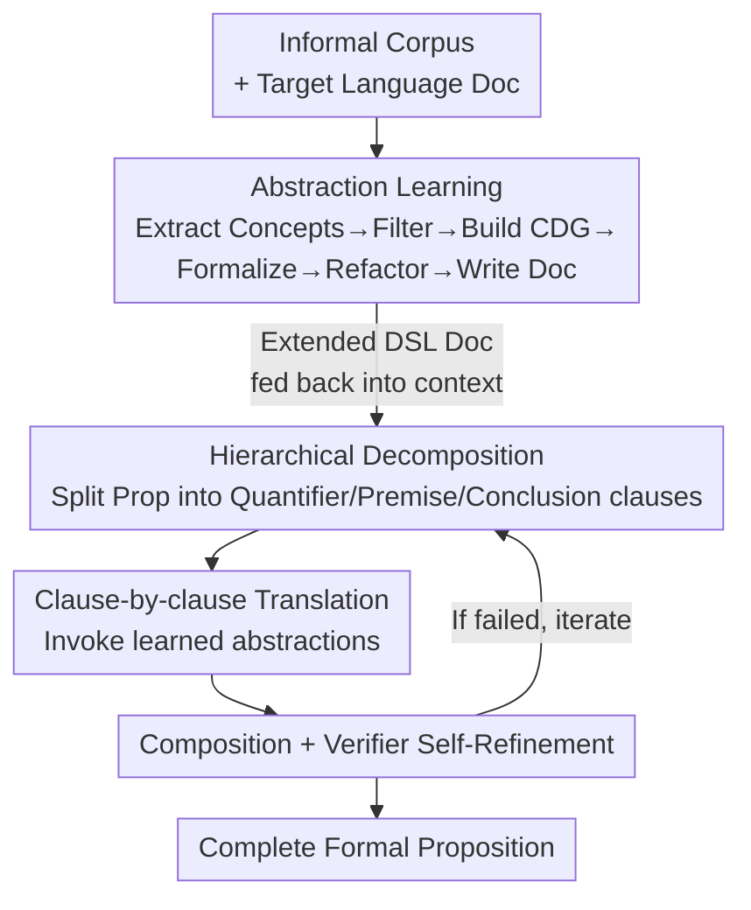

# Divide and Abstract: Autoformalization via Decomposition and Abstraction Learning

**Conference**: ICLR2026  
**OpenReview**: [https://openreview.net/forum?id=NjgaeXNit3](https://openreview.net/forum?id=NjgaeXNit3)  
**Code**: https://github.com/marcusm117/DNA  
**Area**: LLM Reasoning / Autoformalization / Neuro-symbolic  
**Keywords**: Autoformalization, Abstraction learning, Hierarchical decomposition, Zero-shot, Theorem proving

## TL;DR
DNA is a training-free autoformalization framework that first extracts common mathematical concepts from the entire corpus and formalizes them into reusable abstractions to extend the target formal language. It then hierarchically decomposes each new proposition into "quantifier + premise + conclusion" clauses for step-by-step translation and recombination. It achieves a success rate improvement of up to 8.60× over baselines on LeanEuclidPlus and ProofNet-Hard.

## Background & Motivation

**Background**: Autoformalization aims to translate mathematical propositions written in natural language into formal languages (such as Lean or Z3) that can be mechanically verified by theorem provers. Mainstream approaches involve direct LLM generation of the complete formalization, supplemented by retrieval (retrieving relevant library definitions before inference), fine-tuning specialized autoformalizers, or using majority voting/semantic consistency reranking after inference.

**Limitations of Prior Work**: The authors point out that these methods suffer from three fundamental challenges in **generalization**. First, they are **limited by existing abstractions**—the quality of formalization is constrained by the richness of available abstractions in the target language library. For instance, if the target language only has basic definitions for sets and real numbers, "a topological space is a manifold" is almost impossible to translate; however, if `isManifold` exists in the library, the translation reduces to a one-to-one mapping. Existing methods rely heavily on predefined libraries like Mathlib or Isabelle HOL and fail on high-level abstractions not covered. Second, they **struggle with complex propositions**—even with sufficient abstractions, nested propositions like "the space of continuous functions from a compact manifold to a Banach space forms a complete metric space under the supremum norm" require correctly combining multiple layers of abstraction. Current methods expect LLMs to output the final formalization in one step, leading to poor generalization for nested quantifiers, high-order objects, and composite relations. Third, they exhibit **weak cross-formal-language transfer**—fine-tuned autoformalizers are heavily trained on Lean Mathlib, and performance collapses when the target is a domain-specific language (DSL) outside the training data or even just an upgraded Mathlib syntax.

**Key Challenge**: The root cause is that the "direct generation" paradigm collapses two difficult tasks—"building a rich abstraction library" and "translating complex propositions"—into a single LLM call. It can neither supplement missing abstractions nor decompose nested structures, thus becoming limited by both library coverage and proposition complexity.

**Goal**: To enable autoformalization to generalize across three dimensions: self-supplementing abstractions, decomposing complex propositions, and removing dependence on target language training data.

**Key Insight**: The authors observe two overlooked structural facts: different propositions in the same corpus **share many mathematical concepts** (definitions of objects, relations, and functions), and mathematical propositions themselves are **semi-structured data** (quantifier + body, where the body can be split into premise and conclusion lists, and nested clauses can be decomposed recursively). These two points correspond to the feasible paths of "supplementing abstractions" and "decomposing propositions."

**Core Idea**: A two-stage process of "first learning abstractions to extend the language, then hierarchically decomposing for clause-by-clause translation" is used to replace "one-step direct generation." The entire process is zero-shot (relying only on feeding language documentation into the context).

## Method

### Overall Architecture
DNA (Divide and Abstract) is a training-free, plug-and-play framework consisting of two stages. **Stage 1 (Language Extension)**: Given an informal corpus and the current target language documentation, DNA extracts common mathematical concepts from the entire corpus, filters out those already in the target language, constructs a Concept Dependency Graph (CDG), and formalizes concepts layer-by-layer in topological order. It then performs refactoring to remove redundancy and generates documentation, thereby "expanding" the abstraction library of the target DSL. **Stage 2 (Proposition Formalization)**: For each proposition, it is first hierarchically decomposed into a semi-formal structure with explicit quantifiers, premises, and conclusions. Each clause is translated using the abstractions learned in Stage 1, then combined back into a complete formalization, followed by self-refinement using feedback from a symbolic verifier. The coupling point between the two stages is the documentation—new definitions learned in Stage 1 are written back into the language documentation and serve as the context for the LLM in Stage 2. Consequently, the LLM sees both the original language specification and a set of callable high-level definitions.

### Key Designs

**1. Abstraction Learning: Mining shared concepts to "expand" the target language**

Addressing the "limited by existing abstractions" pain point. Instead of formalizing each proposition independently, DNA leverages the insight that propositions in the same corpus share concepts. In the language extension stage, common definitions for objects, relations, and functions are extracted and formalized into reusable abstractions, effectively adding high-level definitions to the target language. This stage is divided into six collaborative steps: **Step 1 Concept Extraction** extracts unambiguous, well-defined, and abstract (not bound to specific variable names or instances) mathematical concepts, categorized into objects/relations/functions, with mandatory tagging of parameter types and counts. **Step 2 Concept Filtering** removes duplicates and concepts already present in the target language; the authors deliberately focus on precision rather than recall—preferring to keep potentially useful abstractions while deleting only absolutely obvious duplicates. **Step 3 CDG Construction** analyzes whether each concept can be expressed directly using existing definitions and which prerequisite concepts it depends on. Nodes are divided into "leaf nodes (directly formalizable or impossible within this language)" and "parent nodes depending on other concepts," processed layer-by-layer from leaves upwards (Algorithm 1: using a queue for breadth-first dependency expansion and an analyzed set for deduplication). **Step 4 Concept Formalization** translates concepts into actual formal definitions according to the CDG, including necessary helper definitions, with iterative refinement to ensure grammatical correctness. **Step 5 Refactoring** eliminates redundancy and extracts common helpers; the authors use the compression ratio (number of definitions before refactoring / number after refactoring, approx. 1.59) to measure reuse effectiveness; a high compression ratio implies lower cognitive load for both humans and models. **Step 6 Documentation Update** generates concise natural language documentation for learned abstractions while hiding low-level helper details, as overfilling documentation with definitions can confuse both models and humans as the context grows. The authors emphasize that CDG construction inherently involves concept decomposition, showing that "abstraction" and "decomposition" are complementary.

**2. Hierarchical Decomposition: Recursively splitting propositions as semi-structured data**

Addressing the "difficulty with complex propositions" pain point. A proposition is not unstructured text but a "quantifier + body," where the body can be split into a list of premises and a list of conclusions, and nested quantified clauses can be decomposed recursively in the same way. DNA thus decomposes a proposition into a hierarchical structure of informal clauses, translates each clause into its formal counterpart, and recombines them. Since Stage 1 provides a rich library of reusable abstractions, translating a single clause is far more tractable than translating a whole complex proposition at once. This effectively breaks down the complexity of "combining multiple layers of abstraction": instead of requiring the LLM to manage nested quantifiers, high-order objects, and composite relations in one generation, it performs local translations on each clear clause.

**3. Four-step Refinement Pipeline: Targeting specific error types**

Addressing specific translation errors in Stage 2. The authors analyzed 100 failed samples each from Qwen3-235B and GPT-5, identifying four categories: Verification Errors (compiler failures due to syntax/logic), Strong/Weak Translation (semantic drift where formalization is stronger or weaker than the English), Mistranslation (wrong formal counterparts or parameters for relations), and Unfaithful Variable Names. The four-step pipeline treats these individually: **Step 1** decomposes the proposition into a semi-formal structure with explicit quantifiers, premises, and conclusions to precisely match logic scopes, addressing "Strong/Weak Translation." **Step 2** translates clause-by-clause using Stage 1 abstractions, allowing the model to focus on correct formal counterparts and parameters (e.g., in LeanEuclidPlus, `formTriangle` requires a specific order of points $a,b$ on line $l_1$, $b,c$ on $l_2$, and $a,c$ on $l_3$; step-by-step translation avoids logical contradictions from parameter order errors), addressing "Mistranslation." **Step 3** systematically combines formal clauses back into a complete proposition, ensuring quantifier scope and logical consistency, reducing "Verification Errors" through structural composition. **Step 4** uses a symbolic verifier for self-refinement, checking three things: syntax correctness, variable name faithfulness between formal and natural language, and logical consistency (non-contradictory premises, non-trivial conclusion). Unlike previous methods relying only on compiler feedback, this provides targeted semantic feedback to guide iterative correction until all quality standards are met, addressing both "Verification Errors" and "Unfaithful Variable Names."

**4. Zero-shot Plug-and-Play: Conditioning via documentation context**

Addressing "weak cross-language transfer." DNA does not perform any training on the target formal language. It is implemented by placing the target language documentation in the LLM's context. After the abstraction learning stage, the documentation is updated with newly learned formal definitions and fed to the proposition formalization stage. Thus, the LLM is conditioned on both the original language specification and a set of ready-to-use high-level definitions. By not relying on training data, DNA is particularly effective for low-resource DSLs—scenarios where fine-tuned autoformalizers typically fail completely (both specialized models and GPT-5 baselines score 0 on ProofNet-Hard).

### A Complete Example
Take a geometric proposition with nested quantification from LeanEuclidPlus: Stage 2 first decomposes it into "Quantifier layer (for all points/lines) → Premise clauses (collinearity, triangles) → Conclusion clause." During clause-by-clause translation, "three points form a triangle" directly invokes the `formTriangle` abstraction learned in Stage 1, filling parameters according to the learned convention ($a,b\in l_1$, $b,c\in l_2$, $a,c\in l_3$). Formal clauses are سپس recombined into the full proposition based on the original logical structure. The result is sent to an enhanced E3 symbolic verifier; if it reports "trivial conclusion" or "unfaithful variable names," feedback is sent to the LLM to refine the corresponding clause, iterating until pass@1 verification is achieved. The entire pipeline requires no training for the Lean geometry DSL.

### Loss & Training
DNA is a zero-shot framework with no parameter updates. In Stage 1, Qwen3-235B-Instruct is used for concept extraction/filtering/CDG construction on LeanEuclidPlus, while GPT-5 is used for ProofNet-Hard. Concept formalization, refactoring, and documentation generation use GPT-5 for both benchmarks. Inference hyperparameters: temperature 0.2 for non-reasoning models, 1.0 for reasoning models, with 5 samples per problem. Token limits: 1024 for specialized autoformalizers, 6144 for standard models, and 12288 for reasoning models. All models receive a standardized 1-shot example demonstrating the full pipeline.

## Key Experimental Results

### Main Results
Evaluation benchmarks include **LeanEuclidPlus** (adapted from LeanEuclid's Euclidean geometry DSL, 100 core problems + 40 complex manual problems) and **ProofNet-Hard** (19 hard problems requiring definitions beyond standard Mathlib). Evaluation uses symbolic equivalence checkers (BEq+ for ProofNet-Hard, E3 with enhanced three-stage pre-check for LeanEuclidPlus), reporting pass@1.

| Model | Benchmark | Baseline | DNA | Gain |
|------|------|----------|-----|------|
| Qwen3-14B | LeanEuclidPlus | 1.0 | 9.6 | ↑8.60× |
| GPT-4.1-mini | LeanEuclidPlus | 4.8 | 42.4 | ↑7.83× |
| Qwen3-32B | LeanEuclidPlus | 4.6 | 20.6 | ↑3.48× |
| Claude-4-Sonnet | LeanEuclidPlus | 34.2 | 58.2 | ↑70.2% |
| Non-reasoning Avg | LeanEuclidPlus | 18.7 | 40.6 | ↑1.17× |
| Reasoning Avg | LeanEuclidPlus | 31.5 | 51.1 | ↑62.2% |
| All Models | ProofNet-Hard | 0.0 | >0 | From 0 to solvable |

On ProofNet-Hard, all baselines (including specialized fine-tuned models and GPT-5) scored 0; DNA enabled successful formalization for the first time, highlighting its value for low-resource DSLs. Gains for small models are particularly significant: Qwen3-14B improved from 1.0 to 9.6, and GPT-4.1-mini approached GPT-4.1 performance, showing DNA allows small models to rival much larger baselines.

### Ablation Study
DNA can naturally be split into two stages. The authors performed systematic ablations: `Divide` (Stage 2 only - decomposition and refinement using original docs), `Abstract` (Stage 1 only - expanding library but direct generation), `DNA` (Full); additionally, `OracleA` (human-expert abstractions) and `DNOracleA` (oracle abstractions + 4-step pipeline) provide upper bounds.

| Config (Non-reasoning Avg, LeanEuclidPlus) | pass@1 | Description |
|------|---------|------|
| Baseline | 18.7 | Direct generation |
| Abstract (Stage 1 only) | 20.9 | Library expansion only |
| Divide (Stage 2 only) | 28.9 | Decomposition only |
| DNA (Full) | 40.6 | Dual-stage synergy |
| DNOracleA (Oracle + Pipeline) | 46.9 | Theoretical upper bound |

### Key Findings
- **Abstraction and decomposition are complementary, Synergy > Individual use**: Divide (28.9) and Abstract (20.9) alone are far inferior to DNA (40.6). DNA often outperforms OracleA, which only provides oracle abstractions, indicating that the four-step decomposition pipeline contributes significantly and that the decomposition inherent in CDG construction complements abstraction learning.
- **Largest gains for small models/low-resource DSLs**: Qwen3-14B achieved the largest relative gain of 8.60×. The leap from zero on ProofNet-Hard is where fine-tuned models fail completely.
- **Error-driven design**: The four-step pipeline precisely addresses three of the four identified error types (Strong/Weak translation, Mistranslation, Verification errors, and Variable faithfulness), serving as an exemplar of "diagnosis before prescription."
- **High stability in Stage 1**: Concept extraction recall was 94.44%, with accuracy across steps between 97–100%. The refactoring compression ratio was ~1.59, and documentation quality was verified by downstream compilation rates (97.4% for Qwen3-235B, 99.8% for GPT-5, with extremely low variance).

## Highlights & Insights
- **Promoting "abstracting" to equal status with "translating"**: Unlike previous methods that assume a given library, DNA first learns a set of reusable abstractions from the corpus. This directly breaks the ceiling of being "limited by existing abstractions." This "extend language before using language" approach is transferable to any code generation task limited by fixed APIs/libraries.
- **Using semi-structured priors for decomposition**: Treating propositions as "quantifier + body" recursive trees rather than unstructured text allows the LLM to handle one clear clause at a time, elegantly thinning the complexity of "combining multi-layer abstractions."
- **Semantic verification feedback vs. pure compiler feedback**: The verifier checks syntax, variable faithfulness, and logical consistency (non-contradiction/non-triviality), providing directional semantic feedback rather than just "pass/fail." This self-refinement signal design can be reused in any generation-correction loop with formal checks.
- **Portability through Zero-shot**: By relying entirely on documentation context, switching DSLs only requires changing the documentation. This avoids retraining and offers a pragmatic engineering advantage for low-resource formal languages.

## Limitations & Future Work
- **Heavy reliance on large models and multiple calls**: Six steps in Stage 1 and four in Stage 2, with GPT-5 used for formalization/refactoring/documentation, lead to high cost and latency. The paper does not report inference overhead.
- **High proportion of human evaluation**: Concept extraction/filtering/CDG/formalization accuracy relies on human judgment (due to the lack of reliable automatic semantic equivalence checkers), making it hard to reproduce and scale.
- **Limited evaluation scale**: ProofNet-Hard only has 19 problems, and LeanEuclidPlus has 100+40, primarily focused on geometry/mathematical propositions. Generalization across broader domain DSLs remains to be verified.
- **Future directions**: Making abstraction learning incremental (expanding the library as the corpus grows), replacing GPT-5 with lighter models for cost reduction, and introducing more reliable automatic semantic equivalence checks to reduce human evaluation reliance.

## Related Work & Insights
- **vs. Direct Generation / Fine-tuned Autoformalizers (Kimina, Mathesis)**: These focus on one-step generation or heavy training on Mathlib. DNA shifts to "learn abstractions then decompose" and is zero-shot. While fine-tuned models are strong within their training distribution (Lean Mathlib), they fail (score ~0) on OOD DSLs like ProofNet-Hard, where DNA succeeds.
- **vs. Retrieval-Augmented / Post-processing (Majority Voting, Semantic Reranking)**: These retrieve from fixed libraries or post-process multiple samples but do not expand the library's abstraction coverage. DNA expands the library itself, solving "insufficient libraries" at the source.
- **vs. Naive Chain-of-Decomposition**: Simply asking a model to "reason step-by-step" is not the same as decomposition based on grammatical structure. DNA's decomposition is anchored in "quantifier/premise/conclusion" semi-structured priors and utilizes learned abstractions for clause-by-clause translation, making it more structured than general step-by-step prompting.

## Rating
- Novelty: ⭐⭐⭐⭐⭐ The trinity of "abstraction learning + hierarchical decomposition + zero-shot" directly hits the three fundamental challenges of autoformalization generalization with a clear, structural approach.
- Experimental Thoroughness: ⭐⭐⭐⭐ Systematic ablations across three model families, two benchmarks, and including Divide/Abstract/Oracle variants with error analysis. However, benchmark sizes are small and cost analysis is missing.
- Writing Quality: ⭐⭐⭐⭐⭐ One-to-one mapping between challenges and designs. Stages and steps are clearly decomposed. Narrative driven by error analysis is highly persuasive.
- Value: ⭐⭐⭐⭐⭐ Moving from "zero" to "solvable" for low-resource DSLs and allowing small models to rival large ones has significant practical value for theorem-proving data synthesis and formal verification.

<!-- RELATED:START -->

## Related Papers

- [\[ICLR 2026\] LoC-Decomp: LLM Autoformalization via Logical Concept Decomposition and Iterative Feedback Correction](loc-decomp_llm_autoformalization_via_logical_concept_decomposition_and_iterative.md)
- [\[ICLR 2026\] ReForm: Reflective Autoformalization with Prospective Bounded Sequence Optimization](reform_reflective_autoformalization_with_prospective_bounded_sequence_optimizati.md)
- [\[ICLR 2026\] ProofFlow: A Dependency Graph Approach to Faithful Proof Autoformalization](proofflow_a_dependency_graph_approach_to_faithful_proof_autoformalization.md)
- [\[ICLR 2026\] Enhancing LLMs for Knowledge Base Question Answering by Chain-of-Decomposition](enhancing_llms_for_knowledge_base_question_answering_by_chain-of-decomposition.md)
- [\[ICLR 2026\] Is In-Context Learning Learning?](is_in-context_learning_learning.md)

<!-- RELATED:END -->
