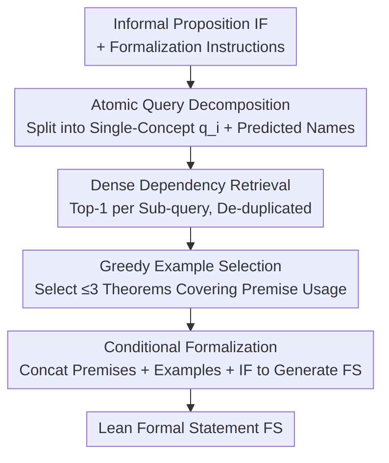

# DRIFT: Decompose, Retrieve, Illustrate, then Formalize Theorems

**Conference**: ICLR2026  
**OpenReview**: [https://openreview.net/forum?id=IGEs577RFz](https://openreview.net/forum?id=IGEs577RFz)  
**Code**: https://github.com/Formal-Math-Reasoning/DRIFT  
**Area**: LLM Reasoning / Autoformalization / Theorem Proving  
**Keywords**: Autoformalization, Dependency Retrieval, Query Decomposition, Lean, Mathlib

## TL;DR
DRIFT decomposes the task of "translating natural language mathematical propositions into Lean formal statements" into four steps: Decompose → Retrieve → Illustrate → Formalize. It first directs the LLM to split information-dense informal propositions into atomic sub-queries focused on single concepts to retrieve precise formal definitions from Mathlib. Then, it uses a greedy algorithm to select example theorems demonstrating how these definitions are used. Finally, these are fed to a formalizer to generate formal statements. DRIFT nearly doubles dependency retrieval F1 on ProofNet and achieves a 55-point surge in BEq+@10 on the OOD ConNF dataset, even surpassing the oracle.

## Background & Motivation

**Background**: Autoformalization, the process of translating natural language mathematical propositions into machine-verifiable formal statements (e.g., Lean, Isabelle, Rocq), is a critical step toward automated theorem proving. Direct use of LLMs for offline formalization performs poorly due to strict formal syntax and the need for precise alignment between informal concepts and formal definitions. Fine-tuning on synthetic data often suffers from "knowledge cutoff" as libraries like Mathlib are constantly updated—fine-tuned models may hallucinate formal objects that have been renamed, reorganized, or deprecated. Consequently, retrieval-augmented methods have become mainstream, dynamically retrieving relevant theorems/definitions from external libraries during inference.

**Limitations of Prior Work**: Existing retrieval-augmented approaches treat the **entire informal proposition as a monolithic query** for retrieval. RAutoformalizer (Liu et al., 2025) introduced the "dependency retrieval" paradigm—specifically retrieving precise underlying definitions (e.g., `IsPrimitiveRoot`, `ZMod`) required for formalization, which is more effective than retrieving similar theorems. However, it suffers from two fundamental flaws: first, informal propositions are often information-dense and contain multiple mathematical concepts; compressing an entire sentence into a single dense vector creates a "representation bottleneck" that captures only the most prominent concepts while losing details. Second, even if a correct definition is retrieved, the model may not know **how to use** it syntactically (e.g., retrieving `def ZMod : ℕ → Type` but not knowing how to declare `a : ZMod p`), which is a primary source of syntax and structural errors in LLM-generated statements.

**Key Challenge**: To achieve precision, dependency retrieval narrows the target to "single atomic definitions" but **loses the usage context** provided by complete theorem statements. Conversely, the granularity of a monolithic query does not match the granularity of the atomic definitions being indexed. Precision and usage context form a significant trade-off.

**Goal**: (1) Match query granularity with the granularity of retrieved atomic definitions; (2) Supplement the model with "how these definitions are used in real theorems" in addition to the definitions themselves.

**Key Insight**: The authors draw inspiration from "query decomposition" in information retrieval, which splits complex questions into sub-queries to match the granularity of indexed documents in multi-hop QA. This approach has not been systematically applied to dependency retrieval in autoformalization. Furthermore, general query decomposition lacks understanding of the strict dependency structures inside theorems and requires specialized adaptation.

**Core Idea**: Reformulate retrieval-augmented autoformalization using "Atomic Decomposition + Usage Illustration." The informal proposition is first decomposed into atomic sub-queries focused on single concepts for precise dependency retrieval, followed by supplementing syntax usage through example theorems based on retrieved premises (rather than generic similar theorems).

## Method

### Overall Architecture
DRIFT is a four-stage sequential pipeline that takes an informal proposition (IF) and output a Lean formal statement (FS). The four steps are: ① **Decompose**—the LLM splits the IF into $n$ atomic sub-queries $Q=\{(q_i,\hat l_i)\}$, each focusing on one mathematical concept; ② **Retrieve**—each sub-query uses a dense retriever to fetch the top-1 premise from the formal library (Mathlib / con-nf), forming a de-duplicated premise set $R_{\text{DRIFT}}$; ③ **Illustrate**—a greedy coverage algorithm selects at most $m=3$ example theorems $T$ that utilize these premises to demonstrate usage; ④ **Formalize Theorems**—the instructions, premises, example theorems, and original proposition are concatenated into a context $C$ for a formalizer to generate the FS. The framework is model-agnostic: the decomposer and formalizer can be frontier LLMs (GPT-4.1, DeepSeek-V3.1, Claude-Opus-4) or specialized formalization models (Goedel-V2-8B), while the retriever is a fixed fine-tuned DPR.

### Key Designs

**1. Atomic Query Decomposition: Matching Definition Granularity**

To address the "monolithic query representation bottleneck," the Decompose module directs the LLM to split the IF into a set of structured sub-queries $\text{Decomposer}(IF)\to Q=\{(q_i,\hat l_i)\}_{i=1}^n$. The number of sub-queries $n$ is dynamic (averaging 5.21–6.42 in practice). Each sub-query $(q_i,\hat l_i)$ isolates a single concept: $q_i$ is a natural language phrase (e.g., "a prime $p$ of the form $4t+3$"), and $\hat l_i$ is a **predicted formal representation** based on the decomposer's parametric knowledge (e.g., `p : ℕ` such that `Nat.Prime p` and `p % 4 = 3`). Including the predicted formal name serves two purposes: it probes the LLM's knowledge to provide a syntax "anchor" for retrieval, and it allows the retriever to **utilize both semantic cues ($q_i$) and syntactic cues ($\hat l_i$)** to locate the correct premise—even if the prediction contains minor errors.

**2. Sub-query Level Dense Dependency Retrieval: Precise Mapping to Premises**

Each sub-query aims to find its corresponding "dependency premise" in the library. The retriever is a dense paragraph retriever (DPR) implemented via a BGE-M3 encoder $E_\theta$, fine-tuned on dependency retrieval tasks. Formal objects $p\in D$ are pre-computed as vectors $\mathbf p=E_\theta(p)$. At inference, sub-queries are encoded as $\mathbf q_i=E_\theta(Q_i)$, and the premise with the highest cosine similarity is selected:

$$p_i=\arg\max_{p\in D}\ \phi(\mathbf q_i,\mathbf p),\qquad \phi(\mathbf q_i,\mathbf p)=\frac{\mathbf q_i\cdot\mathbf p}{\|\mathbf q_i\|\,\|\mathbf p\|}$$

The final set is $R_{\text{DRIFT}}=\bigcup_{i=1}^n\{p_i\}$. Unlike baselines that fix top-k (e.g., top-5), DRIFT uses a **dynamic** number of retrievals capped at $n$.

**3. Greedy Coverage-based Example Selection: Bridging the Definition-Usage Gap**

Definitions alone (e.g., `def ZMod : ℕ → Type`) often lack the specific syntax required for application (e.g., how to declare `a : (ZMod p)`). The Illustrate module uses $R_{\text{DRIFT}}$ and a budget $m$ to select a small set of example theorems $T$ ($|T|\le m$) via a greedy algorithm that **maximizes premise coverage**. It initiates from a candidate set $T_{\text{cand}}$ containing theorems utilizing at least one premise in $R_{\text{DRIFT}}$, ranked by similarity to the original IF. It then iteratively selects the theorem providing the maximum marginal gain (covering the most new premises):

$$t_j=\arg\max_{t\in T_{\text{cand}}\setminus T_{j-1}}\ \big|\,P(t)\cap(R_{\text{DRIFT}}\setminus P_{\text{cov},j-1})\,\big|$$

This ensures the selected theorems demonstrate the actual syntactic usage of the retrieved definitions. In practice, $m=3$ covers 74.59% of premises.

**4. Conditional Formalization: Context-Driven Generation**

The final step concatenates all contexts $C=I\oplus R_{\text{DRIFT}}\oplus T\oplus IF$ for the formalizer. Each premise includes its full name, formal declaration, and source code. Each example theorem is provided as an informal-formal pair, demonstrating both alignment and practical usage.

### A Complete Example
Using Ireland-Rosen Exercise 4.5 ("Let $p$ be a prime of the form $4t+3$. Show that $a$ is a primitive root modulo $p$ iff $-a$ has order $(p-1)/2$"): ① Decompose splits it into 6 sub-queries: "prime $p$", "primitive root mod $p$", "negation $-a$", "order of $-a$", "biconditional", and "multiplicative order `orderOf`". ② Retrieve maps these to precise premises like `PNat.Prime`, `IsPrimitiveRoot`, `ZMod`, `orderOf`, etc. ③ Illustrate selects 3 theorems (e.g., a theorem demonstrating `orderOf a ∣ p-1`). ④ Formalize generates the final statement using these specific constructs.

## Key Experimental Results

### Main Results
Evaluation was conducted on three benchmarks: ProofNet (in-distribution), MiniF2F-test (self-contained, low dependency), and ConNF (OOD, research-level theorems based on the con-nf library). Retrieval was measured via F1; formalization via Typecheck and BEq+ (Semantic equivalence, Pearson 0.974 with humans).

Dependency Retrieval (F1 % vs. monolithic query baseline):

| Benchmark | Decomposer | Baseline F1 | DRIFT F1 | Gain |
|------|-----------|-----------|----------|------|
| ProofNet | DeepSeek-V3.1 | 13.77 | 27.01 | +13.24 |
| ProofNet | Claude-Opus-4 | 13.77 | 27.68 | +13.91 |
| ConNF | DeepSeek-V3.1 | 28.17 | 36.88 | +8.71 |

Formalization (BEq+@10 %, comparing Zero-shot / DPR(RAuto) / oracle*):

| Benchmark | Formalizer | Zero-shot | DPR(RAuto) | DRIFT | oracle* |
|------|-----------|-----------|-----------|-------|---------|
| ProofNet | GPT-4.1 | 13.37 | 19.25 | **21.93** | 27.54 |
| ConNF | GPT-4.1 | 6.76 | 20.08 | **62.33** | 58.90 |

On the OOD ConNF dataset, GPT-4.1 with DRIFT improved BEq+@10 from 6.76% to 62.33% (**surpassing oracle* by 3.43 points**), because DRIFT provides usage examples that the pure oracle (providing only necessary premises) lack.

### Ablation Study

| Configuration (GPT-4.1, ConNF, BEq+@1) | Value | Diff vs. DRIFT |
|------|------|-----------|
| DRIFT (Full) | 54.84 | — |
| w/o Illustrate | 35.90 | −18.94 |
| w/o Decompose | 46.72 | −8.12 |
| w/o Retrieval | 4.47 | −50.37 |

### Key Findings
- **Retrieval is the primary contributor**: Removing retrieval leads to a 50.37-point drop on ConNF, highlighting its necessity in OOD scenarios.
- **Illustration is critical for OOD**: Removing Illustrate drops performance by ~18 points on ConNF but has negligible impact on MiniF2F, suggesting "usage demonstration" is vital when models are unfamiliar with a domain.
- **Retrieval utility depends on the knowledge gap**: On MiniF2F (avg. 0.43 dependencies), retrieval can introduce noise. Specialized models like Goedel-V2-8B were significantly hindered by DPR(RAuto), whereas DRIFT remained robust.
- **Decomposition vs. Formalization**: Frontier models are largely interchangeable as decomposers, but GPT-4.1 significantly outperforms others as a formalizer in integrating retrieved context.

## Highlights & Insights
- **First systematic application of Query Decomposition to Autoformalization**: Addresses the granularity mismatch between complex propositions and atomic definitions, doubling retrieval F1.
- **Conditional Example Selection**: Selecting examples based on retrieved premises rather than just semantic similarity bridges the "definition-syntax gap."
- **Predicted Formal Names as "Soft Anchors"**: Utilizing the LLM's parametric knowledge of syntax to guide the retriever significantly improves alignment.
- **Adaptive Retrieval Awareness**: Highlights that retrieval is not always beneficial and should ideally be adjusted based on the gap between model knowledge and proposition complexity.

## Limitations & Future Work
- **Retrieval as Noise**: In low-dependency tasks, context can lead to "force-fitting" or over-complication; adaptive retrieval strategies are needed.
- **Reliance on Frontier LLMs**: The decomposition stage requires strong reasoning models; specialized smaller models currently struggle with the decomposition instructions.
- **Retriever Generalization**: The DPR was fine-tuned on Mathlib; its inherent OOD capability was not the primary focus of optimization.

## Related Work & Insights
- **vs. RAutoformalizer (Liu et al., 2025)**: DRIFT improves upon RAuto by adding decomposition, dynamic retrieval counts, and example-based augmentation, significantly outperforming it on ConNF (+40 points).
- **vs. Similarity-based Retrieval (k-NN)**: DRIFT targets atomic definitions and selects examples based on those definitions, whereas k-NN relies purely on semantic similarity.
- **vs. CRAMF (Lu et al., 2025)**: CRAMF maps concepts across abstraction levels but lacks the fine-grained decomposition of complex propositions.

## Rating
- Novelty: ⭐⭐⭐⭐⭐ 
- Experimental Thoroughness: ⭐⭐⭐⭐⭐ 
- Writing Quality: ⭐⭐⭐⭐ 
- Value: ⭐⭐⭐⭐⭐ 

<!-- RELATED:START -->

## Related Papers

- [\[ICLR 2026\] Characterizing and Mitigating Reasoning Drift in Large Language Models](characterizing_and_mitigating_reasoning_drift_in_large_language_models.md)
- [\[ACL 2025\] Aristotle: Mastering Logical Reasoning with A Logic-Complete Decompose-Search-Resolve Framework](../../ACL2025/llm_reasoning/aristotle_logical_reasoning.md)
- [\[CVPR 2025\] Reason-before-Retrieve: One-Stage Reflective Chain-of-Thoughts for Training-Free Zero-Shot Composed Image Retrieval](../../CVPR2025/llm_reasoning/osrcir_reflective_cot.md)
- [\[ICLR 2026\] FATE: A Formal Benchmark Series for Frontier Algebra of Multiple Difficulty Levels](fate_a_formal_benchmark_series_for_frontier_algebra_of_multiple_difficulty_level.md)
- [\[ICLR 2026\] Divide and Abstract: Autoformalization via Decomposition and Abstraction Learning](divide_and_abstract_autoformalization_via_decomposition_and_abstraction_learning.md)

<!-- RELATED:END -->
