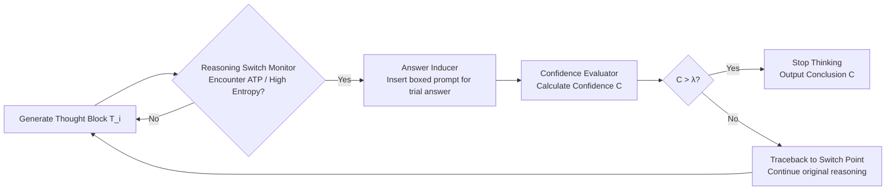

# Dynamic Early Exit in Reasoning Models

**Conference**: ICLR 2026  
**arXiv**: [https://openreview.net/forum?id=NpU7ZXafRi](https://openreview.net/forum?id=NpU7ZXafRi)  
**Code**: [https://github.com/iie-ycx/DEER](https://github.com/iie-ycx/DEER)  
**Area**: LLM Reasoning / Efficient Inference  
**Keywords**: Large Reasoning Models, Chain-of-Thought, Overthinking, Dynamic Early Exit, Training-free, Test-time Compute  

## TL;DR
DEER enables Large Reasoning Models (LRMs) to trial-answer at "reasoning switch points" within the Chain-of-Thought (CoT). It uses the confidence of these trial answers to judge if the reasoning is sufficient, allowing for training-free dynamic early exit. Across 11 models and 10 benchmarks, it reduces CoT length by an average of 19.1%~80.1% while improving accuracy by 0.3%~5.0%.

## Background & Motivation
**Background**: Large Reasoning Models (LRMs) like DeepSeek-R1 and GPT-o1 rely on test-time scaling, generating long CoT to solve complex tasks. Long-form thinking has become a standard for "System 2" reasoning.

**Limitations of Prior Work**: Extremely long CoT presents two issues. First, efficiency: verbose reasoning significantly increases computational overhead and latency, hindering deployment in compute-sensitive scenarios. Second, accuracy: models suffer from "overthinking," where continued generation of repetitive or irrelevant steps causes the model to "stray" from a correct path toward an incorrect conclusion. Statistics on AIME24 (Figure 1) show that ~**75%** of samples exhibit "Pearl Reasoning"—where an early answer from an intermediate point is correct. For 36.7% of samples, less than half the reasoning path is sufficient. In some cases (e.g., problems 11, 19, 26), the model only answers correctly if it exits early; further thinking leads to errors.

**Key Challenge**: Since each problem has a critical point where information is "just sufficient," fixed heuristics (e.g., fixed token budgets or exit ratios) are suboptimal—the best exit point is at 40% for MATH and 50% for GPQA, varying significantly by problem difficulty. **A mechanism is needed to dynamically decide the exit point for each individual problem.**

**Goal**: To allow LRMs to autonomously identify "Pearl Reasoning" points and truncate generation during inference without additional training or weight modification, balancing accuracy and efficiency.

**Core Idea**: **[Confidence as Signal]** The authors observe that when reasoning is incomplete, forcing a trial answer results in low confidence. Conversely, when reasoning is self-consistent and sufficient, trial answer confidence is high. In other words, models "implicitly know" whether they have thought enough; they simply lack a mechanism to convert this sensation into an explicit early exit decision. DEER fills this gap by inserting a "Trial → Measure Confidence → Decide" loop at reasoning switch points.

## Method

### Overall Architecture
DEER (Dynamic Early Exit in Reasoning) is a training-free, plug-and-play inference-time intervention consisting of three sequential modules: the **Reasoning Switch Monitor** identifies candidate exit points; the **Answer Inducer** forces a trial answer at that point; and the **Confidence Evaluator** calculates confidence to compare against a threshold $\lambda$. If it exceeds the threshold, the output is finalized; otherwise, the model traces back to continue along the original reasoning path. This design assumes the LRM "System 2" paradigm where output is split into `<think>` and conclusion segments, with the thinking segment divided into blocks by Action Transition Points (ATPs) like "Wait" or "Alternatively."

### Key Designs

**1. Reasoning Switch Monitor: Seizing exit opportunities at "thought turns."** DEER does not attempt early exit at every token. It monitors critical moments where the reasoning path shifts, as these points represent natural boundaries where one thought block ends and the next begins. The paper proposes two routes: **Language-based markers**, which treat model-generated ATPs (e.g., "Wait," "Alternatively") as exit points (low cost); and **Entropy-based methods**, which segment reasoning by "\n\n" and calculate entropy $H(p(\cdot|x_{<t}))$ for the first token of each step. Low entropy indicates stable execution, while high entropy indicates the model is weighing multiple paths—marking a candidate exit point.

**2. Answer Inducer: Forcing "implicit thoughts" into explicit answers via boxed prompts.** When the monitor pauses at a switch point, the inducer appends a prompt to force an intermediate answer: $A = \mathrm{LRM}(P, T, I)$, where $P$ is the original prompt, $T$ is the generated thought, and $I$ is the induction prompt. Using a `\boxed{}` delimiter allows the trial answer to be precisely extracted for confidence calculation, avoiding interference from explanatory text.

**3. Confidence Evaluator: Quantifying sufficiency via geometric mean.** The evaluator takes the maximum predicted probability for each token in the trial answer and calculates their geometric mean as the overall confidence:

$$C = \left(\prod_{i=1}^{n} \max_{a_t \in V} p(a_t)\right)^{1/n}, \quad p(a_t) = \mathrm{softmax}(M(P, T, I, a_{<t}))$$

The geometric mean is used as it aligns with the multiplicative nature of joint probability and is more sensitive to low-probability tokens. If $C > \lambda$, reasoning stops; otherwise, it resumes. The threshold $\lambda$ is typically set to 0.95 and is robust within the 0.9~0.97 range.

**4. DEER-Pro: Parallel induction + MAD calibration to mitigate prompt sensitivity.** Smaller models are sensitive to induction prompts. DEER-Pro uses $N$ different prompts to generate trial answers in parallel and computes a calibrated confidence using the mean and Mean Absolute Deviation (MAD):

$$C_{\text{cali}} = C_{\text{avg}} - \alpha \cdot C_{\text{MAD}}, \quad C_{\text{avg}} = \frac{1}{N}\sum_{i=1}^{N} C_i, \quad C_{\text{MAD}} = \frac{1}{N}\sum_{i=1}^{N} |C_i - C_{\text{avg}}|$$

Subtracting $C_{\text{MAD}}$ introduces a conservative bias: higher inconsistency across prompts indicates an unreliable sufficiency judgment, delaying the exit. To handle the latency of trial answers, the authors employ **branched parallel decoding** using custom causal attention masks and dynamic KV cache pruning.

## Key Experimental Results

### Main Results (5 Benchmarks × 3 Models, Acc=Accuracy / CR=Compression Ratio)

| Model | Method | GSM8K Acc/CR | MATH-500 Acc/CR | AMC23 Acc/CR | AIME24 Acc/CR | GPQA-D Acc/CR | Overall Acc/CR |
|------|------|------|------|------|------|------|------|
| **R1-Distill-Qwen-7B** | Vanilla | 89.6 / 100% | 87.4 / 100% | 78.8 / 100% | 41.7 / 100% | 23.7 / 100% | 64.2 / 100% |
| | **Ours (DEER)** | 90.6 / 61.8% | 89.8 / 55.5% | 85.0 / 65.5% | 49.2 / 71.5% | 31.3 / 53.4% | **69.2 / 61.5%** |
| | **Ours (DEER-Pro)** | 91.0 / 66.7% | 90.2 / 62.0% | 87.5 / 71.8% | 49.2 / 73.0% | 30.6 / 55.5% | **69.7 / 65.8%** |
| **Qwen3-14B** | Vanilla | 95.1 / 100% | 93.8 / 100% | 95.0 / 100% | 70.0 / 100% | 60.1 / 100% | 82.8 / 100% |
| | **Ours (DEER)** | 95.3 / 41.0% | 94.0 / 68.2% | 95.0 / 66.7% | 76.7 / 70.2% | 57.6 / 39.5% | **83.7 / 57.1%** |
| **QwQ-32B** | Vanilla | 96.7 / 100% | 93.8 / 100% | 92.5 / 100% | 66.7 / 100% | 63.1 / 100% | 82.6 / 100% |
| | **Ours (DEER)** | 96.3 / 68.5% | 94.6 / 73.6% | 95.0 / 85.1% | 70.0 / 93.3% | 64.1 / 84.2% | **84.0 / 80.9%** |

Overall, DEER improves accuracy by 0.9~4.8 points while compressing sequence length by 19.1%~42.9% compared to the vanilla baseline.

### Ablation Study

| Dimension | Setting | Key Conclusion |
|----------|------|----------|
| Monitoring Signal | ATP vs Entropy | Entropy offers most exit opportunities; Language markers are comparable and simpler to implement. |
| Threshold $\lambda$ | 0.85~1.0 | Too low → over-compression/acc drop; Too high → late exit; 0.9~0.97 is stable. |
| DEER vs DEER-Pro | N=4, α=1 | DEER-Pro is more effective for small models to mitigate prompt sensitivity. |
| Task Domain | Math vs Coding | Coding tasks see higher compression (avg CR 19.9% vs 61.5%) due to redundant tokens. |

### Key Findings
- **Smaller models suffer more from overthinking**: 1.5B models generate longer redundant sequences due to limited reasoning guidance; thus, DEER provides the largest compression gains for smaller models.
- **Benefits for both easy and hard tasks**: DEER achieves higher compression on easy problems (MATH-500) and greater accuracy gains on hard problems (AIME24), meeting requirements for both efficiency and precision.
- **Superiority over baselines**: Methods like TCC or NoThinking either ignore constraints on hard tasks or severely damage reasoning. DEER remains robust, even when `</think>` delimiters fail on large models like QwQ-32B.

## Highlights & Insights
- **The observation that "models implicitly know when they have thought enough" is elegant**: It reframes overthinking as the lack of an explicit mechanism to act on internal confidence. DEER simply "wires out" this signal.
- **Training-free and plug-and-play**: It requires no weight changes or training data, working across 11 models (1.5B to 671B), ensuring low deployment barriers.
- **Meticulous design (Geometric Mean + MAD)**: Using geometric mean captures the multiplicative nature of joint probability, while MAD translates prompt inconsistency into "conservatism," representing solid uncertainty engineering.
- **Simultaneous improvement of efficiency and accuracy**: Unlike most methods that trade accuracy for speed, DEER improves both by bypassing the "straying" effect of overthinking.

## Limitations & Future Work
- **Dependence on switch points**: Language markers rely on ATP frequency. If a model avoids these words or if delimiters fail, performance is impacted. Entropy-based methods introduce additional hyperparameters.
- **Empirical $\lambda$ values**: While 0.9~0.97 is stable, the optimal point may vary by model/task. It remains a global threshold rather than a per-problem adaptive one.
- **Trial answer latency**: Trialing and evaluation introduce overhead. For coding tasks with long trial answers, complex branched parallel decoding is required to maintain speed.
- **Confidence $\neq$ Correctness**: High confidence does not guarantee correctness (models can be "confidently wrong"). DEER-Pro mitigates but does not eliminate this risk.

## Related Work & Insights
DEER falls into the category of **efficient inference and overthinking mitigation**. Compared to prompt-based TCC or CoD (which sacrifice accuracy) or output-side Dynasor-CoT (which is too conservative), DEER is unique in being training-free, dynamic per-sample, and confidence-driven. It suggests that using internal signals (confidence, entropy) as feedback for reasoning control is more promising than external fixed heuristics. Future work could explore per-problem adaptive thresholds and deeper integration with speculative decoding.

## Rating
- **Novelty**: ⭐⭐⭐⭐ The "Pearl Reasoning + Confidence as Exit Signal" perspective is refreshing.
- **Experimental Thoroughness**: ⭐⭐⭐⭐⭐ Extensive testing across 11 models, 10 benchmarks, and 6 baselines with systematic ablations.
- **Writing Quality**: ⭐⭐⭐⭐ Logical flow from pilot experiments to methodology, with clear formulas and diagrams.
- **Value**: ⭐⭐⭐⭐⭐ High practical value for LRM deployment as a "drop-in" solution to improve both speed and accuracy.

<!-- RELATED:START -->

## Related Papers

- [\[ACL 2026\] Step-GRPO: Internalizing Dynamic Early Exit for Efficient Reasoning](../../ACL2026/llm_reasoning/step-grpo_internalizing_dynamic_early_exit_for_efficient_reasoning.md)
- [\[ACL 2026\] When Is Thinking Enough? Early Exit via Sufficiency Assessment for Efficient Reasoning](../../ACL2026/llm_reasoning/when_is_thinking_enough_early_exit_via_sufficiency_assessment_for_efficient_reas.md)
- [\[ICLR 2026\] WavefrontDiffusion: Dynamic Decoding Schedule for Improved Reasoning](wavefrontdiffusion_dynamic_decoding_schedule_for_improved_reasoning.md)
- [\[ICML 2026\] DyCon: Dynamic Reasoning Control via Evolving Difficulty Modeling](../../ICML2026/llm_reasoning/dycon_dynamic_reasoning_control_via_evolving_difficulty_modeling.md)
- [\[ICLR 2026\] When More Is Less: Understanding Chain-of-Thought Length in LLMs](when_more_is_less_understanding_chain-of-thought_length_in_llms.md)

<!-- RELATED:END -->
