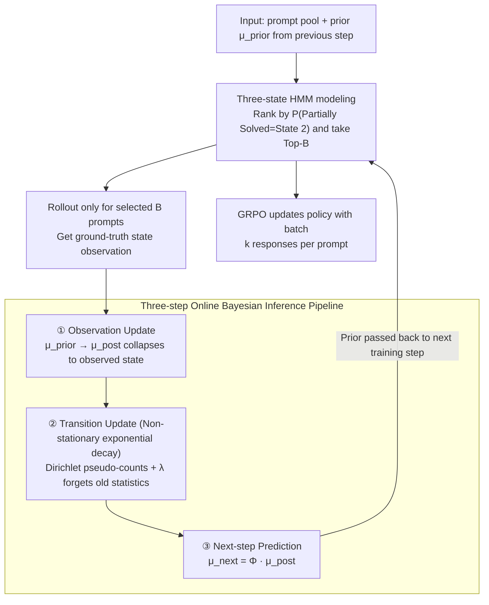

# Dynamics-Predictive Sampling for Active RL Finetuning of Large Reasoning Models

**Conference**: ICLR 2026  
**arXiv**: [2603.10887](https://arxiv.org/abs/2603.10887)  
**Code**: [github.com/maoyixiu/DPS](https://github.com/maoyixiu/DPS)  
**Area**: LLM Reasoning / RL Finetuning  
**Keywords**: RL Finetuning, Prompt Sampling, Hidden Markov Model, Large Reasoning Models, Online Bayesian Inference

## TL;DR

The solving progress of each prompt in RL finetuning is modeled as a Hidden Markov Model (HMM) dynamic system. Through lightweight online Bayesian inference, the solving state of prompts is predicted, prioritizing "partially solved" prompts. This achieves equivalent or superior reasoning performance with less than 30% of the rollout volume compared to DS.

## Background & Motivation

**Background**: RL finetuning (represented by GRPO) has become a core technical route for improving LLM reasoning capabilities. Large Reasoning Models (LRMs) such as DeepSeek-R1 and OpenAI o1 have achieved breakthroughs in mathematical competitions, code generation, and logical reasoning through RL finetuning. However, the effectiveness of RL finetuning highly depends on the quality of training data selection—not all prompts contribute equally to policy optimization.

**Limitations of Prior Work**: GRPO uses intra-group normalization to calculate the advantage function $\hat{A}_i^\tau = \frac{r(\tau, y_i^\tau) - \text{mean}}{\text{std}}$. When all $k$ responses from the model for a specific prompt are either all correct or all incorrect, $\text{std} = 0$, the advantage function degrades, and the gradient signal vanishes. Therefore, only "partially solved" prompts (some correct, some incorrect) can provide effective optimization signals.

**Key Challenge**: Current state-of-the-art online prompt selection methods like Dynamic Sampling (DS) filter effective prompts by expanding the candidate batch (usually 3-4 times the final batch) and performing rollouts for each. Although this accurately finds partially solved samples, the computational overhead of rollouts is extremely expensive—the cost of generating long-chain reasoning responses often exceeds the finetuning itself. Another method, History Resampling (HR), filters prompts already fully solved at the epoch level, but its "absorbing state" assumption is too rigid and only excludes solved prompts without actively seeking partially solved ones.

**Goal**: How to online predict which prompts are currently in a "partially solved" state without performing expensive rollouts, thereby achieving training effects comparable to or better than DS with minimal extra overhead?

**Key Insight**: The authors treat the solving progress of each prompt as a dynamic system evolving over time—as the model updates, the prompt's state (unsolved → partially solved → solved) undergoes transitions. This evolution can be modeled with an HMM: the hidden state is the degree of solving, and observations are intermittent rollout results. Utilizing historical rollout data for Bayesian inference allows for predicting future states without actual rollouts.

**Core Idea**: Model prompt solving progress as an HMM dynamic system and use online Bayesian inference to predict states. Select prompts most likely to be "partially solved" before rollouts, achieving rollout-free adaptive sampling.

## Method

### Overall Architecture

DPS aims to solve the problem of identifying prompts currently in a "partially solved" state—capable of providing non-zero gradients to GRPO—without actually running expensive rollouts for every candidate prompt. It treats the progress of each prompt as a Hidden Markov system evolving with training steps, using historical rollout results for online Bayesian inference to predict the current state.

Each training step $t$ involves two phases. First is **Prediction & Selection**: using the prior $\mu_t^{\tau,\text{prior}}$ inferred from the previous step, prompts are ranked by their probability of being "partially solved" (State 2), and the Top-$B$ are selected for the training batch $\mathcal{B}_t$. Second is **Inference & Update**: rollouts are executed only for the $B$ selected prompts to obtain ground-truth observations. These are used to update their state posteriors and transition matrix posteriors, and finally, the posterior is propagated forward by one step to obtain the prior prediction for the next training step. Consequently, rollouts only happen for prompts that actually enter the batch, rather than rollout-then-filter for 3-4x candidates as in DS.

### Key Designs

**1. Three-state HMM Modeling: Translating "Whether to Sample" to "Current State"**

The GRPO advantage function yields zero when a prompt's $k$ responses are all correct or all incorrect due to $\text{std}=0$; only prompts with mixed correctness generate gradients. DPS defines hidden states $z_t^\tau \in \{1, 2, 3\}$ corresponding to fully unsolved (all $k$ wrong), partially solved (some right, some wrong), and fully solved (all right). The initial prior is a uniform distribution $\mu_1^{\text{prior}} = [1/3, 1/3, 1/3]$. State evolution is characterized by a column-stochastic matrix $\Phi \in \mathbb{R}^{3 \times 3}$. The observation model is a "degenerate emission"—once a prompt is selected for rollout, its true state is precisely observed; if not selected, no observation is made. Three states align with the GRPO gradient structure (advantage non-zero only in State 2) and remain concise; ablation shows more or fewer states decrease prediction accuracy.

**2. Three-step Online Bayesian Inference Pipeline: Real-time Updates of State and Transitions**

Classical HMM forward-backward algorithms require full trajectories, making them unsuitable for concurrent training. DPS decomposes inference into three incremental updates depending only on current observations and the previous posterior. Step 1, **Observation Update**: if a prompt is sampled, the prior $\mu_t^{\text{prior}}$ is updated via Bayes' rule to the posterior $\mu_t^{\text{post}}$; due to degenerate emission, the posterior collapses to the observed state. Step 2, **Transition Update**: leveraging Dirichlet-Categorical conjugacy, posterior transition pseudo-counts $\xi_t(i,j) = \mathbb{P}(z_{t-1}=j, z_t=i \mid y_{1:t})$ are used to incrementally update Dirichlet parameters $\alpha_t$, learning the transition matrix online. Step 3, **Next-step Prediction**: the posterior is propagated through the transition matrix for the next-step prior,

$$\mu_{t+1}^{\text{prior}} = \Phi_t \mu_t^{\text{post}}.$$

The entire pipeline consists of $3 \times 3$ matrix operations with negligible overhead, enabling it to replace expensive rollouts.

**3. Non-stationary Exponential Decay: Adapting Transition Models to Changing Dynamics**

LRM learning is highly non-stationary—as the policy updates, prompt solving probabilities change, violating the stationary assumption of standard HMMs. DPS introduces a decay factor $\lambda \in (0,1)$, modifying the transition parameter update to:

$$\alpha_t = \lambda \cdot \alpha_{t-1} + (1-\lambda) \cdot \alpha_0 + \xi_t,$$

where smaller $\lambda$ allows the model to forget old statistics faster and stay close to current dynamics. This decay also provides implicit exploration: if a prompt goes unsampled for a long time, its posterior decays towards a uniform distribution, allowing it to be naturally revisited without explicit exploration-exploitation hyperparameter tuning.

### Loss & Training

Sampling focuses on pure exploitation: all prompts are ranked by $\mu_t^{\tau,\text{prior}}(2)$ (predicted probability of being partially solved), and the Top-$B$ are taken into the batch. Implicit exploration is handled by the non-stationary decay mentioned above. DPS is orthogonal to specific RL algorithms; experiments in this paper use GRPO within the verl framework: $B$ prompts are chosen per step, $k$ responses are generated per prompt to compute rewards, and the GRPO objective updates the policy. Inference involves only $O(|\mathcal{D}| \times 3^2)$ matrix operations, impacting total training time by $< 1\%$.

## Key Experimental Results

### Main Results: Mathematical Reasoning (MATH training, cross-benchmark testing)

| Method | AIME24 | AMC23 | MATH500 | Minerva | Olympiad | Avg↑ | Rollouts↓ | Runtime↓ |
|------|--------|-------|---------|---------|----------|------|-----------|----------|
| R1-Distill-1.5B (Base) | 18.33 | 51.73 | 76.64 | 23.83 | 35.31 | 41.17 | - | - |
| +US | 26.46 | 63.18 | 82.78 | 27.46 | 43.00 | 48.57 | 737k | 27h |
| +HR | 28.13 | 64.61 | 82.88 | 27.37 | 43.15 | 49.23 | 737k | 28h |
| +DS (Oracle) | 31.88 | 67.32 | 84.79 | 29.18 | 46.83 | 52.00 | 2933k | 89h |
| **+DPS (Ours)** | **32.71** | **67.77** | **84.95** | 29.09 | 46.11 | **52.13** | **737k** | **32h** |
| R1-Distill-7B (Base) | 37.71 | 68.45 | 86.94 | 34.74 | 46.94 | 54.95 | - | - |
| +US | 45.83 | 73.57 | 89.06 | 37.68 | 50.42 | 59.31 | 287k | 30h |
| +HR | 46.46 | 75.98 | 90.01 | 37.94 | 51.50 | 60.38 | 287k | 36h |
| +DS (Oracle) | 49.79 | 78.99 | 90.96 | 37.89 | 54.45 | 62.42 | 1147k | 73h |
| **+DPS (Ours)** | **51.04** | **80.35** | **91.13** | 37.82 | **55.32** | **63.13** | **287k** | **39h** |

**Key Findings**: DPS exceeds the DS oracle on both 1.5B and 7B scales (Avg +0.13/+0.71), while rollout volume is only 25.1% (737k vs 2933k) and 25.0% (287k vs 1147k) of DS, respectively. Execution time is approximately 36% (32h vs 89h) and 53% (39h vs 73h) of DS.

### Cross-task Generalization: Countdown Planning & Geometry Visual Geometry

| Task / Model | Method | Test Accuracy | Rollouts↓ |
|-------------|------|-----------|-----------|
| Countdown / Qwen2.5-3B | +US | 69.87 / 39.42 | 246k |
| | +HR | 70.19 / 42.10 | 246k |
| | +DS (Oracle) | 74.95 / 47.67 | 1141k |
| | **+DPS** | **74.27 / 47.78** | **246k** |
| Countdown / Qwen2.5-7B | +US | 77.84 / 53.27 | 246k |
| | +HR | 78.15 / 54.54 | 246k |
| | +DS (Oracle) | 81.26 / 60.77 | 1006k |
| | **+DPS** | **81.15 / 59.61** | **246k** |

DPS matches DS performance in Countdown (numerical planning) and Geometry3k (visual geometry reasoning using the Qwen2.5-VL multimodal model), with rollout volume at approximately 21-24% of DS, proving generalization across tasks and modalities.

### Prediction Accuracy and Proportion of Effective Samples

- Overall prediction accuracy remains high throughout training; Class 2 (partially solved) precision, recall, and F1 are robust.
- The confusion matrix shows a diagonal strengthening and off-diagonal reduction as training progresses, indicating continuous improvement in predictive capability.
- **Proportion of Effective Samples** (ratio of partially solved prompts in a batch): DPS reaches ~90%, significantly higher than US (~30-50%) and HR (~40-60%), approaching the DS oracle level.

### Ablation Study

**Non-stationary Decay $\lambda$**: $\lambda = 1$ (no decay, equal weight to all history) results in decreased performance and accuracy, confirming the dynamics are non-stationary; $\lambda = 0$ (only using the most recent observation) also degrades because it discards valuable historical information. A medium $\lambda$ (e.g., 0.9-0.99) achieves the best balance between responsiveness and history utilization.

**Number of States**: 2 states (partially solved vs others) group unsolved and solved together, masking their distinct dynamics; 4+ states spread limited observations too thinly, leading to sparse estimation. 3 states prove optimal for modeling accuracy and data efficiency.

**Response Group Size $k$**: The advantage of DPS over US is greatest at $k = 4$. This is because with small $k$, the probability of a prompt yielding both correct and wrong responses ($1 - p^k - (1-p)^k$) decreases, leading to very low effective sample ratios for US, which DPS compensates for through active prediction.

## Highlights & Insights

- **Elegant Fit of HMM Modeling**: The three-state HMM perfectly matches the GRPO gradient structure (Zero gradient for State 1/3, non-zero for State 2), making state prediction equivalent to gradient signal prediction. The degenerate emission model simplifies inference to maintaining a $3 \times 1$ belief vector and $3 \times 3$ Dirichlet parameters per prompt.
- **Graceful Implicit Exploration**: The non-stationary decay $\lambda$ serves two purposes—it adapts to non-stationary dynamics and automatically implements exploration through posterior drift toward a uniform distribution. Experiments (Fig. 7) verify that smaller $\lambda$ results in a more uniform sampling frequency, avoiding sampling deadlock.
- **Self-Reinforcing Prediction Accuracy**: DPS prioritizes State 2 prompts, obtaining more State 2 observations, which in turn improves the prediction accuracy for State 2. This positive feedback loop is the intrinsic mechanism for the method's increasing precision.
- **Implicit Connection to Curriculum Learning**: DPS essentially implements a data-driven adaptive curriculum. In early training, many prompts are in State 1 (unsolved), and DPS naturally samples those just becoming solvable. In late training, more prompts transition to State 3 (solved), and DPS automatically focuses on the remaining challenging samples. This curriculum requires no manually designed difficulty metrics.

## Limitations & Future Work

- **Reward Structure Assumption**: The current method relies on binary correctness rewards to define states. For scenarios with dense rewards (e.g., process rewards) or continuous rewards, the state division scheme needs redesigning. Extension via partitioning cumulative return intervals was mentioned but not verified.
- **Independent Prompt Assumption**: Each prompt maintains an independent HMM, ignoring structural similarities (e.g., prompts on the same topic or difficulty level). Using shared transition models or prompt embeddings could further enhance prediction precision.
- **Top-$B$ Greedy Selection**: Pure exploitation might be sub-optimal in extreme scenarios. Entropy-based priority strategies—sampling prompts with the most uncertain state predictions—are noted as future directions.
- **Scalability Analysis**: While inference overhead is $O(|\mathcal{D}| \times 9)$, calculating priors and sorting all prompts in million-scale datasets could become a bottleneck. Priority-queue-based incremental updates could be considered.
- **GRPO Only**: While DPS is theoretically orthogonal to RL algorithms, experiments only verified GRPO. Applicability to other RL algorithms like PPO or REINFORCE++ remains to be confirmed.

## Related Work & Insights

- **vs Dynamic Sampling (DS)**: DS is a rollout-intensive oracle—requiring full rollouts of a 3-4x candidate set to filter effective prompts. DPS replaces rollouts with predictions, maintaining DS accuracy while reducing rollout overhead by 75%. The core difference is that DS is "rollout-then-filter" while DPS is "predict-then-sample."
- **vs History Resampling (HR)**: HR marks fully solved prompts at the epoch level to exclude them. Its limitations are twofold: (1) The epoch-level absorbing state assumption is too rigid—prompts may regress to unsolved after policy updates; (2) It only excludes fully solved prompts without actively identifying partially solved ones, limiting its effectiveness in early-to-mid training.
- **vs Offline Data Filtering**: Static filtering methods based on difficulty or domain balance cannot adapt to the model's shifting capability boundaries, whereas DPS continuously tracks solving dynamics via online inference.
- **Connections to Curriculum Learning**: DPS can be viewed as an implicit, data-driven curriculum learning. Unlike traditional curriculum learning requiring predefined difficulty metrics, DPS learns difficulty dynamics directly from rollout feedback.

## Rating

- Novelty: ⭐⭐⭐⭐⭐ Elegantly transforms prompt sampling into HMM online state prediction; novel perspective with solid theory.
- Experimental Thoroughness: ⭐⭐⭐⭐⭐ Covers math, planning, and vision tasks with models from 1.5B to 7B; comprehensive ablations.
- Writing Quality: ⭐⭐⭐⭐⭐ Clear modeling, detailed derivations, and standardized experimental presentation.
- Value: ⭐⭐⭐⭐⭐ Achieves SOTA sampling performance with <30% rollout volume; directly practical for large-scale RL finetuning.

<!-- RELATED:START -->

## Related Papers

- [\[ICLR 2026\] A Simple "Motivation" Can Enhance Reinforcement Finetuning of Large Reasoning Models](a_simple_motivation_can_enhance_reinforcement_finetuning_of_large_reasoning_mode.md)
- [\[ICLR 2026\] Variation in Verification: Understanding Verification Dynamics in Large Language Models](variation_in_verification_understanding_verification_dynamics_in_large_language_.md)
- [\[ICLR 2026\] Co-rewarding: Stable Self-supervised RL for Eliciting Reasoning in Large Language Models](co-rewarding_stable_self-supervised_rl_for_eliciting_reasoning_in_large_language.md)
- [\[ICML 2026\] Verifying Meta-Awareness via Predictive Rewards in Reasoning Models](../../ICML2026/llm_reasoning/verifying_meta-awareness_via_predictive_rewards_in_reasoning_models.md)
- [\[ICLR 2026\] Training Large Reasoning Models Efficiently via Progressive Thought Encoding](training_large_reasoning_models_efficiently_via_progressive_thought_encoding.md)

<!-- RELATED:END -->
