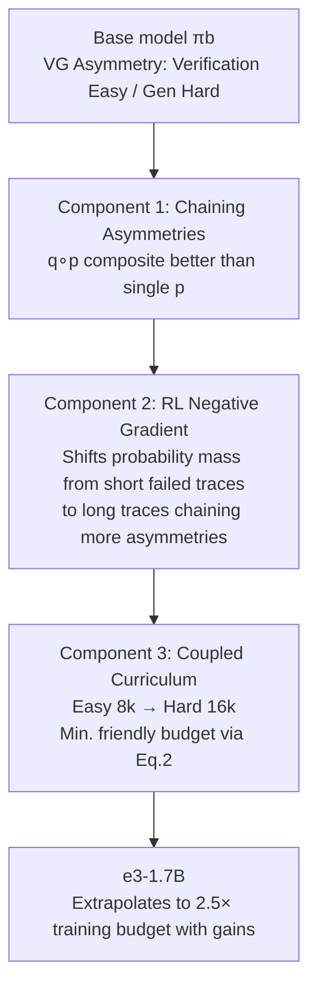

# e3: Learning to Explore Enables Extrapolation of Test-Time Compute for LLMs

**Conference**: ICLR 2026  
**OpenReview**: [https://openreview.net/forum?id=aID0dZmMmM](https://openreview.net/forum?id=aID0dZmMmM)  
**Code**: [https://matthewyryang.github.io/e3/](https://matthewyryang.github.io/e3/)  
**Area**: LLM Inference / Test-time Compute Scaling / Reinforcement Learning Post-training  
**Keywords**: test-time scaling, extrapolation, in-context exploration, verification-generation asymmetry, negative gradient, RL curriculum  

## TL;DR
This paper points out that most open-source reasoning models fail to "extrapolate" test-time compute beyond their training budgets. It proposes the e3 recipe—linking the asymmetric capabilities of base models + RL negative gradients + coupled curricula—to enable in-context exploration. This allows a 1.7B model to continuously improve when extrapolating to 2.5× its training budget on AIME/HMMT'25, surpassing all models $\le$ 2B.

## Background & Motivation

**Background**: Test-time scaling is expected to make models "smarter by thinking longer"—models should solve harder problems by spending more inference compute at deployment. Current mainstream approaches use RL (DeepSeek-R1, DAPO) or SFT (s1, LIMO) for post-training under long context windows, hoping models implement algorithmic processes like "generation-verification-refinement" or "best-of-N" within their chain-of-thought.

**Limitations of Prior Work**: The authors' empirical tests reveal an awkward fact: when increasing the test budget from 16k to 32k tokens (approx. 1.5-2× the training budget), open-source models like R1-1.5B, DeepScaleR, OpenThinker-7B, and STILL-3 show almost no performance gains (Fig. 2). In other words, these models saturate their compute usage within the training budget and **fail to extrapolate**. The true promise of test-time scaling—becoming stronger beyond the training budget—has largely failed to materialize.

**Key Challenge**: To achieve extrapolation in long CoT, the mechanism requires the model to spend compute on "in-context exploration of multiple reasoning paths." However, with existing RL/SFT recipes, models fail to learn this exploration, instead tending to learn short solutions that lead directly to an answer. Once the training length is exceeded, they collapse (through token repetition or premature termination).

**Goal**: To determine "what" enables in-context exploration to achieve extrapolation capabilities and design a reproducible post-training recipe based on these findings.

**Key Insight**: **"Exploration enables extrapolation."** The authors argue for three necessary components for in-context exploration: (1) **Capability asymmetry** must exist in the base model (e.g., a "VG gap" where verification is more accurate than generation) to provide feedback signals; (2) **RL negative gradients** are the actual engine that "links" these asymmetric capabilities to lengthen the trace; (3) A **curriculum coupling data difficulty with training budgets** must be used to structure this exploration. Together, these form e3.

## Method

### Overall Architecture

e3 decomposes "learning to explore" into three progressive components: first, confirming a verification-generation asymmetry in the base model for a given task; second, using RL with negative gradients (GRPO) to link asymmetric skills (e.g., "verify $\rightarrow$ re-generate $\rightarrow$ re-verify") into increasingly longer traces; and finally, using a coupled curriculum (easy tasks with short budgets, then hard tasks with long budgets) to structure this exploration and avoid optimization collapse in long-range RL. Ultimately, a Qwen3-1.7B trained with a 16k budget continues to improve when extrapolated to 32k at test time.

### Key Designs

**1. Chaining asymmetries: Why does exploration enable extrapolation?** The authors formalize "longer traces are more accurate" as follows: when a base model has asymmetric capabilities across different skills, RL post-training will favor solutions that link weak skills $p$ (generation) with strong skills $q$ (verification). Formally, if the composite call $q(p(\cdot))$ yields a higher expected reward than a single $p(\cdot)$—$$\mathbb{E}_{\tau\sim\pi}[r(\tau)\mid \text{detect}(q(p(\cdot)),\tau)>0] > \mathbb{E}_{\tau\sim\pi}[r(\tau)\mid \text{detect}(p,\tau)>0]$$—the model will benefit from chaining even if an optimal strategy that never calls $q$ exists. A key special case is the **VG gap**: the accuracy of a model verifying its own answer is higher than the accuracy of generating the correct answer in one go. The authors verify this on two didactic tasks: Countdown (easy verification) and n-digit multiplication (MULT, weak verification). With a VG gap, longer traces and more chaining lead to higher rewards, a trend RL further amplifies (Fig. 3-4). Without a VG gap (MULT), length and extrapolation performance are suppressed until verification ability is manually fine-tuned (MULT-V), restoring the upward trend—proving asymmetry is a **prerequisite** for exploration.

**2. pk model: Theoretical characterization of why asymmetry drives exploration.** The authors use a didactic $p_k$ model to explain the mechanism: viewing an LLM as making $k$ guesses $a_1, \dots, a_k$ under perfect verification, where each guess fails with probability $p$. The total failure probability is $p^k$, which decays exponentially with $k$. Performance can thus be improved by **decreasing $p$** (better first guess) and **increasing $k$** (more attempts). However, if verification is weak, more guesses are useless, and gains only come from decreasing $p$—explaining the difference between MULT (no extrapolation) and Countdown (extrapolation). This model clarifies "extrapolation = increasing in-context attempts $k$": SFT only decreases $p$ (maximizing likelihood of correct traces at fixed $k$), while RL negative gradients can push $k$ higher.

**3. Negative gradient: The engine that links asymmetries.** The general policy gradient form is $\mathbb{E}_{y\sim\tilde\pi(\cdot|x)}[A(x,y)\cdot\nabla_\pi\log\pi(y|x)]$, where positive gradients raise correct traces and negative gradients (negative advantage) suppress incorrect ones. SFT only has positive gradients. The authors argue that negative gradients are the core mechanism of in-context exploration: when a negative gradient is applied to an incorrect trace $y_1, y_2, \dots, \text{EOS}$, it lowers the probability of each token, especially $p(\text{EOS}|y)$. Due to probability conservation, this mass is shifted to "continuing the text"—for example, replacing EOS with "Wait, ..." to chain another verification. This brings exploration on two levels: (i) within-rollout: longer traces with more asymmetries chained (Fig. 5b-c); (ii) across-rollout: higher diversity (no entropy collapse, more independent attempts, Fig. 6). Comparative experiments of GRPO (retaining negative gradients) vs. GRPOMask (masking negative gradients, degrading to online STaR/RFT) show that without negative gradients, length and verification frequency plateau or decrease, and extrapolation gains vanish.

**4. Coupled curriculum: Structuring long-range RL exploration.** Negative gradients alone are insufficient—if the training budget $B_{tr}$ is too small, exploration is stifled (longer traces exceed budget and only short solutions are rewarded); if too large, long-range RL variance explodes, leading to poor convergence. The authors found that training on hard problems with short budgets forces the model to commit too early, producing extremely short solutions that do not generalize (Fig. 7c-d). Naive mixing of all difficulty levels is also not optimal for OOD extrapolation. The solution is a data $\times$ budget **coupled** curriculum: for a fixed dataset stage $D_i$, greedily select the minimum "RL-friendly" budget:
$$B^\star_{tr,i}(D_i)=\arg\min_{B\ge B_0} B \;\text{ s.t. } J(\pi_i;D_i,2B)\le\kappa\cdot J(\pi_i;D_i,B),\ \kappa>1$$
This selects a budget that is as small as possible but where the model no longer gains significantly at $2B$ compared to $B$. In practice, searching through $\{4k, 8k, 16k\}$, $8k$ is selected for easy problems with $\kappa=1.2$. The final e3 curriculum: first train on DMATH easy problems with $B_{tr}=8k$, then continue on medium/hard problems with $B_{tr}=16k$. The first stage itself already extrapolates to 16k ($\ge 10\%$ gain), providing a strong initialization for the second stage.

## Key Experimental Results

### Main Results (pass@k on AIME/HMMT 2025)

| Model | AIME'25 k=1 | k=8 | k=32 | HMMT'25 k=1 | k=8 | k=32 |
|---|---|---|---|---|---|---|
| Qwen3-1.7B (base) | 35.5 | 52.4 | 65.2 | 22.2 | 39.5 | 54.9 |
| R1-distill-Qwen-1.5B | 23.1 | 40.1 | 52.5 | 12.5 | 27.9 | 42.8 |
| Nemotron-Reasoning-1.5B | 33.6 | 48.9 | 58.0 | 17.4 | 35.2 | 45.0 |
| **e3-1.7B (Ours)** | **43.8** | **60.8** | **67.2** | **24.7** | **44.1** | **56.1** |

e3-1.7B improves the base Qwen3-1.7B from 35.5 to 43.8 on pass@1, and pass@32 also increases (65.2 $\rightarrow$ 67.2). Unlike the common trend where RL improves pass@1 at the cost of high-k pass@k, e3 is truly **discovering new solutions** rather than just sharpening the distribution.

### Ablation Study

| Ablation Dimension | Setting | Conclusion |
|---|---|---|
| Existence of Asymmetry | CDOWN (VG) vs MULT (no VG) | Without VG gap, 16× test compute yields only $\le$ 2% gain; almost no extrapolation. |
| Negative Gradient | GRPO vs GRPOMask | Masking negative gradients causes length/verification to plateau, entropy collapses, and gains vanish. |
| Training Budget | $B_{tr}$=4k/8k/16k (Easy tasks) | 4k kills exploration; 16k optimization fails to converge; 8k is best for extrapolation. |
| Data Mixing | easy vs easy+med vs all (8k) | Training only on easy problems surprisingly results in the best extrapolation up to 32k on OOD AIME'25. |
| Curriculum Type | Budget only / Data only / Coupled | Coupled curriculum yields optimal extrapolation performance (Fig. 8d). |

### Key Findings
- Most open-source reasoning models show almost no gains in the 16k $\rightarrow$ 32k range (Fig. 2); extrapolation capability is rare.
- e3-1.7B, trained at 16k, continues to improve when extrapolated to 24k on AIME'25, reaching approximately 2.5× the training budget.
- Counter-intuitively: training only on **easy problems** leads to the best extrapolation on difficult OOD AIME'25—because hard problems combined with short budgets stifle exploration.
- Models with larger VG gaps exhibit smaller KL divergence relative to the base model, suggesting better generalization.

## Highlights & Insights
- **Targets "extrapolation" as the true goal of test-time scaling**, exposing the reality that "open-source models do not actually extrapolate" (Fig. 2) with great clarity.
- **Attributes the mechanism to negative gradients**: Chains the argument from "probability conservation $\rightarrow$ EOS mass shifting $\rightarrow$ linking new asymmetries," providing a principled explanation for why RL lengthens traces, supported by $p_k$ models and bi-gram theoretical analysis.
- **Asymmetry (VG gap) as a prerequisite for exploration** is a highly explanatory perspective—it explains why the same RL works differently across tasks/base models.
- **Coupled curriculum budget formula (Eq. 2)** turns the "black art" of selecting training budgets into an actionable greedy criterion.
- Outperforms models like s1/s1.1 (32B) using a 1.7B model, highlighting the value of the recipe over scale.

## Limitations & Future Work
- Asymmetry focuses primarily on **VG gap** (verification-generation); other types of capability asymmetries (e.g., planning-execution) are only briefly mentioned in the appendix, with generalizability yet to be verified.
- Experiments are concentrated on mathematical reasoning (AIME/HMMT/Countdown/Multiplication). Although Appendix K mentions improvements in non-math domains, evidence for cross-domain extrapolation is limited.
- The upper bound of extrapolation is still constrained by architecture/context length; gains begin to decay after 2.5×, indicating it is not infinite.
- The difficulty classification for the coupled curriculum relies on strong models like QwQ-32B/R1-32B, introducing a dependency on external models.
- Main results are at the 1.7B scale; whether the recipe is equally effective at larger scales (hyperparameter sensitivity of negative gradients and curricula) is not fully explored.

## Related Work & Insights
- **Long CoT Test-time Scaling**: Works like DeepSeek-R1, s1, and LIMO achieve SOTA through long-chain verification/search/self-correction. Ours differs by emphasizing that "models that explore well extrapolate well," rather than simply continuing tokens (cf. s1's budget forcing).
- **Exploration in RL**: Compared to concurrent works improving exploration via advantage normalization or PPO clipping, this paper is the first to focus on **negative gradients** as the mechanism for linking asymmetries and provides a theoretical basis.
- **Curriculum Learning**: Previous curricula based on difficulty (easy $\rightarrow$ hard) or budget (short $\rightarrow$ long) were mostly motivated by efficiency; the core here is **coupling** the two to enable in-context exploration, moving beyond pure compute efficiency.
- **Inspiration**: For post-training small models, "confirming exploitable asymmetries in the base model $\rightarrow$ amplifying with negative gradients $\rightarrow$ structuring with coupled curricula" is a transferable recipe. It also suggests that reasoning models should be evaluated specifically in the **extrapolation zone** rather than just on within-budget scores.

## Rating
- **Novelty**: ⭐⭐⭐⭐⭐ Attributes extrapolation failure to "lack of in-context exploration" and systematically explains it via the asymmetry/negative gradient/coupled curriculum trifecta.
- **Experimental Thoroughness**: ⭐⭐⭐⭐ Solid mix of didactic tasks (CDOWN/MULT), real benchmarks (AIME/HMMT), and multi-dimensional ablations, though cross-domain and large-scale evidence is limited.
- **Writing Quality**: ⭐⭐⭐⭐ Progressive structure of the three components, good integration of figures and text, blending theory ($p_k$ model) and empirical evidence. High density of mechanical reasoning.
- **Value**: ⭐⭐⭐⭐⭐ Provides a reproducible recipe allowing a 1.7B model to extrapolate to 2.5× budget and surpass all models $\le$ 2B, offering direct guidance for resource-constrained reasoning post-training.

<!-- RELATED:START -->

## Related Papers

- [\[ICLR 2026\] Strategic Scaling of Test-Time Compute: A Bandit Learning Approach](strategic_scaling_of_test-time_compute_a_bandit_learning_approach.md)
- [\[ICLR 2026\] Zero-Overhead Introspection for Adaptive Test-Time Compute](zero-overhead_introspection_for_adaptive_test-time_compute.md)
- [\[ICLR 2026\] Mode-conditioning unlocks superior test-time compute scaling](mode-conditioning_unlocks_superior_test-time_compute_scaling.md)
- [\[ICLR 2026\] T1: Tool-Integrated Verification for Test-Time Compute Scaling in Small Language Models](t1_tool-integrated_verification_for_test-time_compute_scaling_in_small_language_.md)
- [\[ICLR 2026\] Test-Time Scaling in Diffusion LLMs via Hidden Semi-Autoregressive Experts](test-time_scaling_in_diffusion_llms_via_hidden_semi-autoregressive_experts.md)

<!-- RELATED:END -->
