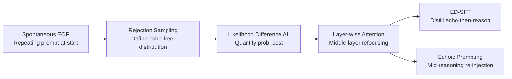

# Echoes as Anchors: Probabilistic Costs and Attention Refocusing in LLM Reasoning

**Conference**: ICLR 2026  
**OpenReview**: [https://openreview.net/forum?id=vndn1Wrult](https://openreview.net/forum?id=vndn1Wrult)  
**Code**: [https://github.com/hhh2210/echoes-as-anchors](https://github.com/hhh2210/echoes-as-anchors)  
**Area**: LLM Reasoning / Test-time Compute  
**Keywords**: Echo of Prompt, Test-time Compute, Attention Refocusing, Rejection Sampling, Chain of Thought  

## TL;DR
This paper reinterprets the spontaneous phenomenon of "repeating the prompt" at the beginning of the Chain of Thought (Echo of Prompt, EOP) in large reasoning models from a training byproduct to an intrinsic attention refocusing mechanism. By defining the "echo likelihood difference $\Delta L$" via a rejection sampling framework to quantify probabilistic costs, the paper proposes two methods: the training-based ED-SFT and the training-free Echoic Prompting, achieving consistent improvements across multiple mathematical reasoning benchmarks.

## Background & Motivation
**Background**: Large Reasoning Models (LRMs) generally "think before answering" by allocating more test-time compute. Prevailing methods for gaining performance include scaling self-consistency, parallel thinking, or inserting generic "thinking tokens" into the prompt to force the model to reread the problem.

**Limitations of Prior Work**: These methods either inject task-irrelevant placeholder tokens or use heuristic rules to force rereading, while often ignoring a real-world phenomenon—many LRMs **spontaneously** repeat the user's question at the start of their internal Chain of Thought. The academic community has largely viewed uncontrolled repetition as a failure mode of the "curse of recursion," with almost no analysis of this initial spontaneous repetition.

**Key Challenge**: Is the initial spontaneous repetition a redundant byproduct of training, or does it play a functional role in reasoning? No theory connects "early repetition" to "likelihood gain and final accuracy," making it impossible to judge whether to suppress or utilize it.

**Goal**: Systematically isolate, analyze, and utilize EOP as an emergent behavior, providing both a probabilistic cost metric and a mechanistic explanation, and translating these insights into actionable methods.

**Core Idea**: **[Redefinition]** View EOP as a "pre-emptive, compute-shaping" mechanism rather than a defect—it exchanges a small initial probabilistic cost for stable anchoring of key problem details in downstream reasoning (i.e., middle-layer attention refocusing). **[Quantification]** Use rejection sampling to formalize "echo-free" generation as a conditional event, defining a computable proxy metric $\Delta L$ to link echoes with accuracy.

## Method

### Overall Architecture
The paper advances along three lines: "Theoretical Metrics → Mechanistic Explanation → Practical Methods." First, it uses a rejection sampling framework to formalize the probabilistic cost of echoes as the echo likelihood difference $\Delta L$, verifying its positive correlation with accuracy on GSM8K. Next, layer-wise attention analysis reveals that the role of echoes is to refocus middle-layer attention back onto the problem's answer prefix. Finally, these insights are implemented in two ways: the training-based ED-SFT distills "echo-then-reason" into the model, and the training-free Echoic Prompting re-injects the problem statement mid-reasoning.

### Key Designs

**1. Echo Likelihood Difference $\Delta L$ via Rejection Sampling: Turning "echo-free" into a measurable probabilistic event.** Let the base model $\pi_\theta(y\mid x)$ be defined over the output sequence space. A separately trained MLP probe partitions the output space into two disjoint sets: "contains echo" $\mathcal Y_{echo}$ and "echo-free" $\mathcal Y_{trim}$. Ideally, the target distribution producing only echo-free trajectories is $\tau_\theta(y\mid x)=\pi_\theta(y\mid x)\,\mathbb 1_{y\in\mathcal Y_{trim}}/Z_x$, but the partition function $Z_x=\sum_{y\in\mathcal Y_{trim}}\pi_\theta(y\mid x)$ is uncomputable as it requires summing over all echo-free sequences. The authors bypass this using a sample-based proxy: for a raw trajectory $y_{raw}$ and its echo-free version $y_{trim}$, they compare the length-normalized average log-likelihood $L(y)=\frac{1}{|y|}\sum_t\log\pi_\theta(y_t\mid x,y_{<t})$ and define $\Delta L=L(y_{raw})-L(y_{trim})$ (nats/token). $\Delta L>0$ indicates the model inherently prefers trajectories with echoes, specifically quantifying the "price of the echo" for each sample.

**2. Suffix-Isolated Likelihood Difference $\Delta L_{suffix}$: Separating the impact of echoes on subsequent reasoning.** Looking at $\Delta L$ alone cannot determine if the echo merely makes itself more "likely" or actually eases subsequent reasoning. The authors split the raw trajectory into an echo prefix $e$ and a reasoning suffix $s$ ($y_{raw}=[e,s]$), defining $\Delta L_{suffix}=L(s\mid x,e)-L(s\mid x)$, which compares the average log-likelihood of the suffix with and without the echo prefix as a condition. A positive value indicates the echo prefix makes subsequent reasoning more probable in the model's view. This metric reveals a subtle phenomenon: incorrect trajectories actually have slightly higher $\Delta L_{suffix}$, suggesting echoes might introduce "confirmation bias"—strengthening locally coherent but ultimately incorrect reasoning. Thus, overall $\Delta L$, rather than just the suffix component, determines correctness.

**3. Attention Refocusing Mechanism: Using answer→answer-prefix attention to locate functional layers.** To explain why echoes work, the authors define average attention from a query token set $S_Q$ to a key token set $S_K$ on the layer-wise attention matrix $A^{(l)}$ as $\text{Attn}^{(l)}(S_Q\to S_K)=\frac{1}{|S_Q|}\sum_{i\in S_Q}\sum_{j\in S_K}A^{(l)}_{ij}$. Specifically, answer→answer-prefix (subsequent reasoning looking back at the starting echo) uses dynamic prefixes based on probe-estimated echo lengths, while answer→question serves as a negative control. Layer-wise analysis shows: correct trajectories have significantly higher attention to the answer prefix in middle layers (7–18), with a peak difference of $\approx$ 3%, while the difference for original question attention is $<$ 1%. This suggests echoes do not simply act as a "problem reread" but as **working memory anchors** pinning the reasoning to the problem representation. Cohen's $d$ reaches 0.832 in the middle layers, identifying the "bottleneck layers" for reasoning aggregation.

**4. ED-SFT and Echoic Prompting: Translating mechanisms into training and training-free paths.** ED-SFT first uses a teacher model (gpt-oss-120B) to generate high-quality, answer-verified CoT data on GSM8K. An MLP probe then detects trajectories lacking EOP, and the teacher minimally inserts a paraphrased opening (e.g., "Okay, let me see. The problem is asking...") at the start. After re-verifying the answer, this creates paired corpora nearly identical token-for-token to normal-SFT except for the initial echo segment, distilling "echo-then-reason" as a learnable behavior. Echoic Prompting is entirely training-free: after the model generates an initial reasoning chain, it appends "look back at the question again" followed by the original problem mid-stream. This uses task-relevant problem text (rather than generic thinking tokens) to re-anchor the model to the problem context.

## Key Experimental Results

### Main Results
ED-SFT consistently outperforms normal-SFT across two model families and multiple math benchmarks (with datasets identical except for the initial echo segment):

| Model | GSM-8K | MathQA | Hendrycks-MATH | Strict EM |
|------|--------|--------|----------------|-----------|
| Qwen3-8B-Base | 79.4 | 80.5 | 31.0 | 0.76 |
| + ED-SFT | **94.2 (+3.4)** | **94.2** | **58.8 (+11.8)** | **10.0 (+8.2)** |
| + normal-SFT | 90.8 | 90.8 | 47.0 | 1.8 |
| Qwen3-8B (Instruct) | 87.49 | 88.1 | 49.2 | 0.8 |
| + ED-SFT | **93.1 (+2.8)** | **93.4** | **53.7** | **6.1** |
| + normal-SFT | 90.3 | 90.1 | 51.8 | 5.0 |
| DeepSeek-Distill-Llama-8B + ED-SFT | 78.2 | **79.7** | **34.8 (+3.4)** | **3.0** |

### Ablation Study
Echo re-insertion as a causal intervention (continuing from 50% prefix of GSM8K failure trajectories, inserting only a paraphrased template):

| Model | Echo-free EM (%) | Echo Re-insertion EM (%) |
|------|------------------|--------------------|
| DeepSeek-R1-Distill-Llama-8B | 15.85 | **26.22 (+10.4)** |
| Qwen3-8B | 21.34 | **29.27 (+7.9)** |
| Qwen3-8B-Base (No CoT) | 10.56 | 10.56 (+0) |

Layer-wise attention (DeepSeek-8B, GSM8K, Correct $-$ Incorrect): Final layer answer→answer-prefix difference +3.28%, answer→question only +0.23%; Layers 7–18 answer→answer-prefix difference +2.87%, Cohen's $d=0.832$ (strongest in mid group).

### Key Findings
- **$\Delta L$ Positive Correlation with Accuracy**: Correct group $\Delta L=2.5231$ vs. Incorrect group $2.4421$ (+0.0811 nats/token); logistic regression remains significantly positive after controlling for trajectory length.
- **Causal Verification**: Forcibly inserting echoes into reasoning-capable models yields +10.4 / +7.9 EM, while base models without CoT show zero gain—indicating that utilizing echoes requires reasoning/instruction-following priors obtained via RL.
- **Mechanism Distillability**: ED-SFT's answer→answer-prefix attention difference is largest in middle layers (7–18) (+3.20 pp, vs. +2.40 pp in normal-SFT and +1.90 pp in base), directly confirming it has learned the refocusing mechanism.
- **Training-free Effectiveness**: Echoic Prompting consistently and significantly outperforms the TTTS baseline (which injects generic thinking tokens) on AIME24 and MATH-500 given the same decoding budget.

## Highlights & Insights
- **Phenomenon Redefinition**: It rehabilitates "repeating the prompt" from a dismissed "curse of repetition" to a functional cognitive primitive—a novel and explanatory perspective.
- **Theory-Mechanism-Method Closed Loop**: Rejection sampling provides computable $\Delta L$ (theory), layer-wise attention locates middle-layer refocusing (mechanism), and ED-SFT/EP provide implementation (method), with all three reinforcing each other (ED-SFT enhances exactly the middle-layer attention analyzed).
- **Relentless Negative Controls**: Using answer→question as a negative control, base models without CoT as a causal zero-gain control, and token-for-token paired SFT corpora cleanly isolates the specific contribution of the echo.

## Limitations & Future Work
- Analysis and mechanism verification are mainly focused on GSM8K + DeepSeek-R1-Distill-Llama-8B; the generalizability of attention conclusions across broader models and tasks requires more extensive verification.
- EOP detection relies on a separately trained MLP probe (binary classification rather than span localization), and span selection is delegated to a teacher model, introducing extra dependencies and potential errors.
- The finding that "suffix likelihood difference is larger in incorrect groups" suggests echoes might amplify confirmation bias; a controllable way to distinguish when echoes are beneficial versus when they reinforce wrong paths is still lacking.
- ED-SFT depends on a strong teacher (gpt-oss-120B) for data generation and verification; the training-free EP was only compared against TTTS on two math datasets, leaving its performance on non-math tasks or larger scales to be explored.

## Related Work & Insights
- **Test-time Compute Efficiency vs. Effectiveness**: Complementary to efficiency-focused "early exit/step compression" routes, this paper focuses on "effectiveness" but differs from "instructed rereading" (e.g., Xu et al. 2024, which treats repetition as an external heuristic) by emphasizing the analysis of spontaneously emergent echoes.
- **Attention Refocusing**: Echoes the "lost-in-the-middle" positional bias, attention drift in vision, and interventions like re-weighting or re-injecting evidence during reasoning. It differs by finding that EOP itself can serve as an anchoring mechanism without external modifications.
- **Insights**: Spontaneous "redundant" behaviors in models may hide undervalued computational strategies. Rather than using generic placeholder tokens, it is better to mine and distill these task-relevant endogenous mechanisms—providing guidance for designing test-time scaling and CoT training data.

## Rating
- Novelty: ⭐⭐⭐⭐ Reinterprets spontaneous repetition as a functional mechanism and provides dual support via rejection sampling and attention analysis.
- Experimental Thoroughness: ⭐⭐⭐⭐ Covers correlation ($\Delta L$), causal intervention, training (ED-SFT across multiple benchmarks), and training-free (EP vs. TTTS) evidence; however, analysis is somewhat concentrated on GSM8K and 8B models.
- Writing Quality: ⭐⭐⭐⭐ Clear theory-mechanism-method narrative with well-designed figures and negative controls; rigorous metric definitions.
- Value: ⭐⭐⭐⭐ Provides both training-based and training-free gain paths for test-time scaling and offers a reusable paradigm for analyzing endogenous cognitive behaviors in models.

<!-- RELATED:START -->

## Related Papers

- [\[ICLR 2026\] FROST: Filtering Reasoning Outliers with Attention for Efficient Reasoning](frost_filtering_reasoning_outliers_with_attention_for_efficient_reasoning.md)
- [\[ICML 2026\] Attention Illuminates LLM Reasoning: The Preplan-and-Anchor Rhythm Enables Fine-Grained Policy Optimization](../../ICML2026/llm_reasoning/attention_illuminates_llm_reasoning_the_preplan-and-anchor_rhythm_enables_fine-g.md)
- [\[ICLR 2026\] Attention as a Compass: Efficient Exploration for Process-Supervised RL in Reasoning Models](attention_as_a_compass_efficient_exploration_for_process-supervised_rl_in_reason.md)
- [\[ICML 2026\] Stop When Further Reasoning Won't Help: Attention-State Adaptive Generation in Reasoning Models](../../ICML2026/llm_reasoning/stop_when_further_reasoning_wont_help_attention-state_adaptive_generation_in_rea.md)
- [\[CVPR 2026\] APPO: Attention-guided Perception Policy Optimization for Video Reasoning](../../CVPR2026/llm_reasoning/appo_attention-guided_perception_policy_optimization_for_video_reasoning.md)

<!-- RELATED:END -->
