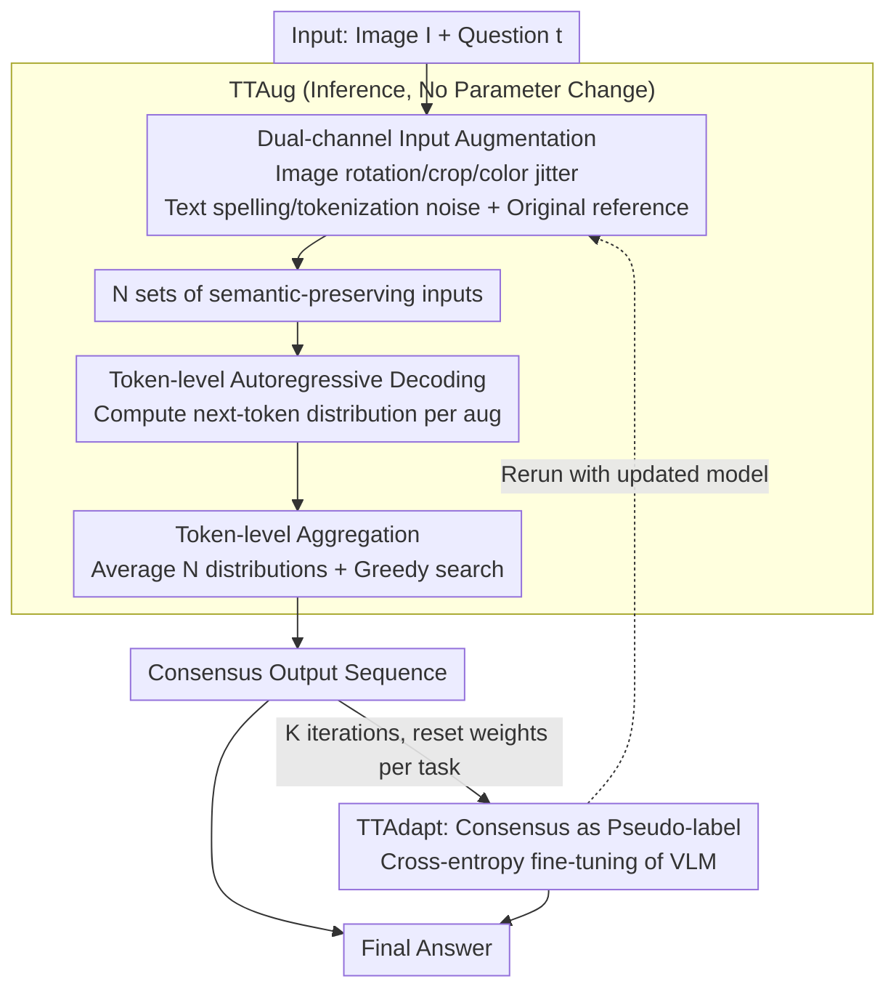

# Efficient Test-Time Scaling for Small Vision-Language Models

**Conference**: ICLR 2026  
**arXiv**: [2510.03574](https://arxiv.org/abs/2510.03574)  
**Code**: [GitHub](https://github.com/monurcan/efficient_test_time_scaling)  
**Area**: LLM Inference / VLM Efficiency  
**Keywords**: test-time scaling, vision-language models, test-time augmentation, test-time adaptation, token-level aggregation

## TL;DR

Two efficient test-time scaling strategies for small VLMs are proposed: TTAug (aggregates output probabilities at the token level after various input augmentations) and TTAdapt (adaptively adjusts model parameters using pseudo-labels generated by TTAug). These methods consistently improve performance across 9 benchmarks while maintaining significantly higher computational efficiency than existing sampling-based test-time methods.

## Background & Motivation

Small Vision-Language Models (e.g., SmolVLM2-2.2B) provide computationally efficient alternatives but suffer from weaker generalization and downstream performance compared to large models. Test-Time Scaling (TTS) techniques compensate for capacity deficits by allocating more computation during inference, but existing methods face fundamental contradictions:

**Self-Consistency**: Generates multiple candidates via temperature sampling and aggregates them through majority voting. However, multiple sampling rounds are computationally expensive, and aggregation at the final answer level loses fine-grained token-level information.

**Self-Selector / Sample-and-Rank**: Uses the model itself or log probabilities to select the best response, yet still relies on multiple independent sampling passes.

**Self-Synthesizer**: Requires the model to synthesize a final answer from multiple responses, adding further overhead to the synthesis step.

Core Problem: **The computational cost of existing TTS methods contradicts the resource-saving design objectives of small models.**

The key insights proposed in this paper are two choices that simultaneously improve effectiveness and efficiency:
- **Replacing temperature sampling with input augmentation to induce diversity**: Semantic-preserving augmentations produce higher-quality diverse candidates than temperature sampling.
- **Aggregating at the token level rather than the answer level**: Captures finer-grained confidence signals.

## Method

### Overall Architecture

To resolve the contradiction where small models require TTS for capability enhancement but find existing methods too expensive, two complementary pipelines are proposed to replace costly repetitive sampling. The first is TTAug (Test-Time Augmentation): it creates $N$ sets of semantic-preserving augmented inputs for both image and text, performs autoregressive decoding, averages the probability distribution for each token, and then uses greedy selection. No parameters are modified. The second is TTAdapt (Test-Time Adaptation): it uses the consensus output from TTAug as a pseudo-label for lightweight fine-tuning. The model is re-run with TTAug iteratively for $K$ rounds to approach a local optimum for the specific task, resetting weights back to the initial state after each problem. Both share a core mechanism—replacing "temperature sampling + answer-level voting" with "input diversity + token-level aggregation."

### Key Designs

**1. Dual-channel Input Augmentation: High-quality diversity via semantic-preserving perturbations**

Existing TTS relies on increasing decoding temperature to generate candidates, which only induces randomness at the output; the information received by the model remains unchanged. This paper focuses on the input side: the image channel applies slight rotations, crops, and color jitters to provide perspective diversity; the text channel injects spelling and tokenization noise (e.g., "Which country" → "Wh ich cou ntry") into the prompt while appending the original question as a reference ("In other words, ..."). This focuses the model on core semantics rather than surface form. Combining these creates $N$ sets of $\{(I_i, t_i)\}_{i=1}^N$. This diversity is more fundamental than temperature sampling—the first transferable insight is that replacing temperature with input augmentation in any TTS framework yields stable gains.

**2. Token-level Aggregation: Utilizing local confidence signals at each step**

Methods like Self-Consistency use majority voting only at the final answer level, discarding confidence information from intermediate steps once the sentence is reduced to a single label. TTAug collects the next-token probability distribution $p_{i,j}(v)=\mathrm{softmax}(f(I_i,t_i,y_{<j}))$ for all augmented inputs at each step of autoregressive decoding, then selects tokens via averaging:

$$p_j(v)=\frac{1}{N}\sum_{i=1}^{N} p_{i,j}(v),\qquad y_j=\arg\max_{v\in V} p_j(v)$$

The selected $y_j$ is appended to the shared context $y_{<j}$. This utilizes local consensus—if 6 out of 10 augmentations predict "Germany," 3 "France," and 1 "UK," token aggregation leverages the 60% consensus to steer the answer correctly. Answer-level voting would wait for the full sentence, which is slower and coarser. This is the second transferable insight: token-level aggregation preserves more fine-grained information.

**3. Consensus Pseudo-label Adaptation (TTAdapt): Internalizing test-time error correction**

While TTAug is effective, its error-correction signals are discarded after use. TTAdapt treats the TTAug consensus as a high-quality pseudo-label to perform a lightweight update aimed at minimizing cross-entropy: $\arg\min_{\theta} -\log p(y^{(k)}|I,t;\theta)$. The updated model reruns TTAug to generate new pseudo-labels, iterating $K$ rounds. A critical engineering detail is resetting weights to $\theta_0$ after each task to prevent catastrophic forgetting or contamination of subsequent tasks. Compared to the non-parametric TTAug, it solidifies temporary consensus into a stronger response at a slight optimization cost.

### Loss & Training

TTAug is a pure inference-time method requiring no training. TTAdapt uses the TTAug consensus as a pseudo-label for standard next-token cross-entropy updates to the VLM parameters. It maintains stability through per-task resets and consensus supervision.

## Key Experimental Results

### Main Results

Evaluations across 9 benchmarks (primarily using SmolVLM2-2.2B):
- VQA: GQA, TextVQA, OCRVQA
- MCQ/Classification: AI2D, MME-RealWorld, AMBER
- Chart Understanding: ChartQA, OCRBench
- Captioning: COCO Captions

Results indicate that TTAug and TTAdapt consistently produce improvements across all 9 benchmarks, where TTAdapt > TTAug > Baseline.

### Comparison with other TTS Methods

| Method | Source of Diversity | Aggregation Level | Efficiency |
|--------|---------------------|-------------------|------------|
| Self-Consistency | Temperature Sampling | Answer-level | Low (multiple full decodings) |
| Self-Selector | Temperature Sampling | Selection | Low |
| Sample-and-Rank | Temperature Sampling | Selection | Low |
| Self-Synthesizer | Temperature Sampling | LLM Synthesis | Lowest |
| **Ours (TTAug)** | **Input Augmentation** | **Token-level** | **High** |

### Scaling Behavior

- Average performance monotonically increases and tends to saturate as the number of augmentations increases.
- A small number of augmentations (e.g., 4-8) captures most of the gains.

### Cross-model Generalization

Although hyperparameters were optimized for SmolVLM2-2.2B, consistent improvements were observed across different models (varying scales and architectures), proving the generalizability of the methods.

### Ablation Study

| Configuration | Description |
|---------------|-------------|
| Aggregation Strategy | Token-level > Answer-level |
| Aggregation Layer | Explored optimal positions for probability merging |
| Augmentation Mix | Image + Text dual augmentation is optimal |
| Adaptation Objective | Comparison of different TTAdapt loss functions |

### Qualitative Results

Cases demonstrate the error-correction capability of augmentation + aggregation:
- ChartQA: Baseline "France" → TTAug/TTAdapt "Germany"
- OCRBench: Baseline "100.00" → TTAug/TTAdapt "71.10"
- OCRVQA: Baseline "Brushy" → TTAug/TTAdapt "Brush Dance"

## Highlights & Insights

1. **Two Core Contributions**: Insights that Augmentation > Temperature and Token-level > Answer-level can be applied independently to other TTS methods.
2. **Text Augmentation Design**: Injecting spelling noise with an original reference is simple yet effective, forcing the model to ignore surface noise and focus on semantics.
3. **Iterative Mechanism**: TTAdapt uses its own consensus as a pseudo-label for self-adaptation, creating a positive feedback loop.
4. **Deployment Oriented**: Specifically targets small models, ensuring efficiency constraints are met.
5. **Systematic Analysis**: Provides comprehensive scaling, generalization, and ablation data.

## Limitations & Future Work

1. **Trade-off between Augmentations and Latency**: While more efficient than sampling, processing multiple augmentations still results in linear latency growth.
2. **Generalization of Text Augmentations**: Noise injection might not be suitable for specific tasks like code generation.
3. **Overfitting Risk in TTAdapt**: Adapting parameters on a single test sample may lead to overfitting, particularly on out-of-distribution data.
4. **Hyperparameter Transfer**: While generalizable, task-specific tuning remains more effective.
5. **Evaluation Scope**: Primarily evaluated on discriminative tasks; performance on open-ended generation requires further verification.

## Related Work & Insights

- **Test-Time Training (TTT)**: Redesigned for the VLM context.
- **Self-Consistency (Wang et al.)**: Improved upon by changing diversity sources and aggregation granularity.
- **Test-Time Augmentation (Traditional CV)**: Extended from traditional CV tasks to the autoregressive generation of VLMs.
- **Token Merging / Pruning**: Complementary to TTAug for efficiency optimization.
- **Inference Strategy**: Demonstrates that performance can be boosted not just via compression, but through smarter reasoning strategies.

## Rating

- Novelty: ⭐⭐⭐⭐
- Experimental Thoroughness: ⭐⭐⭐⭐⭐
- Writing Quality: ⭐⭐⭐⭐
- Value: ⭐⭐⭐⭐

<!-- RELATED:START -->

## Related Papers

- [\[ICLR 2026\] T1: Tool-Integrated Verification for Test-Time Compute Scaling in Small Language Models](t1_tool-integrated_verification_for_test-time_compute_scaling_in_small_language_.md)
- [\[ICLR 2026\] CaTS: Calibrated Test-Time Scaling for Efficient LLM Reasoning](cats_calibrated_test-time_scaling_for_efficient_llm_reasoning.md)
- [\[ICLR 2026\] Plan and Budget: Effective and Efficient Test-Time Scaling on Reasoning LLMs](plan_and_budget_effective_and_efficient_test-time_scaling_on_reasoning_large_lan.md)
- [\[ICLR 2026\] Optimal Aggregation of LLM and PRM Signals for Efficient Test-Time Scaling](optimal_aggregation_of_llm_and_prm_signals_for_efficient_test-time_scaling.md)
- [\[ICLR 2026\] Test-Time Scaling with Reflective Generative Model](test-time_scaling_with_reflective_generative_model.md)

<!-- RELATED:END -->
