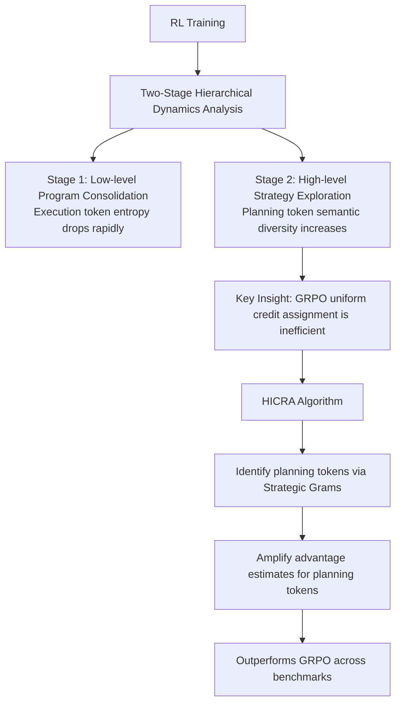

# Emergent Hierarchical Reasoning in LLMs through Reinforcement Learning

**Conference**: ICLR 2026  
**Code**: https://tiger-ai-lab.github.io/Hierarchical-Reasoner/  
**Area**: LLM Reasoning  
**Keywords**: Reinforcement Learning, Hierarchical Reasoning, Credit Assignment, Strategic Planning, GRPO

## TL;DR
Through the analysis of RL training dynamics, this work discovers that the improvement of LLM reasoning capabilities is driven by a two-stage hierarchical mechanism: "low-level program consolidation $\rightarrow$ high-level strategy exploration." Based on this, the HICRA algorithm is proposed to concentrate optimization signals on high-impact planning tokens, significantly exceeding GRPO baselines across multiple mathematical reasoning benchmarks.

## Background & Motivation

**Background**: RL (especially GRPO) has become a core method for enhancing the complex reasoning capabilities of LLMs, achieving significant progress in tasks such as mathematics and coding. However, its internal learning mechanism remains almost entirely opaque.

**Limitations of Prior Work**: Phenomena such as the "aha moment," "length extension," and token entropy dynamics observed during training are recorded in isolation, lacking a unified explanation. More critically, algorithms like GRPO apply the same optimization pressure to all tokens, failing to distinguish tokens that are truly critical to reasoning, which results in the dilution of learning signals.

**Key Challenge**: How does RL actually unlock the reasoning capabilities of LLMs? Current algorithms do not exploit the inherent structure of the reasoning process itself, treating sequences merely as homogeneous token streams.

**Goal**: To reveal the underlying mechanism by which RL improves reasoning and to transform this mechanism into a more efficient RL algorithm.

**Core Idea**: RL training for LLMs unlocks stronger reasoning capabilities by rediscovering a hierarchical reasoning structure of "high-level strategic planning vs. low-level program execution." This insight enables the design of HICRA, a hierarchical credit assignment algorithm focused on planning tokens.

## Method

### Overall Architecture

The paper is divided into two progressive parts: first, it constructs an analytical framework to empirically reveal the emergent two-stage hierarchical reasoning dynamics during RL training across eight LLMs/VLMs; second, based on these findings, it proposes the HICRA algorithm, which transforms the uniform credit assignment of GRPO into a hierarchical credit assignment biased toward planning tokens to accelerate strategy exploration and reinforcement.

### Key Designs

**1. Strategic Grams: Functional Proxies for Planning Tokens**

The core challenge is identifying which tokens perform "high-level planning" functions without human annotation. The paper defines **Strategic Grams (SGs)** as n-gram level phrase units whose function is to guide the reasoning flow—including deduction ("we can use the fact that"), branching ("let's try a different approach"), and backtracking ("but the problem mentions that"). Since the same strategic intent can be expressed in various ways, a data-driven automated pipeline is designed: first, n-grams are clustered by semantics to merge equivalent expressions; then, SGs are filtered based on statistical features. True planning phrases should appear commonly across a large number of different solution paths (high inter-solution frequency) but be used sparsely within a single solution chain (low intra-solution frequency). Human annotation studies verified that 86% of the identified results indeed function to "guide the process or propose a plan," and the analytical results remain qualitatively unchanged after randomly removing 30% of SGs, demonstrating the robustness of this proxy metric.

**2. Empirical Discovery of Two-Stage Hierarchical Dynamics**

Across eight models such as Qwen2.5-7B, Qwen3-4B, and Llama-3.1-8B, the paper tracks four metrics throughout RL training: relative perplexity of execution tokens, token-level entropy of execution tokens, semantic entropy of planning tokens (Shannon entropy of the SG frequency distribution), and overall validation accuracy. The results show a highly consistent two-stage pattern: **Stage 1**, execution token perplexity and entropy decrease rapidly as the model consolidates low-level procedural skills like arithmetic and formula substitution; **Stage 2**, execution token entropy stabilizes, but the semantic entropy of planning tokens continues to rise, indicating that the model is constantly expanding its high-level strategy library, which is highly correlated with continuous accuracy improvement and increased reasoning chain length. This finding simultaneously explains the "aha moment" (behavioral characteristics of discovering and reinforcing new strategies) and "length extension" (richer strategies naturally produce longer reasoning chains), and points out that aggregated token entropy is dominated by a large number of low-level tokens, which can mislead practitioners in judging the exploration state.

**3. HICRA: Hierarchical Credit Assignment**

Based on the above findings, HICRA introduces minimal but precise modifications to the GRPO framework. While GRPO calculates group-normalized advantages $\hat{A}_{i,t} = R(q, o_i) - \frac{1}{G}\sum_j R(q, o_j)$ treating all tokens equally, HICRA asymmetrically amplifies the advantages for planning tokens:

$$\hat{A}^{\text{HICRA}}_{i,t} = \begin{cases} \hat{A}_{i,t} + \alpha \cdot |\hat{A}_{i,t}| & \text{if } t \in S_i \\ \hat{A}_{i,t} & \text{otherwise} \end{cases}$$

Where $\alpha=0.2$ and $S_i$ is the set of indices for tokens belonging to SGs in trajectory $o_i$. The asymmetry of this design is crucial: it amplifies positive credit for planning tokens in successful trajectories ($\hat{A}>0$) and tightens negative penalties for planning tokens in failed trajectories ($\hat{A}<0$). This creates anisotropic optimization pressure at the strategy level, driving the policy distribution toward high-value strategy spaces and forming a positive feedback loop: "exploring new strategies $\rightarrow$ high reward $\rightarrow$ amplified reinforcement $\rightarrow$ further exploration."

## Key Experimental Results

### Main Results (Mathematical Reasoning Benchmarks, selected models)

| Model | Method | AIME24 | AIME25 | Math500 | AMC23 |
|------|------|--------|--------|---------|-------|
| Qwen3-4B-Instruct | Base | 63.4 | 47.7 | 94.6 | 86.7 |
| Qwen3-4B-Instruct | GRPO | 68.5 | 60.0 | 96.2 | 88.5 |
| Qwen3-4B-Instruct | **HICRA** | **73.1** | **65.1** | **97.2** | **90.2** |
| Qwen3-4B-Base | GRPO | 24.9 | 23.8 | 83.0 | 51.2 |
| Qwen3-4B-Base | **HICRA** | **31.0** | **27.6** | **89.0** | **54.0** |
| Qwen2.5-7B-Base | GRPO | 16.3 | 11.4 | 77.6 | 46.7 |
| Qwen2.5-7B-Base | **HICRA** | **18.8** | **14.8** | **80.2** | **55.1** |

### Ablation Study (Comparison on Qwen2.5-7B-Base)

| Configuration | AIME24 | AIME25 | Note |
|------|--------|--------|------|
| High-Entropy Advantage | 15.8 | 11.4 | Amplification by token entropy, not planning semantics |
| Placebo HICRA | 14.6 | 9.3 | Random n-grams instead of SGs |
| Entropy Regularization | 16.0 | 9.3 | Entropy regularization, non-targeted exploration |
| HICRA | **18.8** | **14.8** | Precise amplification of planning token credit |

### Key Findings
- Error type tracking shows that RL eliminates "planning & strategy errors" significantly more than "procedural errors," directly confirming that the strategy layer is the key bottleneck.
- HICRA maintains higher semantic entropy throughout the training process, indicating more thorough exploration of the strategy space.
- Models with stronger capabilities (MiMO-VL-Instruct, Qwen3-4B-Instruct) show shorter or even absent low-level skill consolidation stages, further supporting the claim that "strategy exploration is the core driver of RL."

## Highlights & Insights
- **Hierarchical dynamics provide a unified explanation for three phenomena**: The "aha moment" is a behavioral signature of new strategies being discovered and reinforced; "length extension" is a natural product of strategy diversification; a decrease in token entropy does not represent reduced exploration—semantic entropy is the reliable exploration metric. These three points, previously explained separately, are now unified under one framework.
- **Minimal changes for maximal effect**: HICRA only modifies the advantage function of GRPO and introduces a single hyperparameter $\alpha=0.2$. The engineering cost is extremely low, yet it brings consistent improvements across models and benchmarks, suggesting the modification addresses the true efficiency bottleneck.
- **The "Entropy" Granularity Trap**: The paper insightfully points out that aggregated token entropy is dominated by procedural tokens and decreases as low-level skills consolidate, creating the illusion of "decreased exploration." Authentic exploration states must be captured at the semantic level (SG semantic entropy).

## Limitations & Future Work
- The SG identification pipeline is based on statistical proxies; whether it is equally applicable to reasoning tasks or domains with highly variable styles (e.g., code reasoning) has not yet been verified.
- The improvement of HICRA on Llama-3.1-8B-Instruct is relatively limited (AIME24 from 8.9 $\rightarrow$ 8.3), suggesting that the emergence of hierarchical structures may be related to the model's base capability threshold.
- There is no systematic analysis of whether the optimal value of the $\alpha$ hyperparameter changes with training tasks and model scales.

## Related Work & Insights
- **vs GRPO / DAPO / SimpleRL**: These methods apply uniform optimization pressure to all tokens; HICRA outperforms them with hierarchical credit assignment. HICRA can be directly superimposed on any GRPO variant.
- **vs Entropy Regularization / High-Entropy Advantage**: Both use token entropy as a proxy for exploration value; ablation studies show this is not equivalent to planning semantic function, as high-entropy tokens are not necessarily high-level planning tokens.
- **vs Human Cognitive Hierarchical Models**: Neuroscience frameworks by Murray et al. and Zeraati et al. regarding the brain's "high-level deliberate strategy vs. low-level fast procedure" provided the source for the empirical hypotheses in this paper, which were ultimately verified at the computational level in LLM RL training.

## Rating
- Novelty: ⭐⭐⭐⭐⭐ First to systematically reveal the emergent mechanism of hierarchical reasoning in RL training, unifying three mysterious phenomena and directly translating the mechanism into an algorithm.
- Experimental Thoroughness: ⭐⭐⭐⭐ Covers 5 models, 6 math benchmarks, and VLMs with thorough ablations; some VLM results are in the appendix, making the main text slightly crowded.
- Writing Quality: ⭐⭐⭐⭐⭐ Logically rigorous from analysis to algorithm, clear takeaways, intuitive charts, and distinct narrative layers.
- Value: ⭐⭐⭐⭐⭐ Makes a significant contribution to understanding the mechanism of RL-enhanced LLM reasoning; HICRA is simple and easy to reproduce, holding high academic and engineering value.

<!-- RELATED:START -->

## Related Papers

- [\[ICLR 2026\] NFT: Bridging Supervised Learning and Reinforcement Learning in Math Reasoning](nft_bridging_supervised_learning_and_reinforcement_learning_in_math_reasoning.md)
- [\[ICLR 2026\] Learning to Reason over Continuous Tokens with Reinforcement Learning (HyRea)](learning_to_reason_over_continuous_tokens_with_reinforcement_learning.md)
- [\[ICLR 2026\] Process-Verified Reinforcement Learning for Theorem Proving via Lean](process-verified_reinforcement_learning_for_theorem_proving_via_lean.md)
- [\[ICLR 2026\] Curriculum Reinforcement Learning from Easy to Hard Tasks Improves LLM Reasoning](curriculum_reinforcement_learning_from_easy_to_hard_tasks_improves_llm_reasoning.md)
- [\[ICLR 2026\] Executable Counterfactuals: Improving LLMs' Causal Reasoning Through Code](executable_counterfactuals_improving_llms_causal_reasoning_through_code.md)

<!-- RELATED:END -->
