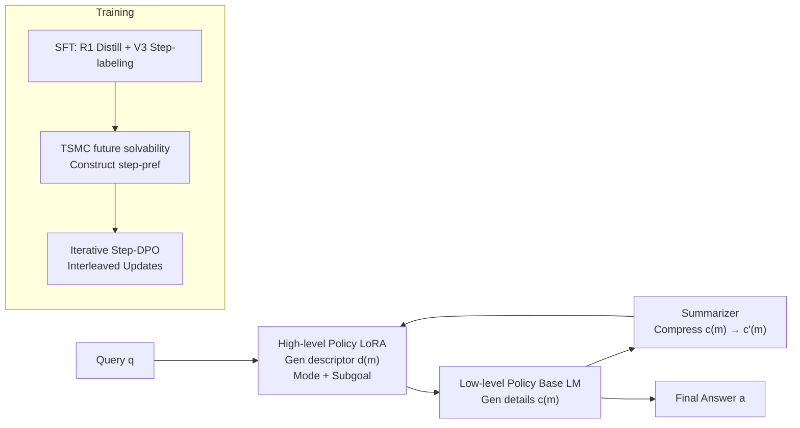

# Enhancing Language Model Reasoning with Structured Multi-Level Modeling

**Conference**: ICLR 2026  
**OpenReview**: [https://openreview.net/forum?id=PlkzZhqBCd](https://openreview.net/forum?id=PlkzZhqBCd)  
**Code**: [https://github.com/xiongsiheng/MLR](https://github.com/xiongsiheng/MLR)  
**Area**: LLM Reasoning / Test-time Scaling / Process-level Preference Optimization  
**Keywords**: Multi-Level Reasoning, Long CoT, Hierarchical RL, Step-DPO, Twisted Sequential Monte Carlo  

## TL;DR
This work reconstructs single-policy long Chain-of-Thought (CoT) generation into a two-level stochastic process (MLR), where a high-level planner outputs step descriptors and a low-level executor writes detailed content. By using Twisted SMC to construct process-level preferences for iterative Step-DPO, the method enables small models to perform stable long-range reasoning under limited data budgets.

## Background & Motivation

**Background**: Reasoning models like o1 and DeepSeek-R1 improve performance on complex tasks through "reasoning-time scaling"—allocating more computation to the reasoning process, typically implemented by generating longer Chains-of-Thought. The prevailing approach uses a single policy combined with Outcome Reward RL (e.g., GRPO) to directly incentivize long CoT generation.

**Limitations of Prior Work**: Single-policy long CoT faces two structural issues. First is **long-horizon plan failure**: the same policy must both plan and execute; without structural constraints, errors accumulate, and the implicit plan gradually drifts from any valid strategy, which is particularly severe for small models with limited capacity. Second is **long-range RL under sparse outcome rewards**: a CoT often involves thousands of token-level actions before receiving a 0/1 reward, making credit assignment extremely difficult. Additionally, empirical measurements show a wide distribution for the position of the first error (Figure 2), and PPO step latency increases sharply with generation length while memory remains tight (Figure 3), leading to slow and unstable training, especially when correct trajectories are scarce in the early stages.

**Key Challenge**: Hierarchical Reinforcement Learning (HRL) could alleviate credit assignment through temporal abstraction, but direct application to LMs faces a dilemma between **Scalability** (multiple policies implemented as independent LMs incur extra compute and coordination overhead) and **Flexibility** (traditional plan-then-execute structures are rigid and cannot correct errors when encountering new information). The key tension lies in gaining the benefits of hierarchical structure without the cost of multiple models while maintaining dynamic planning.

**Goal**: To achieve lightweight, dynamically adjustable multi-level reasoning on a unified base model and provide scalable process-level supervision for long CoT.

**Core Idea**: **[Structural Reconstruction]** Decompose long CoT into alternating high-level step descriptors and low-level details, using the base model as the low-level policy and a LoRA module as the high-level policy. **[Training Mechanism]** Use Twisted SMC (TSMC) to transform "future solvability" into step-level preference signals to drive iterative Step-DPO, bypassing the need for a separate Process Reward Model (PRM).

## Method

### Overall Architecture

MLR (Multi-Level Reasoning) organizes the reasoning process into two layers: a sequence of high-level descriptors $d=(d^{(1)},\dots,d^{(M)})$ and a sequence of low-level details $c=(c^{(1)},\dots,c^{(M)})$. The model alternates between "generating a descriptor → writing corresponding details," forming a plan–execute loop. Architecturally, the low-level policy reuses the base LM, the high-level policy is implemented via a lightweight LoRA module, and a shared small LLM acts as a summarizer. Training proceeds in two steps: first, SFT aligns the base model to multi-level data, followed by online optimization using iterative Step-DPO based on TSMC preferences.

### Key Designs

**1. Two-Level Stochastic Process Reconstruction: Decomposing Long CoT into "Descriptor—Detail" Cycles.** Instead of a single policy outputting thousands of tokens at once, MLR factorizes the joint likelihood by layer. The high-level $p^H_\theta(d^{(m)}\mid d^{(1:m-1)}, c'^{(1:m-1)})$ only observes historical descriptors and **compressed summaries** $c'$ to produce the next step descriptor (containing "reasoning mode + semantic subgoal," such as "Problem Understanding / Calculation / Verification"). The low-level $p^L_\theta(c^{(m)}\mid d^{(1:m)}, c^{(1:m-1)})$ provides detailed reasoning guided by the current descriptor. Experiments show high-level trajectories are only 10–20% of the low-level length, keeping the planner compact. This structure provides explicit abstraction to suppress implicit plan drift while allowing high-level plans to **adjust dynamically based on low-level execution progress**.

**2. Minimal Dual-Policy Architecture: Base LM as Executor, LoRA as Planner.** To avoid the overhead of multiple models, the low-level policy directly uses the full-parameter fine-tuned base LM, while the high-level policy uses a lightweight LoRA adapter. A separate Qwen-2.5-0.5B is fine-tuned as a summarizer, shared across bases and frozen during training. This system effectively maintains "one base + one LoRA," keeping inference overhead manageable compared to a single model while gaining hierarchical benefits. Ablations show that the sequence of "SFT(low)+LoRA(high)" significantly outperforms alternatives, indicating the importance of establishing a low-level foundation first.

**3. TSMC Process-level Preference: Mapping "Future Solvability" to Step-DPO Signals.** Obtaining reliable process-level supervision for long CoT is difficult. MLR uses Twisted Sequential Monte Carlo to estimate the "survival probability" (expected final correctness) for each prefix $x^{(m)}$: $g(x^{(m)})=\mathbb{E}_{\tau\sim p_{roll}}[R(x^{(m)},\tau)]$. Utility is defined as the increment in log-survivability: $U(y^{(m)})=\log\tilde g(x^{(m)},y^{(m)})-\log\tilde g(x^{(m)})$. A step-level preference pair is formed when the utility difference between candidates $y_+$ and $y_-$ exceeds a margin $\delta$. Using log-increments ensures numerical stability and matches the paired preference objective of Step-DPO. Crucially, as only **relative ranking** is required, rollouts can be performed by a smaller LM fine-tuned on the same low-level SFT data, significantly reducing costs.

**4. Iterative Step-DPO + Interleaved Update: Refreshing Preference Data On-policy.** Following the benefits of on-policy sampling, training is iterative. Each round samples preference pairs $D^{(t)}_{pref}$ using the current policy and minimizes the Step-DPO loss. An **interleaved** strategy is used for joint optimization: low-level mini-batches disable LoRA and update base LM parameters; high-level mini-batches freeze the base LM and update only the LoRA adapter. This ensures modularity during joint training.

## Key Experimental Results

### Main Results (Avg. Pass@1 across MATH500/AIME24/GPQA-Diamond/BoardGameQA-Hard)

| Method | Qwen-2.5-1.5B | Qwen-2.5-MATH-7B | Llama-3.1-8B |
|---|---|---|---|
| Instruct | 31.0 | 42.8 | 30.3 |
| DeepSeek-R1-Distill | 47.7 | 60.0 | 58.6 |
| SFT + DPO | 42.0 | 53.4 | 51.6 |
| SFT + Step-DPO | 47.8 | 60.3 | 59.1 |
| SFT + GRPO | 48.4 | 59.9 | 60.0 |
| MLR (SFT only) | 35.8 | 49.5 | 42.2 |
| **MLR** | **54.2** | **66.2** | **66.1** |

With only 10% SFT and 5% preference data budget compared to standard R1 distillation setups, MLR consistently outperforms distillation, DPO, Step-DPO, and GRPO across three different base models.

### Ablation Study

| Ablation Dimension (Qwen-2.5-1.5B / LLaMA-3.1-8B) | MATH500 | AIME24 Pass@1 |
|---|---|---|
| SFT(low)+LoRA(high) (High-level SFT) | 62.0 | 8.9 |
| High-level + Low-level (Full) | 86.1 | 31.2 |
| Low-level only | 84.2 | 27.1 |
| Ours (8B full components) | 91.5 | 53.2 |
| Low-level policy + Step-DPO | 82.4 | 42.6 |

### Key Findings
- **Hierarchy is Essential**: Removing the high-level planner (Low-level only) drops AIME24 performance from 31.2 to 27.1. Both levels are necessary for peak performance.
- **Step-DPO > DPO**: On the 8B model, the process-level "Low-level + Step-DPO" (59.1) significantly outperforms outcome-level "Low-level + DPO" (51.6).
- **Long-horizon Robustness**: MLR exhibits slower Pass@1 decay than GRPO/R1-Distill as task chain length increases, verifying the suppression of plan drift.
- **TSMC Preference Quality**: Increasing the number of rollouts $K$ reduces estimation variance. Preferences from a 1.5B rollout model achieve high alignment with an 8B reference model at $K=8$.

## Highlights & Insights
- **Practical Hierarchical Implementation**: Instead of multiple agents, MLR uses "one base + one LoRA + one shared summarizer" to embed HRL temporal abstraction into a single model.
- **Descriptors as Explicit Plans**: High-level outputs provide human-readable labels that navigate the low-level model and suppress implicit drift while consuming few tokens.
- **Mathematical Form Alignment**: Transforming TSMC multiplicative weights into log-increments elegantly aligns the importance sampling framework with the Step-DPO paired preference objective.
- **Relative Ranking Sensitivity**: The observation that only relative ordering is needed allows for cost-effective rollout strategies using small models, which is the key to scaling the pipeline.

## Limitations & Future Work
- **Data Dependency**: Relies on R1 distillation and V3 step labels for multi-level SFT data; data construction costs in domains without strong teacher models are unknown.
- **Component Coupling**: The pipeline involves multiple modules (base LM, LoRA, summarizer, rollout policy, etc.), leading to a relatively high burden for hyperparameter tuning and replication.
- **Task Scope**: Focuses on MATH/Science/Logic with verifiable 0/1 rewards. Defining survivability for open-ended reasoning tasks remains an open question.
- **Information Bottleneck**: The summarizer introduces compression; whether information loss in long chains leads to new error sources has not been deeply analyzed.

## Related Work & Insights
- **Hierarchical RL (Sutton 1999)**: MLR adapts multi-timescale strategy abstraction to LM reasoning, emphasizing dynamic plan evolution over static options.
- **Process Rewards (Lightman 2023)**: This work replaces independent PRMs with TSMC preferences, avoiding reward hacking and retraining cycles.
- **Step-DPO (Lai 2024)**: MLR extends Step-DPO from outcome-level to process-level and expands it to interleaved dual-policy optimization.
- **Twisted SMC**: Originally for sequential inference, it is repurposed here as a "future solvability" estimator for constructing step-level preferences.

## Rating
- **Novelty**: ⭐⭐⭐⭐ — The dual-level stochastic reconstruction and the TSMC-to-Step-DPO alignment are highly original.
- **Experimental Thoroughness**: ⭐⭐⭐⭐ — Comprehensive testing across 3 bases and 4 benchmarks with various ablations, though limited to verifiable tasks.
- **Writing Quality**: ⭐⭐⭐⭐ — Clear logic, effective quantification of sparse reward issues, and good coordination between formulas and diagrams.
- **Value**: ⭐⭐⭐⭐ — Demonstrates stable long-range reasoning for small models under low budgets, offering practical reference for compute-constrained scenarios.

<!-- RELATED:START -->

## Related Papers

- [\[ICLR 2026\] TSLM: Tree-Structured Language Modeling for Divergent Thinking](tslm_tree-structured_language_modeling_for_divergent_thinking.md)
- [\[ICLR 2026\] Plan-Answer-Refine-on-Graph: Structured Planning and Self-Refinement for Large Language Model Reasoning on Knowledge Graphs](plan-answer-refine-on-graph_structured_planning_and_self-refinement_for_large_la.md)
- [\[ICLR 2026\] On the Thinking-Language Modeling Gap in Large Language Models](on_the_thinking-language_modeling_gap_in_large_language_models.md)
- [\[ICLR 2026\] Why is Your Language Model a Poor Implicit Reward Model?](why_is_your_language_model_a_poor_implicit_reward_model.md)
- [\[ICLR 2026\] ChainGPT: Dual-Reasoning Model with Recurrent Depth and Multi-Rank State Updates](chaingpt_dual-reasoning_model_with_recurrent_depth_and_multi-rank_state_updates.md)

<!-- RELATED:END -->
