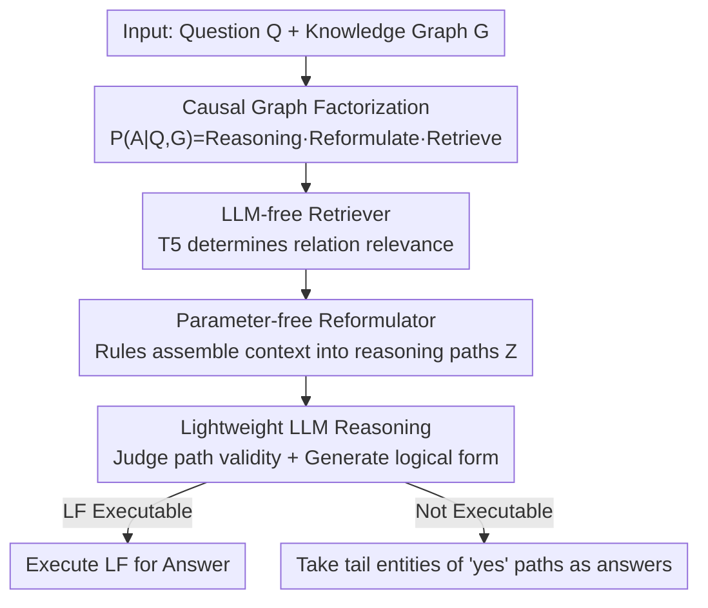

# Enhancing LLMs for Knowledge Base Question Answering by Chain-of-Decomposition

**Conference**: ICLR 2026  
**OpenReview**: [https://openreview.net/forum?id=4vfEo07rmv](https://openreview.net/forum?id=4vfEo07rmv)  
**Code**: https://github.com/YonggangZhang9412/KBQA-CoD  
**Area**: LLM Reasoning  
**Keywords**: Knowledge Base Question Answering, Task Decomposition, Causal Graph Factorization, Retrieval-Augmentation, Reasoning Path

## TL;DR
This paper proposes Chain-of-Decomposition (CoD), which factorizes the answer generation distribution of Knowledge Base Question Answering (KBQA) into three subtasks—"Retrieval → Reformulation → Reasoning"—using a causal graph. Retrieval is handled by a small model and reformulation by rules (both independent of the LLM), leaving only a lightweight binary classification task of "whether the reasoning path is valid" for a fine-tuned LLM. Consequently, Llama-2 7B achieves SOTA performance on WebQSP/CWQ, surpassing GPT-4 with retrieved knowledge.

## Background & Motivation

**Background**: Applying LLMs to Knowledge Base Question Answering (KBQA) primarily follows two paths. One is "prompting"—inserting retrieved knowledge graph subgraphs into prompts for in-context reasoning (e.g., ToG, FiDeLis); the other is "fine-tuning"—fine-tuning LLMs with meticulously designed data and objective functions to generate answers directly or indirectly (e.g., RoG, DeCAF). The essence of KBQA is to predict the answer set $A(Q)$ for a natural language question $Q$ via multi-hop reasoning over a large-scale structured knowledge graph $G$.

**Limitations of Prior Work**: Cramming entire large-scale knowledge bases into in-context learning prompts results in prohibitively high computational costs. While fine-tuning saves tokens, "fine-tuning an LLM to solve a complex task end-to-end" is inherently difficult. KBQA requires multi-hop reasoning, and fine-tuning an LLM with limited data to approximate the highly complex target distribution $P(A\mid Q,G)$ is challenging, with effectiveness heavily dependent on data and objective function design.

**Key Challenge**: Previous works have concentrated on "**enhancing the complex reasoning capabilities of LLMs**"—finding ways to make models better at reasoning—while neglecting another direction: "**reducing the complexity of the task itself**." If a difficult task can be decomposed into several simple subtasks, most of which do not even require an LLM, the learning burden on the LLM is reduced, making fine-tuning more efficient.

**Goal**: To systematically "simplify" the complex KBQA task without increasing model size or stacking prompts, allowing a 7B open-source LLM to focus on learning one simple thing.

**Key Insight**: The authors draw inspiration from "factorization" in causal inference. Since the answer generation process can be modeled as a causal graph (where question $Q$ and knowledge base $G$ are causes of context $C$, $C$ generates reasoning path $Z$, and $Q$ and $Z$ together yield answer $A$), the conditional independence between variables can be used to **factorize the difficult distribution $P(A\mid Q,G)$ into several products of manageable sub-mechanisms**.

**Core Idea**: Use "causal graph factorization" to decompose KBQA into three modular subtasks: retrieval, reformulation, and reasoning. Surprisingly, two of these (retrieval and reformulation) do not require an LLM at all. This **decouples** computationally heavy retrieval and rule-based reformulation from LLM inference, ultimately requiring fine-tuning of the LLM only for a lightweight binary classification—judging whether a reasoning path is logically valid.

## Method

### Overall Architecture

The starting point of CoD is a mathematical observation. The goal of direct answer generation is to minimize $\mathrm{KL}(P(A\mid Q,G),\ f_\theta(A\mid Q,G))$, but the distribution $P(A\mid Q,G)$ is too complex. Based on the causal graph in Fig. 2, the authors express the joint distribution of all variables as $P(Q,G,C,Z,A)=P(Q)P(G)P(C\mid Q,G)P(Z\mid C)P(A\mid Q,Z)$, then use the chain rule to rewrite the answer distribution into a product of three segments:

$$P(A\mid Q,G)=\underbrace{\sum_{Z}P(A\mid Q,Z)}_{\text{reasoning}}\ \underbrace{\sum_{C}P(Z\mid C)}_{\text{reformulate}}\ \underbrace{P(C\mid Q,G)}_{\text{retrieve}}.$$

This formula is the "master plan" of the entire method: instead of approximating the whole $P(A\mid Q,G)$, it is better to align each of the three sub-mechanisms separately. The semantic parsing route (generating logical form $M$) can be decomposed identically (replacing $A$ with $M$), and the retrieval and reformulation sub-objectives are **exactly the same** for both direct answer generation and logical form generation, thus they can be shared.

The overall pipeline is a clear sequential chain: input query $Q$ and knowledge graph $G$ → **Retrieval** module (small T5 model) filters context subgraphs $C$ relevant to the question → **Reformulation** step uses manual rules to translate context into structured reasoning paths $Z$ → **Reasoning** module (fine-tuned LLM) determines the logical validity of each path and simultaneously generates logical forms. The final prediction uses operator composition $\hat A,\hat M = f_{\theta_r}\circ h_\varnothing \circ \phi_{\theta_e}(q,G)$: each reasoning path generates an "answer + logical form" pair. The executable logical form with the highest confidence is processed first to obtain the answer; if the logical form is not executable, the system falls back to using the tail entities of all reasoning paths judged as "yes".

### Key Designs

**1. Causal Graph Factorization: Breaking a difficult distribution into three alignable sub-mechanisms**

This step addresses the fundamental pain point: "fine-tuning an LLM to approximate $P(A\mid Q,G)$ end-to-end is too hard." Instead of brute-force learning the entire distribution, the authors model the answer generation process as a causal graph, identify the conditional independence structure between variables, and then use the chain rule to factorize the target distribution into three segments: retrieval $P(C\mid Q,G)$, reformulation $P(Z\mid C)$, and reasoning $P(A\mid Q,Z)$ (see formula above). Thus, the problem of "aligning one complex distribution" becomes "aligning three simple sub-mechanisms separately"—each of which can be approximated using the most suitable tool. This decomposition also unifies the two main paradigms—direct answer generation and semantic parsing—as they only differ in the final reasoning term ($P(A\mid Q,Z)$ vs $P(M\mid Q,Z)$), with retrieval and reformulation fully shared. The discussion further proves that RoG is a special case of CoD under the additional assumptions of "answer independence from context" and "reasoning path independence from the knowledge base," theoretically demonstrating that CoD is a more general framework.

**2. LLM-free Retriever: Reducing retrieval to binary classification of relations**

Directly traversing all subgraphs of a large-scale knowledge graph is computationally infeasible. Thus, off-topic entities are first filtered based on hop count (path length) to obtain a small-scale subgraph $G_s(Q)$ that varies with the question. However, the remaining entities might still be numerous, and the subgraph drifts with the query, making it difficult to train a stable classifier. CoD's ingenuity lies in reframing "subgraph retrieval" as a traditional binary classification task: "deciding whether each relation is relevant to the answer." All answer-relevant relations are grouped into one class, and the rest into another. The objective function is defined as $\min_{\theta_e}\mathrm{CE}(\phi_{\theta_e}(Q,G_s(q),O),\ Y_e(Q,O))$, where $Y_e\in\{0,1\}$ labels whether relation $O$ is answer-relevant. Retrieved relations, along with their head/tail entities, form the answer-relevant context. Since this is just a binary classification task, **it is entirely unnecessary to use an LLM**—the authors use a relatively small T5 model, and experiments (Table 2) show that this retriever's top-k hit rate far exceeds DPR, BM25, and Sentence-BERT.

**3. Parameter-free Reformulation: Deterministically assembling context into reasoning paths using rules**

The reformulation term $P(Z \mid C)$ aims to translate the retrieved context (a set of triples) into structured reasoning paths. The authors point out that this can be achieved with manual rules—designing a deterministic algorithm or template to string triples into directed "entity-relation-entity" chains $z=e_0\xrightarrow{r_1}e_1\xrightarrow{r_2}\cdots\xrightarrow{r_k}e_k$. Because a rule-based solution exists, the reformulation model parameters $w=\varnothing$ are optimal, such that $\mathrm{KL}(P(Z\mid C),h_w(Z\mid C))=0$. Consequently, this step requires **zero learnable parameters and zero training**. Its value goes beyond simplicity: for dense subgraphs, reformulation filters out structurally invalid path combinations, compressing an exponential search space into a linear chain structure; for sparse subgraphs, imposing connectivity constraints to construct paths is far superior to feeding raw triples directly into an LLM (the "Only RP" variant yields a +14.33% improvement).

**4. Lightweight LLM Reasoning: Reframing multi-class answer prediction as yes/no binary classification**

Finally, only the reasoning term $P(A\mid Q,Z)$ is assigned to the fine-tuned LLM. However, since the number of answer candidates is massive, learning it as a multi-class task is difficult. CoD converts this into binary classification: candidates/entities are grouped into "correct" and "other" categories, and the original answer $A$ is mapped to a label $Y_a(Q,Z)\in\{0,1\}$ indicating whether $(Q,Z)$ leads to the correct answer. As LLMs are generative rather than classifiers, the authors map labels back to tokens: $Y_a=1$ as "yes" and $Y_a=0$ as "no," training with cross-entropy $\mathcal L_a(\theta_r)=\mathrm{CE}(f_{\theta_r}(A\mid Q,Z),Y_a)$. Simultaneously, inspired by DeCAF, the LLM generates logical forms using next-token prediction ($\mathcal L_m$). The final objective is the sum $\mathcal L_r(\theta_r)=\mathcal L_a(\theta_r)+\mathcal L_m(\theta_r)$. This way, the LLM only needs to learn one very simple task—"judging if this path is valid" and spitting out a logical form—minimizing task complexity so a 7B model can excel after fine-tuning.

### An Example: From Context to Reasoning Path

Given retrieved context triples: `(Penn State, contained by, State College)`, `(Penn State, contains, Beaver Stadium)`, `(State College, contained by, Pennsylvania)`, `(Beaver Stadium, contained by, University Park)`, etc. Reformulation rules will deterministically string them into two reasoning paths based on connectivity: $z_1=\text{Penn State}\xrightarrow{\text{contained by}}\text{State College}\xrightarrow{\text{contained by}}\text{Pennsylvania}$; $z_2=\text{Penn State}\xrightarrow{\text{contains}}\text{Beaver Stadium}\xrightarrow{\text{contained by}}\text{University Park}$. Note that not every path leads to the correct answer—this is precisely what the final lightweight LLM judges as "yes/no," while the rules are only responsible for organizing unordered triples into structured, verifiable chains.

### Loss & Training

The retriever (T5) is trained using cross-entropy for relation binary classification $\mathrm{CE}(\phi_{\theta_e}(Q,G_s(q),O),Y_e)$; reformulation is parameter-free and requires no training; the reasoning LLM (Llama-2 7B) is fine-tuned using $\mathcal L_r=\mathcal L_a+\mathcal L_m$ (binary cross-entropy for yes/no answers + next-token prediction for logical forms), with a batch size of 4 and a learning rate of $5\times10^{-5}$. During inference, beam search generates multiple candidates, and the executable logical form with the highest confidence is executed first.

## Key Experimental Results

### Main Results

On the WebQSP (WQSP) and CWQ datasets, Llama-2 7B + CoD outperforms all baselines, including GPT-4 with retrieved knowledge:

| Dataset | Metric | CoD (Llama-2 7B) | Prev. SOTA | Gain |
|--------|------|------|----------|------|
| WebQSP | Hits@1 (%) | 86.54 | 84.39 (FiDeLis+GPT-4) | +2.15 |
| WebQSP | F1 (%) | 81.24 | 78.32 (FiDeLis+GPT-4) | +2.92 |
| CWQ | Hits@1 (%) | 77.42 | 71.47 (FiDeLis+GPT-4) | +5.95 |
| CWQ | F1 (%) | 65.70 | 64.32 (FiDeLis+GPT-4) | +1.38 |

RoG (83.15 / 61.39 Hits@1), which also follows the fine-tuning path, is clearly surpassed, indicating that the advantage stems from task decomposition rather than model scaling. In a standalone retriever comparison (Table 2, top-5/10/20 accuracy), the CoD retriever achieved 91.04 / 95.00 / 96.77 on WebQSP and 89.93 / 92.82 / 95.11 on CWQ, significantly outperforming DPR (max 53.87 / 28.14), BM25, and Sentence-BERT, proving that a small model retriever is sufficient.

### Ablation Study

Table 3 compares the F1 scores of three variants (Only LF: logical form execution only; Only RP: reasoning path only; CoD: joint both) based on beam size:

| Configuration | WQSP F1 (bm=5) | CWQ F1 (bm=5) | Description |
|------|---------|---------|------|
| Only LF | 79.60 | 49.40 | Answer via LF execution only |
| Only RP | 78.62 | 51.37 | Answer via reasoning path (+14.33% over raw triples) |
| CoD (Joint) | 81.24 | 65.70 | Optimal joint answer + logical form |

### Key Findings
- **Joint is Better than Single-Path**: Using logical form execution and reasoning path results jointly is significantly better than either alone, with particularly sharp gains on the more complex CWQ dataset (65.70 vs 49.40/51.37), proving that the decomposition strategy is more robust for hard questions.
- **Diminishing Returns of Beam Size**: Performance improves with larger beam sizes but stabilizes after $bm=3$, indicating that correct answers typically fall within the top few generated results.
- **Reformulation is Inherently Effective**: The "Only RP" variant (regularizing context into reasoning paths before feeding to the LLM) yields a +14.33% improvement over directly feeding raw triples, validating that parameter-free reformulation compresses the search space.
- **Cross-Distribution Generalization**: On GrailQA's i.i.d. / compositional / zero-shot settings, CoD's overall F1 reached 78.2%, surpassing DeCAF (76.0%) by 2.2 points, with +0.9% for compositional generalization and +1.3% for zero-shot, showing robustness to distribution shifts.

## Highlights & Insights
- **Perspective Shift: "Reducing Task Complexity" over "Enhancing Model Capability"**: While others focus on making LLMs better reasoners, this paper asks "Can we make the task simpler?" and provides a theoretically grounded answer via causal graph factorization—a problem reformulation approach that is highly insightful.
- **Leveraging Factorization to Reveal "LLM-free" Subtasks**: A byproduct of decomposition is isolating the computationally expensive retrieval and rule-based reformulation from the LLM. The LLM only needs to learn a yes/no binary classification, which is why a 7B model can beat GPT-4.
- **Elegant Proof of "Reformulation = Zero Parameters"**: Since deterministic rules exist that make the KL divergence 0, the reformulation model can be parameter-free and require no training, effectively outsourcing a sub-mechanism to manual rules.
- **Transferability**: The trick of "reframing multi-class prediction as yes/no binary classification and mapping it to token space" to use a generative LLM as a discriminator can be transferred to other candidate evaluation tasks (e.g., retrieval reranking, fact-checking).

## Limitations & Future Work
- **Acknowledged Limitations**: Only Llama-2 7B was used as the base LLM; more advanced models like Llama-3, Qwen, or DeepSeek-R1 were not tested. Whether stronger bases would yield further improvements remains to be verified.
- **Dependence on Rule Coverage (Self-Observed)**: Reformulation relies entirely on manual rules to link context into reasoning paths. For scenarios with complex relational semantics or those requiring implicit inference for connectivity, templates might lack coverage. Rule details are in the appendix, while the main text provides only simple examples.
- **Closed-set Assumption**: The method follows the closed-set setting (topic and answer entities must be in the KG). Its applicability to open-domain or incomplete KG scenarios is not fully discussed.
- **Potential Improvements**: Upgrade reformulation from "fixed rules" to "trainable but lightweight" small models to increase coverage for complex relations while remaining LLM-free; or introduce joint optimization of semantic recall and structural constraints during retrieval.

## Related Work & Insights
- **vs RoG**: RoG solves $\min_\theta \mathrm{KL}(P(A\mid Q,G),f_\theta)$ within an EM framework and explicitly imposes a uniform distribution assumption; CoD uses decomposition to align sub-terms (retrieval/reformulation/reasoning) individually. The authors prove RoG is a special case of CoD under two extra independence assumptions, making CoD more general.
- **vs FiDeLis / ToG (Prompting + KG)**: These rely on prompts for iterative reasoning path exploration with GPT-4, incurring high costs and limited gains due to path redundancy. CoD uses fine-tuning with a precise small retriever to fetch few paths, then judges them with a lightweight LLM, allowing a 7B model to beat their GPT-4 versions.
- **vs DeCAF**: DeCAF also combines logical forms and LLM reasoning for answers. CoD adopts the "joint generation of answer and logical form" but additionally decouples retrieval/reformulation via causal decomposition, outperforming DeCAF in GrailQA's cross-distribution tests.

## Rating
- Novelty: ⭐⭐⭐⭐ Re-envisioning KBQA via causal graph factorization and decoupling LLM-free subtasks is fresh and theoretically grounded.
- Experimental Thoroughness: ⭐⭐⭐⭐ Includes WebQSP/CWQ main results, retriever comparisons, beam/variant ablations, and GrailQA cross-distribution generalization; fairly complete, though based only on Llama-2 7B.
- Writing Quality: ⭐⭐⭐⭐ Causal factorization derivation is clear, with a tight correspondence between motivation and methodology.
- Value: ⭐⭐⭐⭐ Achieving results with a 7B open-source model that surpass GPT-4 with retrieval knowledge is highly practical for low-cost deployment of complex reasoning.

<!-- RELATED:START -->

## Related Papers

- [\[ICLR 2026\] VoG: Enhancing LLM Reasoning through Stepwise Verification on Knowledge Graphs](vog_enhancing_llm_reasoning_through_stepwise_verification_on_knowledge_graphs.md)
- [\[ACL 2025\] Is That Your Final Answer? Test-Time Scaling Improves Selective Question Answering](../../ACL2025/llm_reasoning/test_time_scaling_selective_qa.md)
- [\[ICLR 2026\] Reasoning with Sampling: Your Base Model is Smarter Than You Think](reasoning_with_sampling_your_base_model_is_smarter_than_you_think.md)
- [\[ICLR 2026\] Learning Global Hypothesis Space for Enhancing Synergistic Reasoning Chain](learning_global_hypothesis_space_for_enhancing_synergistic_reasoning_chain.md)
- [\[ICLR 2026\] LoC-Decomp: LLM Autoformalization via Logical Concept Decomposition and Iterative Feedback Correction](loc-decomp_llm_autoformalization_via_logical_concept_decomposition_and_iterative.md)

<!-- RELATED:END -->
