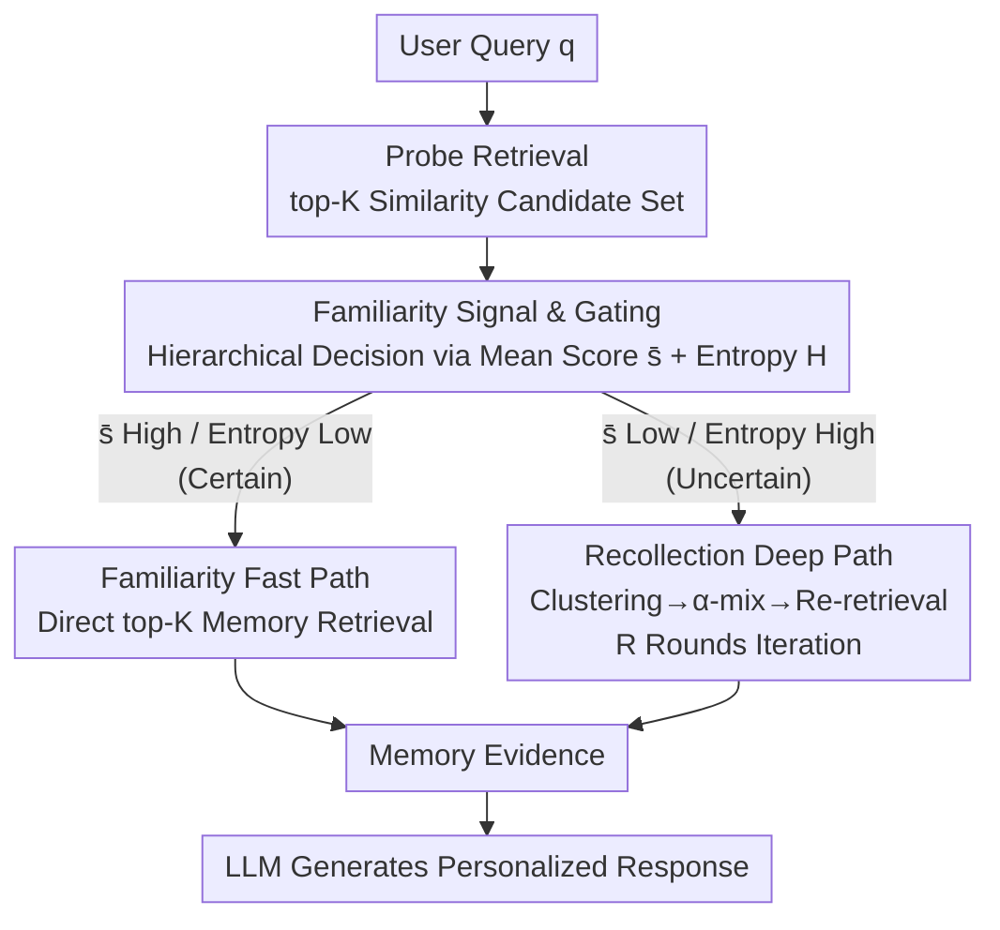

# Evoking User Memory: Personalizing LLM via Recollection-Familiarity Adaptive Retrieval

**Conference**: ICLR 2026  
**arXiv**: [2603.09250](https://arxiv.org/abs/2603.09250)  
**Code**: See paper Reproducibility Statement  
**Area**: Personalization / Information Retrieval  
**Keywords**: LLM Personalization, Memory Retrieval, Dual-Process Theory, Adaptive Retrieval, Cognitive Science

## TL;DR

Inspired by the dual-process theory of cognitive science, this paper proposes the RF-Mem framework. It achieves efficient and scalable LLM personalization through a memory retrieval mechanism that adaptively switches between two paths: Familiarity (fast similarity matching) and Recollection (deep chain reconstruction).

## Background & Motivation

Personalizing Large Language Models requires incorporating user-specific historical records, preferences, and context into dialogue generation. Two existing mainstream methods each have significant drawbacks:

**Full-context approaches**: Stuffing all of a user's historical memory into the prompt is costly and non-scalable—as user memories accumulate, the prompt length quickly exceeds the model's window limits.

**One-shot retrieval approaches**: Simplifying retrieval to a single round of similarity search (top-K) only captures surface-level matches and fails to deeply recover critical memory content indirectly related to the query.

Cognitive science research indicates that human memory recognition operates through a **dual-process**:
- **Familiarity**: A fast but coarse recognition process that quickly determines whether something has been encountered before.
- **Recollection**: A slower but precise reconstruction process capable of consciously tracing back specific details and related contexts.

Existing systems lack both the capability for recollection-style retrieval and the mechanism to adaptively switch between these two retrieval paths. This leads to either insufficient retrieval (missing key memories) or the introduction of noise (retrieving irrelevant content).

## Method

### Overall Architecture

RF-Mem (Recollection-Familiarity Memory Retrieval) incorporates the dual-process theory of human memory recognition into LLM memory retrieval. Given a user query $q$, the system first performs an inexpensive probe retrieval in the user's memory bank. A Familiarity signal is calculated from the returned similarity scores to judge "how certain the system is about finding the correct memory." Based on this, it branches: a strong signal triggers the Familiarity fast path to directly retrieve top-K memories, while a weak signal enters the Recollection deep path for multi-round chain reconstruction. Both paths eventually merge into a set of memory evidence, which is provided to the generation LLM to produce a personalized answer. The entire mechanism occurs at the retrieval layer, is training-free, does not modify the underlying embedding or generation models, and allows independent replacement of the embedder, clusterer, and generator LLM, enabling direct integration into existing personalization systems.

### Key Designs

**1. Familiarity Signal and Hierarchical Gating: Deciding the Path via Score Distribution Shape**

If the branching decision relied on repeated LLM probes, the cost would degrade to the full-context approach. Thus, RF-Mem uses the similarity scores of a single probe retrieval to estimate certainty. Given a query embedding $x_t=\phi(q)$ and memory embeddings $z_i=\phi(m_i)$, probe retrieval extracts top-K candidates based on cosine similarity $s_i=\langle x_t, z_i\rangle$. Two metrics are derived from these K scores: the mean score $\bar{s}=\frac{1}{K}\sum_i s_i$ to capture overall matching strength (higher suggests relevant memories exist), and the entropy $H(p)=-\sum_i p_i\log p_i$ calculated from softmax-normalized scores $p_i=\frac{\exp(\lambda(s_i-\max_j s_j))}{\sum_j \exp(\lambda(s_j-\max_j s_j))}$ ($\lambda$ controls sharpness; lower entropy indicates clear matching on a few memories). Gating is **hierarchical**: the mean score decides first—$\bar{s}\ge\theta_{high}$ leads directly to Familiarity, while $\bar{s}\le\theta_{low}$ leads directly to Recollection; only the fuzzy interval $(\theta_{low}, \theta_{high})$ is judged by entropy, where $H(p)\le\tau$ leads to Familiarity and $H(p)>\tau$ leads to Recollection. This threshold gating is key to avoiding the extremes of "stuffing prompts" and "missing recall": expensive Recollection is reserved for truly ambiguous queries, approaching full-context quality under fixed token budgets and latency.

**2. Familiarity Fast Path: Decisive Action when Certain**

When the signal is judged as certain (high mean or low entropy), the association between the query and historical memory is direct, and complex reasoning would be a waste of computation. this path executes standard top-K similarity retrieval, feeding the most relevant memories from $C_t=\text{Top-K}\{(m_i, \langle x_t, z_i\rangle)\}$ directly to the generation model. It requires only one forward retrieval without additional overhead, handling most daily queries and providing the system's efficiency.

**3. Recollection Deep Path: Simulating Chain Recollection in Embedding Space**

When the signal is uncertain, relevant memories are often only indirectly related to the query, scattered across different times and themes. Since surface matching fails, RF-Mem mimics the human "following the thread" recollection process by iterating "retrieve-cluster-mix" in the embedding space. Each round takes top-N candidates, where $N=(B+r)\times F$ increases with round $r$ ($B$ is beam width, $F$ is fan-out), while filtering out memories from previous rounds. It then uses KMeans to cluster candidate embeddings into $B$ clusters, where each centroid $g_b^{(r)}=\frac{1}{|G_b^{(r)}|}\sum_{m_i\in G_b^{(r)}} z_i$ represents a semantic direction acting as a retrieval tree branch. Then, $\alpha$-mix query expansion is performed by mixing the current query, centroid, and original query to generate a new query biased toward that direction:

$$x_b^{(r+1)} = \text{norm}\big(\alpha\, x^{(r)} + (1-\alpha)\, g_b^{(r)} + x_t\big),\quad \alpha\in[0,1]$$

A residual term of the original query $x_t$ is preserved to prevent the query from drifting away from the original intent after multiple expansions. The new query retrieves the next round of candidates, iterating up to a maximum of $B$ active branches and a depth cap of $R$ rounds. The evidence is the truncated union of all rounds $C_t=\text{Top-K}\bigcup_{r=0}^{R} C^{(r)}$. This chain reconstruction relies only on vector retrieval and small-scale clustering, gradually incorporating memories semantically linked but surface-dissimilar to the original query, avoiding expensive multi-round LLM calls.

## Key Experimental Results

### Main Results

Evaluations were conducted on three personalization benchmarks across different corpus scales:

| Method | Benchmark 1 | Benchmark 2 | Benchmark 3 | Description |
|------|-------|-------|-------|------|
| Full-Context Inference | Baseline | Baseline | Baseline | Highest cost, performance upper bound |
| One-shot Retrieval | Below Full-Context | Below Full-Context | Below Full-Context | Simple and fast but poor quality |
| **RF-Mem** | **Optimal** | **Optimal** | **Optimal** | Consistently outperforms both baselines under fixed budget |

### Ablation Study

| Configuration | Key Metric | Description |
|------|---------|------|
| Familiarity path only | Baseline level | Equivalent to standard top-K retrieval |
| Recollection path only | Above Familiarity-only | Wastes computation on simple queries |
| Dual-path + Adaptive switching | **Optimal** | Balances efficiency and quality |
| Removing Clustering | Performance drop | Clustering helps identify thematic memory structures |
| Removing Alpha-Mix | Performance drop | Query expansion is the core of Recollection |

### Key Findings

- **Consistent Advantage**: RF-Mem outperforms both baseline methods across all three benchmarks and various corpus scales.
- **Budget Efficiency**: Under fixed retrieval budgets (token counts) and latency constraints, RF-Mem achieves performance close to full-context methods while maintaining the efficiency of one-shot retrieval.
- **Scalability**: As the user memory bank scale increases, the advantage of RF-Mem becomes more pronounced—full-context costs grow linearly, while RF-Mem overhead growth is modest.
- **Path Distribution**: Approximately 60-70% of queries are processed via the Familiarity fast path, while 30-40% require the Recollection deep path.

## Highlights & Insights

1. **Elegant Transfer of Cognitive Science**: Adapting the Familiarity-Recollection dual-process theory into LLM retrieval system design is both elegant and practical.
2. **Uncertainty-Guided Adaptation**: Using the mean and entropy of the retrieval score distribution as adaptive signals is more robust than simple thresholding.
3. **Memory Reconstruction in Embedding Space**: Simulating the chain reconstruction of recollection via clustering and Alpha-Mix in embedding space avoids costly multi-round LLM calls.
4. **Practical Design Philosophy**: The framework is modular, with components that can be independently replaced and optimized, making it suitable for engineering deployment.

## Limitations & Future Work

1. **Setting Familiarity Thresholds**: Adaptive switching depends on threshold parameters; different datasets may require different thresholds, and a fully automated solution is lacking.
2. **Choice of Clustering Algorithm**: Clustering methods in the Recollection path might have limited effectiveness in high-dimensional sparse memory spaces.
3. **Long-term Memory Forgetting and Updating**: The handling of outdated or contradictory user memories is not explicitly discussed.
4. **Privacy Considerations**: Storing and retrieving user historical memories involves privacy risks, and privacy protection mechanisms were not discussed in depth.

## Related Work & Insights

- **Dual-Process Theory of Cognition (Yonelinas, 2002)**: Familiarity and Recollection are two basic processes of human memory recognition; this paper operationalizes this theory for retrieval system design.
- **RAG (Retrieval-Augmented Generation)**: RF-Mem can be viewed as an enhanced version of RAG, specifically optimized for personalization scenarios.
- **Adaptive Retrieval**: Works like Self-RAG and FLARE study *when* to retrieve, whereas RF-Mem studies *how* to retrieve.
- **Personalized LLM**: Benchmarks like LaMP and PersonaLLM have driven the development of personalized LLMs, upon which this paper improves the retrieval module.

## Rating

- Novelty: ⭐⭐⭐⭐⭐ — Innovative application of cognitive dual-process theory in LLM retrieval.
- Experimental Thoroughness: ⭐⭐⭐⭐ — Three benchmarks, multi-scale evaluation, and ablation analysis.
- Writing Quality: ⭐⭐⭐⭐ — Clear concepts with well-explained interdisciplinary motivations.
- Value: ⭐⭐⭐⭐ — Provides a practical and scalable solution for memory retrieval in personalized LLMs.

<!-- RELATED:START -->

## Related Papers

- [\[ICLR 2026\] Temperature as a Meta-Policy: Adaptive Temperature in LLM Reinforcement Learning](temperature_as_a_meta-policy_adaptive_temperature_in_llm_reinforcement_learning.md)
- [\[ICLR 2026\] Retrieval-of-Thought: Efficient Reasoning via Reusing Thoughts](retrieval-of-thought_efficient_reasoning_via_reusing_thoughts.md)
- [\[ICLR 2026\] Beyond Markovian: Reflective Exploration via Bayes-Adaptive RL for LLM Reasoning](beyond_markovian_reflective_exploration_via_bayes-adaptive_rl_for_llm_reasoning.md)
- [\[ICLR 2026\] STAT: Skill-Targeted Adaptive Training](stat_skill-targeted_adaptive_training.md)
- [\[ICLR 2026\] Zero-Overhead Introspection for Adaptive Test-Time Compute](zero-overhead_introspection_for_adaptive_test-time_compute.md)

<!-- RELATED:END -->
