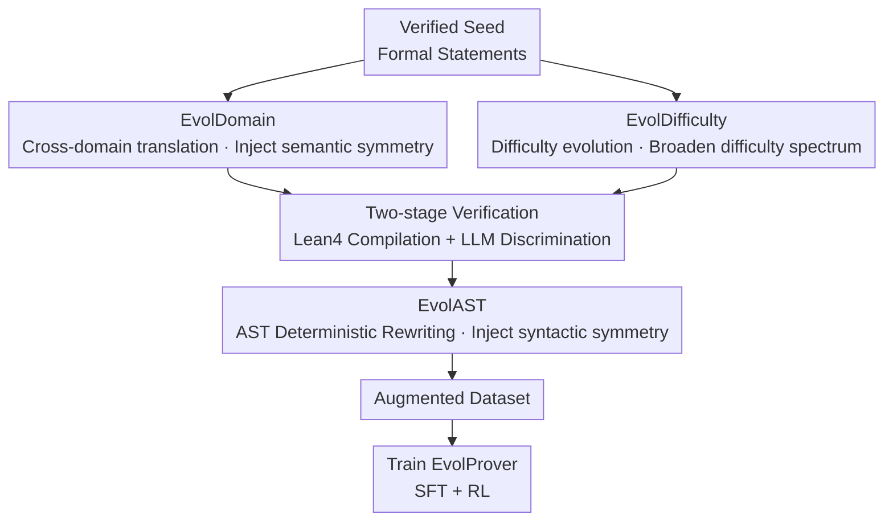

# EvolProver: Advancing Automated Theorem Proving by Evolving Formalized Problems via Symmetry and Difficulty

**Conference**: ICLR2026  
**OpenReview**: [https://openreview.net/forum?id=cBoYkLG3EJ](https://openreview.net/forum?id=cBoYkLG3EJ)  
**Code**: TBD  
**Area**: LLM Reasoning / Formal Theorem Proving / Data Augmentation  
**Keywords**: Formal theorem proving, data augmentation, Abstract Syntax Tree (AST), difficulty evolution, robustness

## TL;DR
EvolProver proposes a dual-perspective "Symmetry + Difficulty" formal statement data augmentation pipeline (EvolDomain cross-domain translation + EvolDifficulty difficulty evolution + EvolAST AST-based deterministic syntactic rewriting). Using this augmented data, a 7B non-CoT theorem prover was trained, achieving a new SOTA for its size with 53.8% pass@32 on FormalMATH-Lite, even surpassing reasoning models.

## Background & Motivation
**Background**: Using LLMs for formal theorem proving in languages like Lean, Coq, and Isabelle is a current hot topic. Formal languages write mathematical proofs as code that requires line-by-line verification by a compiler, ensuring absolute reliability. However, this creates a bottleneck: high-quality training data is extremely scarce. Writing formal proofs requires deep domain knowledge and significant time, which naturally conflicts with the "data-hungry" paradigm of LLMs. To alleviate this, the community has explored various synthesis methods: DeepSeek-Prover automatically translates natural language problems into formal statements followed by model scoring; Goedel-Prover-V2 uses a scaffolding strategy to generate problems of appropriate difficulty; STP allows a model to self-play between "conjecturer" and "prover" roles to iteratively generate new problems and proofs.

**Limitations of Prior Work**: Even when trained with such synthetic data, models still lack generalization and are exceptionally fragile to minor changes in problems. For example, Zhao et al. found that rewriting an inequality $f(x) > g(x)$ into an equivalent but different form like $f(x) + f(y) > g(x) + g(y)$ can cause a "cliff-like" drop in LLM performance. This fragility also exists in informal mathematics (benchmarks like PutnamGAP and MATH-P-Hard observe performance drops of 3%–25%).

**Key Challenge**: The sensitivity of models to minor transformations fundamentally indicates they haven't learned the underlying **symmetric structure** of mathematical problems—"symmetry" in mathematics is precisely "invariance under a certain class of transformations." Meanwhile, existing synthetic data often concentrates in narrow difficulty intervals, causing models to rely on shortcuts and memorization rather than true understanding.

**Goal**: Directly enhance formal data from two previously ignored dimensions—syntactic symmetry and semantic symmetry (collectively "Symmetry") and difficulty distribution ("Difficulty")—to help models learn invariance and cover a wider difficulty spectrum.

**Key Insight**: Unlike the mainstream approach of "evolving natural language problems then formalizing them," the authors advocate for **evolving formal statements directly**. Formal languages already carry logical structures, allowing one to bypass the natural language intermediate layer. This reduces errors introduced during formalization and enables strict equivalent rewriting through procedural means (AST).

**Core Idea**: Use EvolDomain (cross-domain translation) to inject semantic symmetry, EvolDifficulty (difficulty evolution) to broaden the difficulty spectrum, and EvolAST (AST deterministic rewriting) to inject syntactic symmetry. These three components form a pipeline to expand data for training the non-CoT prover EvolProver.

## Method

### Overall Architecture
The pipeline addresses how to mass-produce diverse and correct new training data from verified seed formal statements. it consists of three serial stages: First, LLM-driven EvolDomain and EvolDifficulty are used **in parallel** to evolve seed statements, yielding new cross-domain or cross-difficulty (natural language + formal) statement pairs. These pass through a two-stage verification (Lean 4 compiler for syntax, LLM discriminator for semantics) to filter out poor data. Finally, deterministic EvolAST performs equivalent syntactic transformations at the AST level on verified statements to further expand structural diversity. The augmented dataset is used to fine-tune DeepSeek-Prover-V1.5-Base via SFT + RL to obtain the final EvolProver.

The authors emphasize a **sorting principle**: LLM-driven steps act like exponential amplification ($x \to \exp(x)$) because LLMs introduce significant and unpredictable changes, causing noise to scale exponentially. EvolAST is a deterministic syntactic transformation where noise amplification is closer to linear ($x \to 2x$). Thus, putting the LLM stage first and the deterministic stage second ($x \to \exp(x) \to 2\exp(x)$) prevents premature noise explosion. Reversing the order would scale errors linearly then exponentially. Controlling overall instability to a moderate level is crucial—if problems become too unstable, they become unprovable, leading to insufficient valid training instances.

### Key Designs

**1. EvolDomain: Injecting Semantic Symmetry via Cross-Domain Translation**

Addresses the pain point that models fail to learn that problems can be restated across different mathematical domains (semantic symmetry). EvolDomain uses an LLM to translate a formal statement into a new mathematical domain via three steps: ① Deconstruction & Abstraction of the logical skeleton; ② Analogy & Transfer to find similar structures in the target domain; ③ Instantiation & Packaging of the new proposition. Formally, given a source statement $S^{formal}_i$ and a target domain $D_m$ from a predefined list $L_D = \{D_1, \dots, D_M\}$, function $F$ guides the LLM to extract the skeleton and construct a new proposition, outputting a pair: $F(S^{formal}_i, D_m) = (\hat{S}^{formal}_i, \hat{P}_i)$. To maximize cross-domain exploration, the prompt requires the LLM to transfer a single logic skeleton to 3–5 different domains simultaneously. It is effective because evolving directly on formal statements bypasses mistakes in the "NL $\to$ Formal" middle layer.

**2. EvolDifficulty: Breaking Shortcuts via Difficulty Gradient Evolution**

Addresses narrow difficulty intervals that lead to memorization. EvolDifficulty uses an LLM to adjust statement difficulty, creating a dataset with a broad spectrum. This process $E$ is guided by five core strategies $S = \{s_1, \dots, s_5\}$ designed via expert consultation: (1) logical structure, (2) mathematical depth, (3) abstraction level, (4) constraints, and (5) parameters. Given $S^{formal}_i$, the function uses strategy $s_k \in S$ and a direction $\delta \in \{+1, -1\}$ (increase/decrease difficulty) to generate a new pair $E(S^{formal}_i, s_k, \delta) = (\hat{S}^{formal}_i, \hat{P}_i)$. Systematically traversing these parameters provides fine-grained control, enriching the dataset hierarchy and making it harder for models to rely on narrow shortcuts.

**3. Two-stage Verification: Compiler + LLM Dual Filtering for Quality**

This is the quality gate for the pipeline. Stage one: Syntax Check. Each generated statement $\hat{S}^{formal}_i$ is sent to the Lean 4 compiler; if it fails, the LLM gets one chance to fix it, otherwise it is discarded. Stage two: Semantic Check. Pairs $(\hat{S}^{formal}_i, \hat{P}_i)$ with valid syntax are evaluated by an LLM discriminator on three criteria: consistency between formal and natural language versions, correctness of the proposition, and appropriateness of difficulty. This "Deterministic Compilation + Semantic Discrimination" mechanism ensures data reliability. Evaluations using DeepSeek-V3.1 on 1,634 evolved samples showed a 30.35% semantic failure rate, proving this gate is indispensable.

**4. EvolAST: Completing Syntactic Symmetry via AST Deterministic Rewriting**

Addresses insufficient syntactic diversity and LLM rewriting errors. EvolAST parses formal statements into Abstract Syntax Trees (AST) and applies a set of **deterministic** rewriting rules based on existing axioms and theorems to perform equivalent transformations. This bypasses non-deterministic models to ensure strict semantic equivalence. It implements an extensible set of 7 rules $R = \{r_1, \dots, r_7\}$: (1) premise reordering, (2) commutativity, (3) associativity, (4) distributivity, (5) De Morgan's laws, (6) operand swapping for symmetric relations, and (7) dual relation conversion. Function $A$ recursively visits nodes with probability $p$ to apply rules: $A(S^{formal}_i, p) = \hat{S}^{formal}_i$. Since transformations are logically grounded, the output is guaranteed correct and **requires no further verification**.

**5. Pipeline Sequencing: LLM-first, Deterministic-second**

Balances the tension between diversity and provability. By modeling instability as amplification effects—LLM stage (EvolDomain/EvolDifficulty) as $\exp(x)$ and EvolAST as linear $x \to 2x$—the sequence $(x \to \exp(x) \to 2\exp(x))$ avoids exploding noise exponentially at the start. Maintaining moderate instability is key: overly unstable problems become unprovable, failing to provide useful training instances. This principle balances diversity against provability.

### Loss & Training
The final model fine-tunes DeepSeek-Prover-V1.5-Base (the strongest non-CoT model pre-trained on large-scale formal data). Training involves two stages: Supervised Fine-Tuning (SFT) + Reinforcement Learning (RL). Variants for ablation include EvolProver-Base (public data only), EvolProver-Ablation-SFT/EvolProver-SFT, and EvolProver-Base/Ablation-RL/EvolProver.

## Key Experimental Results

### Main Results
EvolProver is a 7B non-CoT model evaluated at pass@32. It sets a new SOTA on FormalMATH-Lite (425 problems) among same-tier models and surpasses reasoning models:

| Dataset | Metric | EvolProver | Prev. SOTA | Gain / Note |
|--------|------|-----------|----------|------|
| FormalMATH-Lite | pass@32 | **53.86%** | 51.76% (DeepSeek-Prover-V2-CoT) | Exceeds reasoning models |
| FormalMATH-Lite | vs. Base | 53.86% | 44.71% (EvolProver-Base) | +9.15 |
| MiniF2F-Test | pass@32 | **69.80%** | Non-CoT SOTA | ~1/10 tokens of reasoning models |
| Ineq-Comp (Seed) | pass@32 | **52.20%** | 43.26% (Base) | +8.94 |
| Ineq-Comp (Transformed) | pass@32 | **34.02%** | 14.89% (Base) | +19.13 |
| Ineq-Comp (Ratio, Robustness) | Ratio | **65.17%** | 34.43% (Base) | +30.74 |

Note: Ineq-Comp uses the "transformed pass / seed pass" ratio to measure robustness. EvolProver's ratio is 30.74 percentage points higher than its Base, validating the effect of augmentation on robustness.

### Ablation Study
Table 4 results using pass@32. Superscript 0 = Public data; 0+1 = + EvolDomain & EvolDifficulty; 0+1+2 = Full (adds EvolAST).

| Configuration | FormalMATH | MiniF2F | Ineq-Comp(Seed) | Ineq-Comp(Trans) | Ineq-Comp(Ratio) |
|------|-----------|---------|-----------------|------------------|-------------------|
| EvolProver-Base⁰ | 44.71% | 52.05% | 43.26% | 14.89% | 34.43% |
| Ablation-SFT⁰⁺¹ | 50.35% | 65.16% | 49.79% | 29.19% | 58.62% |
| EvolProver-SFT⁰⁺¹⁺² | 51.53% | 66.39% | 49.82% | 30.35% | 60.19% |
| Ablation-RL⁰⁺¹ | 51.98% | 68.22% | 50.36% | 33.05% | 65.62% |
| EvolProver⁰⁺¹⁺² | **53.96%** | **69.80%** | **52.20%** | **34.02%** | 65.17% |

### Key Findings
- **Consistent gains at every stage**: Moving from 0 $\to$ 0+1 (LLM semantic/difficulty evolution) showed the largest jump, indicating primary contributions from semantic symmetry and difficulty broadening. Adding EvolAST (0+1 $\to$ 0+1+2) yields steady small gains.
- **Direct formal evolution is superior**: For 400 seeds, EvolDomain & EvolDifficulty yielded 661 verified statements, outperforming Formalization-Formalizer (570), few-shot (492), and zero-shot (408).
- **Domain diversity breakthrough**: EvolDomain flattened a skewed distribution (Algebra fell from 57.5% to 20.1%, while Calculus rose from 3.5%; new fields like multivariable calculus and integration were introduced).
- **Not due to similarity**: Average top-1 similarity between test samples and the training set was only 3.48 (via Qwen3-Embedding-8B and DeepSeek-V3.1), proving gains aren't from data leakage.

## Highlights & Insights
- **Applying "Symmetry" as a first principle**: Combining syntactic (EvolAST) and semantic (EvolDomain) symmetry directly addresses model fragility by teaching invariance.
- **Exponential vs. Linear noise models**: Quantifying LLM instability vs. AST stability justifies the pipeline order, offering a reusable framework for "LLM generation + rule post-processing."
- **Zero-verification cost for AST**: EvolAST provides "free" diversity without high-overhead filtering since equivalence is strictly logical.
- **Outperforming reasoning models without CoT**: Achieving SOTA results using roughly 1/10 of the tokens is highly attractive for cost-sensitive deployment.

## Limitations & Future Work
- **Ours**: Plans to incorporate synthetic CoT data to enhance reasoning capabilities.
- **LLM failure rates**: A ~30% semantic failure rate in early stages necessitates heavy reliance on the verification gate.
- **Manual rules**: EvolAST and EvolDifficulty rely on human-coded rules and strategies, limiting coverage to what has been manually implemented.
- **Cost of domain balancing**: It is unclear if suppressing the dominant "Algebra" domain in favor of others leads to any performance trade-offs in those originally strong areas.

## Related Work & Insights
- **vs. STP**: While STP uses self-play between a conjecturer and prover, Ours evolves existing verified statements via symmetry/difficulty. STP data can be used as a seed source for EvolProver.
- **vs. DeepSeek-Prover**: DeepSeek-Prover translates natural language to formal. Ours shows direct formal evolution yields higher output quality and quantity.
- **vs. WizardMath / Evol-Instruct**: While Evol-Instruct targets NL math difficulty, EvolDifficulty adapts the concept to formal statements with 5 specific controllable strategies.
- **vs. Ineq-Comp**: EvolProver not only achieves SOTA on this robustness benchmark but treats the benchmark's "robustness to perturbations" as its primary training optimization target.

## Rating
- Novelty: ⭐⭐⭐⭐ Systematizing symmetry/difficulty for formal data and the exp/linear pipeline logic are novel.
- Experimental Thoroughness: ⭐⭐⭐⭐ Broad benchmarks, ablation, domain analysis, and similarity checks.
- Writing Quality: ⭐⭐⭐⭐ Clear motivation and methodology; logical diagrams are well-placed.
- Value: ⭐⭐⭐⭐ High practical value for low-cost, robust formal theorem proving.

<!-- RELATED:START -->

## Related Papers

- [\[ICLR 2026\] Mathesis: Towards Formal Theorem Proving from Natural Languages](mathesis_towards_formal_theorem_proving_from_natural_languages.md)
- [\[ICLR 2026\] Process-Verified Reinforcement Learning for Theorem Proving via Lean](process-verified_reinforcement_learning_for_theorem_proving_via_lean.md)
- [\[ACL 2025\] Local Look-Ahead Guidance via Verifier-in-the-Loop for Automated Theorem Proving](../../ACL2025/llm_reasoning/local_look-ahead_guidance_via_verifier-in-the-loop_for_automated_theorem_proving.md)
- [\[ICLR 2026\] Neural Theorem Proving for Verification Conditions: A Real-World Benchmark](neural_theorem_proving_for_verification_conditions_a_real-world_benchmark.md)
- [\[ICML 2026\] DyCon: Dynamic Reasoning Control via Evolving Difficulty Modeling](../../ICML2026/llm_reasoning/dycon_dynamic_reasoning_control_via_evolving_difficulty_modeling.md)

<!-- RELATED:END -->
