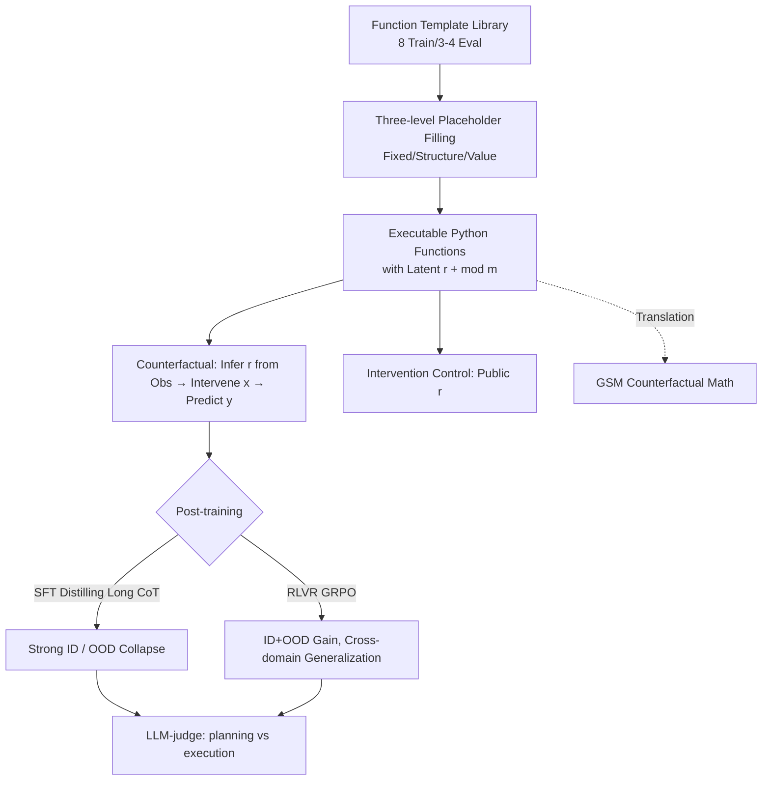

# Executable Counterfactuals: Improving LLMs' Causal Reasoning Through Code

**Conference**: ICLR 2026  
**Code**: [AniketVashishtha/Executable_Counterfactuals](https://github.com/AniketVashishtha/Executable_Counterfactuals)  
**Area**: LLM Reasoning / Causal Reasoning / Post-training  
**Keywords**: Counterfactual Reasoning, Abduction, Executable Code, RLVR, GRPO, Out-of-Distribution Generalization  

## TL;DR
This paper restores "counterfactual reasoning" to its three-step process of "abduction $\to$ intervention $\to$ prediction." By constructing executable Python functions (and equivalent GSM math problems) with latent variables that necessitate abduction for correct answers, the authors find that SOTA models experience a 25–40% performance drop from intervention to counterfactual reasoning. While SFT merely memorizes shallow patterns and fails to generalize, RLVR applied solely to code enables the generalization of these three cognitive skills to entirely new control flows and natural language math problems.

## Background & Motivation
**Background**: Counterfactual reasoning ("what if...") is a core capability for high-stakes fields such as scientific discovery, medicine, and policy, belonging to Level 3 (the highest level) of Pearl’s Causal Hierarchy. A complete counterfactual query comprises three steps: abducing the latent state of the system from observations (abduction), constructing an alternative scenario (intervention), and predicting the outcome under that scenario (prediction).

**Limitations of Prior Work**: Almost all studies evaluating the counterfactual capabilities of LLMs **skip the abduction step**. They either use settings where information is fully observable with no latent variable noise, or they rephrase existing reasoning problems as "counterfactual" by perturbing them. In such settings, counterfactual queries collapse into Level 2 intervention queries—since no latent variables need to be inferred, one only needs to replace the input and perform forward calculation.

**Key Challenge**: This simplification leads to a **significant overestimation** of LLM counterfactual capabilities, conflating true counterfactual reasoning with simpler causal reasoning. This makes it impossible to pinpoint where models are strong or weak, preventing the design of targeted improvement algorithms.

**Goal**: To construct tasks that **require the simultaneous use of abduction, intervention, and prediction steps** to be answered correctly, thereby cleanly isolating counterfactual reasoning from intervention reasoning to evaluate and improve LLMs.

**Core Idea**: **Use code understanding as a vehicle for counterfactual reasoning (executable counterfactuals)**. A "latent random variable $r$" is introduced into a Python function; $r$ remains constant throughout the reasoning process but is hidden from the model. The model must infer $r$ from given factual input-output pairs. For instance, a causal structure $X \to Y \leftarrow R$ is converted into a program: $X$ calculates $Y$, and $R$ determines conditional branches. Given an observation $y=f(r, x{=}1)=-1$ with $r$ unknown, the query "what would $y$ be if $x$ were changed to 3 while keeping the same $r$" forces the model to first abduce $r$, then intervene with $x{=}3$, and finally predict $y_{cf}=f(r, x{=}3)$. Code naturally serves as a computational graph, mapping to causal/mathematical forms while allowing precise difficulty control and generation of verifiable ground truth.

## Method

### Overall Architecture
The framework consists of two parts: (1) a synthetic data generator based on **nested templates** that produces structurally diverse executable counterfactual problems with latent variables and verifiable answers, translating code problems into equivalent GSM math word problems to test cross-domain generalization; (2) a comparison between two post-training paths—**SFT (distilling long CoT from strong models)** and **RLVR (GRPO + verifiable rewards)**—with behavioral analysis using LLM-as-judge to split reasoning trajectories into "planning" (adherence to the three steps) and "execution" (computational accuracy).

### Key Designs

**1. Three-level Placeholder Templates: Large-scale structural diversity from few templates.** Simply changing numbers or operators (like CheckList perturbations) alters values without changing control flow, failing to test true structural generalization. This paper uses templates to "hollow out" full code blocks by function, filling them at three levels: **Fixed placeholders** (function names, sampling $r$ with seeds, return statements), **Structural placeholders** (preprocessing steps, main if-conditions, elif branches, branch code blocks, return formats), and **Value placeholders** (specific operators and thresholds like +, \*, threshold). Claude-3.5-Sonnet drafted templates and candidate blocks with manual quality checks. The training set uses combinations of 15 template groups $\times$ code blocks with deduplication to generate diverse functions.

**2. Modulo operations for multi-solution ambiguity, mimicking real-world counterfactuals.** In reality, multiple latent configurations often explain the same observation. The authors insert a modulo operator at the return: $\text{return } g(\cdot) \bmod m$. The periodicity of the modulo creates a **many-to-one mapping** from latent $r$ to observed output—multiple $r$ values are consistent with the factual run, resulting in multiple valid counterfactual answers. Evaluation scores are based on the "set of all valid answers," reporting exact match (set equality) and aggregate F1 for partial coverage. The control intervention version keeps the code unchanged but reveals the true value of $r$, removing the abduction step and reducing the task to re-running the function with a new $x$.

**3. Four control logic categories for explicit ID/OOD splitting.** `If_else` (≤1 level nesting, for training and ID evaluation), `If_else-long` (deeper nesting, testing **surface** OOD features like length), `While` (while loops, testing **control logic** OOD never seen in training), and `Multi_r` (three latents per function + for loops, testing **causal structure** OOD). GSM math problems are added to test **domain** (code $\to$ natural language) OOD. This allows precise attribution of performance drops to surface length, control flow, latent structure, or language domain.

**4. RLVR (GRPO) vs. SFT distillation: Strongest generalization from weakest supervision.** SFT uses DeepSeek-R1-Distill-Qwen-32B as a teacher to distill long CoT into Qwen2.5-1.5B/3B/7B-Instruct. RLVR uses GRPO with outcome-based supervision, using exact match as the verifiable reward (prompt batch size 16, rollout size 24). Key finding: SFT has strong external supervision but only learns shallow abduction patterns tied to surface features, collapsing on OOD. RLVR, trained only on `If_else` code, **induces the core cognitive behavior** of abduction-intervention-prediction itself, enabling direct transfer to while, multi_r, and even natural language math problems.

## Key Experimental Results

### Main Results: The Counterfactual vs. Intervention Gap in LLMs (Code Domain, Multi-answer F1/EM)
Even top-tier reasoning models show significant drops from intervention to counterfactual tasks:

| Model | while-Intervention | while-Counterfactual | multi_r-Intervention | multi_r-Counterfactual |
|------|-----------|-------------|-------------|---------------|
| o1-mini | 99.4 | 74.4 | 89.8 (≈42.3 EM) | 42.3 |
| Claude-3.5-Sonnet | 71.5 | 58.2 | — | 58.8 |
| QwQ-32B | 98.8 | 55.1 | — | 41.3 |
| GPT-4o | 58.2 | 4.4 | — | 41.7 |
| Llama-3.3-70B | 76.3 | 4.0 | — | 36.4 |

Non-reasoning models generally score <10% on while-counterfactuals, despite reaching 70%+ on intervention controls. SOTA models typically drop by **25–40%**, with failures concentrated almost entirely in the abduction step.

### Post-training Comparison: SFT limits to ID, RLVR enables OOD (Qwen2.5 Series, EM)

| Model | ID if_else | OOD multi_r | OOD while |
|------|-----------|-------------|-----------|
| 7B-Instruct (Base) | 13.9 | 17.9 | 3.3 |
| 7B-Instruct-SFT | **59.0** | 23.3 | 2.1 |
| 7B-Instruct-RL | 67.8 | **36.3** | **8.1** |

SFT improves ID EM from 13.9 to 59.0 (≈40% gain) but causes a drop from 3.3 to 2.1 on OOD while (hurting performance). RLVR shows gains across both ID and OOD. The 7B-RLVR model is overall comparable to the 72B-Instruct and consistently outperforms its 32B variant in the code domain.

### Cross-domain Generalization: Code $\to$ GSM Counterfactual Math (Accuracy)

| Model | Instruct | SFT | RLVR |
|------|---------|-----|------|
| Qwen2.5-1.5B | 9.0 | 1.5 | 11.0 |
| Qwen2.5-3B | 22.0 | 8.5 | 27.7 |
| Qwen2.5-7B | 39.0 | 12.9 | 46.3 |

Despite being trained only on code, RLVR transfers to natural language math problems and scales with model size. SFT consistently suppresses performance below the base model level.

### Key Findings (Behavioral Analysis, LLM-judge 1–5 Score)
- **Scaling model size improves execution, not planning**: The planning score for abduction for the 7B model is higher than for the 32B model in 3/4 tasks, and even higher than the 72B model for if_else-long and while—increasing parameters alone does not solve abduction.
- **SFT memorizes shallow abduction patterns**: As OOD complexity increases, planning scores plummet, and models revert to three prototypical failure modes (exhaustive enumeration of latents, arbitrary assumptions, or unnecessary case splitting with circular reasoning) to avoid true abduction.
- **RLVR learns the strategy itself**: Planning scores are highest across all datasets. However, execution scores for RLVR drop significantly on multi_r/while, indicating that remaining errors are "correct strategy, wrong calculation"—revealing an asynchrony in learning counterfactual strategies versus general computation skills.

## Highlights & Insights
- **Conceptual Clarification**: The paper explicitly points out that many "counterfactual" works are actually performing intervention reasoning, using the abduction step as the litmus test to distinguish Level 2 from Level 3. This framing is highly valuable.
- **Code as a Causal Testbed**: Programs serve as computational graphs that map to mathematical/graphical forms, are verifiable, and allow precise control over latent structure and difficulty, making the generation of verifiable counterfactual data scalable.
- **Modulo for Multi-solutions** is a simple yet clever design, using one line of code to simulate the inherent ambiguity of real-world counterfactuals where multiple latent configurations explain the same observation.
- **SFT vs. RL Generalization** provides clean evidence: even with strong external supervision, distilling long CoT only captures surface patterns. RL, even with only outcome rewards, induces transferable cognitive strategies. This is a persuasive data point in the "SFT vs. RL for reasoning post-training" debate.

## Limitations & Future Work
- **RLVR Bottlenecked by Calculation Accuracy**: Sharp drops in execution scores on multi_r/while show that even with correct strategies, long-range arithmetic or code simulation errors limit accuracy. Future work needs to optimize both counterfactual strategies and general computational skills.
- **Synthetics and Control**: While diverse, template-generated code/math problems remain controlled toy environments, still distant from real-world scientific or medical counterfactual scenarios.
- **Limited Scale**: Post-training was restricted to Qwen2.5-1.5B/3B/7B. Whether RLVR remains superior on larger models or can break through calculation bottlenecks remains unknown.
- **Single Reward Type**: RLVR relied on exact-match outcome rewards without exploring process rewards to directly supervise abduction, which might further mitigate the planning/execution asynchrony.

## Related Work & Insights
- **Causal Hierarchy Benchmarks** (Jin et al. 2024, etc.): Theoretically rigorous but often assume advanced tools like do-calculus or d-separation, making it hard to locate error sources. This paper uses code and math—domains where LLMs improve fastest—to isolate causal abilities.
- **"Counterfactual" Perturbation Works** (Wu et al. 2024, Chen et al. 2025, etc.): These are identified as typical cases where "information is fully observable, collapsing into intervention," serving as primary points of comparison and critique.
- **RLVR / GRPO** (Shao et al. 2024, DeepSeek-R1): This paper applies verifiable reward RL to counterfactual reasoning, providing further evidence that RL induces transferable cognitive behaviors.
- **Insight**: Explicitly operationalizing abstract cognitive skills (like abduction) into verifiable tasks that "must be performed to get the answer right" is a universal paradigm for evaluating and training high-level reasoning, applicable to other latent causal or meta-cognitive skills.

## Rating
- **Novelty**: ⭐⭐⭐⭐⭐ — The framing of "enforcing abduction through executable code with latents" is theoretically clear and engineering-feasible, cleanly separating counterfactuals from interventions.
- **Experimental Thoroughness**: ⭐⭐⭐⭐ — Covers open-source models (1.5B–72B) and proprietary reasoning models, with four-axis ID/OOD evaluation, cross-domain math, and behavioral analysis. Larger scale RL validation would be ideal.
- **Writing Quality**: ⭐⭐⭐⭐ — The three-step definition, the collapse argument, and the template design are well-explained with intuitive comparisons.
- **Value**: ⭐⭐⭐⭐⭐ — Provides both a scalable counterfactual evaluation/training framework and strong evidence for the "SFT vs. RL generalization" case, beneficial to both the causal reasoning and post-training communities.

<!-- RELATED:START -->

## Related Papers

- [\[ICLR 2026\] On Code-Induced Reasoning in LLMs](on_code-induced_reasoning_in_llms.md)
- [\[ICLR 2026\] Emergent Hierarchical Reasoning in LLMs through Reinforcement Learning](emergent_hierarchical_reasoning_in_llms_through_reinforcement_learning.md)
- [\[ICLR 2026\] AceReason-Nemotron 1.1: Advancing Math and Code Reasoning through SFT and RL Synergy](acereason-nemotron_11_advancing_math_and_code_reasoning_through_sft_and_rl_syner.md)
- [\[NeurIPS 2025\] CoRe: Benchmarking LLMs' Code Reasoning Capabilities through Static Analysis Tasks](../../NeurIPS2025/llm_reasoning/core_benchmarking_llms_code_reasoning_capabilities_through_static_analysis_tasks.md)
- [\[ICLR 2026\] Selection, Reflection and Self-Refinement: Revisit Reasoning Tasks via a Causal Lens](selection_reflection_and_self-refinement_revisit_reasoning_tasks_via_a_causal_le.md)

<!-- RELATED:END -->
