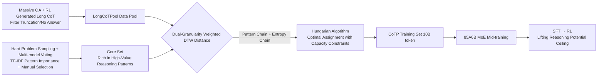

# Expanding Reasoning Potential in Foundation Model by Learning Diverse Chains of Thought Patterns

**Conference**: ICLR 2026  
**OpenReview**: [https://openreview.net/forum?id=3FQV4JHPpY](https://openreview.net/forum?id=3FQV4JHPpY)  
**Code**: [rc314159-creator/CoTP](https://github.com/rc314159-creator/CoTP)  
**Area**: LLM Reasoning / Mid-training Data Selection  
**Keywords**: Chain-of-Thought, Reasoning Potential, Mid-training, Data Selection, Reasoning Patterns, Dynamic Time Warping, Reinforcement Learning  

## TL;DR
This paper formalizes the "reasoning potential" of foundation models as "the reciprocal of the expected number of independent attempts required to solve a problem." It proposes the CoTP framework, which abstracts atomic reasoning patterns from CoT sequences and utilizes a dual-granularity weighted DTW distance (Reasoning Pattern Chain + Token Entropy Chain) to select long CoT data aligned with a high-value core set from massive data pools. Using only 10B tokens, it improves an 85A6B MoE model by 9.58% on AIME and lifts the downstream RL performance ceiling by 7.81%.

## Background & Motivation
**Background**: The progress of Large Reasoning Models (LRM) in mathematical reasoning is primarily driven by RL post-training. However, increasing empirical research suggests that RL only "manifests" implicit reasoning paths already existing within the foundation model's parameter space—the reasoning capability of the foundation model itself directly determines and limits the performance ceiling of RL. Meanwhile, mixing QA data with long CoT data during the mid-training stage has been proven to significantly deepen reasoning depth.

**Limitations of Prior Work**: Current practices almost exclusively use CoT data in a "coarse" manner—either indiscriminately mixing all long CoTs (like the LongCoTPool in this paper) or simply stacking difficult problems for distillation, lacking a granular exploration of the "reasoning paradigms" within CoT sequences. **Key Challenge**: Which specific types of data best enhance a model's reasoning capability? Simple mixing may dilute high-value data; experiments show that the average performance of a mixed LongCoTPool is even slightly lower than single-source data like OpenR1-Math or AM-Distilled, indicating that "quantity" does not equal "quality."

**Goal**: To precisely select CoT data rich in high-value reasoning patterns during mid-training, maximizing the expansion of the foundation model's reasoning potential and thereby lifting the ceiling for downstream RL.

**Core Idea**: **① Formalize Reasoning Potential**—Define it as the reciprocal of the number of independent attempts $K$ required to reach the correct answer. Expanding potential is equivalent to reducing the average number of attempts. **② Approximate the Oracle with a Core Set**—Abstract common and generalizable atomic reasoning patterns from CoTs and construct a core reference set rich in high-value patterns. **③ Dual-Granularity Alignment Selection**—Use a weighted DTW distance based on "Reasoning Pattern Chains + Token Entropy Chains" to recall data from the pool that is most similar to the core set.

## Method

### Overall Architecture
CoTP (Chains of Thought Patterns) transforms the question of "which data is most valuable" into a computable retrieval problem. It first theoretically defines reasoning potential and notes that the ideal oracle training set is unattainable. Instead, it uses a manually curated **Core Set** rich in high-value reasoning patterns to approximate the oracle. Each CoT is represented at two granularities: a "Pattern Chain" (highly abstract reasoning paradigms) and a "Token Entropy Chain" (fine-grained high-gain token features). Weighted DTW is used to measure the distance between pool samples and the core set, followed by the Hungarian algorithm to solve the optimal assignment with capacity constraints, recalling an aligned training subset (CoTP) for foundation model mid-training.

### Key Designs

**1. Defining "Reasoning Potential" as an optimizable quantity: The reciprocal of the number of attempts.** Unlike deterministic evaluation, this paper uses a sampling mode with multiple inferences to characterize the randomness of model performance. Potential is defined as the probability of success during sampling $\Phi(M, q_i) = P[f_M(q_i) = a_i^*]$, where the overall potential is the expectation over the evaluation set $\Phi(M, D_{eval}) = \frac{1}{N}\sum_i \Phi(M, q_i)$. The key link is: if every independent attempt is treated as a Bernoulli trial with success probability $\Phi$, then the number of attempts for the first correct answer $K_i \sim \text{Geom}(\Phi(M, q_i))$, thus $\Phi(M, q_i) = 1/\mathbb{E}[K_i]$. Potential is the reciprocal of the expected first-hit time; smaller $K$ means higher potential. This converts the abstract task of "expanding potential" into a measurable goal of "enabling the model to succeed with fewer average attempts," directly explaining its strong correlation with pass@k curves and RL ceilings.

**2. Approximating the unattainable oracle training set with a Core Set.** Theoretically, there exists an ideal oracle set $D^*_{oracle}$ that maximizes potential. The goal is to select $M$ samples from a data pool such that the potential after training approaches this oracle. Since the oracle is unknown, this work constructs a **manually curated core reference set** as a proxy: first, sample from source data with difficulty/type labels, generate answers using multiple strong reasoning models, and filter unsolvable problems via majority voting to obtain problem set $Q$. Then, generate $r$ CoTs per problem using strong models, extract pattern chains $\xi(c)$, and calculate the importance of each pattern $\rho_k$ using TF-IDF: $\omega(\rho_k|q_i, Q) = \text{TF}(\rho_k, q_i) \times \text{IDF}(\rho_k, Q)$. Finally, **manually select** samples from correct CoTs that exhibit unique and high-importance patterns to form the Core Set, each tagged with its pattern importance weights. This step injects value judgment into a small amount of seed data, which serves as an anchor for subsequent filtering.

**3. Dual-granularity representation + Weighted DTW similarity measurement.** Each CoT is simultaneously encoded into two chains: the **Pattern Chain** $C = [\rho_1, ..., \rho_n]$ (an ordered sequence of atomic reasoning operations annotated by DeepSeek-V3, capturing abstract paradigms) and the **Entropy Chain** $H = [h_1, ..., h_T]$, where the entropy of each token is $h_t = -\sum_{v \in V} p_t(v)\log p_t(v)$, capturing fine-grained high-gain reasoning features. The distance between source sample $j$ and core sample $i$ is a weighted sum: $D_{ij} = \lambda\, d_{pattern}(\xi(c_i^c), \xi(c_j^s)) + (1-\lambda)\, d_{entropy}(\eta(c_i^c), \eta(c_j^s))$. Both distances are calculated using Weighted DTW $d(x, y) = \text{WeightedDTW}(x, y, w, \delta)$: for pattern chains, the weight $w$ is the pattern importance $\Omega_i$ of the core sample, and the base distance $\delta$ uses character-level n-grams; for entropy chains, the weight is 1 and $\delta$ is the absolute difference. DTW allows for inconsistencies in length and alignment between two CoTs while matching their reasoning "rhythm"; importance weighting ensures critical patterns dominate the matching process.

**4. Transformation into a linear assignment problem solved by the Hungarian algorithm.** To recall $o$ source samples for each core sample ($T = t \cdot o$), the problem is formulated as a 0-1 assignment problem with capacity constraints: minimize $\sum_{i}\sum_{j} D_{ij} S_{ij}$, subject to each core sample being assigned exactly $o$ source samples and each source sample being claimed by at most one core sample. This combinatorial optimization problem is solved by duplicating each core instance $o$ times to construct an expanded cost matrix of size $t\cdot o \times N$, then applying the **Hungarian algorithm**. This process is domain-agnostic and theoretically applicable to any scenario decomposable into atomic reasoning patterns.

### Loss & Training
Mid-training uses an 85A6B MoE (pre-trained on 14T tokens) with annealing. 30B tokens of reasoning-specialized data are mixed with general data KnowEdu at a **1:2** ratio. The reasoning data format is `{question}\n{cot answer}` with the answer enclosed in `\boxed{}`. Extended experiments scaled to 60B tokens maintaining the same ratio. For fair comparison, all models underwent SFT using the same 60k long CoTs (to avoid underestimating models that wouldn't naturally generate long CoTs) followed by RL using the GSPO algorithm to verify if the potential expanded during mid-training transfers smoothly to RL.

## Key Experimental Results

### Main Results (Average pass@1 accuracy % after SFT, 85A6B MoE)

| Dataset | General | AIME2025 | AIME2024 | HMMT2025 | BeyondAIME | MATH500 | AVG. |
|---|---|---|---|---|---|---|---|
| KnowEdu | 64.39 | 0.33 | 1.22 | 5.10 | 0.00 | 45.80 | 10.49 |
| OpenR1-Math | 66.58 | 23.96 | 29.69 | 16.04 | 9.10 | 87.80 | 33.32 |
| AM-Distilled | 67.97 | 23.12 | 25.52 | 18.02 | 8.30 | 87.20 | 32.43 |
| LongCoTPool | 65.95 | 21.89 | 24.90 | 15.63 | 7.90 | 85.40 | 31.14 |
| **CoTP (Ours)** | 66.08 | **28.02** | **37.92** | **20.73** | **10.20** | **90.80** | **37.53** |

With only 10B selected tokens, CoTP exceeds LongCoTPool by an average of **6.39%** and improves AIME 2024&2025 by **9.58%**. The fact that LongCoTPool underperforms single sources confirms that "simple mixing is insufficient; precise selection is required."

### Mid-training → RL Ceiling Comparison (AVG SFT vs RL accuracy %)

| Dataset | AVG. SFT | AVG. RL |
|---|---|---|
| KnowEdu | 10.49 | 9.40 |
| LongCoTPool | 31.14 | 43.63 |
| **CoTP (Ours)** | **37.53** | **51.44** |

The RL ceiling for CoTP is **7.81%** higher than LongCoTPool and 42.04% higher than KnowEdu. The pass@k curve consistently leads as k increases, demonstrating that mid-training potential transfers effectively to RL rather than being "exhausted" prematurely.

### Ablation Study (12B token QA blend, AVG. %)

| Configuration | AVG. |
|---|---|
| CoTP (n=1/2, λ=0.8) | **30.68** |
| w/o entropy (λ=1) | 29.93 |
| n-gram n=2 | 29.12 |
| w/o importance | 29.66 |

### Key Findings
- **Entropy chains are effective**: Removing entropy (pattern chain only) drops performance by 0.75%; token-level entropy captures high-gain reasoning at a finer granularity.
- **n=1 or 2 is optimal for n-grams**: This balances context breadth and detail; using n=2 alone yields the worst results.
- **Importance weights are critical**: Removing pattern importance drops performance to 29.66%; distinguishing "common vs. important" patterns makes a difference in potential.
- **Scalability**: Relaxing the similarity threshold to expand to 60B tokens yields another 4.72% gain on AIME without harming general performance.

## Highlights & Insights
- **Quantifying "Potential"**: By strictly defining "reasoning potential" as the reciprocal of the expected first-hit time using a geometric distribution, the paper provides a theoretical anchor for data valuation, explaining the strong correlation with pass@k and RL ceilings.
- **Novel Dual-granularity Perspective**: Characterizing CoT via both "Abstract Reasoning Pattern Chains" and "Fine-grained Token Entropy Chains" is closer to the "essence of reasoning" than simple text similarity or difficulty labels.
- **Retrieval-based Data Selection**: Formalizing data selection as an optimal assignment problem with capacity constraints and solving it with the Hungarian algorithm is a clean, domain-agnostic approach.
- **Focus on Mid-training vs. Post-training**: Amidst the intense focus on RL, this work points to mid-training data as a higher-leverage point, proving that "foundation potential determines the RL ceiling."

## Limitations & Future Work
- **Dependency on Manual Core Set Selection**: Identifying high-value patterns still relies on manual seed selection, which raises concerns regarding scalability and subjectivity; the oracle can only be approximated, not solved.
- **Domain Limited to Mathematics**: Experiments focus on math. While claimed to be domain-agnostic, other fields like STEM or Code are only visualized in the appendix without formal verification.
- **Dependence on Strong Teacher Models**: The pipeline is costly and constrained by the teacher's capability, as CoTs are generated by DeepSeek-R1, patterns are annotated by DeepSeek-V3, and entropy is calculated from a reference model.
- **Hyperparameter Sensitivity**: Parameters like $\lambda$ and n-gram orders require tuning; whether conclusions from Chinese pattern annotation transfer to pure English pipelines remains to be seen.

## Related Work & Insights
- **Expanding Reasoning via Mid-training** (OctoThinker, BoostQA, etc.): This work follows the trend that mixing long CoTs in mid-training deepens reasoning but advances from "what to mix" to "what to select."
- **RL Manifesting Implicit Capabilities** (GSPO, GRPO series): Echoes the observation that the RL ceiling is set by the foundation model, shifting optimization focus upstream.
- **Token Entropy / High-gain Tokens**: Borrows from works using entropy to characterize critical tokens in reasoning, using it as a fine-grained selection signal.
- **Inspiration**: When RL gains plateau, "upstream data quality" may be a higher-leverage direction. Formalizing value judgment as a retrievable distance is a reusable data engineering paradigm applicable to other long-sequence data selection like code or agent trajectories.

## Rating
- **Novelty**: ⭐⭐⭐⭐ First to formalize "reasoning potential" and propose retrieval-based selection via dual-granularity chains; the perspective and method are fresh.
- **Experimental Thoroughness**: ⭐⭐⭐⭐ Main experiments, RL transfer, scalability, and multiple ablations were conducted on a real-world 85A6B MoE across comprehensive benchmarks; however, it lacks formal cross-domain validation beyond math.
- **Writing Quality**: ⭐⭐⭐⭐ Clear theoretical definitions, complete framework diagrams and algorithms, and logical progression from motivation to methodology.
- **Value**: ⭐⭐⭐⭐ Provides an actionable selection paradigm for CoT data in mid-training and proves it lifts the RL ceiling, offering practical significance for industrial-scale reasoning model training.

<!-- RELATED:START -->

## Related Papers

- [\[ICLR 2026\] MathFimer: Enhancing Mathematical Reasoning by Expanding Reasoning Steps through Fill-in-the-Middle Task](mathfimer_enhancing_mathematical_reasoning_by_expanding_reasoning_steps_through_.md)
- [\[ACL 2025\] Fine-Tuning on Diverse Reasoning Chains Drives Within-Inference CoT Refinement in LLMs](../../ACL2025/llm_reasoning/dcot_diverse_cot_refinement.md)
- [\[ICLR 2026\] String Seed of Thought: Prompting LLMs for Distribution-Faithful and Diverse Generation](string_seed_of_thought_prompting_llms_for_distribution-faithful_and_diverse_gene.md)
- [\[ICLR 2026\] Theory-Grounded Evaluation of Human-Like Fallacy Patterns in LLM Reasoning](theory-grounded_evaluation_of_human-like_fallacy_patterns_in_llm_reasoning.md)
- [\[ICLR 2026\] GPG: A Simple and Strong Reinforcement Learning Baseline for Model Reasoning](gpg_a_simple_and_strong_reinforcement_learning_baseline_for_model_reasoning.md)

<!-- RELATED:END -->
