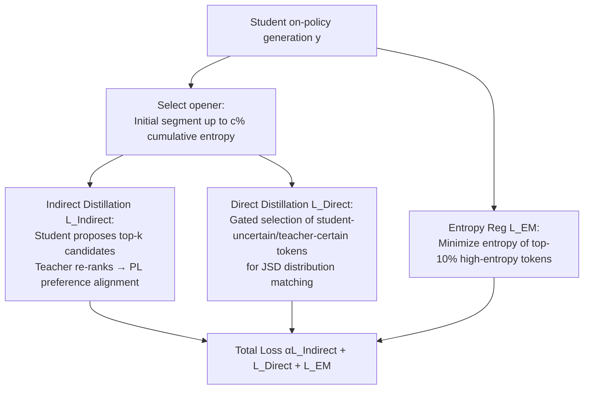

# Explain in Your Own Words: Improving Reasoning via Token-Selective Dual Knowledge Distillation

**Conference**: ICLR 2026  
**Code**: [github.com/kmswin1/TSD-KD](https://github.com/kmswin1/TSD-KD)  
**Area**: LLM Reasoning / Knowledge Distillation  
**Keywords**: Knowledge Distillation, Reasoning Distillation, on-policy KD, Preference Ranking, Token Entropy, Chain-of-Thought  

## TL;DR
TSD-KD enables small student models to reason "in their own words" by distilling only on high-entropy key tokens at the beginning of responses. It combines indirect preference distillation (where the teacher ranks student candidates) with direct distillation (targeting tokens where the student is uncertain but the teacher is certain) and entropy regularization. TSD-KD achieves SOTA results on 10 reasoning benchmarks for a 1.5B student, even outperforming the 14B teacher on specific tasks.

## Background & Motivation
- **Background**: Knowledge distillation (KD) transfers reasoning capabilities from large models to small models, significantly reducing the cost of generating long Chain-of-Thought (CoT) responses. Recent on-policy KD methods (e.g., MiniLLM, GKD) train students on their own generated outputs to mitigate the distribution shift of off-policy methods.
- **Limitations of Prior Work**: On-policy KD is essentially **teacher-forcing**, as it compels students to match the teacher's distribution at every token. Small models with limited capacity are overwhelmed by this "high-density supervision." Furthermore, the gap between teacher and student reasoning levels is vast (likened to a college senior vs. a middle schooler), and forcing token-by-token KL alignment causes distribution mismatch.
- **Key Challenge**: Distillation must "teach enough" to transfer knowledge, but students cannot "absorb" excessive supervision, and over-constraining the model eliminates its room for autonomous reasoning.
- **Key Insight**: The authors measured the per-token entropy of reasoning trajectories and found that **a few tokens have entropy far above the mean, and these high-entropy tokens are concentrated at the start of the reasoning path**—acting as critical "branching points."
- **Goal**: Design a **student-centric** KD framework that provides targeted and indirect supervision only on important tokens, allowing the student freedom on the remaining tokens.
- **Core Idea**: **"Targeted + Indirect" Distillation**—distill only the high-entropy opener tokens. Instead of imposing a full distribution, the teacher ranks candidates proposed by the student, encouraging the student to explain reasoning "in its own words."

## Method

### Overall Architecture
TSD-KD is an on-policy distillation framework consisting of three components that operate via token selection: **Indirect Distillation** (teacher ranks student candidates), **Direct Distillation** (JSD distribution matching on student-uncertain/teacher-certain tokens), and **Entropy Regularization** (minimizing entropy for the most uncertain tokens). All three are restricted to the "opener" section at the start of the response.

### Key Designs

**1. Opener: Locking Supervision to the "Opening" of Reasoning** – Since high-entropy tokens are concentrated at the start, the "opener" is defined as the continuous prefix where the cumulative entropy first reaches $c\%$. For entropy $H_t(p)=-\sum_{v\in V}p(v|x,y_{<t})\log p(v|x,y_{<t})$ at position $t$, the opener is the smallest $m$ such that $\sum_{t=1}^{m}H_t(p_S)/\sum_{t=1}^{L}H_t(p_S)\ge c\%$. The paper uses a small $c=10\%$. Correctly setting the reasoning direction at the start is more critical than agonizing over the latter half.

**2. Indirect Distillation: Teacher as "Referee" not "Lecturer"** – At each token in the opener, the student selects top-k candidates using its own logits. The teacher does not expose its own top-k but **re-ranks** the student's candidates to obtain a permutation $\pi_t$. A Plackett-Luce preference model is used to align student logits with the teacher's ranking:
$$\mathcal{L}_{\text{Indirect}}=-\sum_t \log P_{\text{PL}}(\pi_t|x,y_{<t}),\quad P_{\text{PL}}(\pi_t|x,y_{<t})=\prod_{j=1}^{k}\frac{\exp(z_t[\pi_t(j)])}{\sum_{\ell=j}^{k}\exp(z_t[\pi_t(\ell)])}$$
**Key Insight (Proposition 1)**: This **token-level** preference loss is equivalent to a **sentence-level** preference loss for the sub-response $y_{\to t}$, providing room for self-improvement and reducing shift while remaining computationally efficient.

**3. Direct Distillation: Selective Correction for "Confused Student, Confident Teacher"** – To handle cases where student candidates deviate entirely from the correct path, direct JSD distillation is used with token selection. A sigmoid gate $\sigma_\tau(H_t(p_S)-H_t(p_T))$ modulates distillation intensity:
$$\mathcal{L}_{\text{Direct}}=\frac{1}{L}\sum_{t=1}^{L}\sigma_\tau\!\big(H_t(p_S)-H_t(p_T)\big)\cdot D_{\text{JSD}(\beta)}\big(p_T(\cdot|x,y_{<t})\,\|\,p_S^\theta(\cdot|x,y_{<t})\big)$$
When student entropy is high and teacher entropy is low, the gate approaches 1, strengthening distillation. This complements indirect distillation by providing precise token-level corrections.

**4. Selective Entropy Regularization: Boosting Confidence on Key Tokens** – The authors minimize the entropy of the top-10% most uncertain tokens $I$: $\mathcal{L}_{\text{EM}}=\mathbb{E}_{x}\big[\frac{1}{|I|}\sum_{t\in I}H_t(p_S^\theta)\big]$. This encourages the student to be more decisive on critical reasoning tokens. The total loss is $\min_\theta \mathbb{E}_x[\alpha\mathcal{L}_{\text{Indirect}}+\mathcal{L}_{\text{Direct}}+\mathcal{L}_{\text{EM}}]$.

## Key Experimental Results
Setup: Teacher Qwen2.5-14B-Instruct → Student Qwen2.5-1.5B (also Gemma2 9B→2B); on-policy data from UltraInteract; $k=10$ for indirect distillation, $\beta=0.9$, $c=10\%$.

### Main Results (Qwen2.5 14B→1.5B, Accuracy)

| Method | GSM8K | GSM-Plus | MATH | MBPP | IFEval | MMLU-STEM |
|---|---|---|---|---|---|---|
| 14B Teacher | 80.3 | 59.7 | 21.7 | 78.9 | 85.9 | 70.5 |
| 1.5B Student (Start) | 57.1 | 38.8 | 16.9 | 38.4 | 53.1 | 49.5 |
| Sequence-Level KD | 56.5 | 38.2 | 16.5 | 40.6 | 53.7 | 48.9 |
| DistiLLM | 57.2 | 38.7 | 18.6 | 42.1 | 52.5 | 47.8 |
| MiniLLM | 57.7 | 39.7 | 17.8 | 42.2 | 54.7 | 48.2 |
| GKD (β=0.9) | 57.9 | 39.9 | 18.1 | 41.8 | 52.3 | 47.7 |
| **TSD-KD** | **60.1** | **40.5** | **26.1\*** | 42.1 | **55.2** | **50.0** |

On MATH, TSD-KD (26.1) is 40.3% higher than the runner-up and outperforms the 14B teacher (21.7) by 20.3%.

### Ablation Study (Qwen2.5 14B→1.5B, Baseline: GKD β=0.9)

| Gate $\sigma_\tau$ | $\mathcal{L}_{\text{Indirect}}$ | $\mathcal{L}_{\text{EM}}$ | GSM8K | GSM-Plus | MATH | IFEval | MMLU-STEM |
|---|---|---|---|---|---|---|---|
| ✗ | ✗ | ✗ | 57.9 | 39.9 | 18.1 | 52.3 | 47.7 |
| ✔ | ✗ | ✗ | 58.3 | 40.3 | 18.2 | 54.2 | 48.1 |
| ✔ | ✔ | ✗ | 58.6 | 40.4 | 20.9 | 54.9 | 49.4 |
| ✔ | ✗ | ✔ | 59.0 | 39.8 | 22.3 | 54.1 | 49.3 |
| ✔ | ✔ | ✔ | **60.1** | **40.5** | **26.1** | **55.2** | **50.0** |

### Key Findings
- **Gated Direct Distillation** provides an initial gain of ~3.6%; **Indirect Distillation** yields the most significant gains in general reasoning (MMLU-STEM); **Entropy Regularization** is most effective for mathematical reasoning (MATH 18.1→22.3).
- **Outperforming the Teacher** occurs on 4 tasks in Qwen2.5 (MATH, SciQ, etc.), suggesting that "self-reasoning + key point guidance" generalizes better than pure imitation.

## Highlights & Insights
- **Indirect Distillation is a Novel Paradigm**: Shifts KD from "imitating teacher distribution" to "teacher as a ranking referee." This aligns naturally with the RLHF paradigm.
- **Equivalence in Proposition 1**: Token-level preference loss equals sentence-level preference loss, providing theoretical grounding while drastically saving computation.
- **Entropy as a Unified Metric**: Used for opener selection, gating, and regularization, aligning with findings that high-entropy tokens are critical branching points in reasoning.

## Limitations & Future Work
- **Dependency on Online Teacher Scoring**: Indirect distillation requires the teacher to re-rank candidates during training, which is more expensive than off-policy methods.
- **Hyperparameter Complexity**: Requires tuning for $c$, temperature $\tau$, and loss weights $\alpha$.
- **Scale**: Validated up to 14B teachers and 1.5–2B students; scalability to larger models or longer CoTs remains to be explored.

## Related Work & Insights
- **On-policy KD**: MiniLLM, GKD—TSD-KD argues these are still forms of teacher-forcing.
- **Preference Alignment**: DPO/RLHF—TSD-KD integrates preference modeling into distillation.
- **RL for Reasoning**: The discovery of high-entropy tokens as branching points directly inspired the design of the opener and entropy regularization.

## Rating
- **Novelty**: ⭐⭐⭐⭐
- **Experimental Thoroughness**: ⭐⭐⭐⭐
- **Writing Quality**: ⭐⭐⭐⭐
- **Value**: ⭐⭐⭐⭐

<!-- RELATED:START -->

## Related Papers

- [\[ICLR 2026\] CyclicReflex: Improving Reasoning Models via Cyclical Reflection Token Scheduling](cyclicreflex_improving_reasoning_models_via_cyclical_reflection_token_scheduling.md)
- [\[ICLR 2026\] Probing to Refine: Reinforcement Distillation of LLMs via Explanatory Inversion](probing_to_refine_reinforcement_distillation_of_llm_reasoners_via_explanatory_in.md)
- [\[ICLR 2026\] Where Did This Sentence Come From? Tracing Provenance in LLM Reasoning Distillation](where_did_this_sentence_come_from_tracing_provenance_in_llm_reasoning_distillati.md)
- [\[ICLR 2026\] KaVa: Latent Reasoning via Compressed KV-Cache Distillation](kava_latent_reasoning_via_compressed_kv-cache_distillation.md)
- [\[ICLR 2026\] SkillFactory: Self-Distillation for Learning Cognitive Behaviors](skillfactory_self-distillation_for_learning_cognitive_behaviors.md)

<!-- RELATED:END -->
