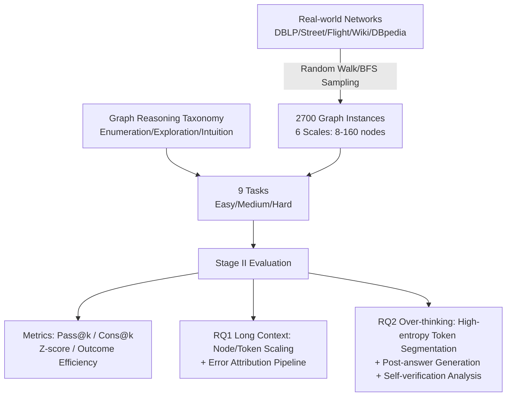

# Exposing Weaknesses of Large Reasoning Models through Graph Algorithm Problems

**Conference**: ICLR 2026  
**Code**: [https://github.com/Bklight999/GrAlgoBench](https://github.com/Bklight999/GrAlgoBench)  
**Area**: LLM Reasoning / Evaluation Benchmarks  
**Keywords**: Large Reasoning Models, Graph Algorithms, Long-context Reasoning, Over-thinking, Self-verification  

## TL;DR
This paper proposes GRALGOBENCH—a benchmark evaluating Large Reasoning Models (LRMs) using graph algorithm problems (8–160 nodes, three reasoning paradigms, nine tasks). Leveraging programmatic verification, controllable difficulty, and intrinsic long-context features, it systematically exposes two major weaknesses of LRMs: a sharp drop in accuracy as context length increases and "over-thinking" driven by excessive but inefficient self-verification.

## Background & Motivation
**Background**: Large Reasoning Models represented by OpenAI-o1 and DeepSeek-R1 have achieved impressive results in mathematics, coding, and commonsense reasoning using ultra-long Chain-of-Thought (including self-verification, strategy switching, and backtracking). Consequently, evaluating the reasoning limits of LRMs and identifying their flaws has become a research hotspot.

**Limitations of Prior Work**: Existing benchmarks primarily focus on mathematics, code, and commonsense, suffering from three structural defects: (1) **Lack of long-context evaluation**: Prompts are generally short, making it difficult to controllably evaluate long-range reasoning; (2) **Insufficient difficulty**: Tasks are too easy for modern LRMs (e.g., GPT-5 achieving 94.3% on AIME-2025), while manually creating harder problems is costly; (3) **Difficulty in programmatic verification**: Math answers can take multiple forms like $\frac{1}{3}$, $0.33\bar3$, or $3^{-1}$, and code might pass tests while harboring logical vulnerabilities.

**Key Challenge**: Researchers seek a unified evaluation environment that allows **arbitrary context extension, fine-grained difficulty adjustment, and automated scoring**, yet they find existing graph benchmarks (NLGraph, GraphArena, etc.) almost exclusively test non-reasoning LLMs, cap at 50 nodes, and categorize tasks by ad-hoc standards like "Local vs. Global" or "P vs. NP" rather than algorithmic principles.

**Goal**: Construct a graph algorithm reasoning benchmark specifically for LRMs that scales to 160 nodes, systematically categorizes tasks by algorithmic paradigms, supports programmatic verification, and quantifies the real weaknesses of LRMs.

**Key Insight**: **Graph algorithm problems are natural touchstones for LRMs.** Describing a graph requires listing all nodes and edges (intrinsically long context); difficulty scales quadratically or exponentially with node size (controllable difficulty); answers are integers or specific graph elements with no equivalent representations (programmatic verification); and minor structural perturbations can batch-generate new instances to **prevent data contamination** while remaining relevant to real-world applications like social networks and transportation.

## Method

### Overall Architecture
GRALGOBENCH consists of two stages: **Stage I: Dataset Construction**—Graph problems are categorized into Enumeration, Exploration, and Intuition based on the algorithm design families in *Introduction to Algorithms* (CLRS). Nine tasks across three difficulty levels are designed, sampling 2,700 graph instances (8–160 nodes) from five real-world networks (DBLP, Street, Flight, Wikipedia, DBpedia). **Stage II: Evaluation**—More than 20 reasoning and non-reasoning models are evaluated using metrics such as Pass@k, Cons@k, Z-score, and outcome efficiency. An LLM pipeline is used for error attribution and over-thinking analysis to address RQ1 (long-context reasoning) and RQ2 (causes of over-thinking).

### Key Designs

**1. Taxonomy of Three Reasoning Classes (Enumeration / Exploration / Intuition): Providing a Theoretical Basis for Task Partitioning.** Unlike previous benchmarks using ad-hoc standards, this work aligns with the three major algorithm design families in CLRS. **Enumeration** corresponds to brute force, requiring systematic traversal of candidate solutions (e.g., Maximum Degree, Triangle, Maximum Clique); **Exploration** corresponds to search, requiring state space traversal with backtracking (e.g., PathSum, Distance-k, Diameter); **Intuition** corresponds to greedy methods, requiring local optimal decisions based on specific problem signals (e.g., Maximum k-core, MST, Distance Threshold). These categories cover complementary abilities while testing memory, logic, and structural reasoning.

**2. LLM-as-judge for Task Classification to Evade the "Multiple Solutions" Problem.** The same problem (e.g., shortest path) can be solved via brute force (Enumeration), DFS (Exploration), or Dijkstra (Intuition). Since the LRM's actual path is unknown, labels cannot rely solely on the "optimal algorithm." The authors generate 300 Erdős–Rényi random graphs for each problem, feed them to LRMs, and use Qwen-2.5-72B as a judge to determine the actual reasoning category used. Manual review by graduate students showed nearly identical conclusions to the judge. Only 9 tasks with clear reasoning categories were retained.

**3. Real-world Semantic Sampling + Six Difficulty Levels for Anti-contamination and Controllable Difficulty.** To test semantic understanding and avoid data contamination, nodes and edges carry real-world semantics (e.g., street names in street networks, academic collaborations in DBLP). Subgraphs are sampled using random walks or BFS and divided into 6 scales (Level-1: 8–15 nodes to Level-6: 121–160 nodes), with 50 samples per scale totaling 2,700 instances. This allows precise difficulty tuning and batch-generation of new problems.

**4. Dual Long-context Experiments + Automated Error Attribution (RQ1).** To decouple "difficulty" from "length": first, node counts are varied; second, the graph structure is **fixed at 80 nodes and 200 edges while token length is extended from 4k to 64k** by lengthening node names. For error attribution, incorrect responses are segmented by `\n\n`, summarized by Qwen-2.5-72B, and labeled by O3-mini into categories: Algorithm Selection Error (ASE), Algorithm Execution Error (AEE), Graph Memory Error (GME), and Redundancy.

**5. High-entropy Token Segmentation + Dual-perspective Over-thinking Analysis (RQ2).** Responses are segmented based on token-level generation entropy, where high-entropy tokens like `wait`, `but`, and `so` (representing self-verification or strategy shifts) act as split points. Over-thinking is quantified via: **Post-answer generation** using outcome efficiency $\zeta_O=\frac{1}{N}\sum_{i=1}^{N}\frac{\hat T_i}{T_i}$ (the ratio of the first correct segment $\hat T_i$ to the total response length $T_i$); and **Self-verification analysis**, where each segment is classified into self-verification, strategy shift, or others, further determining if the verification was "effective" (actually fixing a prior error).

## Key Experimental Results

### Main Results Table (Cons@k / Pass@k, Selection Avg.)

| Model | Level-3 (31-50) c@k/p@k | Level-4 (51-80) c@k/p@k | Level-5 (81-120) c@k/p@k | Level-6 (121-160) c@k/p@k |
|---|---|---|---|---|
| Qwen3-32B | 0.63 / 0.87 | 0.43 / 0.78 | 0.27 / 0.59 | 0.20 / 0.47 |
| Qwen3-235B-A22B-Thinking | 0.97 / 1.00 | 0.86 / 0.96 | 0.58 / 0.76 | 0.45 / 0.50 |
| GPT-OSS-120B | 0.74 / 0.87 | 0.55 / 0.75 | 0.38 / 0.49 | 0.22 / 0.34 |
| DeepSeek-R1 | — | — | 0.55 / 0.55 | 0.45 / 0.45 |
| Gemini-2.5-pro | — | — | 0.45 / 0.61 | 0.36 / 0.50 |
| GPT5-mini | — | — | 0.40 / 0.46 | 0.41 / 0.50 |

Accuracy drops sharply with scale: Qwen3-32B's Pass@k falls from 87.0% (31–50 nodes) to 47.0% (121–160 nodes). Most models' average accuracy drops below 50% once the graph exceeds 120 nodes.

### Decoupling Experiment (Fixed Structure, Variable Token Length, Pass@k)

| Task | Model | 4k | 64k |
|---|---|---|---|
| Triangle Sum | DeepSeek-R1 | 100.0% | 22.0% |
| Triangle Sum | GPT-OSS-120B | 68.0% | 10.0% |

Accuracy collapses even when only extending token length with fixed graph structures, proving that **long context itself** is a bottleneck beyond structural complexity.

### Key Findings
- **① Long context is a true weakness**: Both node-scaling and token-scaling experiments point to the same conclusion.
- **② Three major bottlenecks**: Algorithm Execution Errors (AEE) are far more frequent than Algorithm Selection Errors (ASE)—Qwen3-32B reaches 35.3%/48.6% AEE in Exploration/Intuition while ASE is only 5.5%/5.7%. Models select the right strategy but fail on execution details. Graph Memory Errors (GME) remain >21% even for reasoning models.
- **③ Difficulty Ranking**: Enumeration > Exploration > Intuition across almost all models. LRMs excel at systematic enumeration but struggle most with intuition/greedy reasoning.
- **④ Primary Cause of Over-thinking**: Outcome efficiency for graph tasks stays >0.88, indicating models don't ramble much *after* finding the answer. The real issue is that **self-verification is frequent but has <30% efficiency**—most are just repetitions or irrelevant content, increasing trajectory length without value.
- **Generalization**: GRALGOBENCH correlates well with GPQA ($\rho=0.77$) and LongBench-v2 ($\rho=0.60$). Performance across different graph serialization formats is similar, indicating the tests capture intrinsic reasoning.

## Highlights & Insights
- **Testing "New Models" with "Old Problems"**: Graph algorithms are classic, but their combination of long input, controllable difficulty, automated verification, and anti-contamination perfectly addresses the shortcomings of current LRM benchmarks.
- **Dissecting Over-thinking**: Distinguishing "post-answer generation" from "self-verification" reveals that frequent but ineffective verification—rather than just being "wordy"—is the culprit.
- **Persuasive Decoupling**: Fixing structure while extending text length cleanly separates "long context" from "difficulty."
- **Aligning with CLRS**: The Enumeration/Exploration/Intuition taxonomy is transferable beyond graphs to areas like mathematical permutations, Sudoku (backtracking), or Huffman coding (greedy).

## Limitations & Future Work
- **Task Scope**: Limited to 9 graph algorithm problems. While they align with three paradigms, coverage of complex dynamic graphs or directed-weighted combinatorial tasks is still missing.
- **LLM Judge Dependence**: Error attribution and over-thinking analysis rely heavily on Qwen-2.5-72B and O3-mini. Although human reviewed, label noise and judge bias cannot be fully eliminated.
- **Diagnosis Without Treatment**: The paper identifies execution errors, weak memory, and inefficient self-verification but does not propose specific training or inference mitigation strategies.
- The scale is capped at 160 nodes; degradation patterns at thousands of nodes remain an open question.

## Related Work & Insights
- **Graph×LLM Benchmarks**: Compared to NLGraph, GraphQA, and GraphArena, this work scales to 160 nodes and categorizes tasks by algorithmic paradigms specifically for LRMs.
- **LRM Over-thinking**: Connects with work using outcome efficiency and high-entropy tokens, providing new evidence that "inefficient self-verification" is the core issue in graph reasoning.

## Rating
- **Novelty**: ⭐⭐⭐⭐ Systematically uses graph problems to fix long-context/difficulty/verification gaps in LRM benchmarks. CLRS taxonomy and over-thinking diagnosis are novel.
- **Experimental Thoroughness**: ⭐⭐⭐⭐⭐ Comprehensive evidence from 20+ models, 6 scale levels, 9 tasks, and detailed decoupling/error attribution studies.
- **Writing Quality**: ⭐⭐⭐⭐ Clear logic from motivation to findings; information-dense tables and figures are well-summarized.
- **Value**: ⭐⭐⭐⭐ Provides a scalable, automated, and anti-contamination evaluation suite with direct utility for diagnosing LRM long-context and over-thinking issues.

<!-- RELATED:START -->

## Related Papers

- [\[ICLR 2026\] Towards Safe Reasoning in Large Reasoning Models via Corrective Intervention](towards_safe_reasoning_in_large_reasoning_models_via_corrective_intervention.md)
- [\[ICLR 2026\] Training Large Reasoning Models Efficiently via Progressive Thought Encoding](training_large_reasoning_models_efficiently_via_progressive_thought_encoding.md)
- [\[ICLR 2026\] Dynamic Early Exit in Reasoning Models](dynamic_early_exit_in_reasoning_models.md)
- [\[ICLR 2026\] MetaMuse: Algorithm Generation via Creative Ideation](metamuse_algorithm_generation_via_creative_ideation.md)
- [\[ICLR 2026\] Dynamics-Predictive Sampling for Active RL Finetuning of Large Reasoning Models](dynamics-predictive_sampling_for_active_rl_finetuning_of_large_reasoning_models.md)

<!-- RELATED:END -->
