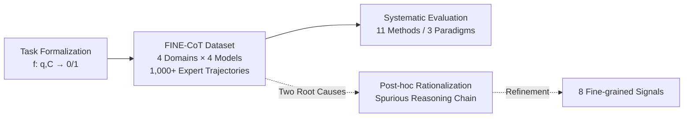

# FaithCoT-Bench: Benchmarking Instance-Level Faithfulness of Chain-of-Thought Reasoning

**Conference**: ICLR 2026  
**OpenReview**: [https://openreview.net/forum?id=lN3yKqqzF1](https://openreview.net/forum?id=lN3yKqqzF1)  
**Code**: [https://github.com/se7esx/FaithCoT-BENCH](https://github.com/se7esx/FaithCoT-BENCH)  
**Area**: LLM Reasoning / Interpretability / Benchmark  
**Keywords**: Chain-of-Thought, CoT Faithfulness, Instance-level Detection, Expert-annotated Dataset, LLM-as-Judge  

## TL;DR
This paper proposes FaithCoT-Bench—the first unified benchmark for **instance-level CoT unfaithfulness detection**. It formalizes the question of "whether a specific reasoning chain accurately reflects the model's internal decision-making" as a binary classification problem, supported by the FINE-CoT dataset containing 1,000+ expert-annotated trajectories, and systematically evaluates 11 detection methods.

## Background & Motivation
**Background**: Chain-of-Thought (CoT) prompting has become a mainstream method for enhancing the multi-step reasoning capabilities of LLMs. The step-by-step reasoning trajectories are often treated as evidence of the model's "transparency and interpretability" and are widely used in high-risk scenarios such as medical and legal fields.

**Limitations of Prior Work**: An increasing number of studies have found that CoT is often **unfaithful**—the reasoning chain may appear coherent but does not necessarily reflect the model's true internal decision-making process. However, existing work almost exclusively focuses on **mechanistic analysis** of collective behaviors (e.g., counterfactual intervention, early answering, logit analysis), providing only aggregate evidence that "CoT might be unfaithful as a whole," without answering questions critical to end users.

**Key Challenge**: Users interact with **a specific reasoning chain** rather than a statistical average. Given a query and its generated CoT, can it be determined if **this specific instance** is unfaithful? This instance-level problem remains unresolved for three reasons: (1) lack of a rigorous definition formalizing unfaithfulness detection as an instance-level discrimination task; (2) lack of datasets with expert-verified ground truth; (3) confusing evaluation standards where "faithfulness" is often conflated with "correctness/accuracy."

**Goal**: To fill these three gaps by establishing a unified benchmark with a **clear task definition + reliable data + systematic evaluation**.

**Core Idea**: **【Treat faithfulness detection as a discriminative task】** Instead of asking if the CoT mechanism can fail, the task of "judging if $C$ is unfaithful given $(q, C)$" is explicitly modeled as a binary classification function $f:(q,C)\mapsto\{0,1\}$. Simultaneously, **【replace unobservable internal reasoning paths with observable signals】**—since the true reasoning path $R$ is unobservable, the authors capture the marks left by unfaithfulness on the textual surface (e.g., step skipping, selective explanation) and construct ground truth via expert annotation.

## Method

### Overall Architecture
FaithCoT-Bench consists of three complementary components forming a complete pipeline: **Task Formalization → Dataset Construction → Systematic Evaluation**. It first defines instance-level unfaithfulness detection as a discriminative problem, then collects CoT trajectories from 4 domains and 4 LLMs to create the FINE-CoT dataset through multiple rounds of manual annotation. Finally, it evaluates 11 detection methods across three paradigms (counterfactual, logit, and LLM-as-Judge) on this dataset.

### Key Designs

**1. Discriminative Formalization of Instance-Level Unfaithfulness Detection: Moving from the group to the individual.** The paper provides the first explicit definition treating CoT faithfulness as a discriminative task (Definition 1): Given a query $q$ and a trajectory $C=(c_1,\dots,c_T)$ produced by model $M$, the detection task is to determine if $C$ faithfully reflects $M$'s internal reasoning $R$, expressed as $f:(q,C)\mapsto\{0,1\}$, where $f=1$ indicates unfaithful and $f=0$ indicates faithful. Different detection algorithms simply instantiate $f$ in different ways. This formalization highlights the fundamental difficulty: $R$ is unobservable, meaning there is no direct ground truth for supervision or verification, necessitating reliance on external datasets and benchmarks to "approximate" this alignment.

**2. Two Root Causes + Eight Fine-grained Signals: Breaking down "unfaithfulness" into operational criteria.** To ensure reproducible and consistent annotation, the paper categorizes unfaithfulness into two root causes: **Post-hoc Reasoning**, where steps are added to justify a **pre-determined answer** rather than reflecting causal decision-making; and **Spurious Reasoning Chain**, where steps are superficially coherent but lack a true causal link to the problem or answer (involving leaps, contradictions, or irrelevant reasoning). These are further refined into 8 observable signals (e.g., Selective Explanation Bias, Change of Conclusion under Post-hoc; Step Skipping, Weak Evidence under Spurious). Statistically, 41.66% of unfaithfulness is Post-hoc and 57.71% is Spurious, with **step skipping (24.36%)** and **selective explanation bias (19.74%)** being the most common. This taxonomy guides the dataset annotation and provides a reusable standard for future data construction.

**3. FINE-CoT Dataset and Multi-round Expert Annotation: Ensuring reliable ground truth.** Each instance consists of three parts: **Query** (sampled from LogiQA/TruthfulQA/AQuA/HLE-Bio, covering logic, facts, math, and biology); **CoT and Answer** (generated by LLaMA3.1-8B, Qwen2.5-7B, GPT-4o-mini, and Gemini 2.5 Flash using standardized prompts); and **Annotation** (faithfulness status, root cause, the key responsible step, and a brief explanation). The annotation follows a three-round process by two experts in the LLM reasoning field: Round I involves independent labeling; Round II involves collaborative discussion for low-confidence or conflicting cases using argumentation rather than majority voting; and Round III involves cross-checking for consensus. The Cohen's Kappa across domains reached 81.0–97.2, indicating high consistency. The final set includes 1,000+ trajectories, with 300+ labeled as unfaithful.

**4. Unified Evaluation Protocol for 11 Methods Across 3 Paradigms: Enabling fair comparison.** The paper evaluates existing methods on FINE-CoT across four categories: **Baselines** (random classifier, perplexity-based fluency); **Counterfactuals** (Adding Mistakes, Option Shuffling, Removing Steps, Early Answering, Paraphrasing); **Logit-based** (Answer Tracing, Information Gain); and **LLM-as-Judge** (Step-Judge for step-wise checks, Faithful-Judge for trajectory-wise assessment). Three metrics are used: Cohen's $\kappa$ for consistency with human labels, Accuracy, and F1 score for balanced precision/recall under class imbalance (F1 is the primary comparison metric).

## Key Experimental Results

### Main Results Table (CoT Faithfulness Detection F1, Excerpt)

| Dataset | Model | Rand | AddMist (Counterfactual) | EarlyAns | InfoGain (Logit) | Step-Judge | Faithful-Judge |
|:---|:---|:---:|:---:|:---:|:---:|:---:|:---:|
| LogiQA | LLaMA3.1 | 35.4 | 47.9 | 48.6 | 51.2 | 59.4 | **77.7** |
| TruthfulQA | Qwen2.5 | 34.8 | 38.5 | 43.2 | 57.8 | 59.6 | **76.1** |
| AQuA | LLaMA3.1 | 37.4 | **66.7** | 53.3 | 20.2 | 70.3 | 67.8 |
| HLE-Bio | LLaMA3.1 | 43.8 | 51.6 | 48.3 | 9.5 | 69.2 | **79.2** |

### Data Statistics & Findings
- **Faithfulness vs. Correctness Distribution**: 605 correct-faithful, 189 wrong-faithful, 204 wrong-unfaithful, 185 correct-unfaithful. The latter three categories account for nearly 40%, indicating that **correct answer $\neq$ faithful reasoning**.
- **Task Accuracy $\neq$ Faithfulness**: On AQuA, Qwen2.5-7B's accuracy (88.6%) is higher than LLaMA3.1-8B's (75.3%), but its unfaithfulness rate is also higher (26.0% vs. 22.0%).
- **Difficulty and Distribution Shift are Key Drivers**: On LogiQA, the unfaithfulness rate for hard problems (38.25%) is much higher than for easy ones (18.18%); on HLE-Bio, it surges from 20.22% (ID) to 73.91% (OOD).

### Key Findings
1. **LLM-as-Judge leads overall, while logit-based methods perform worst**: Judge-based F1 scores are generally 65–77, outperforming other paradigms by over 30%; logit methods often fall below 50 or even 20.
2. **Counterfactual methods are effective only in causal-intensive tasks**: Adding Mistakes is strong on the math-based AQuA (66.7), but fails on knowledge-intensive tasks because perturbations often occur on peripheral steps.
3. **Reasoning error $\neq$ Unfaithfulness**: Step-Judge, which penalizes step-level errors, is consistently weaker than the holistic Faithful-Judge (69.2 vs 79.2 on HLE-Bio), confirming that correctness shouldn't be equated with faithfulness.
4. **Knowledge-intensive domains are harder to detect**, and **stronger models are harder to detect**—they produce more "convincing" yet unfaithful CoTs (scalability paradox).

## Highlights & Insights
- **Shifting from "mechanistic group evidence" to "instance-level discriminative tasks"** represents a paradigm shift in CoT faithfulness research, directly addressing the needs of end users.
- The **Two Causes → Eight Signals** taxonomy is both operational and reusable, grounding the abstract concept of "unfaithfulness" into specific textual surface markers.
- A counterintuitive but important conclusion: **The stronger the model, the more subtle and difficult-to-detect original unfaithfulness becomes**—warning the community not to rely on scaling to solve interpretability automatically.
- The paper emphasizes that **faithfulness should be a primary evaluation metric alongside accuracy** in model publishing, providing practical guidance for future model cards.

## Limitations & Future Work
- The dataset size is relatively small (1,000+ trajectories, 300+ unfaithful), and the combination of 4 domains $\times$ 4 models has limited coverage; robustness when extrapolated to larger models or more tasks needs verification.
- The ground truth is essentially **expert inference from observable signals** rather than the true internal path $R$, carrying risk of systematic bias. The annotation relies on two experts; while subjectivity is mitigated by a multi-round process, it is not eliminated.
- The 11 evaluated methods are off-the-shelf; the paper does not propose a new detector. **Designing stronger instance-level detection methods** based on this benchmark remains an open question.
- Even the strongest method, Faithful-Judge, achieves only ~50 F1 in some knowledge-intensive domains, which is far from practical utility.

## Related Work & Insights
This work is situated in the line of **CoT Interpretability/Faithfulness**: building upon the counterfactual probing of Lanham et al. (2023) and mechanistic analyses of CoT unfaithfulness by Lyu/Turpin et al., while connecting to LLM-as-Judge systems like Step-Judge (Wen et al. 2025) and Faithful-Judge (Arcuschin et al. 2025). Its differentiation lies in the fact that while predecessors focused on **group/mechanistic** diagnosis, this paper is the first to converge the problem into an **instance-level discriminative task** with expert data and a unified benchmark. This offers direct insights for research in trustworthy reasoning and reasoning supervision (using high-quality CoT for RL/distillation signals)—if the CoT itself is unfaithful, its use as a supervisory signal requires extreme caution.

## Rating
- **Novelty**: ⭐⭐⭐⭐ First instance-level CoT unfaithfulness detection benchmark; the task formalization and Two Causes/Eight Signals taxonomy are clear conceptual contributions.
- **Experimental Thoroughness**: ⭐⭐⭐⭐ Solid horizontal evaluation of 4 domains × 4 models × 11 methods with rich statistical observations; however, data scale and model coverage are relatively small.
- **Writing Quality**: ⭐⭐⭐⭐ Clear structure (Three Problems → Three Components), rigorous definitions, and well-supported by figures/tables (root causes/distributions/Kappa).
- **Value**: ⭐⭐⭐⭐ Provides a reusable data and evaluation foundation for trustworthy reasoning research; the advocacy for "faithfulness as an independent evaluation dimension" has practical impact.

<!-- RELATED:START -->

## Related Papers

- [\[ICLR 2026\] RFEval: Benchmarking Reasoning Faithfulness under Counterfactual Reasoning Intervention in Large Reasoning Models](rfeval_benchmarking_reasoning_faithfulness_under_counterfactual_reasoning_interv.md)
- [\[ACL 2025\] Towards Better Chain-of-Thought: A Reflection on Effectiveness and Faithfulness](../../ACL2025/llm_reasoning/towards_better_chain-of-thought_a_reflection_on_effectiveness_and_faithfulness.md)
- [\[ICLR 2026\] Elastic Reasoning: Scalable Chain-of-Thought via Elastic Reasoning](scalable_chain_of_thoughts_via_elastic_reasoning.md)
- [\[ICLR 2026\] Are Reasoning LLMs Robust to Interventions on Their Chain-of-Thought?](are_reasoning_llms_robust_to_interventions_on_their_chain-of-thought.md)
- [\[ICLR 2026\] SceneCOT: Eliciting Grounded Chain-of-Thought Reasoning in 3D Scenes](scenecot_eliciting_grounded_chain-of-thought_reasoning_in_3d_scenes.md)

<!-- RELATED:END -->
