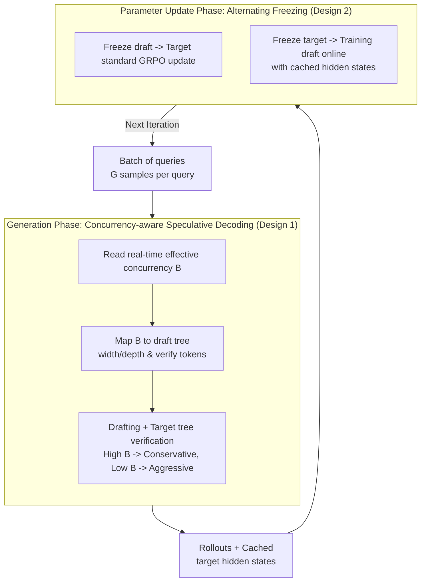

# FastGRPO: Accelerating Policy Optimization via Concurrency-aware Speculative Decoding and Online Draft Learning

**Conference**: ICLR 2026  
**arXiv**: [2509.21792](https://arxiv.org/abs/2509.21792)  
**Code**: [GitHub](https://github.com/yedaotian9/GRPO_speculative)  
**Area**: LLM Inference  
**Keywords**: GRPO acceleration, speculative decoding, concurrency-aware, online draft learning, RL training

## TL;DR

Addressing the critical bottleneck where the generation phase accounts for 91%-98% of GRPO training time, this work proposes a concurrency-aware speculative decoding strategy (dynamically adjusting draft tree parameters to adapt to real-time concurrency changes) and online draft model learning (utilizing hidden states from the target model to adapt to distribution shifts). The approach achieves 2.35x-2.72x end-to-end training acceleration without compromising inference quality.

## Background & Motivation

- **Background**: GRPO is a mainstream RL framework for enhancing LLM reasoning (e.g., DeepSeek-R1, DAPO). However, its training throughput is extremely low compared to SFT, severely hindering experimental iteration.
- **Quantified Bottleneck Analysis**: The generation phase (rollout sampling) occupies 91%-98% of total GRPO training time. Crucially, as model capabilities grow and outputs lengthen, the ratio of generation to update time increases from 6x to over 20x, indicating a worsening problem.
- **Concurrency Dilemma of Speculative Decoding**: Standard speculative decoding is effective under low concurrency ($B=1$) but offers little to no acceleration (speedup < 1.0x) in high-concurrency (large batch) GRPO scenarios. This is because additional overhead shifts the system from a memory-bound to a compute-bound state.
- **Dynamic Concurrency in GRPO**: Effective concurrency changes dynamically during generation—it starts with high batches, but different sequences terminate at different times (length variance up to 3-5x), causing effective concurrency to drop gradually toward 1.
- **Distribution Shift**: The target model is continuously updated during training, increasing the distribution gap with a fixed draft model. This leads to declining acceptance rates and diminishing acceleration over training steps.
- **Limitations of Prior Work**: EAGLE-2, HASS, and EAGLE-3 achieve only 1.1x-1.3x acceleration in the GRPO framework, far below their performance in standard inference scenarios.

## Method

### Overall Architecture

FastGRPO embeds two complementary acceleration components into the GRPO training loop: Concurrency-aware Speculative Decoding in the generation phase to adjust draft tree shapes (keeping validation compute at the hardware's optimal point), and Online Draft Learning during the update phase to absorb new distributions from the target model. The former addresses fluctuating concurrency, while the latter handles target model drift. Combined, they maintain a speedup above 2x throughout training. Each iteration involves batch rollouts (caching target hidden states) followed by alternating updates between models.

### Key Designs

**1. Concurrency-aware Speculative Decoding: Locking Compute at the Hardware Sweet Spot**

Standard speculative decoding fails in GRPO because it assumes low concurrency. In rollouts, large initial batches push the system past the compute-bound threshold due to draft and verification overhead, dropping speedup below 1.0x. FastGRPO dynamically adjusts the draft tree size so the total number of tokens in the verification stage matches the hardware's optimal concurrency $C_{\text{peak}}$—the point where arithmetic intensity transitions from memory-bound to compute-bound. Specifically, given current effective batch size $B$, the number of verification tokens per sequence is $N_{\text{verify}} = C_{\text{peak}} / B$. This maps to draft tree width $K_{\text{draft}} = \min(N_{\text{verify}}-1,\, K^{\max})$ and depth $L_{\text{draft}} = \min(\lfloor\log_2(N_{\text{verify}}/\alpha)\rfloor,\, L^{\max})$, where $\alpha$ encodes draft quality. This mapping is derived from GEMM arithmetic intensity analysis $I_{\text{GEMM}} \approx 2B/s$. During execution, when $B$ is high, the system uses conservative small trees; as sequences finish and $B$ decreases, $N_{\text{verify}}$ increases, and the system uses aggressive large trees to saturate idle compute.

**2. Online Draft Learning: Chasing the Shifting Target Model**

A fixed draft model loses alignment as the target policy updates, leading to lower acceptance rates. FastGRPO updates the draft model synchronously during each GRPO iteration by using the target model's hidden states (generated during rollout) as supervision. Since these states are already computed and cached, the overhead is only 2%–3%. This ensures the accepted length increases or stays stable throughout training. Moreover, online learning allows a draft model to converge from scratch within 1–2 epochs even without pre-training, lowering deployment barriers.

### Loss & Training

The components use alternating freezing to avoid interference: the target is frozen during draft training, and the draft is frozen during target GRPO updates. The draft model utilizes the EAGLE architecture, pre-trained for 10 epochs on ShareGPT-68K with a 1e-4 learning rate (AdamW). Notably, rollout data with zero rewards—unusable for target model updates—is still valuable supervision for the draft model.

## Key Experimental Results

### Main Results

| Model | Method | GSM8K E2E SR | SimpleRL E2E SR | DAPO E2E SR | Average |
|------|------|:-----------:|:---------------:|:-----------:|:----:|
| Qwen2.5-7B-I | EAGLE-3 | 1.26x | 1.20x | 1.13x | 1.20x |
| Qwen2.5-7B-I | **FastGRPO** | **2.43x** | **2.52x** | **2.53x** | **2.49x** |
| Llama3.1-8B-I | EAGLE-3 | 1.31x | 1.28x | 1.23x | 1.27x |
| Llama3.1-8B-I | **FastGRPO** | **2.51x** | **2.69x** | **2.67x** | **2.62x** |
| DS-R1-Qwen-7B | **FastGRPO** | **2.69x** | — | — | — |

### Ablation Study

| Configuration | Gen SR | E2E SR | Note |
|------|:------:|:--------:|------|
| FastGRPO (Full) | 2.91 | 2.52 | Optimal config |
| w/o Online Draft Learning | 2.16 | 2.01 | Online learning contributes 0.5x |
| w/o Concurrency-aware | 2.59 | 2.30 | Concurrency-aware contributes 0.2x |
| vanilla + early termination | 1.68 | 1.61 | Baseline comparison |

### Key Findings

- Validated across 5 models (Qwen2.5-7B/1.5B-I, Llama3.1-8B-I, DS-R1-Qwen-7B, Qwen2.5-Math-7B) and 3 datasets; FastGRPO consistently outperforms all baselines by >2x.
- Post-training reasoning accuracy is consistent with or slightly higher than standard GRPO—acceleration does not compromise quality.
- Effective on GRPO variants (DAPO/GPG) with end-to-end speedups >2x.
- Online Draft Learning's contribution (0.5x) is larger than Concurrency-aware's (0.2x), identifying distribution shift as the primary bottleneck.

## Highlights & Insights

- **Identification of dynamic concurrency in GRPO**: This fundamental difference from standard inference was overlooked by previous work.
- **Theoretical Elegance**: Connecting hardware characteristics to speculative hyperparameters via operational intensity analysis provides a solid theoretical foundation.
- **Efficient Online Learning**: Reusing existing hidden states as intermediate signals results in an "almost free lunch" with only 2-3% overhead.
- **Rapid Deployment**: The ability to reach full effectiveness within 1-2 epochs without pre-training simplifies implementation.

## Limitations & Future Work

- $C_{\text{peak}}$ requires empirical profiling for each GPU/model combination; automated tools could improve usability.
- Verification is limited to mathematical reasoning; effects on code generation or general dialogue are unverified.
- The draft architecture is fixed to the EAGLE series; compatibility with Medusa or other architectures remains unexplored.
- Communication overhead and its interaction with concurrency-aware strategies in multi-node distributed training are not discussed.
- The $\alpha$ hyperparameter encodes draft quality; dynamic adjustment of $\alpha$ during training might yield further gains.

## Related Work & Insights

- **vs EAGLE-2/HASS/EAGLE-3**: These methods suffer under high concurrency in GRPO. FastGRPO's core innovation is adapting to concurrency fluctuations.
- **vs Standard Inference Acceleration**: While speculative decoding is traditionally for low-concurrency deployment, FastGRPO adapts it to high-concurrency RL training.
- **Insight**: RL training fundamentally differs from inference deployment (dynamic concurrency, distribution shift); designing specialized strategies for these traits yields significant returns.

## Rating
- Novelty: ⭐⭐⭐⭐ Target-specific combination of concurrency awareness and online learning.
- Experimental Thoroughness: ⭐⭐⭐⭐⭐ Comprehensive validation across 5 models, 3 datasets, and GRPO variants.
- Writing Quality: ⭐⭐⭐⭐ Clear logic from motivation to observations to methodology.
- Value: ⭐⭐⭐⭐⭐ Directly reduces GRPO training costs by 2-3x, offering high engineering value.

<!-- RELATED:START -->

## Related Papers

- [\[ICLR 2026\] Adaptive Social Learning via Mode Policy Optimization for Language Agents](adaptive_social_learning_via_mode_policy_optimization_for_language_agents.md)
- [\[ICLR 2026\] Learning What Reinforcement Learning Can't: Interleaved Online Fine-Tuning for Hardest Questions](learning_what_reinforcement_learning_cant_interleaved_online_fine-tuning_for_har.md)
- [\[ICLR 2026\] Reference-guided Policy Optimization for Molecular Optimization via LLM Reasoning](reference-guided_policy_optimization_for_molecular_optimization_via_llm_reasonin.md)
- [\[ICLR 2026\] HiPO: Self-Hint Policy Optimization for RLVR](hipo_self-hint_policy_optimization_for_rlvr.md)
- [\[ICLR 2026\] DRPO: Efficient Reasoning via Decoupled Reward Policy Optimization](drpo_efficient_reasoning_via_decoupled_reward_policy_optimization.md)

<!-- RELATED:END -->
